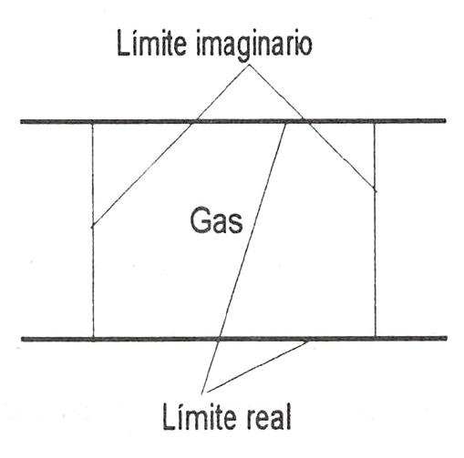

Conceptos fundamentales y definiciones
======================================

Sistema termodinámico
---------------------

Como **sistema termodinámico** se puede considerar cualquier cosa que se desee estudiar y el sistema puede ser tan sencillo como un cuerpo libre, o tan complejo como una moderna central productora de energía. A efectos de sistematización, un sistema termodinámico se define como cualquier cantidad de materia o cualquier región del espacio sometida a estudio (se entiende que se está considerando el análisis termodinámico del mencionado sistema). La cantidad de materia o región del espacio debe hallarse contenida dentro de unos límites perfectamente predeterminados. Estos límites pueden ser fijos o deformables, así como reales o imaginarios.

Según su constitución los sistemas pueden ser homogéneos o heterogéneos. Se dice que un sistema es homogéneo cuando su composición química y propiedades físicas son iguales en todas sus partes o varían de un modo continuo de un punto del sistema a otro. Como ejemplo característico se podría considerar una columna de aire donde en este sistema y debido a la gravedad, cambian de un modo continuo con la altura, tanto su composición química como sus propiedades físicas. Cuando un sistema está constituido por dos o más partes homogéneas distintas se denomina heterogéneo.

En general, se estudiarán sistemas simples compresibles, es decir, aquellos sistemas para los que la única forma de trabajo reversible posible es la ligada a un cambio de volumen. Estos sistemas son homogéneos y se considerará que no es importante la influencia de:

- Campos eléctricos, magnéticos o gravitatorios.
- Efectos de capilaridad.
- Variación de composición isotópica en la sustancia que constituye el sistema.
- Si el sistema es sólido, igualdad de presión en todas las direcciones.

.. note::

   Composición isotópica: del número másico.

Si se define el sistema como una determinada cantidad de materia, entonces el sistema contiene siempre la misma materia y no puede haber transferencia de masa a través del límite del mismo. Sin embargo, si un sistema se define como una región del espacio dentro de un límite predeterminado, entonces la materia puede cruzar el límite del sistema. Para distinguir estos dos tipos de sistemas, al primero se le denomina sistema cerrado o masa de control y al segundo sistema abierto o volumen de control. El límite de un volumen de control, que puede ser móvil, se denomina superficie de control.

Todo lo situado fuera de los límites del sistema se denomina medio ambiente. Normalmente se considera como medio ambiente del sistema aquellas cosas exteriores al mismo que ejercen alguna influencia sobre él (interaccionan con el sistema). El conjunto de sistema y medio ambiente constituye el universo termodinámico en un problema dado.

Un caso especial de sistema cerrado es el sistema aislado. Un sistema aislado es aquel que no interacciona de ningún modo con su medio ambiente. Téngase en cuenta que necesariamente un sistema aislado ha de ser un sistema cerrado, ya que la condición de no interacción con el ambiente prohíbe cualquier transferencia de masa a través del límite del sistema.

Como ya se ha dicho, los sistemas termodinámicos pueden abarcar desde el gas contenido en un pequeño volumen, a plantas industriales complejas y también grandes regiones de la atmósfera terrestre. EL PASO MAS IMPORTANTE EN LA SOLUCION DE UN PROBLEMA EN TERMODINAMICA ES NORMALMENTE LA SELECCION Y ESPECIFICACION CUIDADOSA DEL SISTEMA A CONSIDERAR.

Se consideran a continuación algunos ejemplos de sistemas termodinámicos que se presentarán con frecuencia a lo largo de este estudio.

Cuando se estudia el flujo de gas a través de un conducto, el sistema a considerar será el gas contenido en un determinado tramo del conducto y en este caso los límites del sistema serán las paredes del conducto (límite real) y la frontera ideal que delimita transversalmente la longitud predeterminada del mismo (límite imaginario), como se muestra en la figura 1.1:

   Volumen de control

.. figure:: ./img/masa_control.png
   :height: 300px
   :align: right

   Masa de control

En el estudio de un gas contenido en un cilindro provisto de émbolo, el sistema será normalmente el gas contenido dentro del cilindro. En este caso, aunque el volumen del sistema varíe, el sistema será un sistema cerrado mientras el émbolo se mueva en el cilindro y no sobrepase el límite del mismo. En el estudio de plantas de potencia se verá que las transformaciones que tienen lugar en las mismas se pueden analizar considerando un determinado elemento de masa de fluido (sistema cerrado) y siguiendo su evolución a lo largo de la instalación, o considerando un determinado volumen de control y realizando sobre él el análisis correspondiente.

En general, **al proceder al estudio de una determinada instalación, la mayor parte de las veces ha de idealizarse el conjunto de elementos que la constituyen**, de forma que sean asimilables a sistemas que puedan someterse a un análisis termodinámico sencillo. En tanto en cuanto la elección del correspondiente sistema ideal resulte adecuada al sistema real que se quiere modelar, el análisis teórico dará un resultado que responderá tanto más al resultado real, cuanto más se aproxime la descripción ideal al comportamiento real del sistema. Se ha de tener esto muy presente para ”no caer en la falacia de considerar que el estudio teórico de un sistema hace posible una determinada actuación, mientras que realmente esa actuación no se da”. Está claro que, cuando esto ocurre, el mencionado estudio teórico se basa en un modelo inadecuado al sistema real sometido a estudio.

Propiedades, estados, procesos y equilibrio
-------------------------------------------

Para estudiar un determinado sistema lo primero que debe hacerse es proceder a su descripción y ello requiere el conocimiento de sus características propias, es decir, de sus propiedades.

También la predicción de la evolución del mismo requiere el conocimiento de las propiedades del sistema y de cómo estas se relacionan. ¿A qué se llaman propiedades de un sistema?

Se denominan propiedades termodinámicas de un sistema, o simplemente propiedades, a cualesquiera características macroscópicas observables tales como la masa, el volumen, la presión, la temperatura..., cuyos valores numéricos pueden asignarse en un momento dado sin 'tener en cuenta la historia del sistema. A veces se considera propiedad del sistema cualquier relación entre las propiedades directamente observables del mismo, tal como el producto de la presión y el volumen o la presión y la temperatura, etc. Tales propiedades pueden considerarse características indirectamente observables de un sistema. Teóricamente pueden definirse un gran número de propiedades, pero como se verá, sólo unas pocas resultan útiles. Conviene tener en cuenta que a las propiedades termodinámicas también se las conoce como variables termodinámicas o variables de estado.

Hay otro tipo de propiedades de un sistema que no son directamente observables y que se deducen de los principios de la termodinámica. En las lecciones correspondientes se verá cómo se introducen la energía interna, la entalpía, la entropía, etc., a partir de estos principios.

En el estudio de la termodinámica también se encuentran magnitudes que no son propiedades, porque sus valores dependen de la trayectoria seguida por el sistema, pudiendo citar entre ellas las transferencias de energía, como son el calor y el trabajo.

Todo lo dicho anteriormente podría sintetizarse utilizando un lenguaje matemático de la forma siguiente.

Supóngase un conjunto de propiedades de un sistema:

.. math::

   x_1, x_2, ..., x_n

que pueden ser utilizadas para su caracterización. Desde este punto de vista, serían entonces varióles de estado. Cualquier relación entre estas propiedades conduce a otra propiedad termodinámica que puede expresarse por la función:

.. math::

   y = y(x_1, x_2, ..., x_n)

siendo *y* la nueva propiedad, que por la forma de definirla se denomina función de estado.

Si esto es así, *y* es diferenciable:

.. math::

   dy = \sum_i \frac{\partial y}{\partial x_i} dx_i

y los coeficientes de esta expresión satisfacen la relación de las derivadas cruzadas (teorema de Schwarz):

.. math::

   \frac{\partial^2 y}{\partial x_j \partial x_i} = \frac{\partial^2 y}{\partial x_i \partial x_j}

es decir, *dy* es una diferencial exacta. Esta condición se utilizará con frecuencia posteriormente.

Si *y* no fuese una propiedad del sistema, es decir, su valor en cada punto dependiera de la trayectoria seguida para alcanzar ese punto, entonces las ecuaciones (1.1) y (1.2) no se cumplirían.

Para representar un cambio diferencial en una variable que no sea una propiedad se utilizará el símbolo :math:`\delta y`, que podrá expresarse:

.. math::

   \delta y = \sum z_i dx_i

donde :math:`z_i` y :math:`x_i` son variables de estado para las que:

.. math::

   \frac{\partial z_i}{\partial x_j} \neq \frac{\partial z_j}{\partial x_i}

por lo que :math:`\delta y` no es una diferencial exacta y su integral depende de la trayectoria (integral de línea).

El estado, o situación determinada en la que se halla un sistema, viene especificado por el valor de sus propiedades. Ya que hay numerosas relaciones entre las propiedades de un sistema particular, los valores de unas pocas propiedades identificarán completamente su estado, puesto que las otras propiedades pueden determinarse en función de estas pocas. El número mínimo de propiedades que hace falta para definir el estado de un sistema depende de su complejidad y como se verá al estudiar el Principio de Estado, se halla perfectamente determinado.

Si un sistema tiene el mismo valor de sus propiedades en dos instantes diferentes, se dice que el sistema se encuentra en el mismo estado en estos dos instantes. Cuando cualquier propiedad cambia, el estado del sistema cambia y se dice que el sistema ha experimentado un proceso. Por lo tanto, un proceso es una transformación desde un estado a otro. Un sistema está en estado estacionario si ninguna de sus propiedades cambia con el tiempo.

Entre los diversos procesos que puede experimentar un sistema, tiene especial interés el ciclo termodinámico. Se define el ciclo termodinámico como la secuencia de procesos experimentados por un sistema de forma que comienza y termina en el mismo estado. Por lo tanto, al final de un ciclo las propiedades del sistema son las mismas que al principio, es decir, en el ciclo no hay cambio neto del estado del sistema. Los ciclos juegan un gran papel en las aplicaciones de la termodinámica y la mayor parte de las instalaciones de potencia funcionan mediante ciclos repetidos en el tiempo. El funcionamiento de cualquier motor puede modelizarse según este proceso y el funcionamiento real de las plantas de vapor se representa perfectamente mediante este modelo.

Como se ha dicho antes, en un estado dado cada propiedad tiene un valor definido que puede ser asignado sin saber cómo el sistema ha llegado a ese estado. Por lo tanto, el cambio en el valor de una propiedad, cuando el sistema es alterado para pasar de un estado a otro, se determina únicamente por los estados extremos y resulta independiente de la trayectoria particular seguida por el sistema en el cambio de estado. Es decir, el cambio es independiente de los detalles, o historia, del proceso. Recíprocamente, si la variación en el valor de una magnitud es independiente de la trayectoria del proceso entre dos estados, entonces aquella magnitud es una propiedad. Esto proporciona la prueba necesaria y suficiente para determinar si una magnitud es una propiedad: una magnitud determinada es una propiedad si, y solo si, la variación de su valor al pasar de un estado a otro es independiente del proceso seguido. Se sigue de esto que si el cambio en el valor de una magnitud depende de los detalles del proceso y no solamente de los estado extremos, la mencionada magnitud no es una propiedad termodinámica.

Propiedades extensivas, intensivas y específicas
''''''''''''''''''''''''''''''''''''''''''''''''

Las propiedades termodinámicas pueden dividirse en dos grandes grupos: propiedades extensivas y propiedades intensivas.

A una propiedad se le denomina extensiva si su valor para el sistema en conjunto es la suma del valor correspondiente a cada parte en las que el sistema puede dividirse. Entre ellas se pueden citar la masa y el volumen, así como muchas otras que se irán definiendo a lo largo del curso.

Las propiedades intensivas son aquellas que tienen el mismo valor para cualquier parte del sistema homogéneo que para el sistema en conjunto. La presión, temperatura y densidad son ejemplos de estas propiedades.

Si el valor de una propiedad extensiva se divide entre la masa del sistema, la propiedad resultante es una propiedad intensiva y se denomina propiedad específica. Por ejemplo, el volumen específico se obtiene dividiendo el volumen total del sistema (propiedad extensiva) entre la masa del mismo. Esta relación del volumen a la masa es la misma para cualquier punto de un sistema homogéneo y por tanto es una magnitud intensiva. Para designar una propiedad intensiva se utilizarán letras minúsculas y las propiedades extensivas se designarán mediante letras mayúsculas. Las propiedades específicas se representarán, por tanto, con letras minúsculas. Como excepción, la temperatura termodinámica del sistema se representará con mayúscula y la masa del sistema se suele representar mediante *m* minúscula.

Matemáticamente, se puede formular todo lo dicho recurriendo al concepto de función homogénea. Como se recordará o puede verse en cualquier libro de análisis matemático, una función *Y* se denomina homogénea de grado :math:`\alpha` cuando se verifica:

.. math::

   Y(\lambda X_1, \lambda X_2, ..., \lambda X_n) = \lambda^\alpha Y(X_1, X_2, ..., X_n)

en la que las :math:`X_i` son propiedades extensivas del sistema.

Para estas funciones se cumple el teorema de Euler:

.. math::

   \sum X_i \frac{\partial Y}{\partial X_i} = \alpha Y

También se verifica que si una función es homogénea de grado :math:`\alpha`  su derivada de orden *p* es homogénea de grado :math:`\alpha -p`. En esta expresión *p* es un entero positivo, pero :math:`\alpha` no necesita ser un entero mayor que *p*.

Según lo que acaba de verse, si *Y* es una propiedad de un sistema simple que contiene *n* moles de sustancia, *Y* será intensiva o extensiva según sea proporcional a :math:`n^0` o a :math:`n^1`, respectivamente:

.. math::

   Y \approx n^0 (\alpha = 0), intensiva\\
   y \approx n^1 (\alpha = 1), extensiva

Así, el volumen total *V* es extensiva, ya que si se duplica el número de moles del sistema, conservando constantes todos los parámetros intensivos, el volumen se duplica. Por otro lado, el volumen total dividido entre el número de moles del sistema proporciona el volumen específico molar (:math:`v = \frac{V}{n}`) que es una variable intensiva.

Conviene tener claro que cualquier propiedad extensiva *Y* tiene una variable intensiva correspondiente :math:`\frac{Y}{n}`, pero la inversa no es siempre cierta ya que variables como *T* y *p* no poseen sus correspondientes extensivas.

Para aclarar lo expuesto, supóngase que *Y* es una propiedad extensiva dependiente de otras propiedades extensivas :math:`X_i`. El requisito de que *Y* sea una propiedad extensiva significa que si se duplican las :math:`X_i`, se duplica *Y*, es decir:

.. math::

   Y( 2X_1, 2X_2, ..., 2X_n) = 2 Y(X_1, ..., X_n)

y en general:

.. math::

   Y(\lambda X_1,\lambda X_2, ..., \lambda X_n) = \lambda Y(X_1, ..., X_n)

en otras palabras, *Y* es homogénea de grado uno.

Considerando que *Y* sea una propiedad intensiva, al duplicar las *X* se deja sin alterar la *Y*, o en general:

.. math::

   Y(\lambda X_1,\lambda X_2, ..., \lambda X_n) = Y(X_1, ..., X_n)

por lo que *Y* es homogénea de grado cero.

Resumiendo, si *Y* es una propiedad que depende de variables extensivas :math:`X_i`, resultará que *Y* será una propiedad extensiva si es homogénea de grado uno, y será intensiva si es homogénea de grado cero. Según se vió antes al considerar la derivada de orden *p* de una función homogénea, si *Y* es extensiva, la primera derivada respecto a una variable extensiva será una propiedad intensiva.

A lo largo del curso se utilizará con frecuencia el criterio de homogeneidad.

.. toctree::
   :maxdepth: 1
   :caption: Contenido:
   
   conceptos_fase
   conceptos_equilibrio
