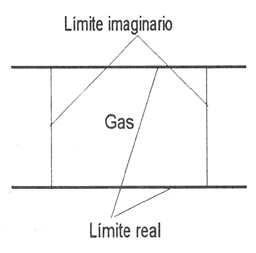
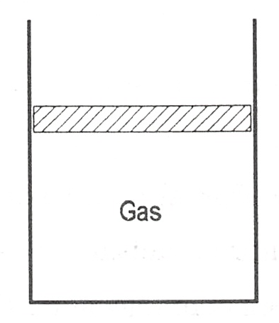

Sistema termodinámico
=====================

Introducción
------------

Como sistema termodinámico se puede considerar cualquier cosa que se desee estudiar y el sistema puede ser tan sencillo como un cuerpo libre, o tan complejo como una moderna central productora de energía.

.. warning::

   Siempre que cumpla la hipótesis de distribución de materia continua.

Por tanto, será un **sistema termodinámico** cualquier cantidad de materia o espacio sometida a estudio (termodinámico). 

Consecuentemente, hablaremos de:

- **Sistema cerrado** o **masa de control**: determinada cantidad de materia. No intercambian material a través de su frontera (ej. compresión de aire con un émbolo). Ojo, la no variación de masa no implica que el sistema sea cerrado (ej. puede salir la misma cantidad de materia que entra en un volumen de control).
- **Sistema abierto** o **volumen de control**: región del espacio dentro de un límite predeterminado . El límite del volumen de control (que puede ser móvil) se denomina superficie de control. El sistema se define como una región del espacio dentro de un límite predeterminado; la materia puede cruzar el límite del sistema.

Todo lo situado fuera de los límites del sistema se denomina **medio ambiente** (o *exterior* o alrededores). Normalmente se considera como medio ambiente del sistema aquellas cosas exteriores al mismo que ejercen alguna influencia sobre él (interaccionan con el sistema). El conjunto de sistema y medio ambiente constituye el universo termodinámico en un problema dado.

Un caso particular de sistema cerrado es el **sistema aislado** que no interacciona de ningún modo con su medio ambiente (ni másica ni energéticamente).

La cantidad de materia o región del espacio debe hallarse contenida dentro de unos límites perfectamente predeterminados. Estos límites pueden ser fijos o deformables, así como reales o imaginarios.

El sistema puede ser:

- Indeformable: cuando la distancia relativa entre todas las partículas del mismo es constante (ej. un sólido). 
- Deformable: cuando algo puede variar su posición relativa (ej. aire, muelle, ...).

En función de la composición química y propiedades físicas:

- Homogéneo: cuando su composición química y propiedades físicas son iguales en todas sus partes o varían de un modo continuo de un punto del sistema a otro. (ej. columna de aire -cambian de un modo continuo con la altura, tanto su composición química como sus propiedades físicas debido a la gravedad-).
- Heterogéneos: Cuando el sistema está constituido por dos o más partes homogéneas distintas. A cada sistema homogéneo de un sistema heterogéneo se le denomina fase.

.. note::

   Determinar y clasificar el sistema es esencial. No hay ninguna regla para elegir el sistema. Este se elegirá intuitivamente.

   Como ya se ha dicho, los sistemas termodinámicos pueden abarcar desde el gas contenido en un pequeño volumen, a plantas industriales complejas y también grandes regiones de la atmósfera terrestre. EL PASO MAS IMPORTANTE EN LA SOLUCION DE UN PROBLEMA EN TERMODINAMICA ES NORMALMENTE LA SELECCION Y ESPECIFICACION CUIDADOSA DEL SISTEMA A CONSIDERAR.
.. note::

   En general, al proceder al estudio de una determinada instalación, la mayor parte de las veces ha de idealizarse el conjunto de elementos que la constituyen, de forma que sean asimilables a sistemas que puedan someterse a un análisis termodinámico sencillo. 
   
   En tanto en cuanto la elección del correspondiente sistema ideal resulte adecuada al sistema real que se quiere modelar, el análisis teórico dará un resultado que responderá tanto más al resultado real, cuanto más se aproxime la descripción ideal al comportamiento real del sistema.
   
   Se ha de tener esto muy presente para "no caer en la falacia de considerar que el estudio teórico de un sistema hace posible una determinada actuación, mientras que realmente esa actuación no se da". Está claro que, cuando esto ocurre, el mencionado estudio teórico se basa en un modelo inadecuado al sistema real sometido a estudio.

Ejemplos de sistemas termodinámicos
-----------------------------------

Cuando se estudia el flujo de gas a través de un conducto, el sistema a considerar será el gas contenido en un determinado tramo del conducto y en este caso los límites del sistema serán las paredes del conducto (límite real) y la frontera ideal que delimita transversalmente la longitud predeterminada del mismo (límite imaginario), como se muestra en la figura que muestra el *Volumen de Control*.

   Volumen de control

En el estudio de un gas contenido en un cilindro provisto de émbolo, el sistema será normalmente el gas contenido dentro del cilindro. En este caso, aunque el volumen del sistema varíe, el sistema será un sistema cerrado mientras el émbolo se mueva en el cilindro y no sobrepase el límite del mismo. En el estudio de plantas de potencia se verá que las transformaciones que tienen lugar en las mismas se pueden analizar considerando un determinado elemento de masa de fluido (sistema cerrado) y siguiendo su evolución a lo largo de la instalación, o considerando un determinado volumen de control y realizando sobre él el análisis correspondiente.

   Masa de control

NO ENTIENDO QUE SE CUENTE LO SIGUIENTE AQUÍ
-------------------------------------------

.. note::

   
   En general, se estudiarán sistemas simples compresibles, es decir, aquellos sistemas para los que la única forma de trabajo reversible posible es la ligada a un cambio de volumen. Estos sistemas son homogéneos y se considerará que no es importante la influencia de:

   - Campos eléctricos, magnéticos o gravitatorios.
   - Efectos de capilaridad.
   - Variación de composición isotópica en la sustancia que constituye el sistema.
   - Si el sistema es sólido, igualdad de presión en todas las direcciones.

.. note::

   Composición isotópica: del número másico.