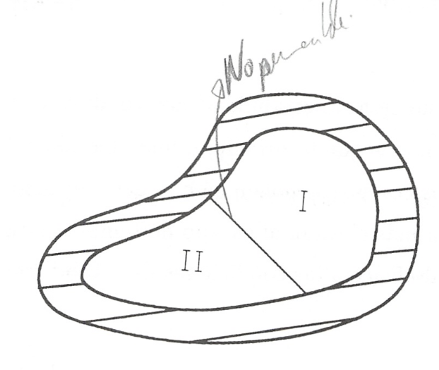

Aplicación de los criterios de equilibrio
=========================================

Matriz de estabilidad
---------------------

Consideremos un sistema cerrado situado en un recinto a una temperatura T ya presión constante p. La condición general de equilibrio estable de tal sistema es el mínimo de su energía de Gibbs.Aunque sea reiterativo recordemos que:

.. math::

   G = U +pV -TS \\
   dG = -SdT + VdP

Esto significa que el estado del sistema situado en un recinto isotermo a p y T dados y teniendo como parámetros extensivos a V y S, es estable si una pequeña variación espontánea de las coordenadas conlleva un aumento de su energía de Gibbs G, ya que ello implica que se hallaba en el mínimo. Si denominamos G al valor de la energía de Gibbs correspondiente al estado de equilibrio y :math:`G_1` el valor en un estado próximo al de equilibrio, tendremos:

.. math::

   \Delta G = G_1 - G > 0
   

es decir:

.. math::

   U_1-U - T(S_1 - S) + p(V_1 - V) > 0
   
   
en la que U es la energía interna del estado de equilibrio inicial del sistema para p y T dadas y las variables extensivas V, 5. La energía interna del estado desplazado del equilibrio con coordenadas :math:`V_1`, :math:`S_1` es :math:`U_1`.

Si en vez de ser de equilibrio el estado del sistema de coordenadas V y S, es el de coordenadas :math:`V_1`, :math:`S_1` a :math:`p_1`, :math:`T_1`  constantes, sería estable si en el caso de una pequeña variación espontánea se verificara la condición:

.. math::

   U — U_1 — T_1(S - S_1) + p_1(V - V_1) > 0
   

Sumando miembro a miembro las desigualdades (8.34) y (8.35) se obtienen las relaciones entre las diferencias de los distintos parámetros de dos estados de equilibrio estable, próximos entre sí, de un sistema homogéneo:

.. math::

   -T (S_1-S)+p(V_1-V)-T_1(S-S_1)+p_1(V-V_1) > 0\\
   -T\Delta S + p \Delta V+ T_1 \Delta S - p_1 \Delta V >0 \\
   (T_1-T)\Delta S - (P_1-p)\Delta V > 0 \\
   \Delta T \Delta S - \Delta p \Delta V > 0

en la que

.. math::

   \Delta T = T_1 - T \\
   \Delta S = S_1 -S \\
   \Delta P = P_1 - P \\
   \Delta V = V_1 - V
   

Una forma adecuada de recordar la desigualdad anterior es mediante la denominada matriz de estabilidad:

.. math::

   \begin{pmatrix}
      \Delta T  & \Delta p \\
      \Delta V  & \Delta S
   \end{pmatrix}

Condiciones de estabilidad de sistemas monofásicos. Principio de Le Chátelier-Braun
------------------------------------------------------------------------------------

La desigualdad (8.39) para el determinante de esta matriz, permite obtener las condiciones de estabilidad de un sistema monofásico en diferentes situaciones. A continuación la aplicaremos al estudio de las condiciones de estabilidad en los casos siguientes:

a) Variación de una fuerza generalizada determinada, con la variación de su correspondiente desplazamiento generalizado manteniendo constantes las fuerzas generalizadas conjugadas de otros desplazamientos generalizados. Por ejemplo, variación de la presión con el volumen manteniendo la temperatura constante, o variación de la temperatura con la entropía manteniendo constante la presión.

b) Lo mismo que en el caso anterior, pero manteniendo constante el correspondiente desplazamiento conjugado generalizado. Como ejemplo se podría considerar la variación de la presión con el volumen a entropía constante, o la variación de la temperatura con la entropía a volumen constante.

a)	Para deducir la condición de estabilidad en transformaciones a temperatura o a presión constantes, dividamos la desigualdad (8.39) por el cuadrado de la variación de volumen, manteniendo constante T, conjugada de la coordenada S, obtenemos:

.. math::

   T=cte: \\
   \frac{0.\Delta S}{\Delta V^2} - \frac{\Delta p \Delta V}{\Delta V^2} > 0 \\
   -\left( \frac{\Delta p}{\Delta V} \right)_T >0 \\
   \left( \frac{\Delta p}{\Delta V} \right)_T <0 \\
   

Al dividir ahora (8.39) entre :math:`\Delta S^2` manteniendo constante p, conjugada de V, obtenemos:

.. math::

   p=cte: \\
   \frac{\Delta T \Delta S}{\Delta S^2} - \frac{0.\Delta V}{\Delta S^2} > 0 \\
   \left( \frac{\Delta T}{\Delta S} \right)_p >0 

De (8.40) y (8.41) se deduce que cuando un sistema homogéneo en estado de equilibrio estable, experimenta alguna pequeña variación de cualesquiera de sus desplazamientos generalizados, manteniendo constantes las fuerzas generalizadas conjugadas de los otros desplazamientos, se verifican las siguientes desigualdades:

.. math::

   \left( \frac{\Delta p}{\Delta V} \right)_T <0 \\
   \left( \frac{\Delta T}{\Delta S} \right)_p = \frac{T}{c_p} >0

y estas desigualdades representan las condiciones suficientes de estabilidad del sistema. De (8.42)	se deduce que para la escala de temperatura adoptada, la capacidad calorífica del sistema a presión constante, :math:`c_p`, será siempre positiva. Si se admitiera una escala de temperaturas negativas, :math:`c_p` habría de cambiar de signo.

Si hacemos el análisis de una forma general, considerando un desplazamiento generalizado :math:`X_k` y la fuerza generalizada conjugada de este desplazamiento :math:`Y_k`, las condiciones de estabilidad tomarán la forma:

.. math::

   \left( \frac{\partial Y_k}{\partial X_k} \right)_T <0 \\   
   \left( \frac{\partial T}{\partial S} \right)_{Y_k} = \frac{T}{c_{Y_k}} > 0

b)	Para analizar ahora lo que sucedería en transformaciones a entropía o a volumen constantes, en vez de las consideradas a temperatura o a presión constantes, se divide la desigualdad (8.39) primero por el cuadrado de la variación del primer desplazamiento generalizado AV manteniendo constante S y seguidamente por el cuadrado de la variación de S, manteniendo constante V y se obtiene:

.. math::

   \left( \frac{\partial p}{\partial V} \right)_S < 0 \\ 
   \left( \frac{\partial T}{\partial S} \right)_V > 0 

De esto se deduce que un sistema termodinàmico en estado de equilibrio estable ha de satisfacer las desigualdades:

.. math::

   \left( \frac{\partial p}{\partial V} \right)_S <0 \\   
   \left( \frac{\partial T}{\partial S} \right)_V = \frac{T}{c_{v}} > 0

cuando cada uno de los desplazamientos generalizados experimenta cualquier variación, manteniendo el otro constante.

También en este caso podemos, por tanto, establecer que para tener un estado de equilibrio estable :math:`c_v > 0`.

De lo expuesto anteriormente se deduce que un sistema homogéneo se encontrará en estado de equilibrio estable si el determinante de la matriz de estabilidad es positivo o si las condiciones de estabilidad (8.42) y (8.45) se cumplen.

Como ya se ha dicho, la condición :math:`c_v > 0` (o la condición :math:`c_p > 0`) se satisface si la temperatura termodinámica T es positiva.

Es decir, si aceptamos que :math:`cv > 0` o :math:`c_p > 0`, la condición de estabilidad nos conduce a la elección de una temperatura T positiva. De acuerdo con el segundo principio, una elección tal del signo de T conduce, como ya vimos, a que cuando dos cuerpos se ponen en contacto térmico, el calor pasa espontáneamente del cuerpo a temperatura más elevada al cuerpo de temperatura “menos elevada. Esto permite encontrar fácilmente sentido físicp a las condiciones de estabilidad (8.42)	y (8.45).

En efecto, supongamos que :math:`c_p` fuese negativo. Esto significaría, teniendo en cuenta la definición de esta propiedad como relación entre el calor suministrado a un sistema a presión constante y el correspondiente incremento de temperatura:

.. math::

   c_p = \left( \frac{\partial q}{\dT} \right)_p \text{ si }c_p<0 \text{ para }\partial q>0\text{, } dT <0

que el suministro de calor a esta sustancia llevaría a una disminución de su temperatura y por tanto a un incremento de la diferencia de temperatura entre la fuente de calor y el sistema. Esto produciría una situación que nos alejaría cada vez más del equilibrio y por tanto a una inestabilidad creciente.

De forma análoga, si :math:`\left( \frac{\partial p}{\partial V} \right)_T > 0` en vez de ser :math:`\left( \frac{\partial p}{\partial V} \right)_T < 0`, una disminución pequeña del volumen debido a las fluctuaciones, provocaría una disminución de presión en el sistema, lo que haría que disminuyera más el volumen y por lo tanto el sistema se alejaría más y más de la condición de equilibrio.

Las condiciones de equilibrio (8.42) y (8.45) llevan al denominado principio de la desviación de equilibrio o principio de Le Chatelier-Braun, el cual podemos enunciar de la forma siguiente: si un sistema que se hay6 en equilibrio se aparta de él, éste tiende a evolucionar de forma que los correspondientes parámetros del sistema varíen en el sentido que permitan al sistema retornar al estado de equilibrio.

Coordenadas termodinámicas en el equilibrio de sistemas monofásicos
-------------------------------------------------------------------

Hemos considerado hasta ahora las condiciones que tendría que cumplir un sistema para que alcanzara un estado de equilibrio estable. Supuesto que estas condiciones se dan, veamos cómo se determinan las coordenadas termodinámicas de equilibrio de los sistemas termodinámicos.

   Sistema aislado integrado por dos sistemas que interactúan.

De los distintos sistemas termodinámicos que podemos considerar y que difieren entre sí por las interacciones que experimentan (supuesto que hacemos abstracción de las sustancias que los integran), el más importante es el sistema aislado integrado por dos subsistemas entre los que se produce interacción, ya que cualquier sistema y su medio ambiente cumple con esta condición.

Consideremos el sistema aislado representado en la figura 8.1, formado por los subsistemas I y II, separados entre sí por una frontera que permite interacciones calor y trabajo. Determinemos en qué condiciones existirá equilibrio entre estos subsistemas. Por ser el sistema aislado se cumple:

.. math::

   U_sis = U_I+U_{II} = \text{constante} \\
   V_sis = V_I+V_{II} = \text{constante} 

Podemos imaginar para este sistema procesos infinitesimales en los que cambie el volumen o la energía de cada subsistema o ambas simultáneamente (U y V son variables independientes). Al estar el sistema aislado:

.. math::

   dU_{sis} = 0 \\
   dV_{sis} = 0

y

.. math::

   dV_I + dV_{II} = dV_{sis} = 0 \\ 
   dU_I + dU_{II} = dU_{sis} = 0
   

por lo que:

.. math::

   dV_I=-dV_{II} \\
   dU_I = -dU_{II}

Antes vimos que la condición de equilibrio (:math:`dS_{sis}=0`)para un sistema aislado es:

por ser:

.. math::

   S_{sis} = S_I + S_{II} \\
   dS_{sis} = dS_I + dS_{II} = 0

y

.. math::

   T_IdS_I = dU_I+p_IdV_I \\
   T_{II}dS_{II} = dU_{II}+p_{II}dV_{II}
   

Es importante destacar que nuestro análisis se limita a sistemas en los que sólo existe trabajo :math:`pdV`.

Despejando :math:`dS_I` y :math:`dS_{II}` y sustituyendo en (8.51):

.. math::

   \frac{dU_I}{T_I} + \frac{p_I}{T_I} dV_I + \frac{dU_{II}}{T_{II}} + \frac{p_{II}}{T_{II}} dV_{II} = 0

sustituyendo :math:`dU_{II}` y :math:`dV_{II}`  en función de :math:`dU_{I}` y :math:`dV_{I}`, respectivamente, obtenemos:

.. math::

   \left( \frac{1}{T_I} - \frac{1}{T_{II}} \right) dU_I + \left( \frac{p_I}{T_I} - \frac{p_{II}}{T_{II}} \right) dV_I = 0

Antes hemos dicho que :math:`dU_{I}` y :math:`dV_{I}` eran variables independientes, por lo tanto, para que la igualdad anterior se cumpla en cualesquiera condiciones, se ha de verificar:

.. math::

   \frac{1}{T_I}- \frac{1}{T_{II}} = 0 \\
   \frac{p_I}{T_I}- \frac{p_{II}}{T_{II}} = 0
   

de donde:

.. math::

   T_I = T_{II}

y

.. math::

   p_I = p_{II}
   
   
(equilibrio térmico y mecánico)

Es decir, un sistema aislado alcanzará el equilibrio estable cuando todos los subsistemas que lo forman estén a la misma presión y temperatura, siempre que no existan paredes internas que impidan este equilibrio.

Si en vez de considerar sistemas en los que el único trabajo sea el :math:`pdV`, se someten a estudio otros tipos de sistemas, llegaríamos a que la condición de igualdad de temperatura se volvería a dar y cambiaría la condición de igualdad de presión.
