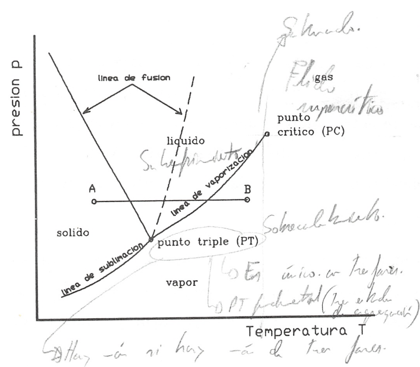
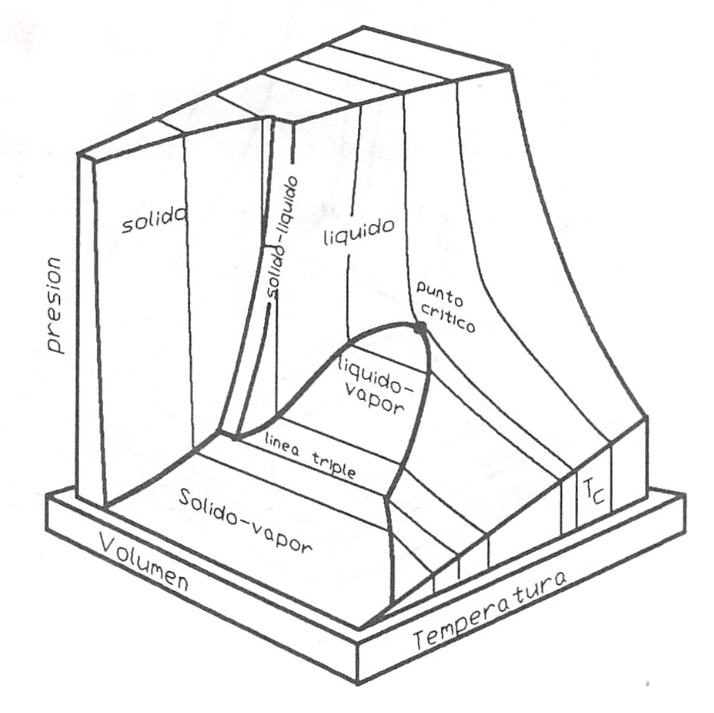

Cambio de fase
==============

Decimos que se produce un cambio de fase cuando una sustancia pasa de una fase a otra que puede coexistir con la primera. Aunque en general, cuando se habla de fases de una sustancia, se hace referencia a los tres estados de agregación de la materia: sólido, líquido y gas, ya vimos que el concepto de fase es más restringido que el de estado de agregación y de hecho se han definido fases distintas para el mismo estado de agregación en el caso del agua, carbono, azufre, etc.. No obstante, salvo que se indique lo contrario, identificaremos el cambio de fase con el paso de un estado de agregación a otro. De aquí que se hable de fusión (paso sólido -líquido), solidificación (paso líquido-sólido), vaporización (líquido-vapor), condensación (vapor-líquido), sublimación (sólido - gas), etc.

Se sabe que una determinada sustancia, dependiendo de las condiciones en las que se encuentre (p, T), puede presentarse en los tres estados de agregación. Un caso típico es el del agua: a presión atmosférica y a las temperaturas comprendidas entre 0 y 100°C, el agua se presenta en estado líquido. Por debajo de cero, manteniendo la presión, el agua es sólida (hielo) mientras que por encima de 100°C el agua se encuentra en estado gaseoso (vapor). También es conocido el hecho de que al cambiar la presión, las temperaturas de solidificación y ebullición cambian. Según el estado de agregación en el que se presenta una determinada sustancia, sus propiedades físicas cambian, en particular la densidad(1).

.. note::

   (1) E1 cambio de densidad no se da de forma regular en el paso de sólido a líquido pues mientras existen sustanciéis que al fundir disminuyen su densidad, hay otras en que ocurre lo contrario (agua). En los pasos líquido - gas y sólido - gas la disminución de densidad se da en todos los casos.

Este cambio de propiedades puede ser relacionado con el cambio en la estructura interatómica o intermolecular que presenta la sustancia. En general, pasamos de una estructura de mayor orden en los sólidos a una de menor orden en los líquidos y gases. La entalpia de cambio de fase (calor suministrado para que un cambio de fase se produzca) se invierte, por ejemplo, en el caso de paso sólido - líquido, en romper los enlaces que permiten una posición determinada a las moléculas y en su caso, también en realizar un cierto trabajo de expansión. De forma análoga podríamos analizar en una primera aproximación los restantes cambios.

En la figura 8.2 representamos en trazo lleno un esquema del diagrama p, T para una sustancia como el agua, que se expande al solidificar y en trazo discontinuo el correspondiente a sustancias que se contraen al pasar al estado sólido (que es el caso más frecuente). En esta figura podemos ver las diferentes regiones y fases en las que se presentan las sustancias.

En la figura se pueden distinguir tres regiones fundamentales: la zona de la fase sólida, zona de h'quido y zona de vapor o gas.

Si consideramos un punto como el A y comunicamos energía al sistema a presión constante, veremos que la temperatura del mismo se incrementa hasta llegar a la línea de fusión. Cuando llegamos a esta línea, observamos que el sólido pasa a líquido (proceso de fusión) y mientras ocurre el cambio la temperatura permanece constante, hasta que todo el sólido ha pasado a líquido. Una vez en estado líquido, al continuar comunicando energía al sistema, la temperatura se incrementa y así continúa el proceso hasta alcanzar la línea de vaporización.

Cuando el sistema alcanza este punto, se observa un proceso análogo al que tuvo lugar en la línea de fusión. Es decir, el líquido comienza a convertirse en vapor (vaporización), sin que
cambie la temperatura y el proceso continúa hasta que todo el líquido se convierte en vapor. A partir de este momento y hasta terminar el proceso, punto B, al comunicar energía al sistema su temperatura se incrementa. No siempre el proceso sigue esta secuencia, pues si el punto escogido está a una presión menor que la del punto triple, se producirá el paso directo de sólido a gas (sublimación). Es lo que ocurre cuando se comunica energía al :math:`CO_2` sólido a presión atmosférica normal (a esta presión la temperatura de equilibrio sólido-gas de esta sustancia es de unos -79°C.

   Diagrama presión-temperatura para cambios de fase.

Si, por el contrario, la presión es superior a la presión crítica el paso del líquido a gas se hace de forma continua sin que en ningún momento podamos distinguir entre la fase gas y líquido.

Es importante destacar que la temperatura a la cual se producen los distintos cambios de fase dependen de la presión que actúa sobre el sistema, por lo que es perfectamente posible ¡hacer que el agua entre en ebullición a 25°C. Bastará para ello que la presión a la que se halla sometida sea lo suficientemente baja (0.03 bar).

Como se puede observar en la figura 8.2, en sustancias como el agua el efecto de la presión sobre la temperatura de cambio de fase, no es para todos los cambios de fase del mismo signo. Así, mientras que en el caso de la sublimación y vaporización un aumento de presión conlleva el correspondiente incremento de temperatura, en el caso de la fusión (trazo continuo), al aumento de presión corresponde una disminución de temperatura. Esto justifica el fenómeno denominado rehielo (paso de un alambre a través de una barra de hielo sin producir modificación aparente de la misma; o soldadura, por presión, de dos trozos de hielo recién cortados).

No obstante lo dicho para sustancias como el agua, conviene tener claro que, en la mayor parte de las sustancia^ las pendientes de las tres líneas de saturación son positivas (trazo discontinuo).

Las tres líneas de equilibrio de dos fases de la figura 8.2 (fusión, vaporización y sublimación), se dice que determinan la región de saturación. Así, se puede decir que la línea de vaporización representa la región de saturación entre líquido y vapor. Al vapor presente en tal mezcla se le denomina vapor saturado y al Líquido allí presente, líquido saturado.. Al líquido a la izquierda de la línea de saturación se le denomina líquido subenfriado o comprimido y al vapor a la derecha de la línea, vapor sobrecalentado.

Conviene destacar el hecho, que se pone de manifiesto en la figura 8.4, que las líneas antes mencionadas (fusión, vaporización y sublimación) son la proyección sobre el plano p, T de superficies en las que coexisten mezclas de sólido-líquido, líquido-vapor y sólido-vapor respectivamente.	^

El denominado punto triple es el estado en el que pueden coexistir tres fases.

El punto crítico, como ya vimos en un tema anterior, corresponde al estado en el que no es posible distinguir entre la fase líquido y vapor . Es decir, al llegar a este punto la superficie de separación entre líquido y vapor desaparece y ias.pxapiedades de ambas fases se hacen idénticas. Por encima de la temperatura crítica el paso de líquido a vapor, como ya hemos dicho, se hace de forma continua y en ningún momento es posible distinguir entre las dos fases. En cierta bibliografia se habla de gas, en vez de hablar de vapor, cuando la temperatura de la sustancia es superior a la correspondiente al punto crítico, mientras que otros prefieren hablar de fluido para referirse a la sustancia en esta región.

A fin de tener una visión más completa del proceso utilizado para distinguir entre las distintas fases y las condiciones que se dan al pasar de una región a otra, representamos el mencionado proceso AB en un diagrama (p, V) y en una superficie (p, V, T), figuras 8.3 y 8.4.

En esta superficie (p, V, T) puede apreciarse mejor la naturaleza de las distintas regiones de saturación. Dentro de cada región podemos trazar líneas en las que la presión y temperatura permanecen constantes, en tanto que se produce un cambio importante en el volumen, y en general en el valor de cualquier propiedad extensiva.

Si nos centramos en la región de líquido-vapor y consideramos el volumen del sistema integrado por el líquido y vapor en equilibrio, tendremos que el volumen del sistema será:

.. math::

   V_{sis} = V_{\text{líquido}}+V_{\text{vapor}} = V_f+v_g

en la que utilizamos *f* y *g* como abreviaturas de líquido y vapor, respectivamente, que son las que con más frecuencia se encuentran en las tablas de propiedades termodinámicas.

.. figure:: ./img/fase_AB_2d.png

   Diagrama presión-volumen	de una sustancia que se expande al solidificar
   
   
.. figure:: ./img/fase_AB_3d.png

   Superficie p-v-T para una sustancia que se expande al solidificar

También para este sistema podremos escribir:

.. math::

   m_{sis} = m_f+m_g \\
   V_{sis} = m_{sis} v_{sis} \\
   V_f = m_f v_f \\
   V_g = m_g v_g

sustituyendo en (8.64):

.. math:

   m_{sis} v_{sis} = m_fv_f+m_gv_g=(m_{sis}-m_g)v_f+m_gv_g \\
   v_{sis} = \left( 1 - \frac{m_g}{m_{sis}} \right) v_f + \frac{m_g}{m_{sis}} v_g

Teniendo en cuenta que para una mezcla de líquido-vapor se define el título del vapor, representado por x, como el cociente :math:`\frac{m_g}{m_{sis}}`, obtendremos de la ecuación anterior:

.. math::

   v_{sis} = (1-x)v_f+xv_g

de donde se deduce:

.. math::

   v_{sis} = v_f+x(v_g-v_f) = v_f+xv_{fg}

en la que

.. math::

   v_{fg} = v_g-v_f

   Superficie (p V T) para una sustancia que se contrae en la solidificación.

De forma análoga obtendríamos para la energía interna, entalpía y entropía en la zona de coexistencia de las fases líquido-vapor:

.. math::

   u_{sis} = u_f+xu_{fg} \\
   h_{sis} = h_f+xh_{fg} \\   
   s_{sis} = s_f+xs_{fg} 

Para que se disponga de una descripción lo más completa posible de los sistemas que se nos pueden presentar, en la figura
8.5	se da una representación de una superficie (p, V, T) para una sustancia que dilata al fundirse, o bien que se contrae en la solidificación, caso más frecuente en el conjunto de sustancias que pueden manejarse y que difieren en este aspecto del agua.

Regla de las fases de Gibbs
---------------------------

En el análisis de los equilibrios de fase y de los procesos de cambio de fase, desempeña un papel importante la llamada regla de las fases de Gibbs. Esta regla establece la relación entre el
JL
r*

rtc. ¡	1+ - h y
¡i/O ( JO” SJfyc
y (Ul
'c- ASt d C&
Ò ■ ',¡'-	/fallís ■
23
CIM___________
J trr
‘yhjíhj	|7~
Equilibrio de los sistemas termodinámicos. Transiciones de fase
¿O /o «g.t/dt	/ó*
número de variables intensivas independientes que definen el estado del sistema termodinámico en equilibrio (a estas variables se les da el nombre de grados de libertad del sistema), el número de fases y el número de componentes del sistema.	——- Y" e"/^-

La regla de las fases podemos formularla mediante la expresión:
r\%-oL u
Z"' A ;j ñ j /
¿ Vk>%
*
. ;
T

Mx/y -
Ui ¿fuse- G: // >* ¡s-fiL-
l ~ 9~ f

¡Cü W í
¿L¿
L (8‘?)
/

en la que l es el número de grados de libertad, c es el número de componentes y / el número de
j i**/¿	O.
fases.
(p.yus- *
r sr% LA.iV
' A-
>kJ¿
La justificación de la relación anterior es sencilla, sin más que tener en cuenta que para definir el estado de equilibrio de un sistema compresible simple necesitamos dos variables intensivas, a las cuales habrá que agregar, en el caso de que el sistema esté integrado por c componentes, las c - 1 fracciones molare^ necesarias para definir la composición de cada fase, en total f(c - 1) variables. A estas debemos restarles las / - 1 igualdades que hay para los potenciales químicos de cada componente en las diversas fases (las cuales establecen una ligadura entre las diversas fracciones molares),,en total c(f - 1), por lo que el número de grados de libertad será:
7	• r,r----r/ -4->)
j/> 1 = 2 + f(c — 1) — c(f — l) = c — f + 2 p’ ^r,	-p¿ (8-74)
La regla de las fases es de importancia fundamental en termodinámica química y puede aplicarse a cualquier número de componentes. Se considera ahora su aplicación a una sustancia pura (c = 1), cumpliéndose entonces:
1 = 3- f	(8.75a)
s»
a)	Si la sustancia presenta una sola fase:
l = 2
(8.756)
el sistema viene definido por dos coordenadas termodinámicas como corresponde a una sustancia compresible simple.
b)	Si la sustancia se presenta en dos fases:
v t/p n1	r ÍQM ’
0	//t/A g- ^— l
y-r-
1 = 1
(8.75c)
y
L'Ú -Sis	rf'.r-.-v ¿C,

fi.
Jé f*.

24 Equilibrio de los sistemas termodinámicos. Transiciones de fase
sólo es independiente una coordenada termodinámica, es decir dada la presión, sabemos cuál es la temperatura correspondiente de equilibrio y las restantes magnitudes específicas de cada fase. Las líneas de transición de fase suelen representarse en un diagrama p, T.
c)	Finalmente, si consideramos un sistema trifásico, nos encontramos con que el número de libertades es 0:
/ = 0	'	(8.75 d)
es decir, tenemos un solo punto en el que puedan coexistir las tres fases. Por lo tanto hay unas p y T determinadas a las que puede darse esta coexistencia de fases y este punto es el punto triple.
Antes hemos dicho que en fase sólida puede darse más de un estado alotrópico y por tanto más de una fase, de aquí que pueda existir más de un punto triple.
.
El punto triple en el que la sustancia se presenta en los tres estados de agregación se
denomina punto triple principal.
8.5.2	Ecuación de ClausiusrClapeyron A—	q.
^	r	/'■<&
Consideremos un sistema monocomponente formado por dos fases que están en equilibrio a la presión p y a la temperatura T. Como hemos visto en el apartado 8.2, para este sistema se cumple la condición:
(8.76)
La función de Gibbs para este sistema podemos expresarla por:
G = migi + mi ¡gu y m =	+ mu dm = dm/ + dm// = 0
(8.77)
de donde:
P
sx
<>
' T
ifr-	= 0
dGT,P = gidmi + gndmn = (g¡ - gii)dm¡ = 0
J*
jJin
rû /
¿P-* G-'
(8.78)
ya que al ser T y p constantes, dgi y dgu son nulas. En consecuencia, para este tipo de sistemas se cumple:
gi(p,T) = gn(p, T)
(8.79)
Equilibrio de los sistemas termodinámicas. Transiciones de fase
25
Sometamos a este sistema a una transformación tal que la presión varíe en dp y la temperatura en dT, de forma que las fases se mantengan en equilibrio, por lo tanto:
9i(p + dp,T + dT) = gn(p + dp,T + dT)
(8.80)
La función g(p + dp,T + dT) puede desarrollarse en serie, hasta términos de primer orden, de forma que:
gÍP + dp,T + dT) = g{ptT)+(^Tdp+(^j dT	(8.81)
De la expresión de dg = —sdT -f vdp obtenemos:
dg\	(dg\
dp)T V \dT)p	S
(8.82)
y por consiguiente el desarrollo en serie toma la forma:
g(p + dp,T + dT) = g(p, T) + vdp - sdT
(8.83)
que sustituido en (8.80):
gi^T) + v¡dp - s¡dT =	n) + vndp - sndT
Recordemos que la condición de partida fue que g¡ = gn, por lo que:
(8.84)
v¡dp — sjdT — vjjdp — sudT
(8.85)
/ o/ c k 'J ■
de donde: ______	.
I 7 Ur /
Yo

dp_ _ su\- sj) dT	vui-v7
(¿c. oi. gg^
ecuación de la curva del cambio de fase, conocida como ecuación de Clausius- Clapeyron. Esta ecuación relaciona la pendiente de la línea de cambio de fase en el diagrama p, T con el cociente de la diferencia en el valor de la entropía de las fases coexistentes (s// — s¡ ) y la variación de volumen al pasar de una fase a otra (v¡¡ — v¡ ).
Teniendo en cuenta que el cambio de fase ocurre a T y p constantes:
dh — Tds + vdp,	dhjp = T dsxv
(8.87)
26
Equilibrio de los sistemas termodinámicos. Transiciones de fase
por lo que:
-VU C h	C 'P/f cffy -
T(s¡i - s¡) = hn - h¡ = /i/,//	(8.88)
en que h¡ u es la entalpia de cambio de fase y representa el calor intercambiado durante el proceso por unidad de masa o de cantidad de sustancia. De la anterior obtenemos:
hru
su ~ si =
y sustituyendo en (8.86): hf,-¡T?0 ]
:'U - jar-
i i?1 Íl
t-ky
-jy u-
éá-J3»
Js	¿-VW- V
(8.89)
<u (8.90)
Pi y¡riVc.,
'' \/jt -	70 •	- —	.
La ecuación anterior aplicada al cambio de fase líquido - vapor toma la forma:
dT T(vg - vj)
(8.91)
Utilizamos la terminología, antes mencionada, de / para el líquido, g para el vapor y f g para la variación del valor de la magnitud correspondiente al cambio de fase. Por ser la densidad del vapor mucho menor que la del líquido tenemos que dpfQ/dT será siempre positiva.
A fin de encontrar una expresión para p¡g en función de T en forma explícita, tendremos que integrar la ecuación anterior y para ello podemos realizar algunas simpliñcaciones. Por ser vg >> Vf, podemos suponer:
?ri>lr
4-
lUM
Vg~vf = Vg
(8.92)
Si consideramos presiones no muy altas, se puede considerar que vg — (RT/pjg), por lo tanto la ecuación (8.91) toma la forma:
dpfg _ hfg	dpfg /Pfg _ hfg
dT T(RT/Pfay
de donde:
lnPfg = J
nfg RT2
dT
dT
RT2
,k
(8.93)
(8.94)
La integración del segundo miembro puede realizarse siempre que conozcamos la dependencia de hfg con T. Para presiones no muy altas y un intervalo de T no muy grande, podemos suponer que hjg no depende de T, por lo que:

Equilibrio de los sistemas termodinámieos. Transiciones de fase	27
en la que C es la constante de integración.
Para hallar el valor de la constante que figura en el segundo miembro de (8.95) hemos de conocer la presión de saturación para el cambio de líquido a vapor a una temperatura determinada. Por lo general, la constante de integración se determina para la temperatura de ebullición normal Ten, es decir, la temperatura a la que hierve el líquido a la presión atmosférica normal (p = 101 325 Pa = 1 atm ). Sustituyendo en (8.95):
ln
Pia
lÍ3
1,013.105 R \Tt
1
fj
(8.96)
Con frecuencia, cuando la presión se expresa en atmósferas, nos podemos encontrar la expresión anterior en la forma:	---£> }} fcv
b f n ( 1
(p en atm)
(8.97)
Cuando la constante de integración la determinamos mediante la presión de saturación a una temperatura cualquiera que podemos designar por T* , la ecuación anterior toma la forma:
ln
Pía _ hfg
Pjg{T*) R
T*
(8.98)
Es importante destacar que la dependencia lineal de ln pjg frente al/T deducida de la ecuación (8.95) y que, de acuerdo con las condiciones de la deducción, sólo serviría para presiones bajas y en un intervalo de temperaturas no muy grande, es aplicable en un gran intervalo de p
y t.
Un razonamiento análogo se puede aplicar a los cambios sólido-vapor y sólido-líquido, aunque los resultados obtenidos no son equivalentes. También se puede utilizar la ecuación de Clausius-Clapeyron para evaluar correcciones a la escala práctica internacional de temperaturas a fin de reducirla a la escala termodinámica2.
8.5.3	Estabilidad de las fases
Consideremos un sistema formado por dos fases en equilibrio, por ejemplo agua líquida y vapor de agua a presión. Supongamos que debido a un escape en la instalación baja la presión manteniéndose constante la temperatura, o que debido a un fallo en el sistema de regulación de
2er, por ejemplo, Kirillin .A. et ai. Termodinámica Técnica Mir Moscú 1986 pág. 171.
28
Equilibrio de los sistemas termodinámicos. Transiciones de fase
presión se incrementa la presión, manteniéndose también constante la temperatura. ¿Cual será en ambos casos la fase más estable? ¿Será la misma en las doá ocasiones?.
Para responder a estas cuestiones analicemos la dependencia de la función específica de Gibbs (en el caso de un solo componente coincide con el potencial químico) de una sustancia con respecto a la presión en cada una de las dos fases a temperatura constante. Este tipo de dependencia se representa gráficamente en la figura 8.6.
9
P
presión
Como:
(8.99)
es evidente que en la figura 8.6 la curva I corresponde a la fase en la que la sustancia tiene mayor densidad (menor v), y la curva II a la fase de menor densidad. Además, en el sistema de coordenadas gp las isotermas tienen siempre la parte convexa hacia los valores de g positivos, ya que si derivamos otra vez respecto a p:
( ^l\ = f—\
\dp2)T \dp)T
(8.100)
y la magnitud (dv/dp)r es siempre negativa, tal como se vio en el apartado 8.3.2, expresión
Figura 8.6 Valores de g en función de	(8.40).	< ú
p para dos fases.	'
Supongamos que la curva I se refiere al líquido (g¡) y la curva II a su vapor saturado (gg). Es evidente que el punto C, en el que se cortan las curvas I y II, es decir, en el que <7/ = gg, será el punto de equilibrio de las fases de la substancia dada (presión p/g).
Teniendo en cuenta que la función de Gibbs es aditiva, para el sistema integrado por las dos fases, podremos escribir:
G3Í3 = n¡g¡ + nggg	(8.101)
Consideremos un sistema formado por dos fases que se encuentran a la misma presión y temperatura (puntos A y B de la isóbara p). Si este estado no es estado de equilibrio , en este sistema a p y T constantes se podrá producir un proceso que ocasione una variación del
Equilibrio de los sistemas termodinámicos. Transiciones de fase
29
potencial G del sistema. Como p y T son constantes, g¡ y gg se mantendrán constantes durante el proceso, por lo que dg¡ y dga serán nulas y:
dGsis — gjdnj 4~ ggdrig	(8.102)
También se cumple que:
na{, = rij + ng = constante
(8.103)
por lo que:
de donde:
(8.104)
/v-
(8.105)
Hemos visto que cuando un sistema está en un estado de no equilibrio a T y p constantes, la función de Gibbs tiende a disminuir hasta que alcance el mínimo que será el punto de equilibrio, es decir, dGrlP < 0, por lo que el signo de dng se determina por el de la diferencia gg — g¡.
En la gráfica esquematizada se ve que a la izquierda del punto fg, es decir, cuando p < p¡g tenemos que gg < g¡ y por tanto, debe ser dng > 0. Esto significa que se producirá un proceso de evaporación (el líquido pasa a vapor). Cuando estemos a la derecha del punto citado el proceso será de condensación.
En resumen, se tiene:
• Si gg > g¡, dng < 0, y por consiguiente, el estado estable es el estado líquido.
• Si Qg < g/, dng > 0, y por tanto, el estado estable del sistema será el estado vapor.
Resulta pues, que a una determinada p y T, es estable la fase cuya función de Gibbs,? específica sea menor.___	___
8.5.4	Equilibrio de fases cuando las presiones sobre ambas fases son distintas
Vamos a considerar el caso de equilibrio de fases cuando sobre cada una de ellas se ejerce una presión diferente. Estos casos son frecuentes en la práctica ya que, por ejemplo, en un
30
Equilibrio de los sistemas termodinámicos. Transiciones de fase
recipiente de agua abierto a la atmósfera, sobre el líquido Se ejerce la presión atmosférica, mientras que el vapor se encuentra a la correspondiente presión parcial pv.
Si nos centramos en el caso del equilibrio de fases Kquido-vapor, cuando la presión adicional sobre el Kquido la crea un gas inerte puede imaginarse este sistema como un recipiente cerrado de paredes rígidas, y en contacto con una fuente térmica, en el cual hay una sustancia en dos fases: un líquido y su vapor saturado. Sobre el líquido, además del vapor, hay un gas inerte que crea una presión adicional p* ejercida sobre el líquido. Consideraremos que el vapor y el gas inerte se comportan como una mezcla de gases ideales, es decir, cada uno se comporta como si ocupara solo todo el volumen a la temperatura del conjunto.
En este caso las condiciones de equilibrio se pueden expresar por las igualdades:
Tf = Tg
9j = 9g Pf = Pg + P*
(8.106)
(8.107)
(8.108)
Las condiciones (8.106) y (8.107) coinciden con las obtenidas antes. La condición (8.108) también es evidente: la diferencia entre las presiones de las dos fases coexistentes es igual a la presión adicional sobre una de ellas. Conviene destacar que en este caso gj se calcula a la presión pj — pg + p*, mientras que gg hay que calcularlo a pg.
Estas condiciones son válidas no sólo para el equilibrio Kquido - vapor, sino también para otros casos de equilibrio de fases (sólido - Kquido y sólido - vapor).
Consideremos ahora un problema importante: si varía la presión sobre la primera fase, con la condición de que T se mantenga constante, para que se recupere el equilibrio de fases, ¿variará la presión sobre la otra fase?. Supuesto que varíe, ¿hasta cuánto variará?.
Para responder a esta cuestión consideremos que en el recipiente antes mencionado tenemos el líquido en equilibrio solamente con su vapor y supongamos que en un principio se encontraba en equilibrio a una presión p0 y una temperatura T. Si esto es así:
gi(Po,T) = gii(p0,T)
(8.109)
donde I y II designan las fases de líquido y vapor.
Equilibrio de los sistemas termodinámicos. Transiciones de fase
31
Si a partir de estas condiciones la presión sobre la fase I se incrementa en dpi, manteniendo T invariable y suponemos que vuelve a restablecerse el equilibrio, la presión sobre la segunda fase se habrá incrementado en dpn, sin que sepamos a priori cuál es la magnitud de este cambio. Desarrollando las expresiones de g obtenemos:
9i(Po + dpi,T) = gi(p0,T) + {jfajdpí	(8.110)
9ii(Po + dpn,T) = gii(p0,T) +	dPu	(8.111)
En el momento en que se restablezca el equilibrio:
9i(Po,T) + dPl = 9ii(Po,T) + (	'dgu\ .dpnJ	) dPll	(8.112)
por lo que: (£)*-(&)*»			(8.113)
Recuérdese que (dgi/dpi)r = v¡, y por tanto:
Vídpi = vjjdpn			(8.114)
de donde: 1 ( s ") = ”' / ^ ( V dpi ) Vil {	uh		(8.115)
Esta ecuación, obtenida por primera vez por el físico inglés EH. Poynting, conduce a un resultado algo inesperado: el aumento de presión sobre una fase lleva a un aumento de presión sobre la segunda fase y este aumento es inversamente proporcional al volumen. Es decir, si el volumen específico es mayor en la segunda fase que en la primera, su correspondiente variación de presión será menor que la que tenga lugar sobre la primera fase.	IT -
Como la densidad del vapor a presiones no muy elevadas (mucho menores que la presión crítica) es considerablemente menor que la densidad del líquido, al aumentar la presión sobre el líquido aumenta de un modo insignificante la presión del vapor (en el caso del agua a la presión atmosférica y temperatura de 100 °C: v¡ — 1,0435.10~3 m3 kg-1, vg = 1,673 m3 kg-1, y por
32
Equilibrio de los sistemas termodinámicos. Transiciones de fase
consiguiente: Apg = (l,0435.10_3/l,673)Ap/ = 6,23.10_4Ap/. Cuando se trata del equilibrio ^sólido-líquido la cuestión es muy diferente, pues en este caso v¡ — 1,00 cm3 g_1 , v, = 1,09 cm3 g_1, y por lo tanto Ap¡ — 1,09 Ap3.
Destaquemos que la ecuación de Poynting sólo es válida si la temperatura se mantiene constante en el proceso. Es decir, si la presión aumenta en una de las fases en equilibrio, la presión en la otra fase sólo aumentará si las temperaturas de las fases ’coexistentes son iguales. Si no se |da esta condición, el aumento de presión en una de las fases puede no ocasionar necesariamente la variación de la presión en la segunda fase. Después se verá este caso de equilibrio.
Es conveniente tener claro, que si las dos fases se encuentran en un principio a igual presión p0 y después se aumenta la presión de una de ellas a pi, no debemos pensar que la diferencia de presión que actúa entre las fases, p*, es pi — p0 , sino que de acuerdo con la ecuación de Poynting deberá incrementarse la presión sobre la segunda fase hasta un valor pjj > p0, y por tanto, la diferencia p* = p¡ — p¡¡, será menor que la considerada en un principio.
Es fácil determinar la relación entre p/, p¡¡, p* y p0. Para ello, si hacemos Api = p¡ - p0 y Apn — p¡¡ — pp , que son los incrementos de presión sobre cada fase, tenemos:
	p* = Api - Api/ |[	(8.116)
y según la ecuación de Poynting:
a p/7= r —dpi		(8.117)
	¿Vo VII
Si la razón vi/vu no varía mucho al variar p¡ (como suele ocurrir con		frecuencia), entonces:
	Á Vl A A pn = —Apiñ r vn j	(8.118)
y de (8.116) y (8.118) se obtiene:
* a	vl a	vn ~ vl »	vll —	*
p = Api------Ap¡ = --------Api = -------A pii
vn	vn	v¡
(8.119)
por lo que:
vii
Pl = Po H--------P
vn ~ vi
V Pll = Po +
Vi
Vil - VI
(8.120)
Equilibrio de los sistemas termodinámicos. Transiciones de fase
33
y estas son las relaciones buscadas entre pi, pn, p* y pQ.
8.5.5 Equilibrio de fases en el caso de variación simultánea de presión y temperatura
Deduzcamos ahora una relación entre los valores de las derivadas de las presiones no iguales pi y pn, sobre dos fases en equilibrio, respecto a la temperatura. Para ello vamos a utilizar un método análogo al empleado en la deducción de la ecuación de Clausius - Clapeyron.
Si las fases están en equilibrio:
gi{Pi,T) = gii(pn,T)	(8.121)
Modifiquemos la temperatura en dT, la presión pi en dpi y pn en dpn, de forma que volvamos a conseguir el equilibrio:
g¡(pi + dpi,T + dT) = gn(pn + dpn,T + dT)
(8.122)
Desarrollando como hicimos en (8.110) y (8.111):
9 Api + dpí,T + dT) = gI(pI, T) +	^ dPi +	dT
= gi(pi,T) + Vídp! - s¡dT gii(pii + dpn, T + dT) = gn(pii, T) + vndpn - sudT
(8.123)
(8.124)
En el equilibrio:
—pdvidpj - s¡dT ^~P(siI ~ s¡)dT
ipil -s/	= ñu
= vndpn - sndT
= vndpn - v¡dp¡ dpn dp¡ f
dT VI dT
\hi,n _ dpn dpi T ~ VH dT	VI dT¡
(8.125)
(8.126)
Esta relación análoga a la de Clausius-Clapeyron, nos muestra la relación que existe entre las magnitudes dp/dT de las fases presentes, cuando las presiones sobre ellas no son iguales.
34 Equilibrio de los sistemas termodinámicas. Transiciones de fase
J jZ/HLiC'G-____<f>-
