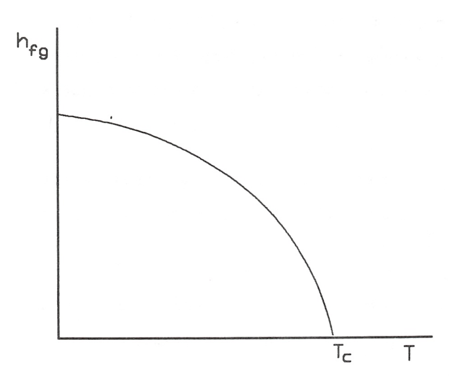
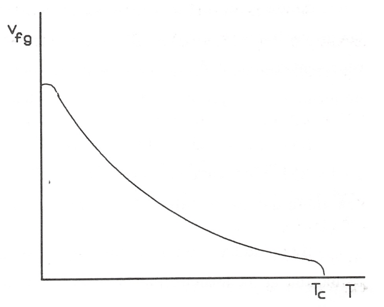

Propiedades de las sustancias en el punto crítico
=================================================

No podemos decir que haya una teoría universalmente aceptada acerca del valor de las propiedades de las sustancias en el punto crítico y se continúa discutiendo si las derivadas :math:`\left( \frac{\partial^3 p}{\partial v^3}\right)_{T_c}` y superiores son nulas o finitas en este punto o qué ocurre con el valor de :math:`c_v` y su variación en este punto. Las dificultades que se presentan son tanto de orden teórico como experimental y todavía no se ha dado una teoría completa que explique el comportamiento de la materia en el punto crítico.

No obstante, hay una serie de hechos que permiten utilizar las propiedades de este punto en la deducción de algunas características de las sustancias.

Ya hemos utilizado la propiedad que tienen las isotermas en el diagrama *p v* de presentar un punto de inflexión en el punto crítico:

.. math::

   \left( \frac{\partial p}{\partial v}\right)_{T_c} = 0\\
   \left( \frac{\partial^2 p}{\partial v^2}\right)_{T_c} = 0
   

Utilizando el diagrama T v, se obtiene, de forma análoga:

.. math::

   \left( \frac{\partial T}{\partial v}\right)_{p_c} = 0\\
   \left( \frac{\partial^2 T}{\partial v^2}\right)_{p_c} = 0

Por otro lado, si representamos en un diagrama :math:`h_{fg}` frente a *T* y :math:`v_{fg}` frente a *T*, para todas las sustancias encontraxíamos gráficas del tipo de las representadas en las figuras 8.7 y 8.8.

   Variación de :math:`h_{fg}` con T.	

   Diagrama de :math:`v_{fg}` frente a T.

De estos diagramas se deduce:

.. math::

   \left( \frac{dh_{fg}}{dT}\right)_{PC} = - \inf \\
   \left( \frac{v_{fg}}{dT}\right)_{PC} = - \inf 

Una mayor información sobre las propiedades de las sustancias en este punto se pueden encontrar en la Termodinámica de Callen(3) y en la ya citada dé Kirillin(4).

.. note::

   (3)Callen K.B.Thermodyna.mics and an Introduction to Thermostatistics 2nd ed. Wiley & Sons New York 1985 Cap. 10.
   
   (4)Kirillin V.A., nota a pie de página 2.