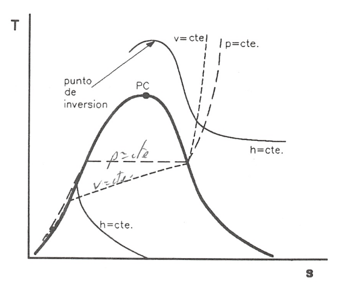
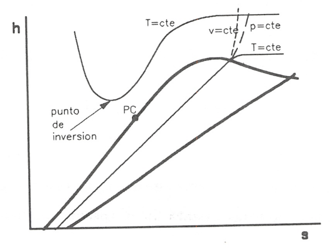
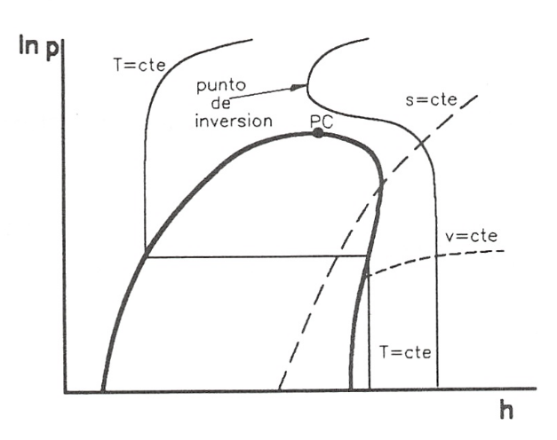
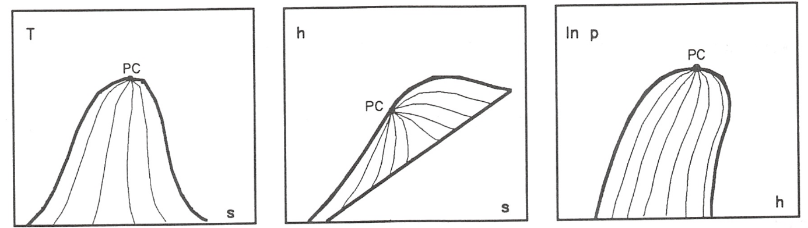

Tablas y diagramas termodinámicos
=================================

Tablas termodinámicas
---------------------

De las tablas de propiedades termodinámicas que con mayor frecuencia se encuentran en los textos de Termodinámica Técnica, cabe mencionar las de vapor saturado y vapor sobrecalentado de sustancias puras como el agua (fluido de trabajo en plantas de potencia y cambiadores
de calor) o alguno de los hidrocarburos halogenados más conocidos, el diclorodiflúormetano o R-12 (muy frecuente en dispositivos de refrigeración).

Las tablas de vapor saturado suelen proporcionar como dato de entrada la temperatura de saturación acompañada de la presión de saturación correspondiente, o a la inversa. Se dan en estas tablas valores del volumen específico, energía interna, entalpia y entropía, tanto para el líquido como para el vapor saturados. El cálculo de las propiedades de cualquier mezcla bifásica se efectúa haciendo uso de las expresiones (8.68) a (8.72), si se conoce el título del vapor x.

En ocasiones, también se encuentran tabulados otros estados de saturación diferentes al de líquido-vapor, pero el manejo de los datos correspondientes resulta análogo al caso mencionado.

En las tablas de vapor sobrecalentado suelen encontrarse tabuladas las propiedades en función de *T* y *p*, la información que proporcionan es bastante inmediata y su manejo no requiere consideración previa.

También resulta frecuente encontrar tablas de Líquido comprimido, o líquido subenfriado, para el agua y alguna otra sustancia. Ambas denominaciones resultan equivalentes aunque representan dos puntos de vista distintos. Cuando se habla de líquido comprimido se está haciendo referencia a que la presión a la que se encuentra el líquido resulta superior a la presión de saturación correspondiente a su temperatura. Sin embargo, cuando se habla de líquido subenfriado se indica que la temperatura del mismo se halla por debajo de la de saturación correspondiente a la presión a la que se encuentra.

De cualquier modo, en todos los casos, la tabulación se efectúa siempre con respecto a un origen seleccionado arbitrariamente y es necesario tener esto en cuenta si se pretende mezclar datos de la misma sustancia, pero procedentes de fuentes distintas.

También cabe destacar que la utilización de tablas en la determinación de propiedades termodinámicas de las sustancias puede requerir algún procedimiento de interpolación.

De las tablas que se van a utilizar vamos a centrarnos en ciertos aspectos de la información que proporcionan las tablas de gas. En general las tablas de gas ideal dan valores de *T*, *h*, *u* y *s*.

Sobre la temperatura, entalpia y energía interna no hay nada que decir, salvo destacar que las tablas se dan para estados termodinámicos de las sustancias tales que pueda considerarse que el comportamiento de las mismas, en estas condiciones, se ajusta al de un gas semiperfecto.

Respecto a :math:`s^o` sí conviene recordar cómo llegamos a su definición, pues vimos que para un semiperfecto:

.. math::

   s_2 - s_1 = \int_{T_1}^{T_2} c_p \frac{dT}{T} - R \ln \frac{p_2}{p_1}
   
por lo que tendríamos que realizar la integral de (8.143) para cada proceso que deseemos analizar.

Para evitar esto, se define la función:

.. math::

   s_T^0  \equiv \int_{T_o}^T c_p \frac{dT}{T}
   

cuyos valores se tabulan para las distintintas temperaturas, de forma que:

.. math::

   \int_{T_1}^{T_2} c_p \frac{dT}{T} = \int_{T_0}^{T_2} c_p \frac{dT}{T}- \int_{T_0}^{T_1} c_p \frac{dT}{T} = s_2^0-s_1^0

Por lo que la variación de entropía para estos gases, ecuación (8.143), toma la forma:

.. math::

   s_2-s_1 =  s_2^0-s_1^0 - R\ln \frac{p_2}{p_1}

Las tablas de gas ideal correspondientes al aire, también traen dos columnas con valores :math:`p_r` y :math:`v_r`, presión relativa y volumen relativo, respectivamente.

Para establecer su definición consideremos un proceso isoentrópico, para este caso (8.146) toma la forma:

.. math::

   s_2^0-s_1^0 = R \ln \frac{p_2}{p_1}

Si aplicamos esta ecuación entre un estado de referencia (:math:`T_0`, :math:`p_0`) y un estado cualquiera a (*T*, *p*), tendremos:

.. math::

   s_T^0-s_{T_0}^0 = R \ln \frac{p}{p_0}

Si consideramos que en este estado de referencia :math:`s_{T_0}^0`, obtendremos:

.. math::

   s_T^0 = R \ln \frac{p}{p_0}

Definamos una nueva función :math:`p_r = \frac{p}{p_0}` y sustituyámosla en la expresión anterior, llegaremos a:

.. math::

   \ln \frac{p}{p_0} = \ln p_r = \frac{s_T^0}{R} \\
   p_r = e^{\frac{s_T^0}{R}}

Por lo que esta función sólo depende de *T* y puede ser tabulada utilizando esta magnitud como parámetro de entrada.

Teniendo en cuenta esta función, para un proceso isoentrópico, como el representado por la ecuación (8.147), obtendríamos:

.. math::

   \left( \frac{p_2}{p_1} \right)_s = \exp{\frac{s_2^0-s_1^0}{R}} = \frac{ \exp{\frac{s_2^0}{R}} }{ \exp{\frac{s_1^0}{R}} } = \frac{p_{r2}}{p_{r1}}

Lo que nos permite disponer de un procedimiento para determinar la relación de presiones en un proceso isoentrópico, aunque los calores específicos a *p* y *v* constantes dependan de la temperatura.

Análogamente se puede proceder para determinar la relación de volúmenes en un proceso isoentrópico:

.. math::

   \left( \frac{v_2}{v_1} \right)_s = \frac{p_1T_2}{p_2 T_1} = \frac{\frac{T_2}{p_{r2}}}{\frac{T_1}{p_{r1}}} = \frac{v_{r2}}{v_{r1}}

Esta ecuación juega, para gases semiperfectos, un papel análogo al desempeñado por :math:`Tv^{(\gamma-1)} = \text{ constante}` en gases perfectos.

Diagramas termodinámicos
------------------------

En lugar de los diagramas tridimensionales p-v-T donde se representa todo tipo de curvas para una sustancia determinada, en la práctica suelen utilizarse diagramas planos cuyas coordenadas rectangulares son propiedades de uso frecuente en cálculos técnicos. Presentan la ventaja, frente a las tablas, de permitir en muchos casos la representación de los procesos en una forma sencilla, aunque si se pretende ser riguroso, sólo los procesos cuasiestáticos pueden ser representados en los diagramas termodinámicos. Esto requiere el trazado de isotermas, isóbaras, isocoras...en dichos diagramas. Las relaciones generales de la Termodinámica permiten efectuar estas determinaciones de forma general y la aplicación del modelo de cada sustancia lleva a conclusiones particulares en los distintos casos. Al igual que en las tablas, el origen es arbitrario y debe tenerse en cuenta si se desea mezclar datos de fuentes distintas. Por su interés en Termodinámica Técnica, se estudian aquí los diagramas temperatura-entropía, entalpia-entropía y presión-entalpia.

Diagrama Temperatura-entropía
^^^^^^^^^^^^^^^^^^^^^^^^^^^^^

Una de las razones por las que el diagrama T-s resulta útil es que, en un proceso reversible, el área comprendida entre la línea que une los estados inicial y final y el eje de abscisas representa el calor intercambiado durante el proceso. La figura 8.9 muestra un ejemplo de un diagrama T-s de una sustancia pura donde se representan las líneas a presión, volumen y entalpia constantes.

   Diagrama T-s de una sustancia pura con algunas líneas de interés.

a)	Las isóbaras son horizontales en la zona bifásica puesto que los cambios de fase de primer orden se efectúan a temperatura y presión constantes.

Tanto en la región de líquido como en las de vapor y gas, las isóbaras se hallan aplicando:

.. math::

   ds = c_p \frac{dT}{T} \hspace{2cm} \text{p constante}

y su representación es una línea curva. En las zonas donde su comportamiento puede aproximarse al de gas perfecto, se tiene la curva exponencial:

.. math::

   T = T_0 \exp{\frac{s-s_0}{c_p}}

La pendiente de las isóbaras en el diagrama *Ts* viene dada por:

.. math::

   \left( \frac{\partial T}{\partial s} \right)_p = \frac{T}{c_p}

en las regiones de líquido y vapor y gas.

La separación entre dos isóbaras para una misma temperatura viene dada por:

.. math::

   ds = - \left( \frac{\partial v}{\partial T}\right)_p dp 0 -\alpha v dp  \hspace{2cm} \text{T constante}

de modo que en la región líquida en que :math:`\alpha v \ll 1`, las isóbaras se hallan muy próximas entre sí y se confunden prácticamente con la curva de líquido saturado. En la zona de gas, av posee un valor considerable y las isóbaras se distinguen unas de otras con facilidad.

b)	Las curvas a volumen constante o isocoras poseen un trazado bastante similar al de las isóbaras en las regiones de líquido y vapor y gas. En estos casos, dichas curvas se hallan aplicando:

.. math::
 
   ds = c_v \frac{dT}{T} \hspace{2cm} \text{ v constante}

y su pendiente se obtiene como:

.. math::

   \left( \frac{\partial T}{\partial s} \right)_v = \frac{T}{c_v}

Como en la zona de líquido :math:`c_p \approx c_v`, las isocoras se confunden prácticamente con las isóbaras.

En la zona de gas, :math:`c_p > c_v`, así que las isocoras poseen mayor pendiente que las isóbaras, aún dando lugar al mismo tipo de curva exponencial:

.. math::

   \left( \frac{\partial T}{\partial s}  \right)_v > \left( \frac{\partial T}{\partial s}  \right)_p

En la región bifásica, las curvas a volumen constante pueden obtenerse sabiendo que :math:`x  = \frac{s-s_f}{s_g-s_f}` y que :math:`\frac{dp}{dT} = \frac{s_g-s_f}{v_g-v_f}` sólo es función de :math:`T^5`:

.. math::

   v = v_f + \frac{s-s_f}{s_g-s_f}(v_g-v_f) \Rightarrow s-s_f = \frac{v-v_f}{\frac{dp}{dT}}

.. note::

   (5)Esta expresión, cuya integración, lleva siempre a una función más o menos complicada de la temperatura (la más sencilla es la llamada a veces ecuación de Clapeyron), sólo depende de la temperatura en cada punto, puesto que relaciona propiedades del equilibrio de fases

y para un valor constante de :math:`v = v_0` se puede trazar la curva isocora en la región bifásica del diagrama *T-s*.

El área encerrada entre dos puntos de una isocora y el eje de abscisas representa la variación de energía interna de un sistema compresible simple durante un proceso efectuado a volumen constante:

.. math::

   u_2-u_1 = \int_1^2 T ds \hspace{2cm} \text{ v constante}

c)	las líneas isoentálpicas en regiones monofásicas pueden obtenerse a partir de las expresiones:

.. math::

   dh = c_p dT + \left[ v - T \left( \frac{\partial v}{\partial T} \right)_p \right] dp \\
   ds = \frac{c_p}{T} dT - \left( \frac{\partial v}{\partial T}\right)_p dp

haciendo dh = 0 y sustituyendo:

.. math::

   ds = \frac{1}{1-\frac{1}{v}\left( \frac{\partial v}{\partial T} \right)_p T} c_p \frac{dT}{T}

En la zona de líquido, :math:`\frac{1}{v}\left( \frac{\partial v}{\partial T} \right)_p \\ 1` así que las isoentálpicas se confunden con las isóbaras (ecuación 8.153), y por tanto, con la curva de líquido saturado.

La pendiente de estas líneas puede obtenerse según se muestra a continuación:

.. math::

   \left( \frac{\partial T}{\partial s} \right)_h = \frac{ \left( \frac{\partial T}{\partial p} \right)_h  }{ \left( \frac{\partial s}{\partial p} \right)_h  } = \frac{\mu_{JT}}{-\frac{v}{T}} = - \frac{T}{v} \mu_{JT}

donde :math:`\mu_{JT}` es el coeficiente de Joule-Thomson.

Para un gas ideal :math:`\mu_{JT}=0` que en la zona donde la sustancia se comporta con arreglo a ese modelo, según nos alejamos de la curva de saturación, las isoentálpicas poseen pendiente nula y son paralelas a las isotermas.

Para la mayoría de los gases reales  :math:`\mu_{JT}>0`, por lo que estas curvas poseerán pendiente negativa.

En la región bifásica, se tiene que :math:`dh = Tds`, pues la presión se mantiene constante durante el cambio de fase. De este modo se tendrá que :math:`s-s_{ref}= \frac{h-h_{ref}}{T}` y para un valor constante de :math:`h = h_0` podrá trazarse la curva isoentálpica :math:`h_0` en el diagrama *Ts*. Al aumentar la temperatura, disminuye la entropía, obteniéndose unas curvas semejantes a la representada en la figura 8.9.

d)	el punto de inversión, es decir, aquél donde para una sustancia cualquiera se cumple que :math:`\mu_{JT}=0`, se encuentra localizado en este diagrama sobre las líneas de entalpia constante, en el punto de tangente horizontal de cada isoentálpica, como se muestra en la figura 8.9. En efecto, como:

.. math::

   \mu_{JT} =  \left( \frac{\partial T}{\partial p} \right)_h = -\frac{v}{T}  \left( \frac{\partial T}{\partial s} \right)_h = 0
   
se deduce que:

.. math::

   \mu_{JT}= 0 \Rightarrow  \left( \frac{\partial T}{\partial s} \right)_h =0
   

Diagrama entalpia-entropía
--------------------------

También recibe el nombre de diagrama de Mollier de un fluido condensable y no debe confundirse con el diagrama de Mollier del aire húmedo, entalpia-humedad.

Los diagramas h-s permiten medir directamente las variaciones de entalpia que tienen lugar en los sistemas abiertos , tan frecuentes en las aplicaciones técnicas. Este es el motivo principal por el que este tipo de diagramas resulta tan útil en las aplicaciones industriales.

A continuación se estudian algunos aspectos de las líneas de mayor interés en este diagrama, cuyo esquema se representa en la figura 8.10.

   Diagrama h-s de una sustancia pura con algunas líneas de interés.
   
a)	La pendiente de las isóbaras, cualquiera que sea la región en la que se encuentren, puede obtenerse del potencial entalpia :math:`dh = Tds + udp`:

.. math::

    \left( \frac{\partial h}{\partial s} \right)_p = T

aumentando al ir aumentando la temperatura y siempre será positiva.

En la región bifásica, *T* permanece constante y las isóbaras son aquí líneas rectas.

b)	La pendiente de las isotermas es, en general:

.. math::

    \left( \frac{\partial h}{\partial s} \right)_T = \frac{ \left( \frac{\partial h}{\partial p} \right)_T}{ \left( \frac{\partial s}{\partial p} \right)_T} = \frac{v-T \left( \frac{\partial v}{\partial T} \right)_p}{-  \left( \frac{\partial v}{\partial T} \right)_p} = T -v \left( \frac{\partial T}{\partial v} \right)_p
    
De esto se deduce que en la región bifásica, donde *T* se mantiene constante durante el cambio de fase, se tiene que:

.. math::

    \left( \frac{\partial T}{\partial vs} \right)_p = 0 \Rightarrow  \left( \frac{\partial h}{\partial s} \right)_T = T
    

y las isotermas en esta zona del diagrama son líneas rectas que coinciden con las isóbaras.

En la zona de gas, lejos de la curva de saturación, donde el comportamiento puede asemejarse al de gas ideal:

.. math::

    \left( \frac{\partial T}{\partial v} \right)_p = \frac{p}{R} = \frac{T}{v} \Rightarrow  \left( \frac{\partial h}{\partial s} \right)_T = 0

donde se adviente que las isotermas tienden a ser rectas paralelas al eje de abscisas. 

La pendiente de las isotermas en las regiones líquida y vapor puede ponerse:

.. math::

    \left( \frac{\partial h}{\partial s} \right)_T = T -\frac{1}{\alpha}
    
y resulta inferior en :math:`\frac{1}{\alpha}` a la pendiente de las isóbaras en dichas zonas del diagrama.

c)	La pendiente de las ¡socoras puede obtenerse como sigue:

.. math::

    \left( \frac{\partial h}{\partial s} \right)_v =  \left( \frac{\partial (u+pv)}{\partial s} \right)_v = \frac{ \left( \frac{\partial (u+pv)}{\partial T} \right)_v}{ \left( \frac{\partial s}{\partial T} \right)_v} = \frac{c_v+v \left( \frac{\partial p}{\partial T} \right)_v}{\frac{c_v}{T}} = T \left[ 1+ \frac{v}{c_v}  \left( \frac{\partial p}{\partial T} \right)_v\right]

En las regiones de vapor y gas esta pendiente será mayor que *T*, ya que se cumple que:

.. math::

    \left( \frac{\partial p}{\partial T} \right)_v = - \frac{ \left( \frac{\partial v}{\partial T} \right)_p}{ \left( \frac{\partial v}{\partial p} \right)_T} > 0

En efecto, de las condiciones de estabilidad de sistemas monofásicos (apartado 8.3.2), se deduce que si	:math:` \left( \frac{\partial p}{\partial v} \right)_T <0`) también debe cumplirse que	:math:` \left( \frac{\partial v}{\partial p} \right)_T<0`. Como además, para las sustancias en estado de vapor se cumple que :math:` \left( \frac{\partial v}{\partial T} \right)_p >0`, se tiene que:

.. math::

    \left( \frac{\partial p}{\partial T} \right)_v >0 \Rightarrow  \left( \frac{\partial h}{\partial s} \right)_v > T

En realidad, esto se cumple para casi todas las sustancias en casi todos los estados, siendo la excepción más conocida la del agua líquida entre 0°C y 4°C.

De lo expuesto se deduce que en cualquier punto de la región de vapor, la pendiente de las isocoras resulta superior a la de las isóbaras, que a su vez es mayor que la de las isotermas:

.. math::

    \left( \frac{\partial h}{\partial s} \right)_v >  \left( \frac{\partial h}{\partial s} \right)_p >  \left( \frac{\partial h}{\partial s} \right)_T

d)	el punto de inversión en este diagrama se localiza en las isotermas con tangente horizontal, pues si el coeficiente de Joule-Thomson ha de ser igual a cero, se tiene que:

.. math::

    \left( \frac{\partial T}{\partial p} \right)_h = - \frac{1}{ \left( \frac{\partial h}{\partial T} \right)_p  \left( \frac{\partial p}{\partial h} \right)_T} = - \frac{ \left( \frac{\partial h}{\partial p} \right)_T}{c_p} = \frac{ \left( \frac{\partial h}{\partial s} \right)_T}{c_p \left( \frac{\partial p}{\partial s} \right)_T} = \frac{\alpha v}{c_p}  \left( \frac{\partial h}{\partial s} \right)_T = 0
    
y de esto se concluye que:

.. math::

   \mu_{JT} = 0 \Rightarrow  \left( \frac{\partial h}{\partial s} \right)_T =0
   

Diagrama presión-entalpía
^^^^^^^^^^^^^^^^^^^^^^^^^

Es este un diagrama de utilización muy extendida en el cálculo de procesos en los que intervienen ciclos frigoríficos. En realidad, se emplea con mucha mayor frecuencia el diagrama :math:`\ln p-h` que el propio *p-h*, ya que presenta la ventaja de permitir trabajar en un intervalo amplio de presiones. En la figura 8.11 se muestra una representación esquemática de este diagrama.

a)	las isotermas en la región bifásica son horizontales y paralelas a las isóbaras, y en las fases homogéneas su pendiente puede expresarse:

.. math::

    \left( \frac{\partial \ln p}{\partial h} \right)_T = \frac{1}{p} \left( \frac{\partial p}{\partial h} \right)_T = \frac{1}{pv(1-\alpha T)}

En la zona de vapor, próxima a la h'nea de saturación, aT > 1, por lo que la pendiente será negativa. Cuando el comportamiento responde al de gas ideal,aT = 1 y las isotermas se hacen prácticamente verticales, paralelas a las isoentálpicas.

   Diagrama lnp-h de una sustancia pura con algunas líneas de interés.

En la región de líquido se tiene que :math:`\alpha T \ll 1` y la pendiente es aproximadamente igual a :math:`\frac{\rho}{p}` y siempre positiva. Si puede suponerse la densidad casi constante, al ir aumentando la presión disminuirá la pendiente de la isoterma y si se admite el modelo de fluido incompresible en la zona de la fase líquida, las isotermas han de ser verticales.

b)	la pendiente de las isocoras se obtiene como:

.. math::

   \left( \frac{\partial \ln p}{\partial h} \right)_v = \frac{1}{p} \left( \frac{\partial p}{\partial h} \right)_v = \frac{1}{p} \frac{\left( \frac{\partial p}{\partial T} \right)_v}{\left( \frac{\partial h}{\partial T} \right)_v} = \frac{1}{p} \frac{1}{\frac{c_v}{\left( \frac{\partial p}{\partial T} \right)_v} + v}
   

En la zona donde la sustancia posee un comportamiento próximo al del gas ideal, esta pendiente será:

.. math::

   \left( \frac{\partial \ln p}{\partial h} \right)_v = \frac{1}{pv}\frac{1}{\frac{c_v}{R} +1} = \frac{R}{c_p}\frac{1}{pv} = \frac{1}{T c_p} = \frac{\gamma -1}{\gamma} \frac{1}{pv}

de modo que siempre será positiva, e irá disminuyendo al aumentar la temperatura.

c)	basándose en la expresión del potencial entalpia, la pendiente de las curvas isoentrópicas queda expresada como:

.. math::

   \left( \frac{\partial \ln p}{\partial h} \right)_s = \frac{1}{p} \left( \frac{\partial p}{\partial h} \right)_s = - \frac{\left( \frac{\partial s}{\partial h} \right)_p}{p \left( \frac{\partial s}{\partial p} \right)_h} = - \frac{1}{p} \frac{\frac{1}{T}}{-\frac{v}{T}} = \frac{1}{pv}

y siempre será positiva.

En la zona de gas, si el comportamiento de la sustancia responde al modelo de gas perfecto, la pendiente de las isocoras resulta inferior en :math:`\frac{\gamma -1}{\gamma}` a la pendiente de las isoentrópicas.

Si el comportamiento se asemeja al de gas ideal, :math:`\left( \frac{\partial \ln p}{\partial h} \right)_s = \frac{1}{RT}`, y la pendiente de la curva irá disminuyendo al ir aumentando la temperatura, al igual que en el caso de las isocoras (ecuación 8.179).

d)	en este diagrama, el punto de inversión se localiza sobre las isotermas con tangente vertical:

.. math::

   \mu_{JT} = - \frac{1}{\left( \frac{\partial h}{\partial T} \right)_p \left( \frac{\partial p}{\partial h} \right)_T} = - \frac{1}{p c_p \left( \frac{\partial \ln p}{\partial h} \right)_T}

así que:

.. math::

   \mu_{JT} = 0 \Rightarrow \left( \frac{\partial \ln p}{\partial h} \right)_T \rightarrow \inf

En los **diagramas de compresibilidad** donde se representa la desviación del comportamiento ideal de la entalpia frente a la presión (presión reducida), el punto de inversión se localiza sobre las isotermas (temperatura reducida) con tangente horizontal, que además son máximos (figura 7.7):

.. math::

   \mu_{JT} = - \frac{1}{\left( \frac{\partial h}{\partial T} \right)_p \left( \frac{\partial p}{\partial h} \right)_T}  = - \frac{\left( \frac{\partial h}{\partial p} \right)_T}{c_p}

y entonces:

.. math::

   \mu_{JT} = 0 \Rightarrow \left( \frac{\partial \ln p}{\partial h} \right)_T \rightarrow \inf

Líneas de título constante en los diagramas termodinámicos
^^^^^^^^^^^^^^^^^^^^^^^^^^^^^^^^^^^^^^^^^^^^^^^^^^^^^^^^^^

Si se denomina con la letra *z* la propiedad termodinámica representada en cada caso en el eje de abscisas y con *x* el título del vapor, se tiene que:

.. math::

   x = \frac{z_x-z_f}{z_g-z_f}
   
cumpliéndose que la relación entre los segmentos que unen en cada diagrama los puntos correspondientes a los estados *x* y *f* y *f* y *g* tal como indica (8.185), es constante para cualquier valor de temperatura (o presión) elegido.

   Representación de las lineas de titulo constante en los diagramas T-s, h-s y lnp-h.
   
Así, el trazado de las líneas de título constante, *x*, en la zona de vapor húmedo de cualquiera de los diagramas descritos más arriba, se efectúa dividiendo en partes iguales cada uno de los segmentos que unen, para una temperatura (o presión) dada, la línea de líquido saturado con la vapor saturado (segmentos de vaporización) y uniendo entre sí todos los puntos que dividen a los respectivos segmentos en la misma relación.

En la figura 8.12 se representan dichas líneas en las zonas de equilibrio líquido-vapor de los diagramas aquí estudiados.
