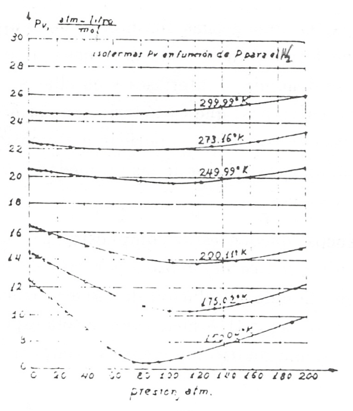
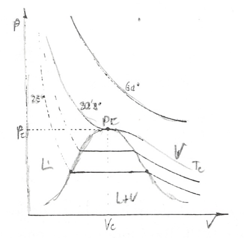
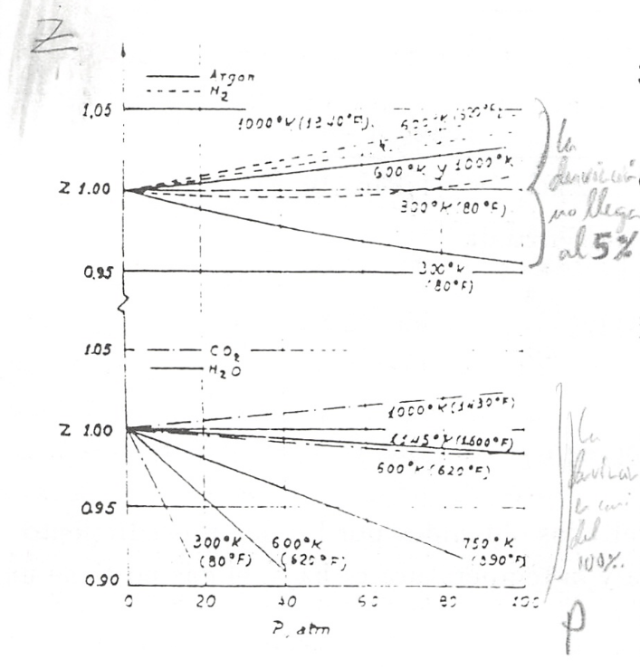
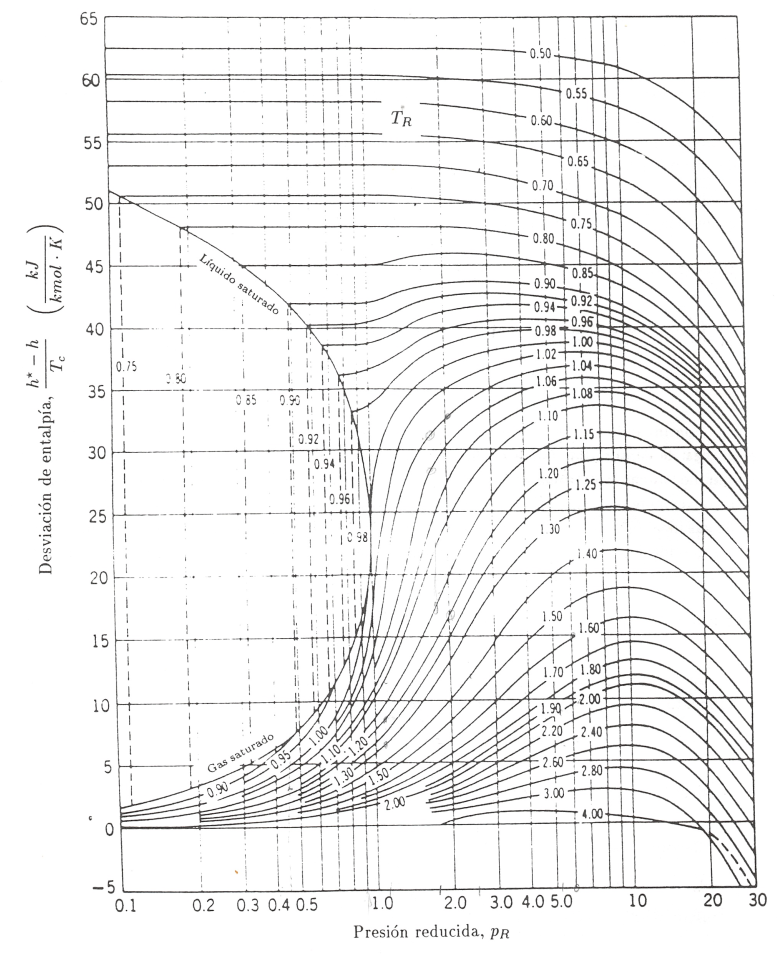

Gases
-----

La relación más sencilla entre las variables p, v, T de un sistema gaseoso, es la correspondiente al gas ideal, que ya hemos considerado. Esta relación es de manejo muy cómodo, pero no representa adecuadamente el comportamiento de los gases reales, por lo que para estudiar estos, hay que recurrir a las tablas de propiedades, a ecuaciones empíricas propias de cada gas o a las gráficas de factor de compresibilidad generalizado. Algo semejante ocurre cuando estudiamos el comportamiento de otros sistemas (Equidos, sólidos, etc.).

Comenzaremos con las relaciones empíricas.

Ecuación de estado del virial
^^^^^^^^^^^^^^^^^^^^^^^^^^^^^

Entre las ecuaciones analíticas que se utilizan para expresar el comportamiento pvT de un gas tenemos la denominada ecuación del virial. La forma de esta ecuación surge del estudio de las curvas isotermas obtenidas en la experimentación con gases.

Supongamos que se mide la presión p y el volumen V de n moles de un gas, mantenidos a una temperatura determinada, para un amplio intervalo de valores de la presión, y representamos el producto pv, siendo :math:`v = \frac{V}{n}`, en función de *p*.

Experiencias de esta clase fueron realizadas por vez primera por Amagat [#Amagat]_ en Francia en 1870 (Antes, en el periodo 1857-69 T. Andrews [#Andrews]_ realizó estudios sobre diversas isotermas del CO2, viendo que al incrementar T disminuye la diferencia :math:`v_g` — :math:`v_l`). Estas experiencias se han repetido en diversos laboratorios y en diversa épocas.

.. rubric:: Investigadores

.. [#Amagat] Emile Hilaire Amagat (1841-1915). Físico francés, autor de importantes investigaciones acerca de las propiedades de líquidos y gases.
.. [#Andrews] Thomas Andrews (1813-1885). Médico inglés. Fue profesor de Química en Belfast. Realizó las primeras investigaciones sobre compresibilidad de los gases reales a distintas temperaturas. Sus experimentos con el dióxido de carbono le llevaron a la noción de temperatura crítica al encontrar que por encima de 31,1°C era imposible licuarlo. Sus resultados fueron publicados en 1869 y confirmados en 1877 por el físico suizo Raúl Picter.

En la Fig.7.1 se representan un conjunto de isotermas típicas de un gas como el nitrógeno.

Como se ve, estás curvas pueden representarse analíticamente mediante una expresión polinómica (o desarrollo del viriaL) en la forma:

.. math::

   pv = A \left( 1 + B'p +  C'p^2 + \cdots \right)

en la que A,B'. C', etc, son los denominados coeficientes del vinal, que dependen de la temperatura y de la naturaleza del gas. Es mucho más frecuente, sin embargo, utilizar el desarrollo del virial en función de potencias de :math:`\frac{1}{v}`, en la forma

.. math::

   pv = A \left( 1 + \frac{B}{v} +  \frac{C}{v^2} +  \frac{D}{v^3} + \cdots \right)

en la que A,B,C, etc., también se denominan coeficientes del virial. Dichos coeficientes como se ha citado anteriormente, únicamente dependen, para una sustancia dada, de la temperatura.

En el intervalo comprendido entre 0 y 40 bares, la relación entre :math:`pv` y :math:`\frac{1}{v}` es prácticamente lineal, de modo que sólo los dos primeros términos del desarrollo son significativos. En general cuanto mayor es el intervalo de presiones, mayor es el número de términos necesarios en el desarrollo del virial para describir adecuadamente el comportamiento del gas.

El desarrollo del virial no sólo es la descripción matemática de las curvas empíricas obtenidas en el estudio de los gases, sino que también puede deducirse teóricamente por los métodos de la mecánica estadística, en cuyo caso se puede asignar significado físico a cada uno de sus términos: :math:`\frac{B}{v}` nos expresa la interacción entre dos moléculas, :math:`\frac{C}{v^2}` tiene en cuenta las interacciones entre tres moléculas, etc. En principio los coeficientes del virial pueden calcularse utilizando expresiones de la mecánica estadística deducidas de consideraciones sobre los campos de fuerza entre las moléculas del gas.

El desarrollo del virial y el significado físico atribuido a los distintos términos de la serie pueden utilizarse para aclarar el comportamiento del gas en el límite cuando la presión tiende a cero a una determinada temperatura. Sabemos que conforme la presión se hace más pequeña a temperatura constante, el volumen tiende a crecer, por lo que los sucesivos términos de la ecuación anterior: :math:`\frac{B}{v}`, :math:`\frac{C}{v^2}`, etc., tienden a ser cada vez más pequeños y en el límite, cuando :math:`p\rightarrow 0`, se anularán, es decir, se anularán los campos de fuerza intermoleculares, por lo que

.. math::

   pv = A

pero cuando ocurre esto, el gas se comporta como ideal, por lo que

.. math::

   a= RT

y por tanto

.. math::

   pv = RT

cuando :math:`p\rightarrow 0`.

Ecuación de Van der Waals
^^^^^^^^^^^^^^^^^^^^^^^^^

El primer intento serio de encontrar una explicación teórica al comportamiento de los gases reales fue realizado con cierto éxito por van der Waals [#VanDerWaals]_ en 1873. Basándose en razonamientos elementales de la teoría cinética llegó a la conclusión de que habría que corregir la hipótesis de comportamiento puntual de las moléculas, utilizado en el modelo de gas ideal, ya que, cuando la presión aumenta, el volumen real de las moléculas puede ser una fracción importante del volumen total ocupado por el gas, de aquí que haya de considerarse un volumen efectivo, igual a :math:`(v — b)`, en donde *b* es un parámetro que depende del gas considerado y al que se denomina covolumen.

.. rubric:: Investigadores

.. [#VanDerWaals] Johannes Direrick Van der Waals (1837-1923). Físico holandés. Profesor de Física teórica desde 1877 en la Universidad de Amsterdam. En 1910 obtuvo el Premio Nobel de Física.

De forma análoga, si tenemos en cuenta que la atracción hacia el gas sobre las moléculas del mismo, que se encuentran en el límite del sistema, en contacto con la pared, ha de ser proporcional al número de moléculas por unidad de volumen y que el número de choques con la pared, también será proporcional a este número, tendremos que la presión efectiva (que ejercería el gas vendrá dada por :math:`\left(p +\frac{a}{v^2}\right)` en la que el valor de *a* depende del campo de fuerzas intermolecular y, en primera aproximación podemos considerarlo característico de cada gas.

Según lo anterior, van der Waals propuso que la ecuación de gases ideales debía ser modificada sustituyendo el volumen específico por el covolumen y la presión debería ser reemplazada por el término :math:`\left(p +\frac{a}{v^2}\right)`, quedando la ecuación de van der Waals:

.. math::

   \left(p +\frac{a}{v^2}\right)(v-b) = RT

Hemos de tener cuidado de expresar tanto *a* como *b* en unidades que seán compatibles con las utilizadas para *p*, *v* y *T*.

En esta ecuación es importante destacar:

a) En el límite, cuando :math:`p\rightarrow 0` y el volumen específico tiende a infinito, los términos de corrección son despreciables y la ecuación se convierte en la de los gases ideales

.. math::

   pv = RT

b) Cuando la presión crece, el término que más rápidamente contribuye a la desviación del comportamiento ideal es el :math:`\frac{a}{v^2}`.

La ecuación de van der Waals tiene un campo de aplicación restringido, ya que tanto *a* como *b*, no sólo dependen de la naturaleza del gas, sino que también dependen de la temperatura y en menor grado de la presión, por lo que habría que determinarlas experimentalmente para cada gas, en cada cierto intervalo de presión y temperaturas.

A pesar de lo dicho, esta ecuación tiene un merecido interés histórico porque permitió la deducción de los parámetros característicos que definen el comportamiento de cada gas (a, b), sin más que tener en cuenta el comportamiento genérico de las sustancias puras. Al principio del tema hemos citado las experiencias de Andrews con gases, fundamentalmente con :math:`CO_2`, siendo los resultados obtenidos una red de isotermas como la esquematizada en la fig. 7.2.

Aunque en el próximo tema consideraremos con más detenimiento este tipo de isotermas destaquemos que en las dos regiones señaladas, gas y líquido-gas, encontramos una isoterma que representa el límite de esta última zona, es decir, el punto en el que coincide el volumen específico del líquido y el gas. A este punto se le denomina punto crítico y a la isoterma se la denomina isoterma crítica. El punto crítico está caracterizado por las coordenadas termodinámicas presión crítica :math:`p_c`, temperatura crítica :math:`T_c`, y volumen crítico :math:v_c``

Como vemos la isoterma crítica presenta un punto de inflexión, por lo que en el se cumplirá

.. math::

   \left( \frac{\partial p}{\partial v}\right)_{T_c} = 0\\
   \left( \frac{\partial^2 p}{\partial v^2}\right)_{T_c} = 0

Estas ecuaciones nos permiten calcular las constantes de cualquier ecuación de estado con dos constantes. En el caso de la ecuación de van der Waals expresada como

.. math::

   p = \frac{RT}{v-b} - \frac{a}{v^2}

tenemos

.. math::

   \left( \frac{\partial p}{\partial v}\right)_{T_c} = - \frac{R T_c}{(v_c-b)^2} + \frac{2a}{v_c^3} = 0 \\
   \left( \frac{\partial^2 p}{\partial v^2}\right)_{T_c} = \frac{2RT_c}{(v_c-b)^3}-\frac{6a}{v_c4} = 0

Pasando los términos en :math:`\frac{1}{v_c}` al segundo miembro y dividiendo una entre otra, obtenemos

.. math::

   \frac{2}{v_c-b} = \frac{3}{v_c}

de donde

.. math::

   v_c = 3b

y sustituyendo en la ecuación (7.6) se obtiene

.. math::

   T_c = \frac{8a}{27Rb}

y de la ecuación (7.4) aplicada en el punto crítico:

.. math::

   p_c = \frac{R\frac{8a}{27Rb}}{2b} - \frac{a}{9b^2} = \frac{a}{27b^2}

de donde

.. math::

   a = \frac{27}{64}\frac{R^2T_c^2}{p_c}\\
   b = \frac{RT_c}{8p_c}

y

.. math::

   z = \frac{p_cv_c}{RT_c}=\frac{3}{8} = 0,375

Estas ecuaciones nos permiten calcular *a* y *b* a partir de :math:`p_c` y :math:`T_c` que se determinan experimentalmente, pero, como ya hemos dicho, esto no es de un gran valor puesto que *a* y *b* varían con la temperatura si queremos que la ecuación de van der Waals nos explique el comportamiento de los gases reales.

La comprobación de lo que acabamos de decir la encontramos en el valor que toma la relación :math:`\frac{p_cv_c}{RT_c}`. De acuerdo con la ecuación de van der Waals el valor de esta relación es 0,375, como ya hemos visto, sin embargo los valores experimentales para la mayoría de los gases están comprendidos entre 0,2 y 0,3. Esto nos confirma que la ecuación que estamos considerando puede conducir a errores importantes, aunque mejora mucho los valores a los que conduce la ecuación de los gases ideales.

:doc:`Ejercicio E7.1 <homogeneos_E7.1>`

Otras ecuaciones de estado
^^^^^^^^^^^^^^^^^^^^^^^^^^

Los trabajos de van der Waals sugirieron otros muchos, encaminados a mejorar la precisión de los resultados que proporciona su ecuación de estado.

Una de las primeras consecuencias de estos trabajos fue la publicación por Dieterici en 1899 de la ecuación que lleva su nombre y que viene dada por la expresión:

.. math::

   p = \frac{RT}{v-b}\cdot e^{\left(-\frac{a}{vRT}\right)}

Esta ecuación proporciona una mayor aproximación a la relación :math:`\frac{p_cv_c}{RT_c}` de los gases reales. El valor obtenido con esta ecuación es 0,27 que podemos considerar un valor medio de los valores obtenidos experimentalmente.

Mucho más precisa que las ecuaciones anteriores es la propuesta en 1949 por Redlich y Kwong

.. math::

   p = \frac{RT}{v-b}-\frac{a}{T^\frac{1}{2}v(v+b)}

Aplicada esta ecuación en el punto critico nos conduce a los valores para *a* y *b* en función de :math:`T_c` y :math:`p_c`

.. math::

   a = 0,4275 \frac{R^2T_c^{2,5}}{p_c}

y

.. math::

   b = 0,08664 \frac{RT_c}{p_c}

Aunque es evidente, conviene no olvidar que *a* y *b* para cada ecuación de estado, con dos constantes, son distintas. Entre las ecuaciones con dos constantes, la que tiene mayor aceptación es la de Redlich y Kwong.

Se han formulado ecuaciones que se ajustan con bastante precisión al comportamiento de cierto tipo de gases, pero requieren el concurso de un gran número de constantes. Entre ellas se puede citar la ecuación de estado desarrollada por Benedict, Webb y Rubin. Esta ecuación tiene ocho constantes, además de la constante del gas, y es muy útil en predecir el comportamiento *pvT*, fundamentalmente de hidrocarburos ligeros. La ecuación de estado de Benedict, Webb y Rubin es

.. math::

   p = \frac{RT}{v}+ \left( BRT-A-\frac{C}{T^2}\right)\frac{1}{v^2}+\frac{bRT-a}{v^3}+\frac{a \alpha}{v^6}+\frac{c}{v^3T^2}\left( 1 + \frac{\gamma}{v^2}\right)e ^{-\frac{\gamma}{v^2}}

Otras ecuaciones se han desarrollado llegando incluso a intervenir hasta 50 constantes.

:doc:`Ejercicio E7.2 <homogeneos_E7.2>`

Factor de compresibilidad y estados correspondientes
^^^^^^^^^^^^^^^^^^^^^^^^^^^^^^^^^^^^^^^^^^^^^^^^^^^^

Para gases reales ya hemos visto que a presiones altas y temperaturas bajas, la extrapolación a presión cero, es decir la ecuación pv = RT, no es una buena aproximación. Para expresar la desviación del comportamiento ideal se utiliza el factor de compresibilidad

.. math::

   Z= \frac{pv}{RT} = \frac{v}{\frac{RT}{p}} = \frac{v_{real}}{v_{ideal}}

En la fig 7.3 se muestra el factor de compresibilidad para varios gases que se utilizan con frecuencia. En ella podemos observar que

- El :math:`N_2` y el Ar hasta 100 bares se desvía un 3% o menos.
- El :math:`CO_ 2` a 300K y el vapor de agua a 600K se desvían rápidamente.
- El vapor de agua habría que mantenerlo a 1100K, para que su desviación del comportamiento ideal fuese menos del 2% hasta 100 bares.

Para muchas sustancias sólo se han medido unos pocos valores de datos *pvT* en intervalos limitados de presión y temperatura. Esto hace que la disponibilidad de este tipo de datos no cubra las necesidades que de ellos se tiene. Un método que A podría paliar esta deficiencia seria el poder dispones de una función :math:`Z = Z(p,T)`.

Dos magnitudes que se utilizan a continuación son la presión reducida :math:`p_R` y la temperatura reducida :math:`T_R`. Viniendo dada la presión reducida por la relación siguiente

.. math::

   p_R = \frac{p}{p_c}

y la temperatura reducida por

.. math::

   T_R = \frac{T}{T_c}

Es importante destacar que las presiones y temperaturas a que se hace referencia en las relaciones anteriores son presiones y temperaturas absolutas.

Volviendo al factor de compresibilidad, y afortunadamente, en ausencia de datos reales, dicho factor de compresibilidad de un gas puede predecirse por aplicación de lo que se conoce como el principio de los estados correspondientes! (atribuido a van der Waals). Este principio establece xue el factor Z para todos los gases puede considerarse el mismo cuando los gases tienen la misma presión y temperatura reducidas.

Si utilizamos la ecuación de van der Waals [ecuación (7.3)] y sustituimos las coordenadas termodinámicas p, v, y T, en función de las correspondientes magnitudes reducidas se obtiene

.. math::

   \left( p_R \frac{a}{27b^2} + \frac{a}{v_R^29b^2}\right)(v_R3b-b)= RT_R \frac{8a}{27Rb}

y agrupando términos

.. math::

   \left( p_R + \frac{3}{v_R^2} \right)(3v_R -1)= 8T_R

Según esto, para sustancias de este tipo, la relación entre :math:`p_R`, :math:`T_R` y :math:`v_R` es independiente del gas considerado, es decir para una determinada :math:`p_R`, :math:`T_R` y :math:`v_R` es el mismo para cualquier gas. Generalizando este resultado podríamos decir que dos gases que estuviesen a la misma :math:`p_R` y :math:`T_R` (estados correspondientes) tienen el mismo valor de *Z*, de acuerdo con lo enunciado en el principio de estados correspondientes.

Como ya hemos visto, esto sólo sería cierto si el comportamiento del gas viniera dado por la ecuación utilizada, como esto no es así, el método seguido consiste en promediar los resultados, para lo cual, recordemos que:

.. math::

   Z = \frac{pv}{RT} = \frac{p_cv_c}{RT_c}\frac{p_Rv_R}{T_R} = Z_c\frac{p_Rv_R}{T_R}

Esto ha llevado a realizar una representación de Z en función de :math:`p_R`, tomando :math:`T_R` como parámetro, para valores determinados de :math:`Z_c`. Las gráficas obtenidas se denominan gráficas de coeficiente de compresibilidad generalizadas. En las gráficas que se utilizan normalmente se toma para :math:`Z_c` el valor 0.27 (figuras 7.4, 7.5 y 7.6). También en el diagrama se representan líneas de :math:`v_R' = v \frac{vp_c}{RT_c}` (volumen seudoreducido), en vez de las correspondientes de :math:`v_R` que no se utilizan.

El gráfico de factor de compresibilidad generalizado tiene muy diversas aplicaciones a la hora de evaluar algunas de las magnitudes que se desean calcular, una vez que se conozcan :math:`p_c` y :math:`T_c` y alguna de las coordenadas del gas. A pesar de la gran precisión que pueden llegar a alcanzar estos cálculos, nunca pueden sustituir a los datos experimentales obtenidos para el gas que se quiera estudiar.

..figure:: ./img/z_pr.png

..figure:: ./img/z_pr2.png

..figure:: ./img/z_pr3.png

..figure:: ./img/z_pr4.png

:doc:`Ejercicio 7.3 <homogeneos_E7.3>`

Gráficas termodinámicas generalizadas
'''''''''''''''''''''''''''''''''''''

El principio de los estados correspondientes también es muy útil en la predicción de valores distintos a los *pvT*. Estos tres valores acabamos de correlacionarlos mediante el factor de compresibilidad y las propiedades reducidas :math:`p_R`, :math:`T_R` y :math:`v_R'`.

Es importante destacar que el factor de compresibilidad y las coordenadas reducidas pueden utilizarse para evaluar propiedades tales como la entalpia, la entropía y el calor específico a presión constante, para gases a presiones elevadas. La utilidad de este método radica en que únicamente se requiere la presión crítica y la temperatura crítica de cualquier sustancia, viniendo las correlaciones entre estas propiedades representadas de nuevo en forma de gráficas. El método de evaluación implica las ecuaciones generalizadas desarrolladas previamente.

Recuérdese que la entalpia de una sustancia homogénea simple, puede evaluarse a partir de la ecuación generalizada

.. math::

   dh = c_pdT + \left[ v-T \left( \frac{\partial v}{\partial T}\right)_p \right]

La variación de la entalpia de un gas con la temperatura se puede calcular con facilidad, ya que sólo se necesita conocer la variación de :math:`c_p` con la temperatura a la presión deseada. De aquí que el primer término del segundo miembro de la ecuación anterior no es demasiado difícil de evaluar en un gran número de casos. No pasa lo mismo con la variación de h con la presión, ya que se requiere del conocimiento del comportamiento *pvT* de cada sustancia considerada. Debido a que el conocimiento detallado de datos sobre muchas sustancias no es conocido, se hace preciso disponer de un método más general que sea aplicable, con la suficiente precisión, al cálculo de esta variación en cualquier sustancia.

De la ecuación anterior se deduce que a temperatura constante el cambio de entalpia está dado por

.. math::

   dh_T = \left[ v - T \left( \frac{\partial v}{\partial T}\right)_p \right] dp

Utilizando la relación de compresibilidad

.. math::

   pv = ZRT

encontraremos que

.. math::

   v = \frac{ZRT}{p} \\
   \left( \frac{\partial v}{\partial T}\right)_p = \frac{ZR}{p}+ \frac{RT}{p}\left( \frac{\partial Z}{\partial T}\right)_p dp

por lo que, sustituyendo en la ecuación (7.12), obtenemos

.. math::

   dh_T = \left[ \frac{ZRT}{p} - \frac{ZRT}{p} - \frac{RT^2}{p}\left( \frac{\partial Z}{\partial T}\right)_p\right] dp = - \frac{RT^2}{p}\left( \frac{\partial Z}{\partial T}\right)_p dp

Antes de integrar esta ecuación debemos transformarla a coordenadas reducidas, de forma que en una primera aproximación, resulte de validez general. Hemos visto que, por definición

.. math::

   T = T_c T_R

y

.. math::

   p = p_cp_R

por lo que

.. math::

   dT = T_cdT_R \\
   dp = p_C dp_R

Sustituyendo estas expresiones en la ecuación (7.13), obtenemos

.. math::

   dh_T = -\frac{RT_c^2T_R^2}{p_Cp_R} \left( \frac{\partial Z}{T_c \partial T_R}\right)_{p_R} d(\ln p_R)

e integrando a temperatura constante se obtiene la expresión

.. math::

   \frac{\Delta h_T}{T_c} = -R \int_i^f T_R^2  \left( \frac{\partial Z}{\partial T_R}_{p_R}\right) d(\ln p_R)

donde i y f indican los límites inicial y final de integración para :math:`p_R`. Debido a que es fácil determinar la variación de entalpia con la temperatura a presión constante, cuando la presión es baja, la integración anterior debe realizarse desde el estado de gas ideal (:math:`p\rightarrow 0`), al estado de gas real a la misma temperatura.

La entalpia de un gas ideal se representa normalmente utilizando como superindice un asterisco, es decir, :math:`h^*`, o también mediante el subíndice (pg), :math:`h_{pg}` (correspondería a la denominación gas perfecto, considerado como sinònimo de gas ideal, sin tener en cuenta la dependencia :math:`c_p` con T). El límite superior es la entalpia reai del gas, h, a una presión determinada. De aquí

.. math::

   \frac{h^*-h}{T_c} = R \int_0^{p_R} T_R^2 \left( \frac{\partial Z}{\partial T_R}\right)_{p_R} d(\ln p_R)

El valor de la integral se obtiene por integración gráfica, utilizando datos de la gráfica de compresibilidad generalizada. El resultado de la integración conduce a valores de :math:`\frac{h^*-h}{T_c}` como función de :math:`p_R` y :math:`T_R`, estos datos se representan en forma de gráficas denominadas gráficas de entalpia generalizada. En la figura 7.7 se reproduce una de estas gráficas.

La variación de entropía se puede calcular de forma semejante partiendo de la ecuación generalizada para ds de una sustancia simple, es decir

.. math::

   ds = \frac{c_p(T,p)}{T}dT - \left( \frac{\partial v}{\partial T}\right)_p  dp

Procediendo como antes para un cambio a T constante

.. math::

   (s_p-s_0^*)_T = - \int_0^p \left( \frac{\partial v}{\partial T} \right)_p dp

Continuando con el proceso, realizaríamos la integración gráfica partiendo de datos de la gráfica de compresibilidad generalizada, :math:`p_R` y :math:`T_R`, pero no merece la pena continuar por este camino, ya que la entropía de gas ideal correspondiente a presión cero es infinita. Para evitar este inconveniente podemos aplicar la ecuación (7.16) al gas que estamos estudiando como si el modelo de gas ideal fuese aplicable en todo el intervalo de presiones (que no se comporte realmente como tal gas ideal no quiere decir que no podamos definir hipotéticamente este comportamiento). Suponiendo que se verifica esta hipótesis, tendríamos

.. math::

   (s_p^*-s_0^*)_T = - \int_0^p \left( \frac{\partial v}{\partial T}_p \right) dp = -R \int_0^p \frac{dp}{p}

El estado representado por :math:`s_p^*` es un estado hipotético, puesto que corresponde a comportamiento ideal a presión p, distinta de cero.

Si restamos de la ecuación (7.17) la ecuación (7.16), obtenemos

.. math::

   (s_p^*-s_p)_T = - \int_0^p \left[ \frac{R}{p}- \frac{\partial v}{\partial T}_p \right] dp

Recordemos que

.. math::

   v = \frac{ZRT}{p} \\
    \left( \frac{\partial v}{\partial T} \right)_p = \frac{ZR}{p}+\frac{RT}{p} \left( \frac{\partial Z}{\partial T}_p \right)

y sustituyendo en la ecuación (7.18) obtenemos

.. math::

   (s_p^*-s_p)_T = - R\int_0^p \left[ \frac{1-Z}{p}- \frac{T}{p}\frac{\partial Z}{\partial T}_p \right] dp

FIGURA

que expresada en función de las propiedades reducidas queda

.. math::

   (s_p^*-s_p)_T = - R\int_0^{p_R} \frac{1-Z}{p_R}dp_R+  R T_R \int_0^{p_R} \left( \frac{\partial Z}{\partial T_R}\right)_{p_R} \frac{dp_R}{p_R}

Teniendo en cuenta la ecuación (7.14), podemos expresar la ecuación anterior como

.. math::

   \frac{(s_p^*-s_p)_T}{R} = \frac{h^*-h}{RT_RT_c}-\int_0^{p_R} (1-Z) \frac{dp_R}{p_R}

De nuevo, utilizando coordenadas reducidas y valores del diagrama de compresibilidad generalizado podemos obtener valores para la desviación de la entropía del comportamiento ideal. Estos valores se representan de forma análoga a lo que se ha hecho con la entalpia, obteniendo las correspondientes gráficas generalizadas [figura (7.8)].

Es conveniente destacar que ambas gráficas generalizadas están basadas en el principio de estados correspondientes, por lo que representan exclusivamente una aproximación. Siempre que sea posible se deben utilizar los datos de la ecuación de estado para la sustancia objeto de análisis. Las gráficas generalizadas sólo proporcionan un medio para resolver los problemas que están fuera del intervalo de datos disponibles, lo cual se presenta con frecuencia en el análisis de ingeniería.

Aunque sólo hemos presentado dos gráficas generalizadas, debe tenerse en cuenta que puede disponerse de cualquier número de ellas, siempre que se disponga de la ecuación generalizada de la propiedad que interese, en función de *p* y *T*. Por ejemplo, se dispone de gráficas generalizadas que permiten la estimación de valores de :math:`c_p` a alta presión o también es corriente en ingeniería química la utilización de gráficas generalizadas de fugacidad (se suele representar :math:`\frac{f}{p}`, coeficiente de fugacidad, frente a :math:`p_R`, utilizando :math:`T_R` como parámetro).

En general, cuando no se disponen de datos *pvT* para una sustancia, las gráficas generalizadas son una herramienta muy adecuada para estimar el valor de las propiedades de un fluido, sea gas o líquido.

:doc:`Ejercicio 7.4 <homogeneos_E7.4>`
