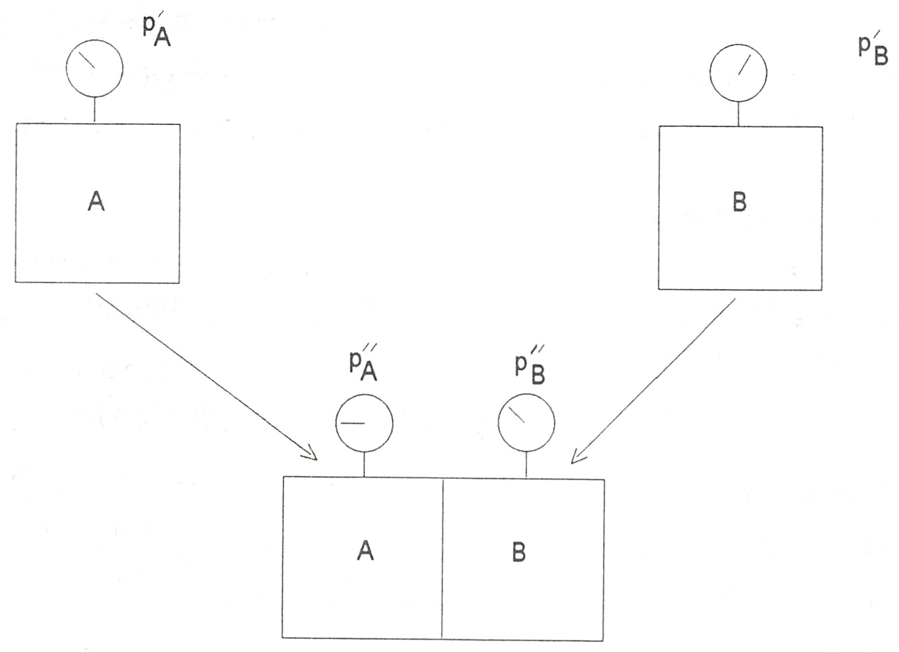
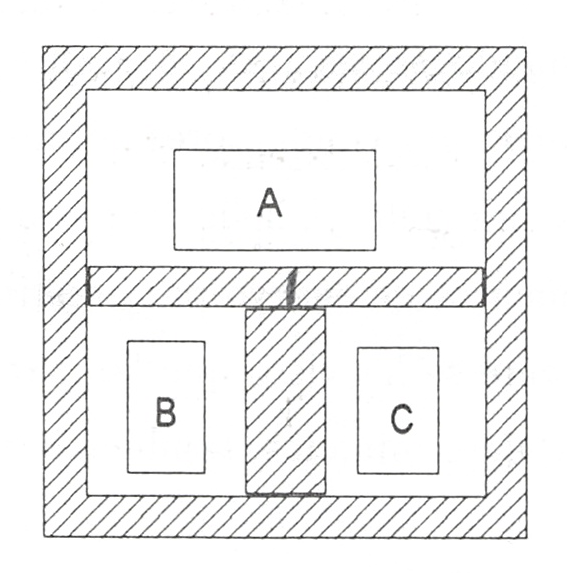
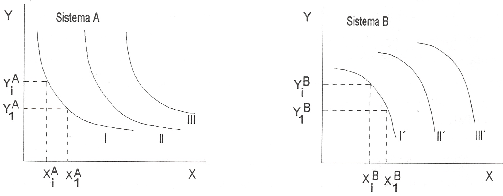

Temperatura y Ley Cero
======================

Introducción
------------

Debido al papel fundamental que la temperatura juega en el estudio de la termodinámica, es conveniente considerar ahora con cierto detenimiento esta magnitud, aunque una definición completa no se pueda obtener hasta abordar el estudio del segundo principio.

La noción de temperatura es compleja y a lo largo de nuestro estudio la veremos evolucionar y completarse. En esta parte se proporciona una noción experimental de temperatura. Fundamentalmente se establece una escala práctica de temperatura, así como los instrumentos utilizados para su aplicación.

Noción intuitiva de temperatura
-------------------------------

La sensación táctil de caliente y frío proporciona la primera aproximación experimental a la noción de temperatura, y se dice que un cuerpo caliente tiene mayor temperatura que un cuerpo frío. No obstante, esta noción resulta insuficiente a la hora de proceder a una evaluación cuantitativa de esta magnitud ya que ni siquiera es capaz de establecer, a partir de ella, un criterio de igualdad (recuérdese la distinta sensación producida por el contacto con un trozo de hierro o un trozo de corcho o madera, mantenidos en un mismo ambiente frío). 

Debido a esto, es preciso revestir adecuadamente estas sensaciones de caliente y frío a fin de convertirlas en conceptos cuantitativamente manejables. Para ello se establecen las definiciones de pared diatèrmica, pared adiabática y equilibrio térmico.

Pared diatérmana y pared adiabática. Equilibrio térmico
-------------------------------------------------------

Considérese la experiencia siguiente: dos recipientes de paredes rígidas A y B contienen el mismo gas con la misma densidad :math:`\rho` y presiones distintas :math:`p_A` y :math:`p_B` respectivamente. Los recipientes se encuentran inicialmente separados, sin que pueda suponerse ninguna influencia entre ellos. A continuación se aproximan entre sí, hasta conseguir el contacto físico. 

   Definición de pared adiabática y pared diatérmana

Una vez alcanzado dicho contacto pueden ocurrir dos cosas:

a. 	que la presión inicial en cada uno de los recipientes se mantenga después de un tiempo suficientemente largo, de forma que :math:`p_{A}'' = p_{A}'` y :math:`p_{B}'' = p_{B}'`.

b.	que la presión vaya cambiando y después de un tiempo suficientemente largo :math:`p_A'' = p_B''`.

En el caso a) se dice que:

- los dos sistemas no están en contacto térmico.
- las paredes del recipiente están formadas por una sustancia que es un aislante térmico.
- hablaremos de **paredes adiabáticas**

Si lo que se produce es el proceso b):

- los dos sistemas están, por definición, en contacto térmico.
- los recipientes están formados por una sustancia que se dice es conductora térmica.
- hablaremos de **paredes diatérmanas** o **diatérmicas**.

En este último caso los sistemas A y B se hallan, por definición, en **equilibrio térmico** una vez alcanzado un estado que se mantiene independientemente del tiempo. Puede constatarse la existencia de equilibrio térmico porque, una vez alcanzado éste y aislado el conjunto del exterior, la presión no cambia.

Equilibrio térmico: estado que se mantiene independiente del tiempo

Relacionado con la definición de pared diatérmana se tiene el concepto de **conductor térmico**. Los sistemas que llegan al equilibrio térmico cuando se separan mediante paredes diatérmicas, es decir, cuando se ponen en contacto térmico, son conductores térmicos. Los metales, especialmente la plata y el cobre, y los gases, sobre todo el helio, son conductores térmicos. Estas sustancias pueden ser utilizadas como elementos de ensayo para distinguir entre superficies diatérmanas y adiabáticas. Experimentalmente se ha visto que las paredes que permiten el contacto térmico entre dos sistemas (sustancias) determinados, también lo permiten entre otros cualesquiera.

Hay sistemas (generalmente son sólidos como el amianto, la lana de vidrio, cierto tipo de plásticos, etc.), que cuando se les rodea de paredes diatérmanas, no alcanzan el equilibrio térmico con su medio ambiente, o tardan un tiempo excesivamente largo en alcanzarlo. A estos sistemas se les denomina **aislantes térmicos** o **malos conductores térmicos**. Estos materiales se utilizan para conseguir paredes adiabáticas (casi adiabáticas).

Según lo que se acaba de ver, el contacto térmico entre un sistema y su medio ambiente o un sistema y otro, viene determinado sólo por la naturaleza de las paredes que lo separan.

Ahora bien, para que se alcance el equilibrio térmico en un tiempo prudencial, es preciso que el sistema sea buen conductor térmico.

Téngase en cuenta que ningún material proporciona una pared que sea realmente adiabática
o diatérmana. Por lo tanto, la consideración de pared adiabática o diatérmana depende del intervalo de tiempo en el que se considera el proceso. Para procesos rápidos casi todas las paredes serán adiabáticas y para procesos lentos las paredes se comportarán como diatérmanas. Si las velocidades son intermedias, una pared metálica será diatérmana y un recipiente recubierto por lana de vidrio o poliuretano será adiabático.

Principio Cero de la Termodinámica
----------------------------------

Considérese que se dispone de tres sistemas, cuyas propiedades pueden medirse mediante la instrumentación adecuada, limitados por paredes diatérmanas, rígidas e impermeables. Para concretar, supóngase que son gases confinados en un volumen determinado, cuya masa y presión se puede determinar. Los tres sistemas se hallan dispuestos en el interior de un recipiente aislado y, mediante tabiques adiabáticos móviles, se aíslan unos de otros.

   Principio Cero de la Termodinámica

Mediante el desplazamiento del tabique que separa A y B, se permite que estos establezcan contacto térmico. Si las propiedades de A y B no cambian después de que este contacto térmico se produzca, puede decirse que A y B están en equilibrio térmico. De forma análoga, se puede establecer el contacto térmico entre A y C, y si se ve que tampoco hay variación en las propiedades, se dice que hay equilibrio térmico entre A y C.

Una vez realizados los procesos anteriores, si se ponen en contacto térmico B y C, se observa que tampoco se producen modificaciones en las propiedades de estos sistemas, por lo que se puede afirmar que también se encuentran en equilibrio térmico.

Generalización de estos resultados:

* **Principio Cero de la Termodinámica**: si dos sistemas se encuentran, por separado, en equilibrio térmico con un tercero, se encuentran en equilibrio térmico entre sí. (*)

.. note::

   (*) Enunciado por R.H.Fowler en 1931.

Concepto de temperatura
-----------------------

Si varios sistemas están en equilibrio térmico deben tener alguna característica o propiedad en común y a esta propiedad común la denominamos *temperatura*.

Aunque la esencia de este concepto sólo se alcanza a través de la teoría cinético-molecular de la materia o a partir del segundo principio de la termodinámica y de la mecánica estadística, tomando como base el Principio Cero de la Termodinámica se pueden obtener métodos que permiten operar con esta magnitud. Es decir, *el Principio Cero permite definir una escala empírica de temperaturas*. 

Escala empírica de temperaturas
^^^^^^^^^^^^^^^^^^^^^^^^^^^^^^^

Para conseguir esto se pueden considerar las experiencias que se describen a continuación.

Se toman dos sistemas, A y B, en equilibrio térmico. Las propiedades elegidas para caracterizar su estado tendrán unos valores determinados que, suponiendo sistemas simples (como después se verá, son aquellos que interaccionan mediante una sola forma de trabajo), se pueden designar por los conjuntos :math:`(X_1^A, Y_1^A)` y   :math:`(X_1^B, Y_1^B)`  para cada sistema. Estas parejas de valores se pueden representar en un sistema de ejes adecuados:

   Definición de isotermas

.. note::

   (2) La función termometrica que dió lugar a esta escala es una función lineal del tipo :math:`\theta = a - X -f b`, en que los dos puntos fijos necesarios para caracterizarla son la temperatura del hielo en equilibrio con agua líquida (:math:`\theta = 0°C`) y la temperatura del vapor en equilibrio con agua líquida (:math:`\theta = 100°C`), a la prseión atmosférica estándar.

Se puede variar el estado del sistema A, manteniendo el contacto térmico con B, de forma que se garantice la existencia de equilibrio térmico. La experiencia muestra que existen parejas de valores :math:`(X_i^A, Y_i^A)` con :math:`i = 2, 3,...`, correspondientes a estados del sistema A en equilibrio térmico con el estado original del sistema B, y por tanto, en equilibrio térmico entre sí. Se denomina **isoterma** al lugar geométrico de los puntos :math:`(X_i^A, Y_i^A)` que corresponden a estados de un sistema en equilibrio térmico entre sí. La curva I de la figura anterior puede ser una de estas isotermas.

Repitiendo la experiencia con distintos estados iniciales del sistema B, que ha servido de base de comparación, se obtendría una red o conjunto de isotermas del sistema A (curvas I, II y III de la figura anterior). Procediendo de manera análoga con B, pero tomando ahora el sistema A como referencia, se tendrían ahora las curvas I’ ( estados de equilibrio térmico con los estados I de A), II’ (equilibrio con II) y III’ (equilibrio con III) de la figura 1.7.

Las curvas I y I’ que corresponden a estados de los dos sistemas en equilibrio térmico se denominan *isotermas correspondientes*. Como la propiedad de los sistemas que determina su estado de equilibrio térmico se ha denominado temperatura, se puede decir que los estados representados sobre estas curvas son estados de igual temperatura y por eso el nombre de las curvas.

Escala de temperatura y termómetros
'''''''''''''''''''''''''''''''''''

Se ha visto en el apartado anterior cómo puede obtenerse una familia de isotermas para un sistema determinado y cómo conseguir esto para otros sistemas a partir de ellas. Para establecer una escala de temperatura se tendrá que asignar, de forma biunívoca, un número a cada conjunto (par, en el caso descrito) de isotermas correspondientes. De esta forma se dispondrá de una cuantificación empírica de la magnitud temperatura.

Para medir la temperatura de un cierto sistema, se utilizará el Principio Cero de la termodinámica, es decir, se procede a conseguir el equilibrio térmico entre el sistema mencionado y otro sistema que se tomará como patrón, y al que se denomina *termómetro*.

Es necesario que el termómetro, al ponerse en contacto con el sistema para determinar su temperatura, no modifique apreciablemente el estado del mismo. Si no fuese así, la temperatura que se obtendría sería la del equilibrio termómetro-sistema, distinta de la temperatura inicial del sistema.

A fin de asignar un número a la temperatura correspondiente a cada isoterma de la familia, se recurre al hecho de que alguna o algunas de las propiedades del termómetro varían al vaciar la temperatura de equilibrio termómetro-sistema en observación. Para simplificar el procedimiento, conviene que sea una sola de las propiedades del termómetro la que varíe, para lo que se deben mantener constantes el resto de las que definen su estado. Téngase en cuenta que, si el termómetro se comporta como un sistema simple, cada una de las isotermas viene expresada en función de un par de magnitudes observables como podrían ser *p* y *V*, y en general, cualesquiera parejas de variables que puedan definir el estado del sistema y que se pueden representar por las variables genéricas *X* e *Y*. La forma más simple de efectuar la asignación antes aludida podría ser, entonces, la que se describe a continuación.

Figura 1.8 Red de isotermas

En el plano *XY* de las coordenadas del termómetro, en el que se han representado las isotermas, se elige una trayectoria que podría ser la recta :math:`Y = Y_j`, representada en la figura 1.8. Cada uno de los puntos en los que ésta corta a las isotermas tiene la misma coordenada :math:`Y_1`, pero diferente coordenada *X*, que corresponde a una temperatura diferente. La temperatura asociada a cada isoterma se toma de forma que sea una función cómoda de la X de este punto de intersección. La coordenada *X* se denomina magnitud o propiedad termométrica, y la forma de la función termométrica :math:`\Theta (X)` determina la escala de temperatura. En principio, cualquier función:math:`\Theta = f(X)`  puede asignarse arbitrariamente para establecer la escala.

Existen cinco tipos importantes de termómetros, cada uno de los cuales posee su propia propiedad termométrica, como se indica en la Tabla 1.1. Se podría representar por *X* una cualquiera de las magnitudes termométricas relacionadas en la misma, y se elige arbitrariamente para la temperatura que marca el termómetro, común a todos los sistemas en equilibrio térmico con él, la siguiente función lineal de X:

.. math::

   \Theta (X) = a X \text{ (Y constante)}

siendo *a* una constante arbitraria. Al utilizar esta función para calcular la razón de dos temperaturas en esta escala lineal, se obtiene:

.. math::

   \frac{\Theta (X_1)}{\Theta (X_2)} = \frac{X_1}{X_2}

es decir, la razón de dos temperaturas es igual a la razón de sus correspondientes valores de la magnitud termomètrica *X*.

Tabla 1.1 Tipos importantes de termómetros

Termómetro	Magnitud termometrica	Símbolo
Gas mantenido a volumen constante	Presión	P
Gas mantenido a presión constante Resistencia eléctrica	Volumen	V
(presión y esfuerzo constantes) Par termoeléctrico	Resistencia eléctrica	R
(presión y esfuerzo constantes)	f.e.m. térmica	£
Columna líquida en un capilar de vidrio (presión constante)	longitud	L

Para fijar el valor de la temperatura de un sistema se definió una escala que utilizaba dos puntos fijos con un intervalo entre ellos igual a 100, eligiendo en un principio los puntos de fusión del hielo y ebullición del agua líquida a la presión atmosférica. La escala se suele conocer con el nombre de quien se considera su descubridor, Celsius.

La escala así definida conducía a errores importantes en la determinación de temperaturas muy bajas, por lo que Giauque en 1939 propuso que se definiera una escala de temperatura que tuviera un solo punto fijo y se eligiera arbitrariamente este punto fijo (esto ya había sido sugerido por lord Kelvin en 1854). Esta propuesta de Giauque, apoyada por la mayor parte de los físicos y químicos que trabajaban con bajas temperaturas, fue aprobada en la X Conferencia de Pesas y Medidas celebrada en París en el verano de 1954.

A partir de esta fecha sólo se requiere un punto fijo para la definición de la escala termométrica; este punto fijo es la temperatura y presión para las cuales pueden coexistir en equilibrio hielo, agua líquida y vapor de agua. A este estado se le denomina punto triple del agua. Como temperatura de este punto fijo se ha asignado el valor 273,16 kelvin (abreviado, 273,16K). El kelvin es la unidad de temperatura en el Sistema Internacional.

Si se tiene en cuenta la relación (1.15) y se designa con el subíndice 3 las estados de equilibrio térmico con el punto triple del agua, se obtiene:

.. math::

   \frac{\Theta (X)}{\Theta (X_3)} = \frac{X}{X_3}

y al haberse asignado a :math:`\Theta (X_3)` el valor 273,16 se obtiene:

.. math::

   \Theta (X) = 273,16 \frac{X}{X_3} K \text{ (Y constante)}

Al ser el punto triple del agua el único punto fijo en termometria, es importante disponer de una fuente térmica a esta temperatura. Para conseguirla se utiliza un recipiente como el esquematizado en la figura 1.9.

Figura 1.9 Esquema de la fuente térmica del punto triple del agua

El recipiente se llena prácticamente con agua destilada perfectamente desgasificada y desionizada; después se hace el vacío, de forma que cuando se cierre sólo contenga agua líquida y vapor de agua. Una vez en estas condiciones, se sitúa en la cavidad central una mezcla frigorífica, con lo que se consigue formar hielo sobre las paredes interiores del recinto al congelarse el agua contenida en el mismo. Posteriormente, se elimina la mezcla frigorífica y en su lugar se sitúa la ampolla del termómetro, con lo que se fundirá una delgada película en contacto con la pared. En estas condiciones quedarán en equilibrio las tres fases (hielo, agua líquida y vapor de agua). Mientras esto suceda tendremos la seguridad de que el recinto se encuentra en el punto triple.

Tipos de termómetros. Comparación
'''''''''''''''''''''''''''''''''

Aplicando a los distintos tipos de termómetros el procedimiento que se termina de describir, se dispone de cinco posibilidades de realizar la determinación de temperatura de un sistema dado. Cada una de éstas conduce al resultado siguiente:

.. math::

   \Theta (p) &= 273,16 \frac{p}{p_3} K \text{ (V constante)}\\
   \Theta (V) &= 273,16 \frac{V}{V_3} K \text{ (p constante)}\\
   \Theta (R) &= 273,16 \frac{R}{R_3} K \text{ (esfuerzo constante)}\\
   \Theta (\epsilon) &= 273,16 \frac{\epsilon}{\epsilon_3} K \text{ (esfuerzo constante)}\\
   \Theta (L) &= 273,16 \frac{L}{L_3} K \text{ (p constante)}

La definición de los cinco posibles tipos de termómetros no resuelve el problema de la determinación de temperatura, ya que si se utilizaran los cinco termómetros simultáneamente en la medida de la temperatura de un sistema determinado, se observarían bastantes discrepancias en los resultados obtenidos con cada uno de los termómetros, dependiendo del intervalo en el que se estuviese midiendo. Aún más, si se eligiese el mismo tipo de termómetro, pero utilizando como sustancia termométrica distintas materias, también se encontrarían diferencias, en algunos casos notables. No obstante, hay termómetros con los que se obtienen resultados más reproducibles, como son los que utilizan gases a presiones moderadas, especialmente :math:`H_2` y :math:`He`. Debido a esto, los gases son las sustancias termométricas más ampliamente utilizadas, y será este tipo de termómetro el que se describirá a continuación. En el libro de Zemansky(4), se puede encontrar una buena información sobre tipos de termómetros y determinación de temperaturas.

.. note::

   3A1 comportarse el líquido como un fluido incompresible, esta condición no influye apreciablemente en la lectura.

.. note::

   
   (4) M.W.Zemansky & R.H.Dittman Calor y Termodinámica 1981 McGraw-Hill USA.

Termómetro de gas a volumen constante
-------------------------------------

La figura 1.10 muestra un esquema muy simplificado de un termómetro de gas a volumen constante. Los materiales, construcción y dimensiones varían de unos laboratorios e institutos nacionales a otros, dependiendo de la naturaleza del gas y del intervalo de temperaturas que se intenta medir. En esta figura, el gas se halla contenido en el depósito B, que comunica con la columna de mercurio M a través de un capilar. El volumen del gas se mantiene constante modificando la altura de la columna M hasta que el nivel de mercurio toque exactamente el índice en el espacio situado encima de M, denominado "espacio muerto" o "volumen perjudicial". Se varía el nivel de la columna M subiendo o bajando el tubo M’ unido a M mediante un tubo flexible.

Figura 1.10 Termómetro de gas a volumen constante

Para realizar la determinación de :math:`\Theta`, se mide la diferencia de niveles *h*, entre las dos columnas de mercurio M y M’, cuando el depósito del termómetro B está rodeado por el sistema cuya temperatura se va a medir y cuando se halla rodeado de agua en el punto triple. Es evidente que la presión del gas en cualquier caso está dada por:

.. math::

   p = p_{atm}+-\rho g h

utilizando el signo + cuando el extremo superior de M’ está por encima del de M.

Las lecturas de presión han de corregirse debido a diversas causas de error, entre las que se pueden citar: la presencia de gas en diversos espacios muertos, en los que el gas se encuentra a temperatura distinta que en B; presencia de gradientes de temperatura y presión en el capilar que une B con el medidor de presión, etc. Algunas de estas causas son corregibles por diseño y otras son evaluables, por lo que el valor de *p* se puede determinar con bastante precisión. Este valor de *p* corregido es el que se lleva a la fórmula correspondiente y mediante ella se calcula :math:`\Theta (p)`:

.. math::

   \Theta (p) = 273.16 \frac{p}{p_3} K

donde *p* y :math:`_3` son las lecturas obtenidas llevando el termómetro en contacto con el sistema cuya temperatura se quiere determinar y la fuente en el punto triple, respectivamente.

Si se utilizaran distintos gases en la determinación de la temperatura de un determinado sistema con este tipo de termómetro, se encontrarían diferencias, por lo que es necesario encontrar otro procedimiento para evaluar esta magnitud que no dependa del instrumento o sustancia de trabajo utilizada. Esto se consigue mediante la escala de gas ideal.

Temperatura en la escala de gas ideal
'''''''''''''''''''''''''''''''''''''

Como se ha dicho y experimentalmente puede comprobarse, al realizar la determinación de la temperatura de un sistema con un termómetro de gas a volumen constante, utilizando distintos gases, los resultados obtenidos son distintos. No sólo ocurre esto, sino que utilizando cantidades distintas de masa de gas termométrico en el termómetro de volumen constante se obtienen resultados distintos según la cantidad de masa de gas que se ponga en el termómetro.

En la figura 1.11 se han representado los datos experimentales obtenidos al calcular la temperatura de ebullición normal del agua utilizando un termómetro de gas a volumen constante utilizando distintos gases y distintas masas para cada gas, como refleja el valor diferente de presión en el punto triple. Es decir, cuanto menor masa tiene el termómetro, menor es el valor de la presión de vapor en este punto.

Es importante destacar el hecho de que, según disminuye la masa de gas en el termómetro, los valores de temperatura indicados por los distintos gases se van aproximando. En el límite, cuando la presión en el punto triple se anula (valor que en la realidad coincidiría con la anulación del gas), los datos de los cinco termómetros coinciden. Basándose en este hecho se establece la definición de la escala de gas ideal, que puede resumirse en la ecuación:

.. math::

   T = 273,16 \lim_{p_3 \rightarrow 0} \left( \frac{p}{p_3} \right) K

Figura 1.11 Punto de ebullición del agua en función del tipo de gas y masa del mismo, en el termómetro

La necesidad de independencia de la lectura de temperatura de la naturaleza del gas con el que se efectúe la determinación al utilizar esta escala, obliga a utilizar el termómetro de acuerdo con el método sugerido anteriormente al citar los resultados experimentales. Es decir, cada medición de temperatura obliga a realizar un conjunto de determinaciones utilizando cada vez menos cantidad de gas, hasta que la sensibilidad de los instrumentos lo permitan, y extrapolar los resultados a presión cero.

Lo dicho anteriormente indica que la escala de gas ideal no resulta una escala cómoda de aplicar en las determinaciones prácticas de temperatura, por lo que se la ha sustituido por una escala práctica que permite realizar las medidas con comodidad. Esta es la escala internacional de temperatura, cuya última versión es la de 1990.

Escala Internacional de Temperatura
'''''''''''''''''''''''''''''''''''

Para evitar la molestia que conlleva la utilización de la escala de gas ideal se utiliza una serie de termómetros secundarios, cuya calibración se realiza basándose en la escala de gas ideal. Para ello, se divide la escala de temperatura en intervalos y en cada uno se utiliza un termómetro secundario con funciones que relacionan los valores medidos con este termómetro y los correspondientes valores de la escala de gas ideal.

La última versión de la ESCALA INTERNACIONAL DE TEMPERATURA es la correspondiente a 1990 (ITS-90). Esta escala se extiende desde 0,65 K a las temperaturas más altas que pueden medirse utilizando un método óptico. En los intervalos más bajos utiliza, o bien un termómetro de gas He, o bien la determinación de temperatura basada en las relaciones presión de vapor-temperatura para 3He y 4He. Entre 14 K y 904 K utiliza un termómetro de resistencia de platino y un polinomio que expresa T en función de R (resistencia eléctrica) y cuyas constantes se calculan utilizando distintos puntos fijos determinados con la escala de gas ideal. Desde 904 a 1338 K, se emplea un termopar de platino platino-rodio y el correspondiente polinomio y puntos fijos de referencia. Por encima de esta temperatura se recurre a la pirometría óptica.

Normalmente, la calibración de los instrumentos utilizados en la determinación de temperatura se basa en esta escala, mucho más fácil de aplicar que la del gas ideal, y en su definición se ha cuidado de que las diferencias se hallen dentro de la sensibilidad de los instrumentos utilizados.

Resumen
-------

Sean dos sistemas A y B con el mismo gas. A y B con la misma densidad :math:`rho`, presiones distintas y temperaturas distintas (lo sabemos tocándolo; no nos confundimos porque se trata de la misma sustancia y no de hierro y madera, por ejemplo).

Los ponemos en contacto:

a. :math:`P_A^{(1)} = P_A^{(2)}` y :math:`P_B^{(1)} = P_B^{(2)}`; paredes adibáticas: aislante térmico.
b. :math:`P_A^{(2)} = P_B^{(2)}`; paredes diatérmanas (o diatérmicas): conductoras térmicas.

.. note:: 

   Un material que sea conductor térmico lo será sean cuales sean las sustancias puestas en contacto.

Los procesos rápidos serán adiabáticos. Los procesos lentos serán diatérmicos (equilbrio térmico con el medio ambiente).

Principio cero de la termodinámica: A en equilibrio térmico con B y B en equilibrio térmico con C implica que A está en equilibrio térmico con C. (se observa empíricamente)

Temperatura: característica o propiedad común que tienen dos sistemas en equilibrio térmico.

Escala empírica de temperaturas: