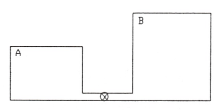

Mezcla de gases ideales
=======================

Relaciones p, v, T para mezclas de gases ideales
------------------------------------------------

En la presente sección nos vamos a referir exclusivamente a mezclas de gases ideales y vamos a introducir los dos modelos utilizados al considerar esta idealización: el modelo de Dalton y el de Amagat.

Consideremos un sistema consistente en un determinado número de gases contenidos en un recipiente cerrado de volumen *V*. La temperatura de la mezcla gaseosa es *T* y la presión *p*. La mezcla total se considera como un gas ideal, de modo que *p*, *V*, *T* y el número total de moles de la mezcla, *n*, están relacionados mediante la ecuación:

.. math::

   p = n \frac{RT}{V}

Con relación a este sistema vamos a considerar sucesivamente los modelos de Dalton y Amagat.

Modelo de Dalton
^^^^^^^^^^^^^^^^

Este modelo es consistente con el concepto de gas ideal; esto es un gas compuesto de moléculas que ejercen fuerzas despreciables unas sobre otras por lo que el comportamiento de cada componente no se ve afectado por la presencia del resto de los componentes y que además cada molécula ocupa un volumen despreciable comparado con el que ocupa el gas de modo que puede considerarse que cada componente ocupa todo el volumen disponible. En resumen el modelo de Dalton supone que cada componente de la mezcla se comporta como un gas ideal que estuviera él solo ocupando todo el volumen disponible a la temperatura de la mezcla.

Para cada componente se verifica, pues:

.. math::

   p_1 V = n_1 RT \\
   p_2 V = n_2 RT \\
   ...
   p_k V = n_k RT \\   

Sumando ambos miembros de estas igualdades se obtiene:

.. math::

   (p_1 + p_2 + ... + p_k) V = (n_1+n_2+...+n_k)RT

y teniendo en cuenta (9.4),

.. math::

   (p_1 + p_2 + ... + p_k) V = nRT

Comparando esta última expresión con (9.59), obtenemos que:

.. math::

   p = \sum_{i=1}^k p_i

La relación entre la presión del componente *i* y la presión de la mezcla se obtiene del cociente entre cada una de las ecuaciones (9.60) y la ecuación (9.59):

.. math::

   \frac{p_i}{p} = \frac{n_i}{n} = x_i \rightarrow p_i = x_i p

A :math:`p_i` se le da el nombre de presión parcial del componente :math:`i^*` en la mezcla. Esta presión parcial vemos que es igual al producto de la fracción molar del correspondiente componente por la presión de la mezcla.

Modelo de Amagat
^^^^^^^^^^^^^^^^

La hipótesis que subyace en el modelo de Amagat es que cada componente de la mezcla se comporta , por separado, como un gas ideal a la presión y temperatura de la mezcla. El volumen que los :math:`n_i`moles del componente *i* ocuparían, si ese componente estuviera solo a (*T*, *p*), se llama volumen parcial :math:`V_i` del componente *i*. Este volumen parcial puede calcularse haciendo uso de la ecuación térmica de estado del gas ideal:

.. math::

   V_i = \frac{n_i RT}{p}

Si esta ecuación la dividimos por el volumen total *V*, siendo :math:`V = \frac{nRT}{p}`, obtendremos:

.. math::

   \frac{V_i}{V} = \frac{n_i}{n} = x_i

Así pues, el volumen parcial del componente *i* puede expresarse en función de su fracción molar :math:`x_i` y del volumen total *V*:

.. math::

   V_i = x_i V

Esta relación entre la fracción del volumen y la fracción molar subyace en el uso del término análisis volumétrico cuando una mezcla se especifica por los volúmenes parciales de sus componentes.

Sumando en (9.64) para todos los componentes:

.. math::

   \sum_{i=1}^k V_i = V \sum_{i=1}^k x_i = V

La mezcla ideal de gases ideales es un caso particular de la disolución ideal analizada en 9.4

Propiedades termodinámicas de la mezcla de gases ideales
--------------------------------------------------------

La aplicación del principio de conservación de la energía y/o del segundo principio de la termodinámica a un sistema que consista en una mezcla ideal de gases ideales precisa de la evaluación de las variaciones de energía interna, entalpia y/o de la entropía de la mezcla. Nuestro objetivo en esta sección es desarrollar los medios para evaluar tanto la energía interna, entalpia y entropía de la mezcla como sus variaciones cuando el sistema (la mezcla) experimenta un proceso que la lleva desde un estado termodinámico (:math:`T_1`, :math:`p_1`) a otro (:math:`T_2`, :math:`p_2`).

.. math::

   * Obsérvese que estos resultados ya se han obtenido anteriormente (Cfr 9.3.2)

De las expresiones (9.9), teniendo en cuenta (9.46), se obtiene:

.. math::

   U = \sum_{i=1}^k n_i \overline{u_i} = \sum_{i=1}^k n_i u_i \\
   H = \sum_{i=1}^k n_i \overline{h_i} = \sum_{i=1}^k n_i h_i 

Como cada componente de la mezcla se comporta como gas ideal, tanto U como H serán función sólo de la temperatura. Para la entropía, y únicamente para el tipo de proceso que consideramos en el apartado siguiente, podemos llegar a una expresión análoga a las anteriores.

Procesos de mezclado en los que intervienen gases ideales
---------------------------------------------------------

Consideremos el proceso de mezclado de varios gases que se mantienen a *T* y *p*, separados en sus correspondientes volúmenes parciales. Si el recinto que los contiene está aislado y quitamos los tabiques que los mantienen separados, como la energía total se mantiene constante tendremos que

.. math::

   U_1 = U_2

   

o bien

.. math::

   \sum_i x_i \left. u_i \right|_1 = \sum_i x_i \left. u_i \right|_2

Lo mismo podemos decir de la entalpia. Para analizar la variación de entropía consideremos el caso siguiente:

.. figure:: ./img/fig_9_2.png

Sea un dispositivo en el que mediante émbolos rígidos se confinan dos gases según se muestra en la figura. El émbolo :math:`E_1` es permeable al gas 1, el tabique *A* es permeable al gas 2 y el :math:`E_2` es impermeable.

_Estado 1_: :math:`E_1` adosado a *A*. Los gases 1 y 2 están no mezclados, a la temperatura *T* y presiones respectivas :math:`p_1` y :math:`p_1`-

Estado 2: Gas perfecto mezclado a la temperatura *T*.

Desplazando, tan lentamente como sea preciso, el conjunto :math:`E_1-E_2` de los dos émbolos ligados mediante el vástago 1, se obtiene una zona de mezcla entre las paredes :math:`E_1` y *A*; el desplazamiento inverso separa los gases, siendo la operación reversible, por lo que puede imaginarse una sucesión de estados de equilibrio entre los estados inicial y final.

Es importante destacar que los volúmenes ocupados por el gas 1 y 2, no varían durante el proceso, por lo que, al mantenerse la temperatura, tampoco variarán :math:`p_1` y :math:`p_2`.

Si denominamos :math:`A_c` al área de la sección recta del cilindro, el émbolo :math:`E_1` está sometido en su cara izquierda a un fuerza :math:`p_1 A_c` dirigida hacia la derecha y en la cara derecha a una fuerza :math:`-(p_1+p_2)A_c` dirigida hacia la izquierda. La fuerza resultante sobre :math:`E_1` es :math:`-p_2 A_c`.

El sistema ejerce sobre la cara izquierda de :math:`E_2` una fuerza :math:`p_2 A_c`, por lo que la fuerza resultante sobre el sistema en conjunto de los dos émbolos es nula, como corresponde a una evolución en equilibrio.

De lo que acabamos de ver resulta que el trabajo es nulo, la temperatura es constante durante el proceso por lo que :math:`\Delta U = 0`, aplicando el primer principio obtenemos

.. math::

   Q_{1,2} = 0

Al ser la transformación reversible :math:`\Delta S = \frac{Q_{1,2}}{T} = 0` por lo que

.. math::

   S - S_o = ns - \sum_i n_i s_{oi} = 0

Esto es:

.. math::

   ns = \sum_i n_i s_{oi} \\
   s = \sum_i x_i s_{oi}

En (9.66) s es la entropía molar de la mezcla a *T* y *p* y :math:`s_{oi}` es la entropía del componente *i* evaluada a *T* y :math:`p_i`, es decir en las condiciones iniciales.

Proceso real de mezclado
^^^^^^^^^^^^^^^^^^^^^^^^

Consideremos a continuación el caso esquematizado en la figura adjunta:

Dos depósitos *A* y *B* están unidos mediante un conducto provisto de una llave, en los depósitos hay dos gases a la misma presión y temperatura, que es la del medio ambiente. Se abre la llave y se espera hasta que se alcanza el equilibrio.

La transformación se realiza a *T* constante y los gases tenderán a difundirse el uno en el otro hasta que llenen todo el depósito, momento en el que alcanzarán, respectivamente, las presiones :math:`p_1` y :math:`p_2`-

Es importante destacar, en este caso, que en las condiciones iniciales los gases están a la misma temperatura y presión y que en el estado final se mantiene la temperatura, pero las presiones de cada gas son distintas, a diferencia de lo que ocurre en el caso analizado en el apartado anterior.

Para calcular la variación de entropía podremos utilizar la ecuación:

.. math::

   ds = \frac{c_p}{T}dT - R \frac{dp}{p}

al ser la transformación a *T* constante:

.. math::

   ds = -R \frac{dp}{p}

En el caso del componente *i*, tendremos que al cambiar su presión de *p* a :math:`p_i` la entropía cambia desde :math:`s_{oi}(p,T)` a :math:`s_{i}(p_i,T)`, siendo:

.. math::

   s_i-s_{oi} = -R \ln \frac{p_i}{p}

esto es:

.. math::

   s_i = s_{oi} - R \ln \frac{p_i}{p}

El valor de la entropía final será:

.. math::
 
   S = \sum_i n_i s_i \\
   = \sum_i n_i \left( s_{oi} - R \ln \frac{p_i}{p} \right) \\
   = n \left[ \sum_i x_i s_{oi} - R \sum_i x_i \ln x_i \right]

Esta ecuación, al dividirla entre el número total de moles y reordenarla queda:

.. math::

   \Delta s_{\text{mezcla}} = s - \sum_i x_i s_{oi} = -R \sum_i x_i \ln x_i

en la que s es la entropía molar de la mezcla a *T* y *p* y :math:`s_{oi}` es la entropía molar del componente *i* a las mismas *T* y *p*. Por lo tanto :math:`s- \sum_i x_i s_{oi}` representa el incremento de entropía por mol que se produce al mezclar gases a las mismas *T* y *p*. Téngase en cuenta que siempre será positiva ya que :math:`x_i` siempre será menor que la unidad. Sólo en el caso de que todos los gases sean iguales :math:`x = 1` y el incremento de entropía sería nulo (paradoja de Gibbs). No parece ser que tenga sentido hablar de mezcla en el caso de que consideremos gases iguales en las mismas condiciones de *T* y *p*.

Se propone como ejercicio el encontrar las condiciones finales en el caso de mezcla de tres gases, contenidos en tres recintos aislados del exterior, y que se encuentran a distinta *T* y *p*.

Variaciones de las propiedades termodinámicas
---------------------------------------------

En el trabajo con mezclas más que los valores de estas propiedades, lo que nos interesa es poder evaluar las variaciones de las mismas cuando la mezcla experimenta un proceso durante el cual la composición permanece constante; esto es, tenemos un sistema formado por varios componentes cuyo número de moles permanece constante durante el proceso, y, por lo tanto, también permanece constante el número de moles de la mezcla.

Las variaciones de *U*, *H*, y *S* durante el proceso, a partir de (9.65) y (9.66), serán:

.. math::

   \Delta U = \sum_{i=1}^k n_i (u_{i2})-u_{i1}) \\
   \Delta H = \sum_{i=1}^k n_i (h_{i2})-h_{i1}) \\   
   \Delta S = \sum_{i=1}^k n_i (s_{i2})-s_{i1}) 

donde :math:`u_i` y :math:`h_i` se calculan a la temperatura de la mezcla (a :math:`T_2` en el instante final y a :math:`T_1` en el instante inicial) mientras que :math:`s_i` se calcula a la temperatura y presión de la mezcla; esto es,

.. math::

   \Delta U &= \sum_{i=1}^k n_i (u_i(T_2)-u_i(T_1)) \\
   \Delta H &= \sum_{i=1}^k n_i (h_i(T_2)-h_i(T_1)) \\   
   \Delta S &= \sum_{i=1}^k n_i (s_i(T_2,p_2)-s_i(T_1,p_1)) 

ya que lo que hemos denominado :math:`\Delta S_{\text{mezcla}}` es el mismo para el estado inicial y final puesto que no depende ni de *T* ni de *p*, sino sólo de la composición según se ve de (9.67).

Finalmente si las expresiones dadas en (9.65) las dividimos por *n*, como :math:`c_v = \left. \frac{\partial u}{\partial T} \right|_v` y :math:`c_p = \left. \frac{\partial h}{\partial T} \right|_p` se obtienen las expresiones siguientes de los calores específicos a volumen y presión constante para una mezcla ideal de gases ideales:

.. math::

   c_v = \sum_{i=1}^k x_i \left. \frac{\partial u_i}{\partial T} \right|_v = \sum_{i=1}^k x_i c_{vi} \\
   c_p = \sum_{i=1}^k x_i \left. \frac{\partial h_i}{\partial T} \right|_p = \sum_{i=1}^k x_i c_{pi} 
