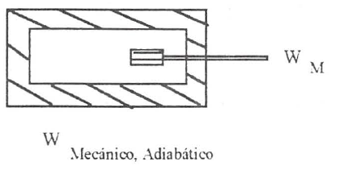
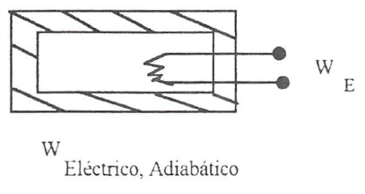
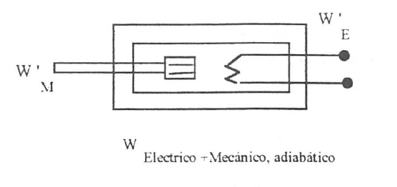

Primer principio
=================

Introducción
------------

Utilizando los conceptos  y  definiciones  expuestos  hasta  aquí, procederemos  a  enunciar la primera gran generalización de la termodinámica, el denominado primer principio o primera ley de la termodinámica. Como se ha dicho es un enunciado y no una demostración, ya que partiendo de hechos experimentalmente demostrables, se generalizan hasta elevarlos a la categoría de principio universal, cuya única validación consiste en comprobar experimental o teóricamente la verificación de las consecuencias que de él se deducen.

   
   Comunicamos trabajo mecánico a un sistema adiabático

 
   Comunicamos trabajo eléctrico a un sistema adiabático

   Comunicamos trabajo mecánico y eléctrico a un sistema adiabático

Para llevar al sistema desde un  estado 1 a un estado 2 determinados, el trabajo transferido en distintos procesos es:

.. math::

   W_M = W_E = W_M' +W_E' 

Para enunciar este primer principio, consideremos las experiencias utilizadas anteriormente para definir trabajo adiabático y haciendo uso de los dos métodos indicados, paletas y resistencia eléctrica, llevemos adiabáticamente una determinada masa  de fluido desde unas condiciones iniciales definidas por (:math:`T_1`  , :math:`p_1`), a unas condiciones finales representadas por (:math:`T_2`  , :math:`p_2`). En ambos casos las condiciones iniciales y finales son las mismas. La experiencia demuestra que el trabajo mecánico y eléctrico realizado en condiciones adiabáticas para conseguir un determinado cambio de estado de un sistema es el mismo:

.. math::

   W_{\text{12(Mecánico,adiabático)}} = W_{\text{12(Eléctrico,adiabático)}}

Aun más, si se interacciona simultáneamente con trabajo eléctrico y mecánico para llevar al sistema desde el mismo estado inicial al mismo estado final, la suma de los trabajos utilizados en esta ocasión es igual a cada uno de los suministrados en las ocasiones anteriores, figura 2.5 (fórmula matemática superior).

De lo dicho anteriormente se puede inferir, haciendo una primera generalización, que la cantidad de trabajo adiabático suministrado a un sistema para llevarlo desde un estado a otro no depende del procedimiento seguido para conseguir este cambio, sino solamente de los estados inicial y final. 

En esencia esto constituye la base del enunciado de la primera ley de la termodinámica.

Primera Ley de la Termodinámica
-------------------------------

El trabajo implicado en la modificación adiabática del estado de un *sistema cerrado* no depende del procedimiento utilizado en el proceso, sino solamente de los estados inicial y final  del sistema.

También se podría decir que el trabajo intercambiado en un proceso adiabático solo depende del estado inicial y final del sistema y no del procedimiento utilizado en la realización del mismo, ni de la naturaleza del sistema.

Consecuencias
-------------

Como ya hemos dicho la validez de este principio no está en el método utilizado para su formulación, sino en que las consecuencias que de él se derivan han sido ampliamente comprobadas.

La primera consecuencia que puede obtenerse de este enunciado es que si el trabajo adiabático sólo depende del estado inicial y final del sistema, este trabajo debe representar la variación de una propiedad del sistema. A esta propiedad se le denomina energía total y la representaremos por *E*. Según el primer principio:

.. math::

   \Delta E = E_2 - E_1 = W_{adiabático}

Conviene destacar que esta ecuación es una definición operacional del incremento de energía en un proceso cualquiera, ya que al ser E propiedad del sistema sólo dependerá del estado del sistema y no del procedimiento que nos haya llevado a él. Esto quiere decir que para cualquier proceso experimentado por un sistema del que conozcamos el estado inicial y final, se podrá calcular el incremento de energía total del sistema sin más que calcular o medir el trabajo adiabático realizado para llevar el sistema desde el mencionado estado inicial hasta el final.

Lo dicho anteriormente tiene una teórica limitación, ya que hay estados entre los que no es posible definir una transformación adiabática, por lo que hay quien considera poco consistente la ecuación anterior. No obstante, la objeción no es excesivamente importante puesto que si bien es posible que entre los estados 1 y 2 no se tenga un proceso adiabático, siempre es posible localizar un punto *R* tal que sean posibles los procesos adiabáticos *1R* y *2R*, de forma que:

.. math::

   \Delta E_{1R} &= E_R - E_1 &= W_{adiabático}' \\
   \Delta E_{2R} &= E_R - E_2 &= W_{adiabático}'' 

Consecuentemente:

.. math::

   \Delta E &= E_2 - E_1 = (E_R - E_1) - (E_R - E_2) \\
   \Delta E &= W_{adiabático}'-W_{adiabático}''

Y siempre será posible la determinación de :math:`\Delta E` mediante la realización y medida de trabajo  adiabático.

Es conveniente destacar, que si bien :math:`\Delta E`, para  un determinado sistema y proceso, está cuantificada, no podemos decir lo mismo del valor absoluto de *E* para un estado dado de ese sistema. Para poder calcular este valor espreciso fijar un valor de referencia arbitrariamente elegido.

Principio de conservación de la energía para sistemas cerrados
--------------------------------------------------------------

Basándonos en la definición de *E* como función de estado, se puede proceder a formular el principio general de conservación de la energía para las interacciones que puede experimentar un sistema cerrado dado.

Hemos visto que *E* es una función de estado para la que se cumple en procesos adiabáticos: :math:`\Delta E = W_{\text{adiabático}}` 

.. note::

   Si *E* es una función de estado su valor no dependerá de la forma en que ese estado haya sido conseguido.

Si el proceso no es adiabático, en general se cumplirá: :math:`W_{12} \neq W_{\text{adiabático}}`. Y consecuentemente, en general:

.. math::

   \Delta E \neq W_{12} 

Calor
^^^^^

A fin de conseguir una ecuación que nos permita manejar este proceso desde el punto de vista de los intercambios de energía, se introduce una magnitud :math:`Q_{12}` para el mencionado proceso, a la que se denomina **calor** y que cumple la condición:

.. math::

   Q_{12} = \Delta E - W_{12}
   

 
o lo que es lo mismo:
 
.. math::

   \Delta E =   W_{12} + Q_{12}

 
El calor lo mismo que el trabajo son magnitudes que nos definen el tipo de interacción del sistema con su ambiente, y por tanto se pueden evaluar sólo en la frontera del sistema.

Conviene insistir en lo dicho hace un momento: por ser *E* una función de estado, el valor de :math:`\Delta E` cuando el sistema pasa desde un estado 1 a un estado 2 es el mismo, independientemente del proceso que lleve desde el estado inicial al final. Lo que cambia de un proceso a otro es la naturaleza de la interacción con el medio ambiente: mientras que en un proceso adiabático sólo se necesita trabajo para producir el cambio, en general será necesario el concurso del calor y del trabajo para conseguir un proceso dado. Habrá casos en los que también se podrá producir un cambio determinado utilizando solamente transferencia de calor.

El criterio de signos para el calor es idéntico al que se formuló para el trabajo.

Puesto que las cantidades de calor y trabajo que intervienen en un cambio  de estado dado dependen de cómo se realice el proceso,  ambas  serán  función  de la trayectoria  seguida por el proceso y sus diferenciales no serán exactas. Para tener esto en cuenta un proceso dife­ rencial  se representará  mediante la ecuación:

.. math::

   dE = \delta Q + \delta W

En donde se utilizan los símbolos :math:`\delta` para tener en cuenta el hecho de que tanto *W* como *Q* dependen de la trayectoria seguida por el proceso y no son magnitudes características de un sistema dado. Según esto:

.. math::

   Q_{12} &= \int_1^2  \delta Q \\
   W_{12} &= \int_1^2  \delta W 

Como ya se ha dicho, los valores que toman :math:`W_{12}` y :math:`Q_{12}`  no sólo dependerán de los estados inicial y final, sino que también dependerán de la trayectoria seguida en el proceso, así que definidos los correspondientes estados 1 y 2, los valores de :math:`W_{12}` y :math:`Q_{12}` dependerán de la trayectoria seguida y de aquí que no se pueda hablar de incrementos de las correspondientes magnitudes, sino de valores de las mismas involucrados en el proceso. Recuerdese que en el caso de E, por ser función de estado, se tiene:

.. math::

   \int_1^2  dE = \Delta E = E_2 - E_1 

ya que sólo depende de los estados extremos del proceso.

Es conveniente volver a insistir en que tanto *Q* como *W* nos indican interacciones entre el sistema y medio ambiente y, por tanto, tendrán lugar en la zona de interacción de uno con otro, es decir, en el límite del sistema. Cuando se tiene un sistema aislado :math:`\Delta E  = 0`, por lo tanto hay que llevar mucho cuidado en termodinámica al hablar de "calor generado" en el interior de los límites del sistema, porque normalmente se está haciendo referencia a la variación de algún tipo de energía interna del mismo que no es fácil de evaluar(2)  por lo que se recurre a ese artificio. Termodinámicamente hablando, no parece que sea muy afortunada la solución adoptada .

.. note::

   (2) En el apartado siguiente se considerará más detenidamente el concepto de energia interna.

Magnitudes específicas
^^^^^^^^^^^^^^^^^^^^^^

En el estudio de sistemas cerrados es conveniente hacer referencia a valores de las magnitudes correspondientes a la unidad de masa del sistema, cuando este sea el caso se utilizarán como símbolos de las magnitudes consideradas:

.. math::

   \Delta e = \frac{\Delta E}{m} \\
   q_{12} = \frac{Q_{12}}{m} \\
   w_{12} = \frac{W_{12}}{m}

Si la referencia es a la unidad de sustancia (mol) de sistema, los símbolos son los mismos, lo cual no crea ambigüedad puesto que las correspondientes magnitudes, normalmente están suficientemente definidas en el contexto del problema; si esto no es así hay que hacer la observación correspondiente.

Naturaleza de la energía total de un sistema
--------------------------------------------

Según hemos, visto para un sistema y proceso determinados

.. math::

   \Delta E = Q_{12}  + W_{12}
 

Para poder evaluar esta expresión es conveniente saber qué tipos de energías están involucradas en el proceso. Conocido este dato, se podría recurrir a otras ramas de la Física para su posible evaluación.

Si lo dicho anteriormente es posible hacerlo, todavía habría que conocer alguno de los otros dos términos.  En general, el trabajo sabemos cómo evaluarlo y más adelante, en este mismo tema, se insistirá en cómo tener en cuenta las distintas formas de trabajo con las que podemos estar relacionados, por lo tanto será fácil evaluar :math:`Q_{12}`.  En otros casos, lo que se hace es asignar un valor al calor (con frecuencia cero) y la relación anterior se podrá utilizar para evaluar otras magnitudes del proceso.

Nos centraremos ahora en el estudio de la naturaleza de las distintas formas en las que un sistema cerrado puede almacenar energía:

- :math:`\Delta E_p`: un sistema puede tener energía debido a su posición en el campo gravitatori
- :math:`\Delta E_{ct}` y :math:`\Delta E_{cr}`: también debido a su velocidad de translación y rotación.
- :math:`\Delta E_{Mag}`: en prensencia de campos magnéticos.
- :math:`\Delta E_{El}`: en presencia de campos eléctricos.
- :math:`\Delta E_{Sup}`: variación de energía total es la debida a efectos de tensión superficial.

No obstante estos términos de energía no completan el conjunto de las formas de energía que pueden atribuirse a un sistema, ya que al comunicar a un sistema calor y trabajo, sin cambiar ninguna de las formas de energía mencionadas, puede producirse un cambio de estado. La energía relacionada con este cambio de estado es la denominada **energía interna** que representaremos por la letra *U* y que verifica la igualdad:

.. math::

   \Delta U = \Delta E - \Delta E_{p} - \Delta E_{c} - \Delta E_{cr} - \Delta E_{El} - \Delta E_{sup}

Cuando consideremos un sistema fijo en el espacio y sobre el que no actúan campos eléctricos ni magnéticos y los efectos superficiales sean despreciables:

.. math::

   \Delta U = \Delta E

En general la termodinámica está interesada en este tipo de procesos.

Aunque la termodinámica nada tiene que ver con la estructura interna de la materia, es interesante relacionar la energía interna del sistema con la de sus constituyentes, porque intuitivamente ayuda a la comprensión de este concepto: supuesto que se dispone de un conocimiento elemental de la teoría cinético-molecular, es evidente que los cambios de energía interna están ligados a las variaciones de la energía potencial intermolecular, cinética de traslación, rotación, vibración, etc. de las partículas que constituyen el sistema. Como es conocido por la teoría cinética, se encuentra una relación directa entre la energía cinética de las moléculas de un sistema y la temperatura del mismo.

En sistemas en los que se producen reacciones químicas los cambios de energía interna están relacionados con los cambios de configuración de los constituyentes del sistema, es decir, con el  paso de unas especies químicas a otras.	

También en los sistemas en los que se producen reacciones nucleares hay cambios de energía interna debido a la transformación de especies atómicas. Conviene destacar que en el caso de reacciones químicas el cambio de configuración esta ligado a la forma en la que están dispuestos los átomos formando distintas moléculas, mientras que en el caso de una reacción nuclear son los constituyentes fundamentales de la materia los que se reordenan formando distintos átomos. En este último caso al realizar el balance de energía habrá que tener en cuenta la equivalencia de masa y energía.

Hay una distinción clara entre las variaciones de energía de un sistema debidas a la presencia de campos de fuerzas exteriores y la posible variación en las coordenadas del sistema respecto a marcos de coordenadas exteriores al mismo (extrínsecas) y las que se deben  a cambios que tienen lugar en el interior del sistema, dependiendo de su naturaleza e independientes de influencias externas (intrínsecas). Estas últimas son las que componen la energía interna del sistema.
