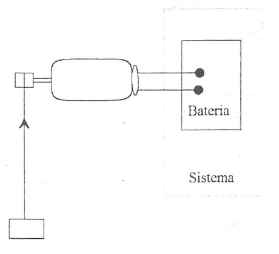

El concepto de trabajo y los procesos adiabáticos
=================================================

Es conocida la definición mecánica de trabajo como el producto de la fuerza por el desplazamiento de su punto de aplicación. Para un desplazamiento diferencial, se tiene:

.. math::

   \delta W = F_s ds = \vec F \cdot \vec{dr} = \overline{F} \cdot \overline{v} dt

En el primer caso :math:`F_s` es la componente de la fuerza paralela a la trayectoria y *ds* el desplazamiento a lo largo de la trayectoria, mientras que :math:`\vec{F}` y :math:`\vec{dr}` representan, en general, los vectores fuerza y variación del vector de posición. Para calcular el trabajo, involucrado en un proceso finito habría que realizar la integral a lo largo de la trayectoria, por lo que se tendría que conocer la relación funcional (*F*, *s*) o (:math:`\vec{F}`, :math:`\vec{dr}`).

En termodinámica, al ser el trabajo una interacción entre sistema y medio ambiente, se debe analizar el proceso que se considere viendo lo que ocurre en la zona de influencia de ambos, es decir, las interacciones en la frontera del sistema, por lo que es más adecuada la definición siguiente de trabajo propuesta por M. Planck y desarrollada más tarde por J.H. Keenan.

Se denomina trabajo a la interacción entre sistema y medio ambiente que, cuando es realizada por el sistema, su único efecto sobre el ambiente puede representarse por la elevación de un peso.

Es importante destacar que se dice puede, lo cual no significa que tenga que darse realmente la elevación de un peso. También es destacable que, implícitamente, se está utilizando la definición mecánica de trabajo.

A continuación se verán unos ejemplos que permiten hacer más evidente y aplicable esta definición. Ambos se basan en algunas de las experiencias de Joule.

En el caso representado en la figura 2.1 la caída de un peso mueve una rueda de paletas y esto se traduce en el calentamiento del líquido en el que está introducida la rueda. 

   
En el caso de la figura 2.2 el paso de una cierta intensidad de corriente a través de los límites del sistema, se traduce también en el calentamiento del líquido.

Nonnalmente se supone que cuando hay un calentamiento (incremento de temperatura) es porque se ha suministrado una cierta cantidad de calor (estrictamente hablando todavía no se sabe que es calor). A continuáción se verá que también este incremento de temperatura puede conseguirse mediante una interacción trabajo. Para ello, en las figuras anteriores, se sustituyen los recipientes que contienen el fluido por los sistemas que se indican en las figuras siguientes:

En el primer caso el peso en su caída eleva un peso en el medio ambiente, por lo que la interacción que se produce entre sistema y medio ambiente es la que hemos denominado trabajo.

   
   Esquema equivalente a la figura 2. 1

   
   Esquema equivalente a la figura 2.2

Cuando sustituimos por el motor eléctrico el recipiente primitivo, también conseguimos elevar un peso por el paso de la corriente eléctrica, pero simultáneamente se produce, en más o menos extensión, el calentamiento del motor. No obstante, se sabe que, mejorando el diseño del motor y empleando superconductores, podríamos reducir las pérdidas de energía en el mismo y en el límite, teóricamente, se podría conseguir que toda la energía eléctrica se utilizara en elevar el peso, luego la interacción también es trabajo. Este segundo ejemplo es muy importante porque pone de manifiesto el tipo de interacción que tiene lugar cuando la carga eléctrica atraviesa los límites de un sistema. Este es un fenómeno que hay que analizar con frecuencia, y según hemos visto, este transporte de carga eléctrica se puede considerar desde el punto de vista termodinámico como una interacción trabajo.

En cuanto al criterio de signos a adoptar para esta interacción, tendremos en cuenta el que con mayor frecuencia se ve en la bibliografia y es el que considera el punto de vista del sistema: es decir, será positivo lo que demos al sistema y negativo lo que se extraiga de él.

Desde este punto de vista, el trabajo es positivo cuando se le da al sistema y negativo cuando el sistema lo produce.

En termodinámica técnica se encuentra con cierta frecuencia el criterio opuesto para el trabajo: el trabajo es positivo cuando lo produce el sisteHia y negativo cuando se le suministra.

Conviene tener daro que cualesquiera de los criterios es adecuado si se utiliza coherentemente. Llevaría a un resultado incorrecto la utilización sucesiva de los dos criterios en el análisis de las distintas partes de un problema.

Por su importancia en el análisis de los distintos procesos que tendremos que considerar en nuestro estudio es conveniente destacar que consideraremos transformación adiabática a aquella en la que sólo intervienen interacciones de trabajo.

Como se ha visto en el tema anterior, si el límite de un sistema está formado por paredes adiabáticas rígidas y sin ejes que las atraviesen, las propiedades que definen el estado del sistema, también denominadas coordenadas termodinámicas del sistema, no se ven afectadas por la presencia de otros sistemas cualesquiera en el entorno del mismo, independientemente de las coordenadas que definieran el estado es estos. Es decir, el sistema está aislado de su medio ambiente.

Para poder interaccionar con sistemas rodeados por paredes adiabáticas es preciso que haya algún límite móvil o que un eje o carga eléctrica pueda atravesar la frontera del sistema, dicho de otra forma: es preciso que pueda realizarse trabajo.
