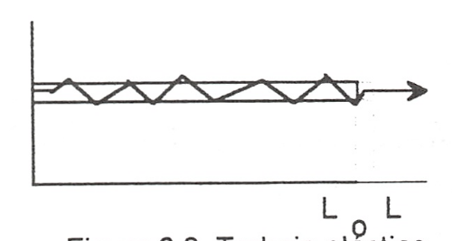

Trabajo en procesos cuasiestáticos
==================================

Se ha visto que la interacción trabajo se da en el límite del sistema cuando el efecto sobre el medio ambiente puede sustituirse por la elevación de un peso, si es el sistema el que realiza el trabajo.

A efectos de cálculo, es conveniente analizar los distintos modos de trabajo que se pueden dar en un sistema determinado, de forma que sea factible su evaluación a partir de la variación de las propiedades del mismo. Veremos que una condición necesaria para que pueda efectuarse el cálculo a partir de la determinación del cambio en el valor de las propiedades del sistema es que el proceso sea cuasiestático .

Trabajo de expansión y compresión
---------------------------------

En los dispositivos utilizados para la transformación de energía térmica en energía mecánica se emplea con frecuencia la expansión de un gas contenido en un cilindro provisto de émbolo. A  continuación consideraremos este caso con cierto detenimiento.

En la figura 2.6 se representa esquemáticamente una determinada masa de fluido contenida en un cilindro provisto de un émbolo.

   Trabajo -p dV

Si en todo momento:
 
.. math::

   p &= p_o + \frac{F_a}{A} \\
   F &= -p A
 

siendo *A* la sección transversal  del émbolo:

Ya que la fuerza ejercida por el fluido contra la cara interior del émbolo es :math:`F = -pA`, la fuerza que ejercerá el medio ambiente sobre el sistema, si la evolución se realiza en condiciones de casi equilibrio, será :math:`-p A` para un desplazamiento infinitesimal se tendrá:

.. math::

 
   \delta W = F \cdot dx = -p \cdot  A  \cdot dx = -p \cdot dV

En el caso de considerar una transformación desde el estado 1 al 2, la expresión para el trabajo será la dada por (2.3) 

.. math::

   W_{12} = \int_1^2 -p dV
   
y su valor será el que corresponde al del área de la superficie limitada por la gráfica que representa el proceso experimentado por el fluido, el eje de abscisas y los límites extremos de la transformación. 

Sólo en el caso de que, en todo momento, la presión del fluido esté equilibrada por la correspondiente a las acciones del medio ambiente sobre el sistema, se podrá expresar el trabajo en función de la presión del fluido mediante la expresión (23). En este caso tendremos lo que se denomina una transformación cuasiestática, aunque, si no se impone ninguna otra condición, no necesariamente tendrá que ser reversible. Por el contrario toda transformación reversible es necesariamente cuasiestática.

La mayor parte de los procesos que tienen lugar en dispositivos de aplicación técnica, en una primera aproximación, pueden analizarse suponiendo que la transformación es cuasiestática, para lo cual es preciso que la velocidad del fluido en el dispositivo analizado sea pequeña frente a la velocidad del sonido en dicho fluido en las mismas condiciones (número de Mach menor que 1).

En la figura 2.6 es fácil ver que_ la cantidad de trabajo óptimo que puede intercambiarse en una transformación con un cambio de volumen determinado, se da para una transformación cuasiestática. Supongase que la transformación  se realizara  en condiciones  de no-equilibrio  y considerese lo que ocurriría en los casos:

* Compresión.
* Expansión.

Comrpesión
^^^^^^^^^^

a)	Si se quiere comprimir el gas y se realiza la compresión de forma no cuasietática, en todo momento tendrá que cumplirse que la acción ejercida por el medio ambiente sobre el sistema produzca una fuerza, :math:`F_Á'`, que sea superior a :math:`-p A`, para conseguir el desplazamiento del émbolo hacia la izquierda, por lo que la hipotética  trayectoria del proceso podria representarse por la línea de puntos AB, esta trayectoria limita sobre el diagrama pV una superficie mayor que la delimitada  por la trayectoria  del proceso  cuasiestático  y por  lo tanto  correspondería  a un trabajo realizado sobre el sistema mayor que el realizado en el mencionado  proceso.

Expasión
^^^^^^^^

b)	En este caso y siguiendo un razonamiento análogo al utilizado en el caso anterior, se llega a la conclusión de que la trayectoria seguida por la evolución estarla por debajo de la correspondiente a la transformación cuasiestática y por lo tanto el trabajo obtenido seria menor que el que se obtendria en la transformación cuasiestática correspondiente.

A efectos de cálculo y para evitar posibles confusiones, es preciso destacar que:

I)	El cálculo del trabajo de expansión (en general de cualquier forma de trabajo) en función de propiedades del sistema sólo es posible para procesos cuasiestáticos.

II)	Cuando el proceso tiene lugar deforma no cuasiestática el cálculo o la medida del trabajo habrá que hacerlo mediante la utilización de propiedades o parámetros externos al sistema.

III)	Desde el punto de vista termodinámico sólo es posible hablar de trabajo en interacciones que puedan reducirse a determinados efectos en la frontera del sistema (elevación de un peso).

Trabajo eléctrico
-----------------

Al considerar el proceso de paso de una carga eléctrica a través de los límites de un sistema, vimos que este tipo de interacción correspondía plenamente a la definición termodiná­ mica de la interacción trabajo. Para su evaluación recuerdese del estudio elemental de la elec­ tricidad que el trabajo asociado al transporte de una carga :math:`dQ_e` a través de una diferencia de potencial  *V* es:

.. math::

   \delta W = V dQ_e

Teniendo en cuenta que :math:`d Q_e =I \cdot dt`, siendo *I* la intensidad de la corriente eléctrica, tendremos entonces:
 
.. math::

   \delta W = V \cdot I \cdot dt

Por lo que el trabajo asociado al paso de una intensidad I desde el instante 1 al 2, será:

.. math::

   W_{12} = \int_1^2 V \cdot I \cdot dt

En la que *V* se mide en voltios, *I* en amperios y *t* en segundos.

Cuando se estudia la descarga reversible de una pila electroquímica la diferencia de potencial se sustituye por la f.e.m. de la pila e.

Trabajo de superficie
---------------------

Para  un  líquido  se  define  la  tensión  superficial mediante la expresión:

.. math::

   \Gamma = \frac{F}{2I} = \frac{F}{I}

 
   Esquema sistema de me- dida de la tensión superficial.
 

Es 'decir fuerza por unidad de longitud necesaria para mantener una determinada superficie libre. En la figura 2.7 se muestra un esquema que aclara esta definición, el factor 2 que aparece en la fórmula tiene en cuenta el hecho de que hay dos superficies libres en contacto con el lado móvil del bastidor. Para aumentar la superficie de A en dA, habrá que realizar untrabajo sobre el sistema:
 

.. math::

   \delta W = F dx = \Gamma L dx = \Gamma dA
 

Los valores de la tensión superficial son del orden de :math:`1O^{-2} \frac{N}{m}` para la mayor parte de los líquidos, a pesar de su pequeñez, tienen una gran influencia en numerosos procesos industriales ligados a tratamiento de minerales, fundición de metales, fabricación de detergentes, etc.

Trabajo elástico
----------------

El trabajo  realizado  para cambiar la longitud de un muelle o varilla metálica,  sometida a una fuerza *F*, en *dx*, viene dado por:

.. math::

   \delta W_e = F dx
   

En la que:

.. math::

   dx = d(L-L_o)

siendo:

- :math:`L_o`: longitud del sistema no perturbado.
- *L*: longitud del sistema sometido a tensión.

 

   Trabajo elstico
 
En los materiales elásticos ideales es aplicable la ley de Hooke, es decir la fuerza que actúa sobre el sistema es proporcional a la deformación producida:

.. math::

   F = k_E x = k_e (L- L_o)

:math:`k_e` es la denominada constante elástica del sistema.

 

 
El trabajo  realizado  sobre el sistema cuando éste se lleva desde una longitud :math:`L_1`  a :math:`L_2` es:
 
.. math::

   W_{12} &= \int_1^2 F d(L-L_o) = \int_1^2 k_e (L-L_o) d(L-L_o) = \\
   &=\frac{1}{2} k_e \left[ (L_2-L_o)^2 - (L_1 - L_o)^2 )\right]
 

Para un sólido en general, aunque no sea en forma de alambre o varilla, la ley de Hooke es aplicable dentro del límite elástico, aui:iq ue en estos casos se suele expresar el trabajo elástico en función de la deformación unitaria :math:`\epsilon = \frac{(L - L_o)}{L}` el esfuerzo normal :math:`\sigma = \frac{F}{A}`
(:math:`A_o` es la sección transversal del material no sometido a esfuerzo). Como expresión del-rral5aJO para este caso se obtiene:

.. math::

   \delta W_e  = F d(L-L_o) = \sigma A_o L_o d\epsilon = V_o \sigma d\epsilon

en la que :math:`V_o` será el volumen del material sin deformar.

En los estudios de resistencia de materiales  se utiliza  como parámetro  característico  de la sustancia el denominado módulo de Young :math:`E_T = \frac{\sigma}{\epsilon}`. Este parámetro tiene la propiedad de mantenerse  constante cuando el material  se utiliza dentro  de su límite elástico.  Sustituyendo :math:`\sigma` en función de :math:`E_T` en la ecuación anterior, se obtiene:

.. math::

   \delta W_e = V_o E_T \epsilon d\epsilon
 

Por lo que, dentro del límite elástico, el trabajo transferido en un proceso que lleve al sólido desde la deformación unitaria  :math:`\epsilon_1` a  :math:`\epsilon_2` vendrá dado por

.. math::

   W_{12} = V_o E_T \frac{\epsilon_2^2 - \epsilon_1^2}{2}

Ecuación equivalente a la obtenida para la deformación elástica de un muelle o varilla delgada.

Trabajo de magnetización y de polarización
------------------------------------------

En el estudio de la electricidad y el electromagnetismo se demuestra que el trabajo realizado al incrementar la magnetización de una sustancia debido a la variación del campo magnético al que se encuentra sometida, viene dado por:

.. math::

   \delta W_{\text{magnetización}} = V \mu_o H dM
 
en la que:
 
- *H* = intensidd del campo magnético, se expresa en :math:`\left[ \frac{C}{m \cdot s}\right]`
- *M* = magnetizac1on por urudad de volumen  :math:`\left[ \frac{C}{m \cdot s}\right]`
- :math:`\mu_o`: permeabilidad  magnética del vacío (:math:`1.3566 \cdot 10^{-6} \frac{m\cdot kg}{C^{-2}}`)
- *V* = volumen de la sustancia.

De forma análoga se encuentra que el trabajo eléctrico ligado a la variación de la polarización de un dieléctrico en un campo eléctrico es:

.. math::

   \delta W_{\text{polarización}} = V \vec{E} \cdot \vec{dP}

en la que:	

- :math:`\vec{E}`: vector intensidad campo eléctrico :math:`\left[ \frac{m \cdot kg}{s^{-2} \cdot C^{-1}}\right]`
- :math:`\vec{P}`: vector polarización eléctrica :math:`\left[ \frac{C}{m^2}\right]`
- *V*: volumen del dieléctrico.

Interacciones generalizadas de trabajo. Dependencia de la trayectoria
---------------------------------------------------------------------

Se ha visto que en todas las formas de trabajo examinadas siempre se da el producto de u na magnitud  intensiva  (*p*, :math:`\vec{E}`, :math:`\vec{H}`, etc) por  la variación  de una  magnitud  extensiva  (*dV*, :math:`d(V\vec{P})`, :math:`d(V\vec{M})`,  etc.). Por lo que se podría  generalizar este hecho  expresando  la interacción rabajo como el producto de una fuerza generalizada *F* (la correspondiente magnitud intensiva) por un desplazamiento generalizado *dX* (en el que *X* será la correspondiente magnitud extensiva). Para las diversas formas..de trabajo examinadas se tendría:

+----------------------+----------------------+-------------------+---------------------------------------------+
| Sistema              | F                    | X                 | Trabajo cuasiestático                       |
+======================+======================+===================+=============================================+
| Fluido               | p                    | V	              |-p dV                                        |
+----------------------+----------------------+-------------------+---------------------------------------------+
| Carga eléctrica      | V o :math:`\epsilon` | :math:`Q_e`       | :math:`V dQ_e \hspace{0.5cm} \epsilon dQ_e` | 
+----------------------+----------------------+-------------------+---------------------------------------------+
| Superficie líquidos  | :math:`\Gamma`       | A                 | :math:`\Gamma dA`                           | 
+----------------------+----------------------+-------------------+---------------------------------------------+
| Muelles o varillas   | F                    | :math:`L-L_o`     | :math:`Fd(L-L_o)`                           |
+----------------------+----------------------+-------------------+---------------------------------------------+
|                      | :math:`\sigma`       | :math:`\epsilon`  | :math:`V \sigma d\epsilon`                  |
+----------------------+----------------------+-------------------+---------------------------------------------+
| Dieléctrico          | :math:`\vec{E}`      | :math:`V \vec{P}` | :math:`\vec{E} \cdot d(V \vec{P})`          |
+----------------------+----------------------+-------------------+---------------------------------------------+
| Sustancia magnética  | :math:`\vec{H}`      | :math:`V \vec{M}` | :math:`\mu_o \vec{H} V \vec{M}`             |
+----------------------+----------------------+-------------------+---------------------------------------------+

.. figure:: ./img/trabajo_generalizado.png

   Trabajo generalizado
 
Para representar un proceso cualquiera se podría recurrir a un diagrama generalizado F, X. En este diagrama se puede ver , figura 2.9, que el trabajo intercambiado para llevar al sistema desde un determinado estado 1 a otro 2 depende de la trayectoria seguida en este proceso y no únicamente del estado inicial y final. Ya que el valor de las áreas encerradas por las correspondientes trayectorias y el eje de abscisas, que representan el trabajo cuasiestático intercambiado en el proceso, dependen de los correspondientes estados inicial y final y de la trayectoria seguida por el proceso, como ya se vio anteriormente.

Aunque ya se ha mencionado es conveniente insistir  en que, a diferencia de la energía total del sistema que sólo es función de estado del sistema y por tanto su variación sólo depen­ de del estado inicial y final del proceso, las cantidades de calor y trabajo intercambiadas en el proceso dependerán de la naturaleza del mismo y sólo su suma será igual a la variación de energía y por lo tanto será función únicamente de los estados extremos del sistema en el  pro­ ceso. Al hacer los balances de energía calor y trabajo en el sistema, es muy importante que es­ to se tenga muy presente.
