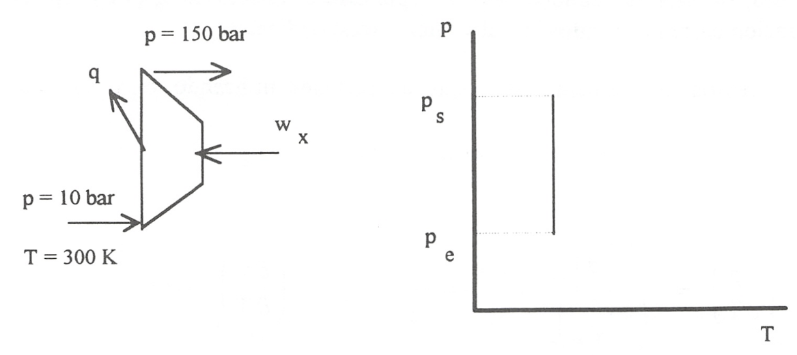

Ejercicio E6.2
==============

Se ha de comprimir un gas monoatómico en un compresor que funciona en régimen estacionario, de forma reversible y a temperatura constante.

El gas entra al compresor a 300 K y 10 bar y se comprime hasta 150 bar.
Determínese:

1)	el trabajo requerido, por mol de gas, para hacer funcionar el compresor.
2)	la cantidad de calor intercambiado, si:

   a)	El gas se comporta como gas perfecto.
   b)	El comportamiento del gas obedece a la ecuación:

.. math::

   pv= RT - \frac{a}{T}p+bp

en la que:

.. math::

   a &= 0.385 \frac{K m^3}{kmol} \\
   b &= 0.0152 \frac{K m^3}{kmol} 

Relaciones termodinámicas generalizadas.

*******************

Solución
--------

* Sistema: Volumen de control definido por la carcasa del compresor. * Interacciones: Las esquematizadas en la figura.
* Proceso: El representado en el diagrama.
* Ecuaciones aplicables: las (4.11) y (4.20)

.. math::

   q &= h_{ts} - h-{te} - w_x \\
   \sum_i \frac{Q_i}{T_i} &= \sum_s s \left. \dot{m} \right|_s — \sum_e s \left. \dot{m} \right|_e

En el caso que estamos considerando sólo hay una entrada y una salida y puede considerarse que únicamente se intercambia calor con una fuente térmica a 300K (proceso isotérmico), por lo que:

.. math::

   \frac{\dot{Q}}{T} = (s_s-s_e) \dot{m}
   

de donde:

.. math::

   q = T (s_s -s_e)

Y =	“ Se
m
q = T(ss-se)	(E6.2.a)

En esta ecuación podemos considerar valores por unidad de masa o por unidad de cantidad de sustancia (mol). Para el problema que nos ocupa conviene utilizar el mol.

Se ha de calcular wx y q, por lo que, según (4.11) y (E.6.2.a):

wx = A h - q
q = T A s
Ir?	Vemos que, calculado el incremento de entropía, puede determinarse q y una vez conocido q y
calculado D h, se podrá determinar el trabajo.
%
Para calcular A s y A h, recordemos que según (6.43) y (6.45):
14
Relaciones termodinámicas generalizadas.
h
^ dv^
k8Tj
dp
dh = cp
dT +
^ 5v ^
v5Ty
dp
para un proceso a temperatura constante:
d s^p
5T
dp
d h j —
v-T

v5T /
dp
a) En el caso de gas perfecto:
pv=RT,
_ RT P
/ , \ 5v
5T
R
P
s2 _ S1 -
8.314
/•l50 «	ISO
—= R ln—— = - 22.51 kJ . kmol
J io P 10
d hT —
T R
v-T —
dp = 0,
Ah = 0
q = T D s = 300 (- 22.51) = -6 754,42 kJ.kmol'1 w, = Dh - q = 0 + 6 754.42 = 6 754,42 kJ.kmol'1
b) Gas real:
pv =
RT- — p + bp, T
RT	a	,
v =------ + b ,
P	T

dT
R a
H 2 p T2
15
Relaciones termodinámicas generalizadas.
t
v-T

v5Ty
RT a R T a	RT a _ 2a,b
“	T _ p T	p T~T
d Sr — —
( d\ '	dp = -	( R a V	M50	f R a 'j
		— + — dp, A s =	—
	p	l P T2 J J	10	y p t2 )
dp
ÁSx = - 8.314 ln
150	0.385
10	3002
(150- 10) 102 = -22,57 kJ.(kmol.K)-1
dhT
	r (7 v 'l			(. ¿a"!
v-T			dp =
	[tiT¡	l C.		l T J
dp
i
A hT
n	b-^1
JJ	T )
dp
b (150 - 10) 102 - — (150- 10) 102 = 176,86 kJ . kmol-1 300
q = - 300.22.57 = - 6 772,38 kJ . kmol'1
wx = 176,86 - ( - 6 772,38 ) = 6 949,24 kJ . kmol’1
