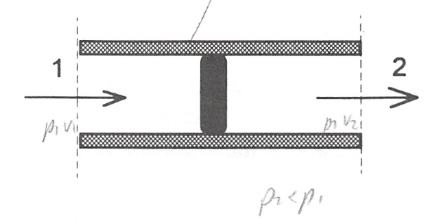
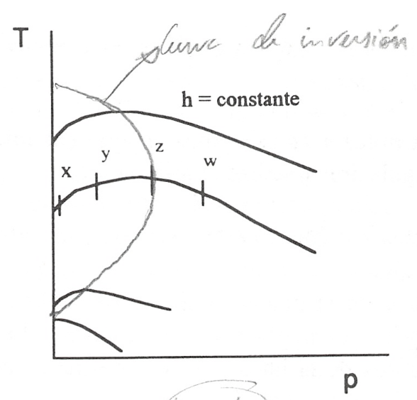

Coeficiente de Joule-Thomson o Joule-Kelvin
-------------------------------------------

Consideremos el flujo de un fluido a través de un conducto que tiene un obstáculo o limitación al paso del fluido. Esta limitación puede ser un estrechamiento o algún tipo de tapón poroso como lana de acero, lana de vidrio o algodón. El efecto de esta limitación es producir una caída notable de presión a través del obstáculo. Un esquema de la instalación se muestra en la figura 6.1. La interacción trabajo entre las superficies de control 1 y 2 es nula y el conducto a través del que se produce el flujo está aislado térmicamente.

   Experiencia de Joule-Thomson

   Resultados del experimento de Joule-Thomson

Consecuentemente, la interacción térmica es nula o despreciable. El flujo del fluido se ajusta a las condiciones de estado estacionario. Además, los cambios en energía cinética y potencial de la corriente fluida entre 1 y 2, pueden también considerarse despreciables. Por lo que aplicando el primer principio para sistemas abiertos, se obtiene:

.. math::

   h_1 = h_2

Como ya mencionamos en la aplicación del primer principio a sistemas abiertos, los procesos en los que la entalpia de entrada es igual a la entalpia de salida, se denominan procesos de estrangulación. El efecto de estrangulación tiene un gran número dé aplicaciones tanto desde el punto de vista, técnico como teórico, a este tipo de experiencias también se les denomina efecto Joule-Thomson o Joule-Kelvin.

El efecto Joule-Kelvin tiene gran importancia, fundamentalmente, por dos hechos:

a)	Se pueden referir a él otras propiedades termodinámicas, que pueden evaluarse a partir de este efecto, como: volúmenes específicos, calores específicos y temperaturas.

b)	El resultado de la estrangulación, en ciertas condiciones, es una reducción en la temperatura del fluido, de forma que podemos tener un enfriamiento mediante un sistema sin partes móviles. De hecho, bajo condiciones adecuadas, es posible que uno o más componentes de una corriente fluida pase a la fase líquida durante el proceso de estrangulación, de forma que puede utilizarse el sistema para proceder a la separación de componentes de una mezcla gaseosa.

Como acabamos de decir, se ha visto experimentalmente que mediante el efecto Joule-Kelvin un fluido puede llegar a una temperatura final con un valor mayor o menor que el valor correspondiente de la temperatura inicial, dependiendo de los valores de :math:`p_1`, :math:`T_1` y :math:`p_2`. Una evaluación matemática adecuada de este efecto se realiza mediante el coeficiente de Joule-Kelvin :math:`\mu_{JT}`, que se define mediante la ecuación:

.. math::

   \mu_{JT} = \left( \frac{\partial T}{\partial p}\right)_h

De acuerdo con esta ecuación es fácil ver que :math:`\mu_{JT}` se puede determinar mediante las gráficas experimentales de procesos a entalpia constante, en un diagrama :math:`T_p`.

Para obtener estas gráfica experimentalmente, se fijan los valores de:math:`p_1T_1` corriente arriba de la estrangulación y se hace variar la presión :math:`p_2`. Para cada valor de :math:`p_2` se determina experimentalmente :math:`T_2`. Bajo condiciones de estrangulación, cada uno de los estados medidos corriente abajo tiene la misma entalpia que los estados corriente arriba del obstáculo. Después de hacer un número de medidas adecuado corriente abajo, para un estado dado en la parte anterior del obstáculo, se puede trazar una línea que corresponde a estados del sistema con la misma entalpia, sobre un diagrama :math:`T_p`. Es necesario hacer notar que lo único que decimos es que cada estado representado por puntos de la linea tienen la misma entalpia, lo cual no quiere decir que el proceso que tiene lugar cuando se produce el paso de un fluido por un estrechamiento sea isoentálpico.

Para obtener otra curva de entalpia constante, se altera o la presión o la temperatura inicial y se repite el procedimiento anterior para este nuevo valor de la entalpia.

De esta forma se traza una familia de líneas de entalpia constante sobre un diagrama :math:`T_p`. Un resultado típico se muestra en la figura 6.2. La pendiente de una línea de entalpia constante, para cualquier estado, es una medida del coeficiente de Joule-Kelvin correspondiente a ese estado, es decir, una medida de :math:`\mu_{JT}`.

En la figura 6.2, en donde se han representado las lineas de entalpia constante, vemos que algunas de ellas presentan un máximo. La linea que une estos máximos se denomina linea de inversión, y el valor de la temperatura para este estado se denomina temperatura de inversión. Una linea de presión constante cortará a la curva de inversión en dos puntos, de aquí que se hable de temperatura de inversión superior e inferior para una presión dada, en la zona de existencia de la curva de inversión.

La línea de inversión tiene un significado físico importante. A la derecha de la curva de inversión en un diagrama Tp el coeficiente de Joule-Kelvin es negativo. Es decir en esta región particular la temperatura se incrementará cuando la presión decrezca y a través del estrechamiento se produce un efecto de calentamiento. Por otro lado, a la izquierda de la curva de inversión el coeficiente es positivo, lo que significa que tendrá lugar un enfriamiento por expansión en esta región.

Vemos, por tanto, que en la estrangulación de un fluido, la temperatura final después del tapón poroso puede ser mayor que, igual a, o menor que la temperatura inicial, dependiendo, para un conjunto dado de condiciones iniciales, de la presión final. Por ejemplo, en la figura mencionada un estado típico inicial puede ser el punto w y la expansión hasta la curva de inversión (punto z) produce un calentamiento del fluido. Si se permite una expansión posterior hasta el punto y, se producirá un enfriamiento, pero no será suficiente para que el fluido recupere su temperatura inicial. Sin embargo, si la expansión progresa hasta el punto x, entonces será posible un enfriamiento suficiente para que la temperatura final sea inferior a la correspondiente al estado inicial.

Debe también destacarse que, para algunos estados iniciales, es imposible un proceso de enfriamiento. La parte superior de la curva de inversión corta a la línea de presión cero en un valor finito de temperatura, para todas las sustancias. Consecuentemente, las líneas de entalpia constante correspondientes a temperaturas muy altas nunca pasan a través de la línea de inversión, como puede verse en la mencionada figura y para estas líneas el coeficiente de Joule-Kelvin es siempre negativo para cualquier presión. Ejemplos de gases que tienen coeficientes negativos a temperaturas ordinarias y presiones bajas son el hidrógeno y el helio. De aquí que, si se quieren enfriar estos gases utilizando un dispositivo de estrangulación, previamente habrá que disminuir su temperatura considerablemente antes de poder conseguir mediante la estrangulación un enfriamiento adicional. No obstante, para la mayor parte de los gases, a temperaturas ordinarias, el coeficiente de Joule-Kelvin es negativo para presiones altas y positivo para presiones bajas.

En la figura 6.2 puede verse que, para una disminución de presiones determinada, el máximo efecto de enfriamiento se consigue si el estado inicial se encuentra sobre la línea de inversión. Si el estado inicial está a la derecha de la cura de inversión, parte de la expansión produce calentamiento, lo que está en contra del efecto deseado.

Es interesante que consideremos el coeficiente de Joule-Kelvin desde el punto de vista de una ecuación generalizada, es decir, su relación con las variables p, v, T y los calores específicos. Esto se obtiene fácilmente recordando la ecuación generalizada para la entalpia

.. math::

   dh = c_p dT + \left[ v - T \left( \frac{\partial v}{\partial T}\right)_p \right] dp

considerando una transformación entre dos estados con el mismo valor de la entalpia , :math:`dh = 0`, se obtiene:

.. math::

   \left( \frac{\partial T}{\partial p} \right)_h = \frac{1}{c_p} \left[ T \left( \frac{\partial v}{\partial T}\right)_p - v\right]

Por lo que el coeficiente de Joule-Kelvin, para un fluido determinado, puede calcularse a partir de la relación *pvT* del fluido y del calor específico a presión constante para el estado considerado. En la práctica, se utiliza el coeficiente de Joule-Kelvin, que puede medirse con facilidad, para evaluar calores específicos a presiones elevadas.

De la ecuación anterior se puede deducir una expresión para la temperatura de inversión, sin más que tener en cuenta que, en la curva de inversión, es igual a cero, de donde:

.. math::

   T_i \left( \frac{\partial T}{\partial p} \right)_p -v = 0

por lo que:

.. math::

   T_i = \frac{v}{\left( \frac{\partial T}{\partial p} \right)_p} = \frac{1}{\alpha_i}

A partir de esta relación, una vez conocida la ecuación *pvT* del gas, se podría determinar el valor de la temperatura de inversión del mismo.
