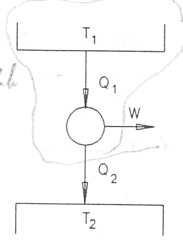
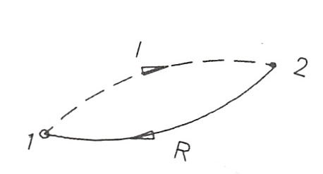

Segundo Principio de la Termodinámica. Entropía
===============================================

(Antonio Sánchez Sánchez / Pablo de Assas Martínez de Morentin)

Introducción
------------

Como corolario de la primera ley de la termodinámica se obtiene para un sistema cerrado que efectúe un proceso cíclico que

.. math::

    	 \displaystyle\oint \delta Q = - \displaystyle\oint \delta W

Así pues, la primera ley no impone ninguna restricción en las direcciones de los flujos de calor y trabajo. Esto es, un ciclo en el cual se transfiere desde un sistema una cantidad determinada de calor y a la vez se realiza sobre el sistema una cantidad igual del trabajo satisface la primera ley igual que un ciclo en el que el flujo de calor y el trabajo tuviesen los sentidos contrarios (el sistema recibe calor y realiza trabajo).

Sin embargo, se sabe por experiencia que el hecho de que un ciclo propuesto no viole la primera ley, no nos asegura que ese ciclo pueda realizarse. Es esta evidencia experimental la que lleva a la formulación de la segunda ley de la termodinámica. Así un ciclo sólo se efectuará si se satisfacen a la vez las leyes primera y segunda de la termodinámica.

En un sentido amplio, la segunda ley recoge el hecho de que los procesos suceden en una cierta dirección y no en la opuesta. Una taza caliente de café se enfría cediendo calor hacia el medio ambiente, pero no habrá transferencia de calor desde el medio ambiente frió hacia el café caliente. Observaciones familiares, análogas a la anterior, ponen en evidencia la validez de la segunda ley de la termodinámica.

En el estudio de la materia que se plantea en este tema, y en análisis posteriores al aplicar el segundo principio, es necesario sustituir el medio ambiente por sistemas ideales a los que puede transferirse de manera reversible cualquier cantidad de calor o trabajo. Estos sistemas reciben el nombre de fuentes térmicas y fuentes de energía mecánica.

Con el término fuente térmica designamos a cualquier sistema de masa y volumen constantes que puede transferir cualquier cantidad de calor sin que cambie su temperatura. Es importante tener en cuenta que una fuente térmica, por definición, está siempre en equilibrio termodinàmico a una cierta temperatura T. En sentido estricto, ningún sistema real puede representar el comportamiento de una fuente térmica; sin embargo como posibles sistemas reales con los que se materializa este sistema ideal podríamos citar: un gran bloque metálico, un termostato, también se utiliza la atmósfera, el agua del mar o un río, etc. es evidente que, de los ejemplos citados, el que más se aproxima al modelo, siempre que su tamaño sea lo suficientemente grande como para que su temperatura no se vea afectada por la transferencia de calor, es el bloque metálico.

En el caso de una fuente de energía mecánica, se puede disponer de cualquier cantidad de trabajo sin producción de entropía.

De los dos artificios mencionados el que más se va a utilizar es el de la fuente térmica.

Enunciados del segundo principio
--------------------------------

Con las consideraciones hechas anteriormente, podemos ya enunciar la segunda ley de la termodinámica. Hay dos enunciados clásicos de este principio conocidos como enunciado de Kelvin-Planck y enunciado de Clausius.

Enunciado de Kelvin-Planck del segundo principio

   Es imposible construir un dispositivo que, funcionando cíclicamente, no produzca otro efecto que extraer calor de un fuente térmica y realizar una cantidad equivalente de trabajo

Enunciado de Clausius del segundo principio

   No es posible construir un dispositivo que funcione cíclicamente y no produzca otro efecto que el paso de calor de un cuerpo a otro más caliente

De los enunciados del segundo principio vemos que un dispositivo que funcione según un ciclo termodinámico y del que se obtenga trabajo debe intercambiar calor, al menos, con dos fuentes térmicas. Y que si lo que se quiere es transferir, con un dispositivo que trabaje cíclicamente, calor desde una fuente térmica a otra a mayor temperatura, hay que suministrar a ese dispositivo una cierta cantidad de trabajo.

Pues bien, definimos un *motor térmico* como un dispositivo que funciona según un ciclo termodinámico y que proporciona un cierto trabajo como resultado del intercambio de calor entre dos fuentes térmicas una a alta y otra a baja temperatura, ver figura 3.1.

   Motor térmico

.. figure:: img/2nd_principio_maquina_refrigeradora.png
   :width: 30%
   :align: center

   Máquina refrigeradora

Definiendo el *rendimiento del motor* como el cociente entre el trabajo que da el motor, W, y el calor que recibe de la fuente térmica de alta temperatura, :math:`Q_1`, podremos escribir:

.. math::

   \eta_{mot} = \frac{W}{Q_1}

y, del balance de energía aplicado al motor, se obtiene

.. math::

   Q_1-Q_2 -W = 0

en donde los valores de W, :math:`Q_1` y :math:`Q_2` están considerados en sus valores absolutos, considerándose positivos según las flechas de la figura. Así pues, podremos poner

.. math::

   \eta_{mot} = \frac{Q_1-Q_2}{Q_1} = 1 - \frac{Q_2}{Q_1}

En términos del rendimiento de un motor térmico el enunciado de Kelvin-Planck del segundo principio diría que no es posible ningún motor térmico cuyo rendimiento sea la unidad.

De manera análoga una *máquina refrigeradora*, figura 3.2 la definimos como un dispositivo que funciona según un ciclo termodinámico y que el trabajo que se le aporta lo invierte en extraer una cierta cantidad de calor :math:`Q_2` de una fuente a baja temperatura y ceder otra cantidad de calor :math:`Q_1` a otra fuente a temperatura mayor.

Si aplicamos el balance energético a este dispositivo, obtenemos:

.. math::

   -Q_1+Q_2+W = 0

Definiendo el rendimiento de refrigeración, COP, como el cociente entre el calor extraído y el trabajo suministrado, se tendrá que

.. math::

   COP_{MF} = \frac{Q_2}{W}

El enunciado de Clausius del segundo principio podría enunciarse diciendo que no es posible ninguna máquina refrigeradora cuyo COP sea infinito.

Equivalencia entre estos dos enunciados
^^^^^^^^^^^^^^^^^^^^^^^^^^^^^^^^^^^^^^^

Aunque, en principio, ambos enunciados parecen no tener relación alguna, vamos a demostrar que son equivalentes y, por lo tanto, pueden utilizarse uno u otro indistintamente según convenga.

En la demostración que sigue designaremos por K la veracidad del enunciado de Kelvin-Planck y por C la de Clausius. La falsedad de cada uno de ellos los designaremos por :math:`\bar{K}` y :math:`\bar{C}`.

Se trata de demostrar la equivalencia lógica de ambos postulados esto es :math:`K\Leftrightarrow C`, lo que equivale a demostrar a) que :math:`K\Rightarrow C` y b) que :math:`C\Leftarrow K`.

a) Demostrar lo primero, esto es ,que el enunciado de Kelvin-Planck es equivalente al de Clausis es lo mismo que demostrar que el no cumplimiento del de Clausius es equivalente al no cumplimiento del de Kelvin-Planck. :math:`(K \Rightarrow C) \Leftrightarrow (\bar{C}\Rightarrow \bar{K})`

Consideremos una máquina frigorífica que pase una cantidad de calor :math:`Q_2` desde la fuente fría a la caliente sin necesidad de aportar trabajo, lo que constituye :math:`\bar{C}`.

Consideremos a su vez un motor térmico que trabajando entre las dos mismas fuentes cede :math:`Q_2` a la fuente fría. El conjunto máquina frigorífica-motor térmico se comporta como un dispositivo, que funciona cíclicamente, productor de trabajo intercambiando calor con una sóla fuente térmica (:math:`\bar{K}`). Figura 3.3.

Así pues el no cumplimiento del enunciado de Clausius es lo mismo que el no cumplimiento del de Kelvin-Planck: :math:`\bar{C}\Rightarrow\bar{K}`

.. figure:: img/2nd_principio_C_implica_K.png
   :width: 35%
   :align: center

   Demostración de :math:`\bar{C}\Rightarrow\bar{K}`

.. figure:: img/2nd_principio_K_implica_C.png
   :width: 35%
   :align: center

   Demostración de :math:`\bar{K}\Rightarrow\bar{C}`

b)	De manera análoga podemos probar que :math:`(C\Rightarrow K) \Leftrightarrow (\bar{K}\Rightarrow\bar{C})`

Para ello consideremos un motor que extrayendo la cantidad de calor :math:`(Q_1-Q_2)` de una fuente térmica a temperatura :math:`T_1` lo transforme íntegramente en trabajo :math:`(\bar{K})`.

Si este trabajo se emplea en una máquina frigorífica que extraiga :math:`Q_2` de una fuente térmica a :math:`T_2` y ceda a la fuente :math:`T_1` :math:`(T_1>T_2)` una cantidad de calor :math:`Q_1`, el conjunto motor-refrigerador constituye un dispositivo que, funcionando cíclicamente, hace pasar una cantidad de calor :math:`Q_2` de una fuente térmica a otra de mayor temperatura sin aportar trabajo al dispositivo (:math:`\bar{C}`). Así pues, :math:`\bar{k}\Rightarrow\bar{C}`. Figura 3.4

Con a) y b) queda demostrada la equivalencia entre los enunciados de Kelvin-Planck y de Clausius.

Procesos reversibles e irreversibles
------------------------------------

Ya se definió anteriormente el proceso reversible como aquel que ocurre de tal manera que tanto el sistema como el medio ambiente pueden ser devueltos a sus estados originales respectivos.

Se plantea ahora la cuestión de si los procesos que ocurren en la naturaleza, y que son con los que trata la ingeniería y los que se van a estudiar en este curso, son reversibles o irreversibles. O dicho de otra forma, de lo que vamos a ocuparnos a continuación es examinar algunos de los factores que hacen que los procesos sean irreversibles.

Clases de irreversibilidad
^^^^^^^^^^^^^^^^^^^^^^^^^^

1)	Irreversibilidad mecánica externa.

Existen procesos en los que el trabajo realizado sobre el sistema se convierte en energía interna, bien de un fuente térmica, bien del propio sistema. Estos procesos, que se conocen con el sobrenombre de disipativos (decimos que en ellos se "disipa" energía), presentan, como vamos a ver, una irreversibilidad que denominaremos irreversibilidad mecánica externa. Conviene señalar que esta energía degradada (disipada) por fricción puede ser interna al sistema, aunque el agente productor de la energía mecánica que se disipa sea externo. El nombre de irreversibilidad mecánica externa hace referencia al hecho de que es la energía producida por un agente mecánico externo la que se disipa.

Para comprobar que un proceso como el anteriormente descrito es irreversible no hay más que ver si se transgrede o no el segundo principio cuando se desanda el camino. En efecto, si una cierta cantidad de trabajo lo convertimos en energía interna, del sistema o de la fuente térmica, para volver a las condiciones iniciales se necesitaría extraer una cierta cantidad de calor (del sistema o de la fuente) y convertirla íntegramente en trabajo, lo cual contradice el enunciado de Kelvin-Planck del segundo principio de la termodinámica.

Como ejemplos en los que se convierte trabajo en energía interna de un fuente térmica pueden, entre otros, citarse:

- Agitación de un fluido viscoso.
- Detención de la rotación o vibración de un líquido.
- Deformación inelástica de un sólido.
- Paso de electricidad por una resistencia.
- Histéresis magnética de una sustancia.

siempre que cada uno de los sistemas citados estén en contacto con un fuente térmica.

Los ejemplos anteriormente citados, si se encuentran aislados térmicamente, nos sirven como ejemplos en los que el trabajo se convierte en energía interna del sistema.

2)	Irreversibilidad mecánica interna.

Se llamará así porque no hay ningún agente mecánico externo. Son procesos en los que la irreversibilidad es intrínseca al sistema; por ejemplo, la expansión adiabática en el vacío de un gas.

Que la expansión adiabática en el vacío de un gas es un proceso irreversible puede verse de la siguiente forma. Consideremos un gas encerrado en una parte de un depósito rígido y aislado térmicamente del exterior, mientras que en la otra parte del depósito se ha hecho el vacío. En un instante dado se permite que el gas pase a ocupar todo el volumen. En la figura 3.5 se muestra el sistema y los estados inicial y final que sp suponen de equilibrio.

.. figure:: img/2nd_principio_irreversibilidad.png
   :width: 70%
   :align: center

En el proceso espontáneo se verifica que:

.. math::

   U_{fin}- U_{in} = 0

ya que durante el proceso tanto el calor (Q) como el trabajo (W) son nulos, pues el sistema está aislado térmicamente y el gas se expansiona contra el vacío no habiendo, por lo tanto, ninguna fuerza resistente. Así pues, en el proceso de expansión libre no hay variación de la energía interna del sistema.

Lo que pretendemos es probar por contradicción que el proceso es irreversible, esto es, que si fuese reversible y espontáneamente el gas volviese a ocupar el volumen inicial se violaría el segundo principio.

Modificamos el sistema como se muestra en la figura 3.6, introduciendo una turbina y una fuente térmica.

.. figure:: img/2nd_principio_fig_3.6.png
   :width: 50%
   :align: center

   FIgura 3.6

A partir del estado final de la expansión libre, esto es, partiendo del gas ocupando todo el volumen, con las modificaciones dichas, permitimos que el gas realice un ciclo siguiendo los siguientes procesos:

Proceso 1

   El gas pasa espontáneamente a ocupar el volumen inicial.

Proceso 2

   Parte del gas se expansiona en la turbina, yendo a ocupar el volumen de la derecha, hasta que la presión a ambos lados sea la misma. Durante la expansión en la turbina adiabática el gas realiza un trabajo disminuyendo, por lo tanto, su energía interna, esto es :math:`U' < U_{in}`

Proceso 3

   Se quita parte del aislamiento del depósito y, por medio de la fuente térmica, se le suministra calor hasta conseguir que la energía interna del gas alcance su valor inicial. Con esto se completa el ciclo.

El resultado neto de este ciclo es extraer calor de una sola fuente térmica y realizar una cantidad equivalente de trabajo. Este ciclo viola el segundo principio (enunciado de K-P) y por lo tanto no es posible. De los tres procesos, tanto el segundo como el tercero, esto es, la expansión en la turbina y la cesión de calor desde la fuente térmica, son posibles por lo que el proceso que hace el ciclo no sea posible es el primero. Así pues la expansión libre de un gas es un proceso irreversible.

Como ejemplos de irreversibilidad mecánica interna podemos citar:

- Ondas de choque.
- Procesos de estrangulación (gas que pasa a través de un tabique poroso o de una
válvula).
- Chasquido de un alambre tenso después de cortado.
- Desvanecimiento de una pompa de jabón después de pinchada.

3)	Irreversibilidad térmica

Se da en los procesos en los que existe una transferencia de calor entre sistemas como consecuencia de una diferencia finita de temperaturas; por ejemplo la coducción o radiación de calor desde un sistema a otro más frío  o a través de un sistema (que permanece invariable), transferencia directa de calor entre dos fuentes térmicas a temperaturas distintas.

4) Irreversibilidad química

Hay procesos en termodinámica de los que puede demostrarse, aunque generalmente no es sencillo, que presentan lo que llamaremos irreversibilidad química. Algunos de estos procesos son:

- Reacciones químicas
- Difusión entre gases inertes distintos.
- Mezcla de líquidos (alcohol y agua, por ejemplo)
- Solidificación de un líquido subenfriado.
- Disolución de un sólido en agua.
- Ósmosis.

Condiciones necesarias para la reversibilidad
^^^^^^^^^^^^^^^^^^^^^^^^^^^^^^^^^^^^^^^^^^^^^

Prácticamente todos los procesos naturales pueden incluirse en alguna de las clasificaciones anteriores, por lo que puede afirmarse, como consecuencia del segundo principio de la termodinámica, que todos los procesos naturales son irreversibles.

Examinando los ejemplos anteriormente citados podemos decir que la irreversibilidad se deve, en rasgos generales, a que no se cumplen las condiciones de equilibrio termodinámico (equilibrios mecánico, térmico y químico) y/o a que se producen efectos disipativos originados por fricción, viscosidad, histéresis, etc.

Para que un proceso sea, pues, reversible han de cumplirse los fenómenos contrarios a los dichos arriba; esto es, ha de realizarse cuasi-estáticamente y no ha d ehaber efectos disipativos, con el objeto de que el trabajo realizado sobre un sistema durante el proceso pueda ser devuelto íntegramente en el proceso inverso.

Las condiciones anteriores no son perfectamente realizables de modo que el proceso reversible es una abstracción que nos aproximará tanto más a la realidad cuanto en mayor parte se cumplan estas condiciones.

Ciclo de Carnot
---------------

Ya se ha visto la posibilidad de la existencia de un dispositivo que trabajando cíclicamente e intercambiando calor con dos fuentes térmicas realice trabajo. A un tal dispositivo le hemos llamado motor térmico.

Se nos plantea ahora la siguiente cuestión: dadas dos fuentes térmicas:

- ¿Cómo sería el motor térmico y cuáles sus características?
- ¿Cuál sería su rendimiento?
- ¿Cómo influye, si es que lo hace, la naturaleza de la sustancia de trabajo?

Estas preguntas fueron contestadas por N. S. Carnot en su trabajo "Reflections sur la puissance motrice du feu el les moyens propes a developped" publicado anteriormente al enunciado del :math:`1^{er}` principio y 25 años antes de enunciarse el segundo. En este trabajo Carnot introdujo por primera vez el concepto de ciclo y propuso un motor ideal que funcionaba según un ciclo, particularmente sencillo, que ha recibido el nombre de Ciclo de Carnot.

Diremos que un sistema termodinàmico cualquiera (mecánico, eléctrico, químico, magnético, etc.) realiza un ciclo de Caxnot si, partiendo del equilibrio con la fuente térmica fría a temperatura :math:`T_2` realiza el siguiente ciclo:

- Una evolución adiabática reversible hasta alcanzar la temperatura :math:`T_1` de la fuente caliente.
- Un proceso isotérmico a temperatura :math:`T_1` mientras recibe una cantidad de calor :math:`Q_1` de la fuente caliente.
- Una evolución adiabática reversible en la que el sistema se enfría desde :math:`T_1` a :math:`T_2`.
- Un proceso isotérmico a :math:`T_2` durante el que cede :math:`Q_2` a la fuente fría hasta alcanzar las condiciones iniciales.

Todo motor que funcione según el ciclo descrito lo denominaremos **motor de Carnot**.

Este ciclo es reversible por serlo los procesos que intervienen en él y, por lo tanto, puede ser recorrido en sentido inverso al descrito siendo éste el funcionamiento de la **máquina frigorífica de Carnot**, máquina que extrae calor del foco frío y cede calor al foco caliente consumiendo una cantidad determinada de trabajo.

Como esta máquina lo que hace es extraer calor de una fuente térmica fría y ceder calor a otra más caliente podemos hacer una distinción según el fin primario a que se la destine. Así, si en vez de extraer calor del foco frío, el fin primordial es la cesión de calor en el foco caliente, se podrá utilizar como sistema de calefacción en cuyo caso la máquina se denomina **bomba térmica**.

Las expresiones (3.1) y (3.2) del rendimiento térmico de un motor y del coeficiente de refrigeración son aplicables a estas máquinas de Carnot.

Si la máquina inversa se utiliza como bomba térmica su coeficiente de funcionamiento se define como

.. math::

   COP_{BT} = \frac{Q_1}{W}

La relación entre uno y otro, para sistemas funcionando entre las mismas fuentes térmicas, es:

.. math::

   COP_{BT} = 1+COP_{MF}

Teoremas de Carnot
^^^^^^^^^^^^^^^^^^

Las consideraciones realizadas por Carnot sobre el funcionamiento de las máquinas térmicas le llevó a enunciar los principios que llevan su nombre:

I

Ningún motor que funcione entre dos fuentes térmicas dadas puede tener mayor rendimiento que uno de Carnot funcionando entre las mismas fuentes térmicas.

II

Todas las máquinas reversibles que funcionan entre dos fuentes térmicas dadas tienen el mismo rendimiento

La demostración de la validez de estos enunciados podemos hacerla Viendo que el violar cualquiera de ellos nos conduce a violar el enunciado de Kelvin-Planck del segundo principio.

En efecto, supongamos que entre las fuentes 1 y 2, como se muestra en la figura 3.7a, funciona una máquina X y un motor de Carnot y que el rendimiento de la primera es mayor que el de la máquina de Carnot. Como a cada máquina se le suministra la misma cantidad de calor :math:`Q_1` y la máquina X tiene mayor rendimiento que la máquina de Carnot se tendrá que :math:`W_X > W_R` y :math:`Q_{2X} < Q_{2R}`. (Estamos tomando valores absolutos para W y Q y se consideran positivos según las flechas de la figura.)

   Demostración del teorema de Carnot.

.. figure:: img/2nd_principio_fig_3.7b.png
   :width: 45%
   :align: center

   Demostración del teorema de Carnot.

Por ser la máquina de Carnot reversible podemos hacer que funcione como máquina frigorífica como se muestra en la figura 3.7b. Esta cede una cantidad de calor :math:`Q_1` a la fuente térmica 1 y precisa una cantidad de trabajo :math:`W_R`. Como :math:`W_R` es menor que el trabajo :math:`W_X` desarrollado por la máquina X ésta puede suministrar a la máquina refrigeradora de Carnot el trabajo que precisa y todavía puede obtenerse de ella trabajo en una cantidad de :math:`(W_X-W_R)`. La máquina invertida de Carnot cede a la fuente 1 el mismo calor :math:`Q_1` que de ella absorbe la máquina X por lo que el intercambio de calor de esta fuente es nulo y puede, por ello, eliminarse. Fijémonos ahora en el sistema formado conjuntamente por la máquina X y por la máquina frigorífica de Carnot (el encerrado por la línea a trazos). Este sistema trabaja cíclicamente y realiza un trabajo :math:`(W_X-W_R)` recibiendo calor de una única fuente térmica, lo cual contradice el enunciado de Kelvin-Planck del segundo principio. Por consiguiente nuestra hipótesis de que :math:`\eta_X > \eta_R` es falsa y queda probado que ningún motor que funcione entre dos fuentes térmicas dadas puede tener un rendimiento mayor que una máquina de Carnot que trabaje entre las mismas fuentes térmicas.

La segunda parte del teorema de Carnot se prueba manera análoga. En efecto, si ahora  la máquina X fuese reversible y los rendimientos de cada máquina, al contrario de lo que dice el teorema, fuesen distintos para la misma cantidad de calor recibida cada máquina daría un trabajo distinto. Invertimos la máquina que tenga un rendimiento menor. La otra máquina, que realiza un trabajo mayor, puede proporcionar el que necesita la que se ha invertido y dar, además, un trabajo adicional. De esta forma lo que se obtiene es un dispositivo que contradice el enunciado de Kelvin-Planck del segundo principio. Así pues es falso que dos máquinas reversibles que trabajen entre las mismas fuentes térmicas tengan distinto rendimiento.

La segunda parte del teorema del Carnot puede enunciarse, de forma alternativa, diciendo que el rendimiento térmico de una máquina reversible depende sólo de las temperaturas de las fuentes entre las que trabaja y que no depende de la sustancia de trabajo de la máquina.

Definición termodinámica de temperatura
---------------------------------------

Al tratar del concepto de temperatura vimos que la ley cero de la termodinámica nos proporcionaba una base para medir la temperatura, y de hecho todos los termómetros se basan en esta ley cero. El inconveniente es que con estos termómetros la escala de temperaturas definida depende de la sustancia particular de cada termómetro y del dispositivo usado (termómetro de gas, de columna líquida, etc.) Lo deseable es una escala de temperaturas que sea independiente de cualquier sustancia concreta. Al analizar el ciclo de Carnot se ha visto que su rendimiento es independiente de la sustancia de trabajo que realice el ciclo y que sólo depende de la temperatura de las fuentes entre las que trabaja. Esto nos proporciona la base para poder definir una escala de temperatura absoluta, escala que llamaremos *escala termodinámica de temperatura*.

Dado que el rendimiento de un motor de Carnot es función sólo de las temperaturas de las fuentes entre las que trabaja, si tales temperaturas las designamos por :math:`\vartheta_1` y :math:`\vartheta_2`, podremos escribir:

.. math::

   \eta = \frac{W}{Q}= 1-\frac{Q_2}{Q_1} = \Phi(\vartheta_1,\vartheta_2)

de donde se deduce que:

.. math::

   \frac{Q_1}{Q_2} = \frac{1}{1- \Phi(\vartheta_1,\vartheta_2)} = f(\vartheta_1,\vartheta_2)

Consideremos ahora tres fuentes a temperaturas :math:`\vartheta_1`, :math:`\vartheta_2` y :math:`\vartheta_3` entre los que trabajan las máquinas de Carnot A, B y C tal como se indica en la figura 3.8.

.. figure:: img/2nd_principio_tres_fuentes_temperatura.png
   :width: 30%
   :align: center

   Figure 3.8

Si	:math:`\vartheta_1 > \vartheta_3 > \vartheta_2`  podremos escribir para la máquina B:

.. math::

   \frac{Q_1}{Q_3} = f(\vartheta_1,\vartheta_3)

y para la máquina C:

.. math::

   \frac{Q_3}{Q_2} = f(\vartheta_3,\vartheta_2)

mientras que para la máquina A será lo escrito anteriormente, esto es:

.. math::

   \frac{Q_1}{Q_2} = f(\vartheta_1,\vartheta_2)

Ahora bien, el cociente :math:`\frac{Q_1}{Q_2}` se puede poner en la forma:

.. math::

   \frac{Q_1}{Q_2} = \frac{Q_1}{Q_3}  \frac{Q_3}{Q_2}

esto es:

.. math::

    f(\vartheta_1,\vartheta_3)  f(\vartheta_3,\vartheta_2) =  f(\vartheta_1,\vartheta_2)

Para que pueda verificarse la expresión anterior la función f tiene que ser de la forma:

.. math::

    f(\vartheta_i,\vartheta_j) = \frac{\psi(\vartheta_i)}{\psi(\vartheta_j)}

Por consiguiente tendremos que:

.. math::

   \frac{Q_1}{Q_2} = \frac{\psi(\vartheta_1)}{\psi(\vartheta_2)}

que establece que la relación entre el calor absobido a la temperatura :math:`\vartheta_1` y el cedido a la temperatura :math:`\vartheta_2` debe de ser igual a la relación de la misma función de las dos temperaturas, siendo :math:`\psi` una función desconocida de las temperaturas :math:`\vartheta_1`  y  :math:`\vartheta_2`  que son los valores de las temperaturas de las fuentes medidas en cualquier escala arbitraria.

La ecuación 3.4 nos permite la definición de una escala de temperaturas que no esté ligada a una sustancia determinada, ya que, a partir de los teoremas de Carnot, la podemos tener directamente relacionada con la cantidad de calor que un motor de Carnot intercambia con dos fuentes térmicas.

Hay varias formas posibles de elección de la función característica que ligue :math:`\psi(\vartheta)`  con la temperatura, T, medida en la nueva escala. La más sencilla es escoger:

.. math::

   \psi(\vartheta) = T

Esta elección nos lleva a la escala de temperatura termodinámica o **escala absoluta de temeratura**, también denominada **escala Kelvin de temperatura**.

Con (3.5), la ecuación (3.4) se nos convertirá en:

.. math::

   \frac{Q_1}{Q_2} = \frac{T_1}{T_2}

Es decir, dos temperaturas medidas en la escala absoluta de temperaturas tienen la misma relación que las cantidades de calor intercambiadas por una máquina de Carnot que funcione entre dos fuentes térmicas mantenidas a esas temperaturas.

A fin de fijar por completo la escala, es preciso definir un punto fijo. Se vuelve a considerar como único punto fijo de esta escala absoluta, la temperatura correspondiente al punto triple del agua :math:`T_3 = 273,16K`.

Según lo que acabamos de decir, la temperatura de un sistema dado se podrá expresar
mediante la ecuación:

.. math::

   T = 273,16 \frac{Q}{Q_3}

en la que :math:`Q` y :math:`Q_3` son, respectivamente, el calor que una máquina de Carnot intercambia con el sistema cuya temperatura se quiere determinar y la fuente térmica en el punto triple del agua.

De acuerdo con (3.6) la temperatura cero (:math:`T_2 = 0`) corresponderá a :math:`Q_2 = 0`. Esta temperatura, que sería el cero de la escala, es inalcanzable ya que con la definición de temperatura que hemos hecho, ver (3.6), el rendimiento del ciclo de Carnot tomaría la forma:

.. math::

   \eta = \frac{W}{Q_1} = 1-\frac{Q_2}{Q_1} = 1 - \frac{T_2}{T_1} \Rightarrow T_2 = T_1 \left(1 - \frac{W}{Q_1} \right)

y si :math:`T_2` fuese igual a cero, sería preciso que :math:`\frac{W}{Q_1} = 1`, lo cual supondría que mediante un proceso cíclico podríamos obtener trabajo de una sola fuente térmica en contradicción del enunciado de Kelvin-Planck del segundo principio.

Teorema de Clausius
-------------------

Desde un punto de vista histórico, el proceso seguido para introducir el concepto de entropía incluye, como paso fundamental, la demostración del **teorema de Clausius**, también conocido como **desigualdad de Clausius**. Esta nos dice que la relación existente entre las cantidades de calor :math:`Q_i` que intercambian diversas fuentes a temperaturas :math:`T_i` con un sistema determinado en un proceso cíclico o estacionario cumple la desigualdad:

.. math::

   \sum\frac{Q_i}{T_i} \leq 0

Si las cantidades de calor son diferenciales y el proceso es cíclico:

.. math::

    \displaystyle\oint\frac{\delta Q}{T} \leq 0

Para demostrar esta desigualdad consideremos el sistema esquematizado en la figura 3.7a
en la que diversas fuentes térmicas, a temperaturas :math:`T_1, T_2,...T_i...T_n`, intercambian calor con un sistema y éste produce un trabajo :math:`W_a` sin que haya incremento de su energía total.

   Demostración de la desigualdad de Clausius.

   Demostración de la desigualdad de Clausius.

El conjunto de la figura 3.9a podríamos sustituirlo por otro equivalente, es decir que el sistema intercambie el mismo calor y realice el mismo trabajo, de forma que únicamente hubiese intercambio de calor con una sola fuente térmica, que podría ser el ambiente, a una temperatura :math:`T_o > T_i` (para todo i) según se esquematiza en la figura 3.9b. Es decir, mediante suficientes máquinas de Carnot que funcionan en ciclos elementales infinitesimales, si son infinitas, con intercambios :math:`\delta Q_{oi}`, :math:`\delta Q_{ci}` y :math:`\delta W_{ci}^{(*)}`. Cada una de las fuentes térmicas intercambia calor con la fuente a :math:`T_0`, mediante las máquinas térmicas mencionadas, de forma que recuperan el calor que ceden al sistema por lo que, desde el punto de vista del proceso considerado, no experimentan ninguna alteración, es decir :math:`\delta Q_{ci}+\delta Q_i = 0`.

Haciendo el balance de energía a cada una de la máquinas elementales de Carnot tendremos:

.. math::

   \delta Q_{oi} = \delta Q_{ci}+\delta Q_{ci}

A partir del segundo de los teoremas de Carnot podemos escribir, para cada una de las máquinas elementales:

.. math::

   \frac{\delta Q_{oi}}{T_o} = \frac{\delta Q_{ci}}{T_i} \rightarrow \frac{\delta W_{ci}+\delta Q_{ci}}{T_o} = \frac{\delta Q_{ci}}{T_i}

Aplicando el primer principio a la fuente térmica :math:`T_i`, recuérdese la condición impuesta a las fuentes, tendremos:

.. math::

   \delta Q_{ci}+\delta Q_i = 0 \rightarrow \delta Q_{ci} = -\delta Q_i

.. note::

   (*) Si el número de fuentes es finita los intercambios serán :math:`Q_{oi}`, :math:`Q_{ci}` y :math:`W_{ci}`.

y sustituyendo en (3.10), se obtiene:

.. math::

   \frac{\delta W_{ci} - \delta Q_i}{T_o} = -\frac{\delta Q_i}{T_i}

de donde:

.. math::

   \delta W_{ci} = \left( 1 - \frac{T_o}{T_i} \right) \delta Q_i

Para todos los ciclos:

.. math::

   \sum_{i=1}^n \oint \delta W_{ci}  = \sum_{i=1}^n \oint \left( 1 - \frac{T_0}{T_1}\right) \delta Q_i

Durante el mismo ciclo, en el sistema se verificará:

.. math::

   \oint \delta W_s + \oint \delta Q_i = 0

De (3.11) y (3.12) se obtiene:

.. math::

   \sum_{i=1}^n \oint \delta W_{ci}+\oint\delta W_s = -\sum_{i=1}^n \oint \frac{T_o}{T_i}\delta Q_i

y esta última igualdad puede ser positiva o nula ya que sólo es posible, actuando con una sola fuente térmica, que el sistema reciba tranbajo. Así pues, como :math:`\sum_{i=1}^n \oint \delta W_{ci}+\oint \delta W_s \geq 0`, se cumplirá que:

.. math::

   \oint\frac{\delta Q_i}{T_i} \leq 0

Si en vez de considerar un conjunto de cicles infinitesimales, se consideran intercambios finitos se obtendría:

.. math::

   \sum \frac{Q_i}{T_i} \leq 0

en donde :math:`Q_i` indica calor intercambiado por cada fuente con el sistema y considerado desde el punto de vista del sistema.

Si invertimos el ciclo :math:`Q_i` cambiará de signo (al cambiar de sentido) por lo que el signo igual (=) es para procesos reversibles y el signo menor que (<) para procesos irreversibles.

**Ejemplo 3.1**

Un frigorífico de absorción funciona utilizando únicamente gas ciudad. El sistema puede considerarse como una máquina que funciona cíclicamente y que intercambia calor con tres fuentes:

1)	El foco caliente ( materializado mediante un quemador de gas ciudad)
2)	El foco frío (recinto utilizable)
3)	Medio ambiente.

Si la temperatura media del foco caliente puede considerarse igual a 250 °C, la temperatura del recinto frío igual a -10 °C y el ambiente está a 35 °C, determínese, suponiendo que el sistema funciona/sin irreversibilidades, qué cantidad de energía hay que suministrar en el foco caliente por cada unidad de energía extraída del foco frío y cuál es el C.O.P. de la instalación.

**Solución:**

.. figure:: img/2nd_principio_solucion.png
   :width: 40%
   :align: center

   Demostración de la desigualdad de Clausius.

Si el sistema funciona cíclicamente, la variación de energía para un ciclo o número
determinados de ciclos, será nula, por lo que aplicando el primer principio al sistema en este proceso, se obtiene:

.. math::

   Q_1-Q_2+Q_3= \Delta U = 0

Al ser la transformación reversible, la desigualdad de Clausius, [(3.13.b)], aplicada en este caso nos da:

.. math::

   \frac{Q_1}{T_1}-\frac{Q_2}{T_2}+\frac{Q_3}{T_3} = 0

Para el proceso considerado:

.. math::

   T_1 &= 250+273,15 = 523,15K\\
   T_2 &= 35 + 273,15 = 308,15K\\
   T_3 &= -10+273,15 = 263,15K\\
   Q_3 &= 1kJ

Sustituyendo estos valores en (E.l) y (E.2), se obtiene:

.. math::

   Q_2-Q_1 = 1\\
   -\frac{Q_1}{308,15}+\frac{Q_2}{523,15} = \frac{1}{263,15}

Resolviendo y despejendo :math:`Q_1`, se obtiene: :math:`Q_1 = 0,416kJ`. Por lo que :math:`C.O.P. = \frac{1}{0,416} = 2,40`

¿Cuál sería el COP de la máquina frigorífica de Carnot que realizara la misma función
que la máquina dada?

Entropía
--------

Consideremos dos estados de equilibrio (1) y (2) representados en un diagrama generalizado en la figura 3.10. De (1) a (2) podemos ir por el camino indicado por la curva I y regresamos a (1) por el camino representado por la curva II. Ambos procesos los suponemos reversibles y en conjunto constituyen un ciclo. Si aplicamos a este ciclo reversible el teorema de Clausius, (3.13.a), obtendremos:

.. figure:: img/2nd_principio_gibbs.png
   :width: 30%
   :align: center

.. math::

   \int_{iI}^f \frac{\delta Q}{T}+\int_{fII}^i \frac{\delta Q}{T} = 0

o lo que es lo mismo

.. math::

   \int_{iI}^f \frac{\delta Q}{T}= -\int_{fII}^i \frac{\delta Q}{T}

Por ser reversibles los procesos los caminos dados serán invertibles, es decir:

.. math::

   -\int_{fII}^i \frac{\delta Q}{T}= \int_{iII}^f \frac{\delta Q}{T}

por lo que

.. math::

   \int_{iI}^f \frac{\delta Q}{T} = \int_{iII}^f \frac{\delta Q}{T}

Es decir, la integral de :math:`\frac{\delta Q}{T}` no depende de la trayectoria elegida para la integración, sino únicamente de los estados inicial y final de la transformación. De acuerdo a lo que dijimos en el tema 1 al definir una propiedad: una magnitud es una propiedad si y solo si el cambio en su valor entre dos estados de equilibrio es independiente del camino seguido en el proceso, :math:`\int_1^2 \frac{\delta Q}{T}` representa una propiedad del sistema. A esta propiedad se la denomina **entropía** y su variación entre dos estados de equilibrio viene dada por:

.. math::

   dS = \left. \frac{\delta Q}{T} \right)_R \text{ ó } \Delta S_{1-2} = \int_1^2 \left.\frac{\delta Q}{T}\right)_R

ya se trate de un proceso elementál o de un proceso finito.

La unidad de la entropía en el sistema internacional es el :math:`J\cdot K^{-1}`. Es una magnitud extensiva, de modo que podemos definir la entropía específica :math:`s =\frac{S}{m}` ó :math:`s =\frac{S}{n}` si se toma la unidad de masa o la unidad de sustancia siendo, entonces, las unidades de la entropía específica  :math:`J\cdot kg^{-1}\cdot K^{-1}` ó :math:`J\cdot mol^{-1}\cdot K^{-1}`.

Es importante destacar que la variación de la entropía la hemos deducido sólo para una transformación reversible y que sólo para este caso puede evaluarse mediante :math:`\int_1^2 \frac{\delta Q}{T}`. Ahora bien, por ser la entropía una propiedad, esto es, sólo depende del estado del sistema, siempre podremos evaluar su variación entre dos estados de equilibrio dados sin más que imaginar, entre los dos estados conocidos, un proceso o serie de procesos reversibles adecuados a los que podemos aplicar (3.14). Esto podremos hacerlo siempre, independientemente de que el sistema haya ido de un estado a otro mediante una evolución reversible o irreversible. A lo largo del curso se hará aplicación de todo esto.

Entropía y procesos irreversibles; producción de entropía
---------------------------------------------------------

Consideremos dos estados de equilibrio conectados mediante dos procesos, uno reversible (R) y otro irreversible (I) según se muestra en la figura 3.9.

   Procesos reversibles (R) e irreversibles (I) que conectan los estados 1 y 2.

Si describimos el ciclo 1-I-2-R-1, que en total es irreversible, podremos escribir, de acuerdo con (3.13.a)

.. math::

   \int_{1I}^2 \frac{\delta Q}{T} + \int_{2R}^1 \frac{\delta Q}{T} < 0

Figura 3.11 Procesos reversibles (R) e irreversibles (I) que conectan los estados 1 y 2.

Ahora bien, el proceso (R) es reversible y por ende invertible por lo que, teniendo en cuenta (3.14), podremos escribir

.. math::

   \int_{2R}^1 \frac{\delta Q}{T} = -\int_{1R}^2\frac{\delta Q}{T} = -(S_2-S_1)

con lo que se obtendrá finalmente que

.. math::

   \int_{1I}^2 \frac{\delta Q}{T} < S_2 - S_1

y si la evolución es elemental

.. math::

   \frac{\delta Q}{T} < dS

La expresión (3.15.b) nos dice que en el curso de una evolución irreversible la variación de entropía del sistema, dS, es superior al cociente :math:`\frac{\delta Q}{T}`

Debe resaltarse que mientras en los procesos reversibles la temperatura del sistema coincide on la de la fuente térmica con la que intercambia calor, en los irreversibles son diferentes; de hecho, incluso puede ocurrir que en el sistema no sea uniforme siendo la temperatura que aparece en (3.15.a) y (3.15.b) la de la frontera del sistema, :math:`T = T_{front}`, en las regiones por donde se intercambia el calor con la fuente.

Si el sistema está aislado térmicamente. :math:`\delta Q = 0` y de (3.15.a) se deduce que:

.. math::

   \Delta S_{aisl} > 0

Como el universo es en sí un sistema aislado, podemos afirmar que todos los procesos reales ocurren en el séntido de que la entropía del universo aumenta, lo cual marca un sentido a la evolución del mundo físico, hecho que se conoce como *principio del aumento de entropía*.

Así pues, la forma matemática más sencilla del *segundo principio de la termodinámica* expuesto al principio del tema, puede ser la siguiente:

.. math::

   \Delta S_{univ} \geq 0

donde el signo igual (=) se aplica a procesos reversibles y el signo mayor (>) a procesos irreversibles.

La desigualdad (3.15.a) podemos escribirla como una igualdad simplemente sumando a la izquierda una determinada cantidad, esto es

.. math::

   \sigma_s+\int_1^2 \frac{\delta Q}{T} = S_2 - S_1

donde el símbolc :math:`\sigma_s` representa la **producción de entropía**, término en el que incluimos todos los efectos disipativos internos al sistema en consideración. En (3.18) vemos que a la variación de entropía de un sistema cooperan dos causas: una debida, como se acaba de señalar, a las irreversibilidades existentes en el interior del sistema que se analiza y la otra debida al flujo de calor hacia el sistema desde fuentes externas (*).

Para tener en cuenta todas las irreversibilidades, tanto internas como externas, existentes en un proceso determinado, es preciso elegir un sistema aislado en cuyo interior estén todas las irreversibilidades y, entonces, podremos escribir:

.. math::

   \Delta S_{univ} = \sigma_t

donde :math:`\Delta S_{univ} = \Delta S_{sis}+\Delta S_{ext}`

A la variación de entropía del exterior solo contribuyen los posibles flujos de calor procedentes de fuentes térmicas. Como la transferencia de calor desde una fuente térmica se realiza reversiblemente se tendrá:

.. math::

   \Delta S_{ext} = - \sum_i \frac{Q_i}{T_i}

siendo :math:`Q_i` el calor transferido al sistema por la fuente i-ésima que está a una temperatura :math:`T_i`.

Si sustituimos en (3.19) :math:`\Delta S_{ext}` por su valor dado en (3.20), obtenemos la ecuación del segundo principio para sistemas cerrados que es:

.. math::

   S_2 - S_1 - \sum_i \frac{Q_i}{T_i} &= \sigma_t\\
   &= \sigma_s+\int_1^2 \frac{\delta Q}{T} - \sum_i \frac{Q_i}{T_i}

(*) A esta última contribución a la variación de entropía de un sistema se la suele llamar **flujo de entropía**

Entropía y energía no utilizable
--------------------------------

Consideremos un sistema que evoluciona de forma irreversible en contacto con su ambiente cuya temperatura es :math:`T_a`. El primer principio aplicado al sistema nos dice que

.. math::

   Q+W= \Delta E

siendo Q el calor que el sistema recibe. La variación de entropía del ambiente considerado éste como una fuente térmica, vendrá dada por:

.. math::

   \Delta S_a = -\frac{Q}{T_a}

Imaginemos ahora un proceso reversible que devuelva el sistema, a sus condiciones iniciales. Aplicando nuevamente el primer principio obtendremos

.. math::

   Q_R + W_R = \Delta E_R

donde el subíndice R indica reversibilidad.

La variación de entropía del ambienté asociada al proceso reversible será:

.. math::

   \Delta S_{a_R} = -\frac{Q_R}{T_a}

Para el ciclo completo tendremos que :math:`\Delta E + \Delta E_R = 0` con lo que

.. math::

   Q+Q_R = -(W-W_R)

Como el sistema ha vuelto a sus condiciones iniciales su entrópía no habrá experimentado variación alguna, por lo que el cambio de entropía del sistema compuesto por el sistema original más el ambiente vendrá dado, de acuerdo con (3.19) por

.. math::

   \Delta S_{univ} &= - \left( \frac{Q+Q_R}{T_a} \right)\\
   &= \left( \frac{W+W_R}{T_a}\right)\\
   &= \sigma_t

de donde

.. math::

   W+W_R = T_a \sigma_t

La cantidad :math:`(W + W_R)` representa el trabajo que ha sido necesario hacer para devolver el sistema a su estado original. Si el primer proceso hubiera sido reversible esta cantidad sería nula. En conclusión :math:`(W + W_R)` es la energía que no ha podido ser aprovechada en forma de trabajo útil durante el proceso irreversible que va ligada a la producción de entropía del proceso.

Al producto :math:`T_a \sigma` se le denomina **irreversibilidad** y nos indica que cuanto mayor sea ésta, tanto mayor será la cantidad de energía no utilizable en forma de trabajo útil. De todo esto se hablará con más extensión en el tema 5.

Ecuación de Gibbs
-----------------

Consideremos un sistema simple compresible que realiza un proceso elemental cuasi-estático y reversible durante el cual intercambia una cantidad de calor :math:`\delta Q` y recibe del exterior un trabajo :math:`\delta W`.

Según se vió en el tema 2, a partir del primer principio obtenemos para la evolución elemental de este sistema que:

.. math::

   dU = \delta Q -p dV

De la ecuación (3.14) se deduce que, para el proceso de nuestro sistema, :math:`\delta Q = tdS`, por lo que podemos poner:

.. math::

   dU = TdS -pdV

Esta importante relación cono conoce con el nombre de ecuación de Gibbs y es ampliamente utilizada en termodinámica, como se verá a lo largo del curso (*).

