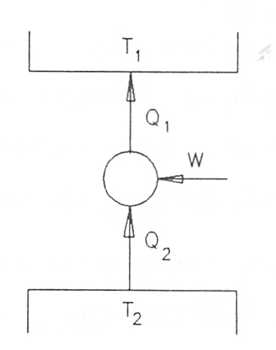
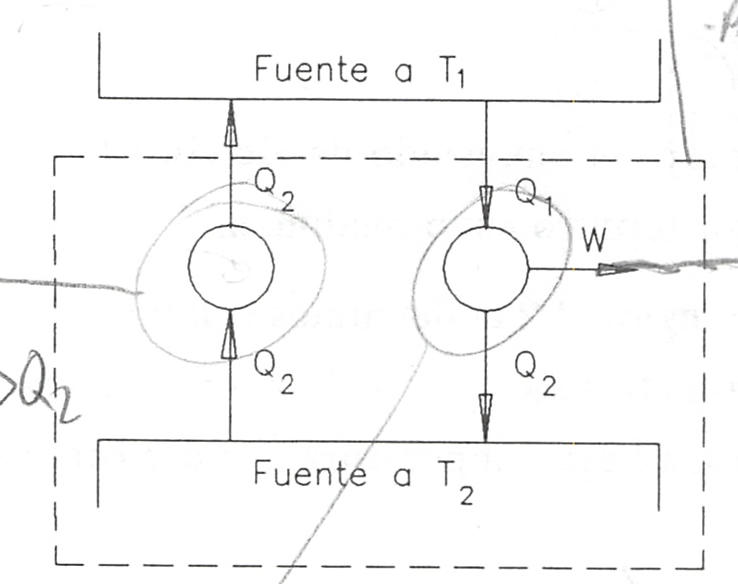

Segundo Principio de la Termodinámica. Entropía
===============================================

(Antonio Sánchez Sánchez / Pablo de Assas Martínez de Morentin)

Introducción
------------

Como corolario de la primera ley de la termodinámica se obtiene para un sistema cerrado que efectúe un proceso cíclico que

.. math::

    	 \displaystyle\oint \delta Q = - \displaystyle\oint \delta W

Así pues, la primera ley no impone ninguna restricción en las direcciones de los flujos de calor y trabajo. Esto es, un ciclo en el cual se transfiere desde un sistema una cantidad determinada de calor y a la vez se realiza sobre el sistema una cantidad igual del trabajo satisface la primera ley igual que un ciclo en el que el flujo de calor y el trabajo tuviesen los sentidos contrarios (el sistema recibe calor y realiza trabajo).

Sin embargo, se sabe por experiencia que el hecho de que un ciclo propuesto no viole la primera ley, no nos asegura que ese ciclo pueda realizarse. Es esta evidencia experimental la que lleva a la formulación de la segunda ley de la termodinámica. Así un ciclo sólo se efectuará si se satisfacen a la vez las leyes primera y segunda de la termodinámica.

En un sentido amplio, la segunda ley recoge el hecho de que los procesos suceden en una cierta dirección y no en la opuesta. Una taza caliente de café se enfría cediendo calor hacia el medio ambiente, pero no habrá transferencia de calor desde el medio ambiente frió hacia el café caliente. Observaciones familiares, análogas a la anterior, ponen en evidencia la validez de la segunda ley de la termodinámica.

En el estudio de la materia que se plantea en este tema, y en análisis posteriores al aplicar el segundo principio, es necesario sustituir el medio ambiente por sistemas ideales a los que puede transferirse de manera reversible cualquier cantidad de calor o trabajo. Estos sistemas reciben el nombre de fuentes térmicas y fuentes de energía mecánica.

Con el término fuente térmica designamos a cualquier sistema de masa y volumen constantes que puede transferir cualquier cantidad de calor sin que cambie su temperatura. Es importante tener en cuenta que una fuente térmica, por definición, está siempre en equilibrio termodinàmico a una cierta temperatura T. En sentido estricto, ningún sistema real puede representar el comportamiento de una fuente térmica; sin embargo como posibles sistemas reales con los que se materializa este sistema ideal podríamos citar: un gran bloque metálico, un termostato, también se utiliza la atmósfera, el agua del mar o un río, etc. es evidente que, de los ejemplos citados, el que más se aproxima al modelo, siempre que su tamaño sea lo suficientemente grande como para que su temperatura no se vea afectada por la transferencia de calor, es el bloque metálico.

En el caso de una fuente de energía mecánica, se puede disponer de cualquier cantidad de trabajo sin producción de entropía.

De los dos artificios mencionados el que más se va a utilizar es el de la fuente térmica.

Enunciados del segundo principio
--------------------------------

Con las consideraciones hechas anteriormente, podemos ya enunciar la segunda ley de la termodinámica. Hay dos enunciados clásicos de este principio conocidos como enunciado de Kelvin-Planck y enunciado de Clausius.

Enunciado de Kelvin-Planck del segundo principio

   Es imposible construir un dispositivo que, funcionando cíclicamente, no produzca otro efecto que extraer calor de un fuente térmica y realizar una cantidad equivalente de trabajo

Enunciado de Clausius del segundo principio

   No es posible construir un dispositivo que funcione cíclicamente y no produzca otro efecto que el paso de calor de un cuerpo a otro más caliente

De los enunciados del segundo principio vemos que un dispositivo que funcione según un ciclo termodinámico y del que se obtenga trabajo debe intercambiar calor, al menos, con dos fuentes térmicas. Y que si lo que se quiere es transferir, con un dispositivo que trabaje cíclicamente, calor desde una fuente térmica a otra a mayor temperatura, hay que suministrar a ese dispositivo una cierta cantidad de trabajo.

Pues bien, definimos un *motor térmico* como un dispositivo que funciona según un ciclo termodinámico y que proporciona un cierto trabajo como resultado del intercambio de calor entre dos fuentes térmicas una a alta y otra a baja temperatura, ver figura 3.1.

.. figure:: img/2nd_principio_motor_termico.png
   :width: 30%
   :align: center

   Motor térmico

   Máquina refrigeradora

Definiendo el *rendimiento del motor* como el cociente entre el trabajo que da el motor, W, y el calor que recibe de la fuente térmica de alta temperatura, :math:`Q_1`, podremos escribir:

.. math::

   \eta_{mot} = \frac{W}{Q_1}

y, del balance de energía aplicado al motor, se obtiene

.. math::

   Q_1-Q_2 -W = 0

en donde los valores de W, :math:`Q_1` y :math:`Q_2` están considerados en sus valores absolutos, considerándose positivos según las flechas de la figura. Así pues, podremos poner

.. math::

   \eta_{mot} = \frac{Q_1-Q_2}{Q_1} = 1 - \frac{Q_2}{Q_1}

En términos del rendimiento de un motor térmico el enunciado de Kelvin-Planck del segundo principio diría que no es posible ningún motor térmico cuyo rendimiento sea la unidad.

De manera análoga una *máquina refrigeradora*, figura 3.2 la definimos como un dispositivo que funciona según un ciclo termodinámico y que el trabajo que se le aporta lo invierte en extraer una cierta cantidad de calor :math:`Q_2` de una fuente a baja temperatura y ceder otra cantidad de calor :math:`Q_1` a otra fuente a temperatura mayor.

Si aplicamos el balance energético a este dispositivo, obtenemos:

.. math::

   -Q_1+Q_2+W = 0

Definiendo el rendimiento de refrigeración, COP, como el cociente entre el calor extraído y el trabajo suministrado, se tendrá que

.. math::

   COP_{MF} = \frac{Q_2}{W}

El enunciado de Clausius del segundo principio podría enunciarse diciendo que no es posible ninguna máquina refrigeradora cuyo COP sea infinito.

Equivalencia entre estos dos enunciados
^^^^^^^^^^^^^^^^^^^^^^^^^^^^^^^^^^^^^^^

Aunque, en principio, ambos enunciados parecen no tener relación alguna, vamos a demostrar que son equivalentes y, por lo tanto, pueden utilizarse uno u otro indistintamente según convenga.

En la demostración que sigue designaremos por K la veracidad del enunciado de Kelvin-Planck y por C la de Clausius. La falsedad de cada uno de ellos los designaremos por :math:`\bar{K}` y :math:`\bar{C}`.

Se trata de demostrar la equivalencia lógica de ambos postulados esto es :math:`K\Leftrightarrow C`, lo que equivale a demostrar a) que :math:`K\Rightarrow C` y b) que :math:`C\Leftarrow K`.

a) Demostrar lo primero, esto es ,que el enunciado de Kelvin-Planck es equivalente al de Clausis es lo mismo que demostrar que el no cumplimiento del de Clausius es equivalente al no cumplimiento del de Kelvin-Planck. :math:`(K \Rightarrow C) \Leftrightarrow (\bar{C}\Rightarrow \bar{K})`

Consideremos una máquina frigorífica que pase una cantidad de calor :math:`Q_2` desde la fuente fría a la caliente sin necesidad de aportar trabajo, lo que constituye :math:`\bar{C}`.

Consideremos a su vez un motor térmico que trabajando entre las dos mismas fuentes cede :math:`Q_2` a la fuente fría. El conjunto máquina frigorífica-motor térmico se comporta como un dispositivo, que funciona cíclicamente, productor de trabajo intercambiando calor con una sóla fuente térmica (:math:`\bar{K}`). Figura 3.3.

Así pues el no cumplimiento del enunciado de Clausius es lo mismo que el no cumplimiento del de Kelvin-Planck: :math:`\bar{C}\Rightarrow\bar{K}`

   Demostración de :math:`\bar{C}\Rightarrow\bar{K}`

.. figure:: img/2nd_principio_K_implica_C.png
   :width: 35%
   :align: center

   Demostración de :math:`\bar{K}\Rightarrow\bar{C}`

b)	De manera análoga podemos probar que :math:`(C\Rightarrow K) \Leftrightarrow (\bar{K}\Rightarrow\bar{C})`

Para ello consideremos un motor que extrayendo la cantidad de calor :math:`(Q_1-Q_2)` de una fuente térmica a temperatura :math:`T_1` lo transforme íntegramente en trabajo :math:`(\bar{K})`.

Si este trabajo se emplea en una máquina frigorífica que extraiga :math:`Q_2` de una fuente térmica a :math:`T_2` y ceda a la fuente :math:`T_1` :math:`(T_1>T_2)` una cantidad de calor :math:`Q_1`, el conjunto motor-refrigerador constituye un dispositivo que, funcionando cíclicamente, hace pasar una cantidad de calor :math:`Q_2` de una fuente térmica a otra de mayor temperatura sin aportar trabajo al dispositivo (:math:`\bar{C}`). Así pues, :math:`\bar{k}\Rightarrow\bar{C}`. Figura 3.4

Con a) y b) queda demostrada la equivalencia entre los enunciados de Kelvin-Planck y de Clausius.

.. toctree::
   :maxdepth: 1
   :caption: Contenido:

   segundo_principio_ciclo_carnot
   segundo_principio_definicion_termodinamica_temperatura
   segundo_principio_clausius
   segundo_principio_entropia
   segundo_principio_entropia_procesos_irreversibles
   segundo_principio_entropia_energia_no_utilizable
   segundo_principio_gibbs
   segundo_principio_variacion_entropia
