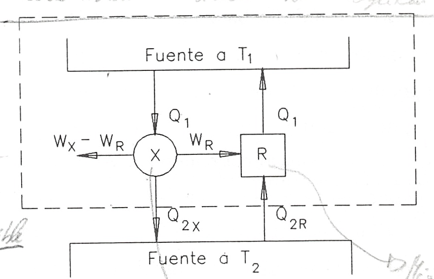

Ciclo de Carnot
===============

Introducción
------------

Ya se ha visto la posibilidad de la existencia de un dispositivo que trabajando cíclicamente e intercambiando calor con dos fuentes térmicas realice trabajo. A un tal dispositivo le hemos llamado motor térmico.

Se nos plantea ahora la siguiente cuestión: dadas dos fuentes térmicas:

- ¿Cómo sería el motor térmico y cuáles sus características?
- ¿Cuál sería su rendimiento?
- ¿Cómo influye, si es que lo hace, la naturaleza de la sustancia de trabajo?

Estas preguntas fueron contestadas por N. S. Carnot en su trabajo "Reflections sur la puissance motrice du feu el les moyens propes a developped" publicado anteriormente al enunciado del :math:`1^{er}` principio y 25 años antes de enunciarse el segundo. En este trabajo Carnot introdujo por primera vez el concepto de ciclo y propuso un motor ideal que funcionaba según un ciclo, particularmente sencillo, que ha recibido el nombre de Ciclo de Carnot.

Ciclo de Carnot
---------------

Diremos que un sistema termodinàmico cualquiera (mecánico, eléctrico, químico, magnético, etc.) realiza un **ciclo de Carnot** si, partiendo del equilibrio con la fuente térmica fría a temperatura :math:`T_2` realiza el siguiente ciclo:

- Una evolución adiabática reversible hasta alcanzar la temperatura :math:`T_1` de la fuente caliente.
- Un proceso isotérmico a temperatura :math:`T_1` mientras recibe una cantidad de calor :math:`Q_1` de la fuente caliente.
- Una evolución adiabática reversible en la que el sistema se enfría desde :math:`T_1` a :math:`T_2`.
- Un proceso isotérmico a :math:`T_2` durante el que cede :math:`Q_2` a la fuente fría hasta alcanzar las condiciones iniciales.

Todo motor que funcione según el ciclo descrito lo denominaremos **motor de Carnot**.

Este ciclo es reversible por serlo los procesos que intervienen en él y, por lo tanto, puede ser recorrido en sentido inverso al descrito siendo éste el funcionamiento de la **máquina frigorífica de Carnot**, máquina que extrae calor del foco frío y cede calor al foco caliente consumiendo una cantidad determinada de trabajo.

Como esta máquina lo que hace es extraer calor de una fuente térmica fría y ceder calor a otra más caliente podemos hacer una distinción según el fin primario a que se la destine. Así, si en vez de extraer calor del foco frío, el fin primordial es la cesión de calor en el foco caliente, se podrá utilizar como sistema de calefacción en cuyo caso la máquina se denomina **bomba térmica**.

Las expresiones (3.1) y (3.2) del rendimiento térmico de un motor y del coeficiente de refrigeración son aplicables a estas máquinas de Carnot.

Si la máquina inversa se utiliza como bomba térmica su coeficiente de funcionamiento se define como

.. math::

   COP_{BT} = \frac{Q_1}{W}

La relación entre uno y otro, para sistemas funcionando entre las mismas fuentes térmicas, es:

.. math::

   COP_{BT} = 1+COP_{MF}

Teoremas de Carnot
------------------

Las consideraciones realizadas por Carnot sobre el funcionamiento de las máquinas térmicas le llevó a enunciar los principios que llevan su nombre:

I

Ningún motor que funcione entre dos fuentes térmicas dadas puede tener mayor rendimiento que uno de Carnot funcionando entre las mismas fuentes térmicas.

II

Todas las máquinas reversibles que funcionan entre dos fuentes térmicas dadas tienen el mismo rendimiento

La demostración de la validez de estos enunciados podemos hacerla Viendo que el violar cualquiera de ellos nos conduce a violar el enunciado de Kelvin-Planck del segundo principio.

En efecto, supongamos que entre las fuentes 1 y 2, como se muestra en la figura 3.7a, funciona una máquina X y un motor de Carnot y que el rendimiento de la primera es mayor que el de la máquina de Carnot. Como a cada máquina se le suministra la misma cantidad de calor :math:`Q_1` y la máquina X tiene mayor rendimiento que la máquina de Carnot se tendrá que :math:`W_X > W_R` y :math:`Q_{2X} < Q_{2R}`. (Estamos tomando valores absolutos para W y Q y se consideran positivos según las flechas de la figura.)

.. figure:: img/2nd_principio_fig_3.7a.png
   :width: 45%
   :align: center

   Demostración del teorema de Carnot.

   Demostración del teorema de Carnot.

Por ser la máquina de Carnot reversible podemos hacer que funcione como máquina frigorífica como se muestra en la figura 3.7b. Esta cede una cantidad de calor :math:`Q_1` a la fuente térmica 1 y precisa una cantidad de trabajo :math:`W_R`. Como :math:`W_R` es menor que el trabajo :math:`W_X` desarrollado por la máquina X ésta puede suministrar a la máquina refrigeradora de Carnot el trabajo que precisa y todavía puede obtenerse de ella trabajo en una cantidad de :math:`(W_X-W_R)`. La máquina invertida de Carnot cede a la fuente 1 el mismo calor :math:`Q_1` que de ella absorbe la máquina X por lo que el intercambio de calor de esta fuente es nulo y puede, por ello, eliminarse. Fijémonos ahora en el sistema formado conjuntamente por la máquina X y por la máquina frigorífica de Carnot (el encerrado por la línea a trazos). Este sistema trabaja cíclicamente y realiza un trabajo :math:`(W_X-W_R)` recibiendo calor de una única fuente térmica, lo cual contradice el enunciado de Kelvin-Planck del segundo principio. Por consiguiente nuestra hipótesis de que :math:`\eta_X > \eta_R` es falsa y queda probado que ningún motor que funcione entre dos fuentes térmicas dadas puede tener un rendimiento mayor que una máquina de Carnot que trabaje entre las mismas fuentes térmicas.

La segunda parte del teorema de Carnot se prueba manera análoga. En efecto, si ahora  la máquina X fuese reversible y los rendimientos de cada máquina, al contrario de lo que dice el teorema, fuesen distintos para la misma cantidad de calor recibida cada máquina daría un trabajo distinto. Invertimos la máquina que tenga un rendimiento menor. La otra máquina, que realiza un trabajo mayor, puede proporcionar el que necesita la que se ha invertido y dar, además, un trabajo adicional. De esta forma lo que se obtiene es un dispositivo que contradice el enunciado de Kelvin-Planck del segundo principio. Así pues es falso que dos máquinas reversibles que trabajen entre las mismas fuentes térmicas tengan distinto rendimiento.

La segunda parte del teorema del Carnot puede enunciarse, de forma alternativa, diciendo que el rendimiento térmico de una máquina reversible depende sólo de las temperaturas de las fuentes entre las que trabaja y que no depende de la sustancia de trabajo de la máquina.
