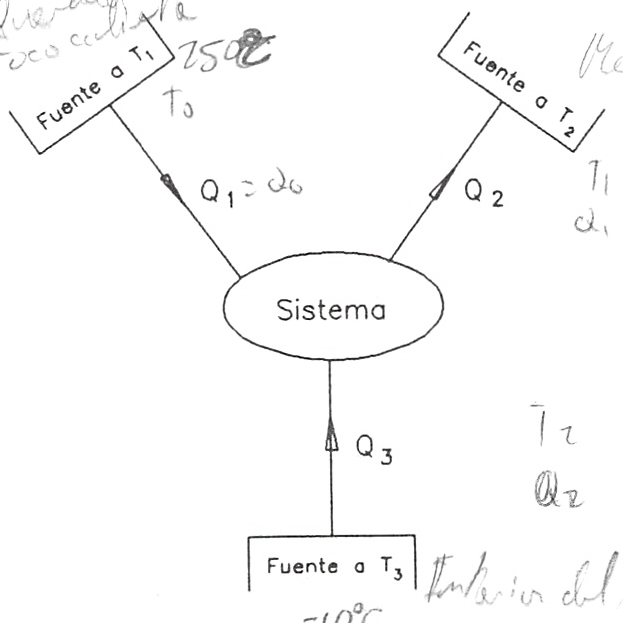

Ejemplo 3.1
===========

Un frigorífico de absorción funciona utilizando únicamente gas ciudad. El sistema puede considerarse como una máquina que funciona cíclicamente y que intercambia calor con tres fuentes:

1)	El foco caliente ( materializado mediante un quemador de gas ciudad)
2)	El foco frío (recinto utilizable)
3)	Medio ambiente.

Si la temperatura media del foco caliente puede considerarse igual a 250 °C, la temperatura del recinto frío igual a -10 °C y el ambiente está a 35 °C, determínese, suponiendo que el sistema funciona/sin irreversibilidades, qué cantidad de energía hay que suministrar en el foco caliente por cada unidad de energía extraída del foco frío y cuál es el C.O.P. de la instalación.

Solución
--------

   Demostración de la desigualdad de Clausius.

Si el sistema funciona cíclicamente, la variación de energía para un ciclo o número
determinados de ciclos, será nula, por lo que aplicando el primer principio al sistema en este proceso, se obtiene:

.. math::

   Q_1-Q_2+Q_3= \Delta U = 0

Al ser la transformación reversible, la desigualdad de Clausius, [(3.13.b)], aplicada en este caso nos da:

.. math::

   \frac{Q_1}{T_1}-\frac{Q_2}{T_2}+\frac{Q_3}{T_3} = 0

Para el proceso considerado:

.. math::

   T_1 &= 250+273,15 = 523,15K\\
   T_2 &= 35 + 273,15 = 308,15K\\
   T_3 &= -10+273,15 = 263,15K\\
   Q_3 &= 1kJ

Sustituyendo estos valores en (E.l) y (E.2), se obtiene:

.. math::

   Q_2-Q_1 = 1\\
   -\frac{Q_1}{308,15}+\frac{Q_2}{523,15} = \frac{1}{263,15}

Resolviendo y despejendo :math:`Q_1`, se obtiene: :math:`Q_1 = 0,416kJ`. Por lo que :math:`C.O.P. = \frac{1}{0,416} = 2,40`

¿Cuál sería el COP de la máquina frigorífica de Carnot que realizara la misma función
que la máquina dada?

