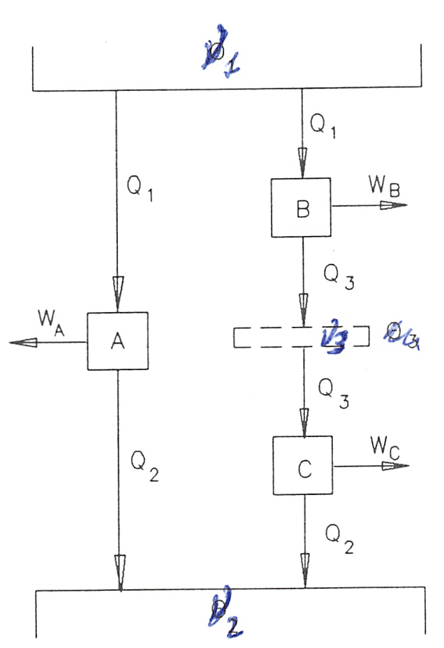

Definición termodinámica de temperatura
=======================================

Al tratar del concepto de temperatura vimos que la ley cero de la termodinámica nos proporcionaba una base para medir la temperatura, y de hecho todos los termómetros se basan en esta ley cero. El inconveniente es que con estos termómetros la escala de temperaturas definida depende de la sustancia particular de cada termómetro y del dispositivo usado (termómetro de gas, de columna líquida, etc.) Lo deseable es una escala de temperaturas que sea independiente de cualquier sustancia concreta. Al analizar el ciclo de Carnot se ha visto que su rendimiento es independiente de la sustancia de trabajo que realice el ciclo y que sólo depende de la temperatura de las fuentes entre las que trabaja. Esto nos proporciona la base para poder definir una escala de temperatura absoluta, escala que llamaremos *escala termodinámica de temperatura*.

Dado que el rendimiento de un motor de Carnot es función sólo de las temperaturas de las fuentes entre las que trabaja, si tales temperaturas las designamos por :math:`\vartheta_1` y :math:`\vartheta_2`, podremos escribir:

.. math::

   \eta = \frac{W}{Q}= 1-\frac{Q_2}{Q_1} = \Phi(\vartheta_1,\vartheta_2)

de donde se deduce que:

.. math::

   \frac{Q_1}{Q_2} = \frac{1}{1- \Phi(\vartheta_1,\vartheta_2)} = f(\vartheta_1,\vartheta_2)

Consideremos ahora tres fuentes a temperaturas :math:`\vartheta_1`, :math:`\vartheta_2` y :math:`\vartheta_3` entre los que trabajan las máquinas de Carnot A, B y C tal como se indica en la figura 3.8.

   Figure 3.8

Si	:math:`\vartheta_1 > \vartheta_3 > \vartheta_2`  podremos escribir para la máquina B:

.. math::

   \frac{Q_1}{Q_3} = f(\vartheta_1,\vartheta_3)

y para la máquina C:

.. math::

   \frac{Q_3}{Q_2} = f(\vartheta_3,\vartheta_2)

mientras que para la máquina A será lo escrito anteriormente, esto es:

.. math::

   \frac{Q_1}{Q_2} = f(\vartheta_1,\vartheta_2)

Ahora bien, el cociente :math:`\frac{Q_1}{Q_2}` se puede poner en la forma:

.. math::

   \frac{Q_1}{Q_2} = \frac{Q_1}{Q_3}  \frac{Q_3}{Q_2}

esto es:

.. math::

    f(\vartheta_1,\vartheta_3)  f(\vartheta_3,\vartheta_2) =  f(\vartheta_1,\vartheta_2)

Para que pueda verificarse la expresión anterior la función f tiene que ser de la forma:

.. math::

    f(\vartheta_i,\vartheta_j) = \frac{\psi(\vartheta_i)}{\psi(\vartheta_j)}

Por consiguiente tendremos que:

.. math::

   \frac{Q_1}{Q_2} = \frac{\psi(\vartheta_1)}{\psi(\vartheta_2)}

que establece que la relación entre el calor absobido a la temperatura :math:`\vartheta_1` y el cedido a la temperatura :math:`\vartheta_2` debe de ser igual a la relación de la misma función de las dos temperaturas, siendo :math:`\psi` una función desconocida de las temperaturas :math:`\vartheta_1`  y  :math:`\vartheta_2`  que son los valores de las temperaturas de las fuentes medidas en cualquier escala arbitraria.

La ecuación 3.4 nos permite la definición de una escala de temperaturas que no esté ligada a una sustancia determinada, ya que, a partir de los teoremas de Carnot, la podemos tener directamente relacionada con la cantidad de calor que un motor de Carnot intercambia con dos fuentes térmicas.

Hay varias formas posibles de elección de la función característica que ligue :math:`\psi(\vartheta)`  con la temperatura, T, medida en la nueva escala. La más sencilla es escoger:

.. math::

   \psi(\vartheta) = T

Esta elección nos lleva a la escala de temperatura termodinámica o **escala absoluta de temeratura**, también denominada **escala Kelvin de temperatura**.

Con (3.5), la ecuación (3.4) se nos convertirá en:

.. math::

   \frac{Q_1}{Q_2} = \frac{T_1}{T_2}

Es decir, dos temperaturas medidas en la escala absoluta de temperaturas tienen la misma relación que las cantidades de calor intercambiadas por una máquina de Carnot que funcione entre dos fuentes térmicas mantenidas a esas temperaturas.

A fin de fijar por completo la escala, es preciso definir un punto fijo. Se vuelve a considerar como único punto fijo de esta escala absoluta, la temperatura correspondiente al punto triple del agua :math:`T_3 = 273,16K`.

Según lo que acabamos de decir, la temperatura de un sistema dado se podrá expresar
mediante la ecuación:

.. math::

   T = 273,16 \frac{Q}{Q_3}

en la que :math:`Q` y :math:`Q_3` son, respectivamente, el calor que una máquina de Carnot intercambia con el sistema cuya temperatura se quiere determinar y la fuente térmica en el punto triple del agua.

De acuerdo con (3.6) la temperatura cero (:math:`T_2 = 0`) corresponderá a :math:`Q_2 = 0`. Esta temperatura, que sería el cero de la escala, es inalcanzable ya que con la definición de temperatura que hemos hecho, ver (3.6), el rendimiento del ciclo de Carnot tomaría la forma:

.. math::

   \eta = \frac{W}{Q_1} = 1-\frac{Q_2}{Q_1} = 1 - \frac{T_2}{T_1} \Rightarrow T_2 = T_1 \left(1 - \frac{W}{Q_1} \right)

y si :math:`T_2` fuese igual a cero, sería preciso que :math:`\frac{W}{Q_1} = 1`, lo cual supondría que mediante un proceso cíclico podríamos obtener trabajo de una sola fuente térmica en contradicción del enunciado de Kelvin-Planck del segundo principio.
