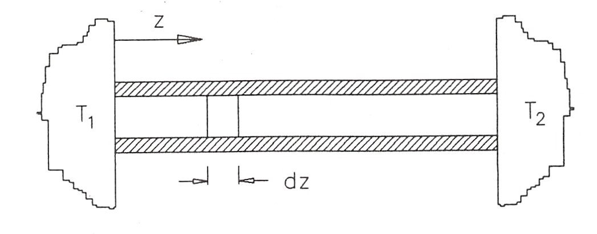

Ejemplo 3.2
===========

Una barra de metal cilindrica, delgada, de longitud L y masa m está en contacto, por sus extremos, con dos cuerpos, que asemejamos a dos fuentes térmicas, a temperaturas :math:`T_1` y :math:`T_2 (T_1 > T_2)`. La superficie lateral de la barra está aislada térmicamente. En esta situación la distribución de temperatura a lo largo de la barra viene dada por:

.. math::

   T(z) = T_1 - \frac{T_1-T_2}{L}z   \text{    } [K]

A partir de estas condiciones, se separa la barra de los cuerpos y se aíslan, también, sus extremos y se deja que la barra alcance su temperatura de equilibrio :math:`T_f`.

Se desea obtener:

1.	- La temperatura de equilibrio de la barra :math:`T_f` en función de :math:`T_1` y :math:`T_2`.
2.	- La producción de entropía desde que la barra se separa de los cuerpos hasta que
alcanza la temperatura de equilibrio en función de las temperaturas de los cuerpos, :math:`T_1` y :math:`T_2`, de la masa de la barra, m y del calor específico del material de la barra, c.

Solución
--------

Elegimos como sistema la barra ya separada de los cuerpos y aislada. Es un sistema aislado. Para la barra metálica se utilizará el modelo de sustancia incompresible.
1)

Por estar la barra aislada :math:`Q = 0` y :math:`W = 0`, por lo que el primer principio aplicado a ella queda

.. math::

   \Delta U = 0

Para calcular la variación de energía interna de la barra tomamos un elemento de ella de longitud dz. Cada elemento diferencial de barra varía su temperatura desde T(z), temperatura inicial del elemento, a :math:`T_f`, temperatura de equilibrio de la barra, de modo que

.. math::

   dU(z) &= (dm) c [T_f-T(z)]\\
   &= (\rho Adz)c[T_f-T(z)]

siendo :math:`\rho` la densidad del material de la barra y A el área de la sección recta transversal de la barra.

Así pues, como :math:`\Delta U = \int_0^L dU(z)` de (E.1) y (E.2) se obtendrá

.. math::

   0 &= \rho Ac \int_0^L \left( T_f-T_1+\frac{T_1-T_2}{L}z \right)dz\\
   &= \rho Ac L \left( T_f - \frac{T_1+T_2}{2} \right)

de donde

.. math::

   T_f = \frac{T_1+T_2}{2} \text{   } [K]

2)

Para calcular la producción de entropía hasta que la barra alcanza su temperatura de equilibrio, haremos uso de las ecuaciones (3.18) y (3.25).

Al ser la barra es un sistema aislado :math:`\int_1^2 \frac{\delta Q}{T_{front}} = 0`, luego la producción de entropía vendrá dada, de acuerdo con (3.18) por la variación de entropía de la barra

.. math::

   \sigma = \Delta S

Para calcular la variación de entropía tomamos un elemento de barra de longitud dz y de acuerdo con (3.25) podremos poner

.. math::

   dS(z) = (dm)c \ln \frac{T_f}{T(z)}

Luego

.. math::

   \Delta S &= \rho Ac \int_0^L \ln \frac{T_f}{T(z)} dz \\
   &= \rho Ac [L \ln T_f - \int_0^L (\ln T(z)) dz]

Para realizar la última integral cambiamos de variable (de z a T) obteniendo

.. math::

   dT = - \frac{T_1-T_2}{L}dz \rightarrow dz = - \frac{L}{T_1-T_2} dT

con lo que

.. math::

   \int_0^L (\ln T(z)) dz &= - \frac{L}{T_1-T_2} \int_{T_1}^{T_2}\ln TdT\\
   &= \frac{L}{T_1-T_2}[T\ln T - T]_{T_2}^{T_1}\\
   &= L \left[ \frac{T_1 \ln T_1}{T_1-T_2} - \frac{T_2 \ln T_2}{T_1-T_2} -1\right]

Llevando el resultado de (E.6) a (E.5) y de acuerdo con (E.4) se obtendrá finalmente

.. math::

   \sigma &= \rho A Lc \left[ \ln T_f - \left( \frac{T_1 \ln T_1}{T_1-T_2} - \frac{T_2 \ln T_2}{T_1 - T_2} -1\right)\right]\\
   &= mc \left[ 1+ \ln T_f +\frac{T_2\ln T_2}{T_1-T_2}-\frac{T_1\ln T_1}{T_1-T_2}\right] \text{    } [J\cdot K^{-1}]

