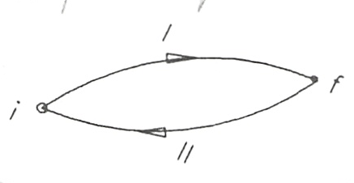

Entropía
========

Definición
----------

La **entropía** es una *propiedad del sistema* definida como:

.. math::

   dS = \left. \frac{\delta Q}{T} \right)_R \text{ ó } \Delta S_{1-2} = \int_1^2 \left.\frac{\delta Q}{T}\right)_R

.. note::

   Recordemos que una magnitud es una propiedad si y solo si el cambio en su valor entre dos estados de equilibrio es independiente del camino seguido en el proceso.

.. note::

   Realmente hemos indicado la **variación de la entropía**. Esta fórmula es sólo válida para una transformación reversible.

La unidad de la entropía en el sistema internacional es el :math:`J\cdot K^{-1}`. 

Es una magnitud extensiva, de modo que podemos definir la entropía específica :math:`s =\frac{S}{m}` ó :math:`s =\frac{S}{n}` si se toma la unidad de masa o la unidad de sustancia siendo, entonces, las unidades de la entropía específica  :math:`J\cdot kg^{-1}\cdot K^{-1}` ó :math:`J\cdot mol^{-1}\cdot K^{-1}`.

.. warning::

   Es importante destacar que la **variación de la entropía** la hemos deducido sólo para una transformación reversible y que sólo para este caso puede evaluarse mediante :math:`\int_1^2 \frac{\delta Q}{T}`. 

Ahora bien, por ser la entropía una propiedad, esto es, sólo depende del estado del sistema, siempre podremos evaluar su variación entre dos estados de equilibrio dados sin más que imaginar, entre los dos estados conocidos, un proceso o serie de procesos reversibles adecuados a los que podemos aplicar (3.14). Esto podremos hacerlo siempre, independientemente de que el sistema haya ido de un estado a otro mediante una evolución reversible o irreversible. A lo largo del curso se hará aplicación de todo esto.

Demostración
------------

Consideremos dos estados de equilibrio (1) y (2) representados en un diagrama generalizado en la figura 3.10. De (1) a (2) podemos ir por el camino indicado por la curva I y regresamos a (1) por el camino representado por la curva II. Ambos procesos los suponemos reversibles y en conjunto constituyen un ciclo. Si aplicamos a este ciclo reversible el teorema de Clausius, (3.13.a), obtendremos:

.. math::

   \int_{iI}^f \frac{\delta Q}{T}+\int_{fII}^i \frac{\delta Q}{T} = 0

o lo que es lo mismo

.. math::

   \int_{iI}^f \frac{\delta Q}{T}= -\int_{fII}^i \frac{\delta Q}{T}

Por ser reversibles los procesos los caminos dados serán invertibles, es decir:

.. math::

   -\int_{fII}^i \frac{\delta Q}{T}= \int_{iII}^f \frac{\delta Q}{T}

por lo que

.. math::

   \int_{iI}^f \frac{\delta Q}{T} = \int_{iII}^f \frac{\delta Q}{T}

Es decir, la integral de :math:`\frac{\delta Q}{T}` no depende de la trayectoria elegida para la integración, sino únicamente de los estados inicial y final de la transformación. 

De acuerdo a lo que dijimos en el tema 1 al definir una propiedad: una magnitud es una propiedad si y solo si el cambio en su valor entre dos estados de equilibrio es independiente del camino seguido en el proceso.

Consecuentemente, :math:`\int_1^2 \frac{\delta Q}{T}` representa una propiedad del sistema. A esta propiedad se la denomina **entropía** y su variación entre dos estados de equilibrio viene dada por:

.. math::

   dS = \left. \frac{\delta Q}{T} \right)_R \text{ ó } \Delta S_{1-2} = \int_1^2 \left.\frac{\delta Q}{T}\right)_R

ya se trate de un proceso elemental o de un proceso finito.

