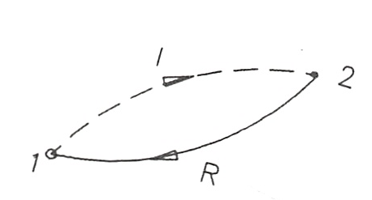

Entropía y procesos irreversibles; producción de entropía
---------------------------------------------------------

Consideremos dos estados de equilibrio conectados mediante dos procesos, uno reversible (R) y otro irreversible (I) según se muestra en la figura 3.9.

   Procesos reversibles (R) e irreversibles (I) que conectan los estados 1 y 2.

Si describimos el ciclo 1-I-2-R-1, que en total es irreversible, podremos escribir, de acuerdo con (3.13.a)

.. math::

   \int_{1I}^2 \frac{\delta Q}{T} + \int_{2R}^1 \frac{\delta Q}{T} < 0

Figura 3.11 Procesos reversibles (R) e irreversibles (I) que conectan los estados 1 y 2.

Ahora bien, el proceso (R) es reversible y por ende invertible por lo que, teniendo en cuenta (3.14), podremos escribir

.. math::

   \int_{2R}^1 \frac{\delta Q}{T} = -\int_{1R}^2\frac{\delta Q}{T} = -(S_2-S_1)

con lo que se obtendrá finalmente que

.. math::

   \int_{1I}^2 \frac{\delta Q}{T} < S_2 - S_1

y si la evolución es elemental

.. math::

   \frac{\delta Q}{T} < dS

La expresión (3.15.b) nos dice que en el curso de una evolución irreversible la variación de entropía del sistema, dS, es superior al cociente :math:`\frac{\delta Q}{T}`

Debe resaltarse que mientras en los procesos reversibles la temperatura del sistema coincide on la de la fuente térmica con la que intercambia calor, en los irreversibles son diferentes; de hecho, incluso puede ocurrir que en el sistema no sea uniforme siendo la temperatura que aparece en (3.15.a) y (3.15.b) la de la frontera del sistema, :math:`T = T_{front}`, en las regiones por donde se intercambia el calor con la fuente.

Si el sistema está aislado térmicamente. :math:`\delta Q = 0` y de (3.15.a) se deduce que:

.. math::

   \Delta S_{aisl} > 0

Como el universo es en sí un sistema aislado, podemos afirmar que todos los procesos reales ocurren en el séntido de que la entropía del universo aumenta, lo cual marca un sentido a la evolución del mundo físico, hecho que se conoce como *principio del aumento de entropía*.

Así pues, la forma matemática más sencilla del *segundo principio de la termodinámica* expuesto al principio del tema, puede ser la siguiente:

.. math::

   \Delta S_{univ} \geq 0

donde el signo igual (=) se aplica a procesos reversibles y el signo mayor (>) a procesos irreversibles.

La desigualdad (3.15.a) podemos escribirla como una igualdad simplemente sumando a la izquierda una determinada cantidad, esto es

.. math::

   \sigma_s+\int_1^2 \frac{\delta Q}{T} = S_2 - S_1

donde el símbolc :math:`\sigma_s` representa la **producción de entropía**, término en el que incluimos todos los efectos disipativos internos al sistema en consideración. En (3.18) vemos que a la variación de entropía de un sistema cooperan dos causas: una debida, como se acaba de señalar, a las irreversibilidades existentes en el interior del sistema que se analiza y la otra debida al flujo de calor hacia el sistema desde fuentes externas (*).

Para tener en cuenta todas las irreversibilidades, tanto internas como externas, existentes en un proceso determinado, es preciso elegir un sistema aislado en cuyo interior estén todas las irreversibilidades y, entonces, podremos escribir:

.. math::

   \Delta S_{univ} = \sigma_t

donde :math:`\Delta S_{univ} = \Delta S_{sis}+\Delta S_{ext}`

A la variación de entropía del exterior solo contribuyen los posibles flujos de calor procedentes de fuentes térmicas. Como la transferencia de calor desde una fuente térmica se realiza reversiblemente se tendrá:

.. math::

   \Delta S_{ext} = - \sum_i \frac{Q_i}{T_i}

siendo :math:`Q_i` el calor transferido al sistema por la fuente i-ésima que está a una temperatura :math:`T_i`.

Si sustituimos en (3.19) :math:`\Delta S_{ext}` por su valor dado en (3.20), obtenemos la ecuación del segundo principio para sistemas cerrados que es:

.. math::

   S_2 - S_1 - \sum_i \frac{Q_i}{T_i} &= \sigma_t\\
   &= \sigma_s+\int_1^2 \frac{\delta Q}{T} - \sum_i \frac{Q_i}{T_i}

(*) A esta última contribución a la variación de entropía de un sistema se la suele llamar **flujo de entropía**

