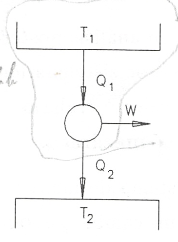
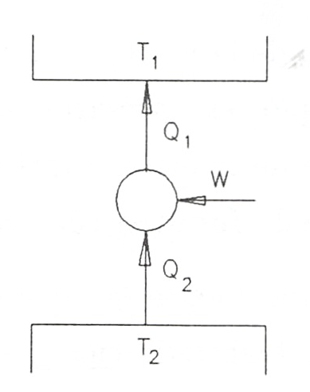
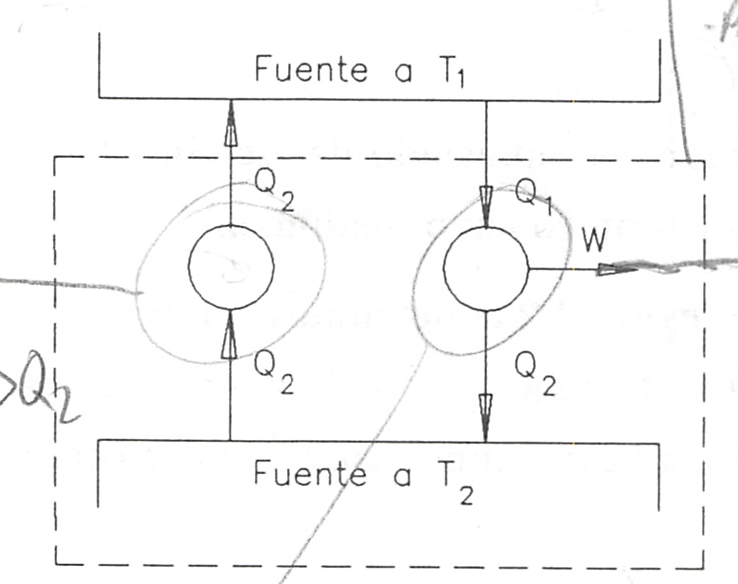

Enunciados del segundo principio
================================

Con las consideraciones hechas anteriormente, podemos ya enunciar la segunda ley de la termodinámica. Hay dos enunciados clásicos de este principio conocidos como enunciado de Kelvin-Planck y enunciado de Clausius.

Enunciado de Kelvin-Planck del segundo principio

   Es imposible construir un dispositivo que, funcionando cíclicamente, no produzca otro efecto que extraer calor de un fuente térmica y realizar una cantidad equivalente de trabajo

Enunciado de Clausius del segundo principio

   No es posible construir un dispositivo que funcione cíclicamente y no produzca otro efecto que el paso de calor de un cuerpo frío a otro más caliente

De los enunciados del segundo principio vemos que un dispositivo que funcione según un ciclo termodinámico y del que se obtenga trabajo debe intercambiar calor, al menos, con dos fuentes térmicas. Y que si lo que se quiere es transferir, con un dispositivo que trabaje cíclicamente, calor desde una fuente térmica a otra a mayor temperatura, hay que suministrar a ese dispositivo una cierta cantidad de trabajo.

Motor térmico
-------------

Definimos un *motor térmico* como un dispositivo que funciona según un ciclo termodinámico y que proporciona un cierto trabajo como resultado del intercambio de calor entre dos fuentes térmicas una a alta y otra a baja temperatura, ver figura 3.1.

   Motor térmico

Definiendo el *rendimiento del motor* como el cociente entre el trabajo que da el motor, W, y el calor que recibe de la fuente térmica de alta temperatura, :math:`Q_1`, podremos escribir:

.. math::

   \eta_{mot} = \frac{W}{Q_1}

y, del balance de energía aplicado al motor (primer principio), se obtiene

.. math::

   Q_1-Q_2 -W = 0

en donde los valores de W, :math:`Q_1` y :math:`Q_2` están considerados en sus valores absolutos, considerándose positivos según las flechas de la figura. Así pues, podremos poner

.. math::

   \eta_{mot} = \frac{Q_1-Q_2}{Q_1} = 1 - \frac{Q_2}{Q_1}

En términos del rendimiento de un motor térmico el enunciado de Kelvin-Planck del segundo principio diría que no es posible ningún motor térmico cuyo rendimiento sea la unidad.

Máquina refrigeradora
---------------------

De manera análoga, una *máquina refrigeradora* la definimos como un dispositivo que funciona según un ciclo termodinámico y que el trabajo que se le aporta lo invierte en extraer una cierta cantidad de calor :math:`Q_2` de una fuente a baja temperatura y ceder otra cantidad de calor :math:`Q_1` a otra fuente a temperatura mayor.

   Máquina refrigeradora

Si aplicamos el balance energético a este dispositivo, obtenemos:

.. math::

   -Q_1+Q_2+W = 0

Definiendo el rendimiento de refrigeración, COP, como el cociente entre el calor extraído y el trabajo suministrado, se tendrá que

.. math::

   COP_{MF} = \frac{Q_2}{W}

El enunciado de Clausius del segundo principio podría enunciarse diciendo que no es posible ninguna máquina refrigeradora cuyo COP sea infinito.

Equivalencia entre estos dos enunciados
---------------------------------------

Aunque, en principio, ambos enunciados parecen no tener relación alguna, vamos a demostrar que son equivalentes y, por lo tanto, pueden utilizarse uno u otro indistintamente según convenga.

En la demostración que sigue designaremos por K la veracidad del enunciado de Kelvin-Planck y por C la de Clausius. La falsedad de cada uno de ellos los designaremos por :math:`\bar{K}` y :math:`\bar{C}`.

Se trata de demostrar la equivalencia lógica de ambos postulados esto es :math:`K\Leftrightarrow C`, lo que equivale a demostrar:

a) que :math:`K\Rightarrow C` y
b) que :math:`C\Leftarrow K`.

:math:`K\Rightarrow C`
^^^^^^^^^^^^^^^^^^^^^^

Demostrar lo primero, esto es ,que el enunciado de Kelvin-Planck es equivalente al de Clausis es lo mismo que demostrar que el no cumplimiento del de Clausius es equivalente al no cumplimiento del de Kelvin-Planck. :math:`(K \Rightarrow C) \Leftrightarrow (\bar{C}\Rightarrow \bar{K})`

Consideremos una máquina frigorífica que pase una cantidad de calor :math:`Q_2` desde la fuente fría a la caliente sin necesidad de aportar trabajo, lo que constituye :math:`\bar{C}`.

Consideremos a su vez un motor térmico que trabajando entre las dos mismas fuentes cede :math:`Q_2` a la fuente fría. El conjunto máquina frigorífica-motor térmico se comporta como un dispositivo, que funciona cíclicamente, productor de trabajo intercambiando calor con una sóla fuente térmica (:math:`\bar{K}`). Figura 3.3.

Así pues el no cumplimiento del enunciado de Clausius es lo mismo que el no cumplimiento del de Kelvin-Planck: :math:`\bar{C}\Rightarrow\bar{K}`

   Demostración de :math:`\bar{C}\Rightarrow\bar{K}`

.. figure:: img/2nd_principio_K_implica_C.png
   :width: 35%
   :align: center

   Demostración de :math:`\bar{K}\Rightarrow\bar{C}`

:math:`C\Leftarrow K`
^^^^^^^^^^^^^^^^^^^^^

De manera análoga podemos probar que :math:`(C\Rightarrow K) \Leftrightarrow (\bar{K}\Rightarrow\bar{C})`

Para ello consideremos un motor que extrayendo la cantidad de calor :math:`(Q_1-Q_2)` de una fuente térmica a temperatura :math:`T_1` lo transforme íntegramente en trabajo :math:`(\bar{K})`.

Si este trabajo se emplea en una máquina frigorífica que extraiga :math:`Q_2` de una fuente térmica a :math:`T_2` y ceda a la fuente :math:`T_1` :math:`(T_1>T_2)` una cantidad de calor :math:`Q_1`, el conjunto motor-refrigerador constituye un dispositivo que, funcionando cíclicamente, hace pasar una cantidad de calor :math:`Q_2` de una fuente térmica a otra de mayor temperatura sin aportar trabajo al dispositivo (:math:`\bar{C}`). Así pues, :math:`\bar{k}\Rightarrow\bar{C}`. Figura 3.4

Con a) y b) queda demostrada la equivalencia entre los enunciados de Kelvin-Planck y de Clausius.
