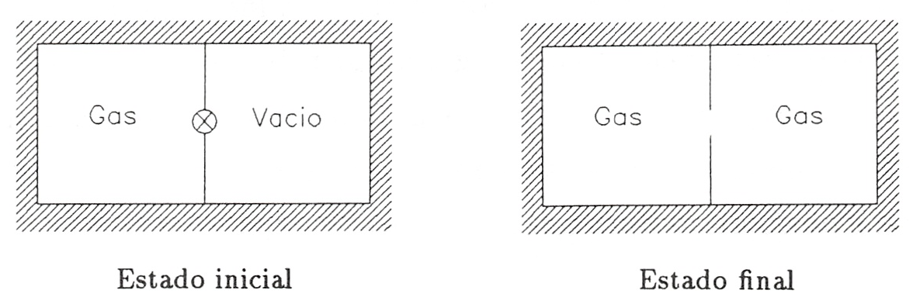
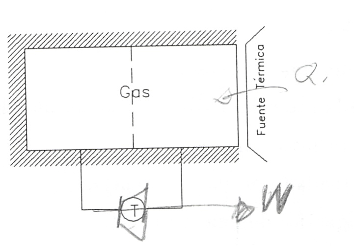

Procesos reversibles e irreversibles
====================================

Introducción
------------

Ya se definió anteriormente el **proceso reversible** como aquel que ocurre de tal manera que tanto el sistema como el medio ambiente pueden ser devueltos a sus estados originales respectivos.

Se plantea ahora la cuestión de si los procesos que ocurren en la naturaleza, y que son con los que trata la ingeniería y los que se van a estudiar en este curso, son reversibles o irreversibles. O dicho de otra forma, de lo que vamos a ocuparnos a continuación es examinar **algunos de los factores que hacen que los procesos sean irreversibles**.

Clases de irreversibilidad
--------------------------

Irreversibilidad mecánica externa
^^^^^^^^^^^^^^^^^^^^^^^^^^^^^^^^^

Existen procesos en los que el trabajo realizado sobre el sistema se convierte en energía interna, bien de un fuente térmica, bien del propio sistema. Estos procesos, que se conocen con el sobrenombre de disipativos (decimos que en ellos se "disipa" energía), presentan, como vamos a ver, una irreversibilidad que denominaremos irreversibilidad mecánica externa. Conviene señalar que esta energía degradada (disipada) por fricción puede ser interna al sistema, aunque el agente productor de la energía mecánica que se disipa sea externo. El nombre de irreversibilidad mecánica externa hace referencia al hecho de que es la energía producida por un agente mecánico externo la que se disipa.

Para comprobar que un proceso como el anteriormente descrito es irreversible no hay más que ver si se transgrede o no el segundo principio cuando se desanda el camino. En efecto, si una cierta cantidad de trabajo lo convertimos en energía interna, del sistema o de la fuente térmica, para volver a las condiciones iniciales se necesitaría extraer una cierta cantidad de calor (del sistema o de la fuente) y convertirla íntegramente en trabajo, lo cual contradice el enunciado de Kelvin-Planck del segundo principio de la termodinámica.

Como ejemplos en los que se convierte trabajo en energía interna de un fuente térmica pueden, entre otros, citarse:

- Agitación de un fluido viscoso.
- Detención de la rotación o vibración de un líquido.
- Deformación inelástica de un sólido.
- Paso de electricidad por una resistencia.
- Histéresis magnética de una sustancia.

siempre que cada uno de los sistemas citados estén en contacto con un fuente térmica.

Los ejemplos anteriormente citados, si se encuentran aislados térmicamente, nos sirven como ejemplos en los que el trabajo se convierte en energía interna del sistema.

Irreversibilidad mecánica interna
^^^^^^^^^^^^^^^^^^^^^^^^^^^^^^^^^

Se llamará así porque no hay ningún agente mecánico externo. Son procesos en los que la irreversibilidad es intrínseca al sistema; por ejemplo, la expansión adiabática en el vacío de un gas.

Que la expansión adiabática en el vacío de un gas es un proceso irreversible puede verse de la siguiente forma. Consideremos un gas encerrado en una parte de un depósito rígido y aislado térmicamente del exterior, mientras que en la otra parte del depósito se ha hecho el vacío. En un instante dado se permite que el gas pase a ocupar todo el volumen. En la figura 3.5 se muestra el sistema y los estados inicial y final que sp suponen de equilibrio.

En el proceso espontáneo se verifica que:

.. math::

   U_{fin}- U_{in} = 0

ya que durante el proceso tanto el calor (Q) como el trabajo (W) son nulos, pues el sistema está aislado térmicamente y el gas se expansiona contra el vacío no habiendo, por lo tanto, ninguna fuerza resistente. Así pues, en el proceso de expansión libre no hay variación de la energía interna del sistema.

Lo que pretendemos es probar por contradicción que el proceso es irreversible, esto es, que si fuese reversible y espontáneamente el gas volviese a ocupar el volumen inicial se violaría el segundo principio.

Modificamos el sistema como se muestra en la figura 3.6, introduciendo una turbina y una fuente térmica.

   FIgura 3.6

A partir del estado final de la expansión libre, esto es, partiendo del gas ocupando todo el volumen, con las modificaciones dichas, permitimos que el gas realice un ciclo siguiendo los siguientes procesos:

Proceso 1

   El gas pasa espontáneamente a ocupar el volumen inicial.

Proceso 2

   Parte del gas se expansiona en la turbina, yendo a ocupar el volumen de la derecha, hasta que la presión a ambos lados sea la misma. Durante la expansión en la turbina adiabática el gas realiza un trabajo disminuyendo, por lo tanto, su energía interna, esto es :math:`U' < U_{in}`

Proceso 3

   Se quita parte del aislamiento del depósito y, por medio de la fuente térmica, se le suministra calor hasta conseguir que la energía interna del gas alcance su valor inicial. Con esto se completa el ciclo.

El resultado neto de este ciclo es extraer calor de una sola fuente térmica y realizar una cantidad equivalente de trabajo. Este ciclo viola el segundo principio (enunciado de K-P) y por lo tanto no es posible. De los tres procesos, tanto el segundo como el tercero, esto es, la expansión en la turbina y la cesión de calor desde la fuente térmica, son posibles por lo que el proceso que hace el ciclo no sea posible es el primero. Así pues la expansión libre de un gas es un proceso irreversible.

Como ejemplos de irreversibilidad mecánica interna podemos citar:

- Ondas de choque.
- Procesos de estrangulación (gas que pasa a través de un tabique poroso o de una
válvula).
- Chasquido de un alambre tenso después de cortado.
- Desvanecimiento de una pompa de jabón después de pinchada.

Irreversibilidad térmica
^^^^^^^^^^^^^^^^^^^^^^^^

Se da en los procesos en los que existe una transferencia de calor entre sistemas como consecuencia de una diferencia finita de temperaturas; por ejemplo la coducción o radiación de calor desde un sistema a otro más frío  o a través de un sistema (que permanece invariable), transferencia directa de calor entre dos fuentes térmicas a temperaturas distintas.

Irreversibilidad química
^^^^^^^^^^^^^^^^^^^^^^^^

Hay procesos en termodinámica de los que puede demostrarse, aunque generalmente no es sencillo, que presentan lo que llamaremos irreversibilidad química. Algunos de estos procesos son:

- Reacciones químicas
- Difusión entre gases inertes distintos.
- Mezcla de líquidos (alcohol y agua, por ejemplo)
- Solidificación de un líquido subenfriado.
- Disolución de un sólido en agua.
- Ósmosis.

Condiciones necesarias para la reversibilidad
---------------------------------------------

Prácticamente todos los procesos naturales pueden incluirse en alguna de las clasificaciones anteriores, por lo que puede afirmarse, como consecuencia del segundo principio de la termodinámica, que todos los procesos naturales son irreversibles.

Examinando los ejemplos anteriormente citados podemos decir que la irreversibilidad se debe, en rasgos generales, a que no se cumplen las condiciones de equilibrio termodinámico (equilibrios mecánico, térmico y químico) y/o a que se producen efectos disipativos originados por fricción, viscosidad, histéresis, etc.

Para que un proceso sea, pues, reversible han de cumplirse los fenómenos contrarios a los dichos arriba; esto es, ha de realizarse cuasi-estáticamente y no ha de haber efectos disipativos, con el objeto de que el trabajo realizado sobre un sistema durante el proceso pueda ser devuelto íntegramente en el proceso inverso.

Las condiciones anteriores no son perfectamente realizables de modo que el proceso reversible es una abstracción que nos aproximará tanto más a la realidad cuanto en mayor parte se cumplan estas condiciones.
