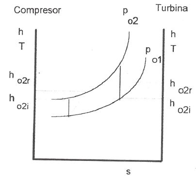

Análisis de turbinas, compresores, difusores y toberas
======================================================

Vamos ahora a analizar una serie de dispositivos que suponemos funcionan en régimen estacionario y que sólo tienen una corriente de entrada y otra de salida. Para ellos será de aplicación la ecuación (4.11):

.. math::

   q+w_x = h_{ts}-h_{te}

Suponiendo despreciable la variación de energía potencial gravitatoria y la interacción con otros campos de fuerzas, la entalpia total coincide con la entalpia de remanso, :math:`h_t = h_o`, pudiéndose escribir la última ecuación en la forma:

.. math::

   q + w_x = h_{0s} - h_{oe}

Turbina
-------

Una turbina es un dispositivo para obtener trabajo de una corriente fluida. En ella el paso del fluido es tan rápido y el área efectiva para la transferencia de calor es tan pequeña que, en primera aproximación, podemos suponer que la turbina es un dispositivo adiabática, esto es, en ella q = 0, por lo que, de (4.31), el balance energético para una turbina se reduce a:

.. math::

   w_x = {h_o}_s - {h_o}_e

Si suponemos, además, que la variación de velocidad es despreciable, la ecuación anterior queda:

.. math::

   w_x = h_s - h_e

Compresor
---------

Un compresor es un dispositivo que se utiliza para incrementar la presión de un fluido. En este dispositivo se entraga trabajo al fluido y se produce un incremento de presión en el mismo. Si suponemos transformación adiabática y en régimen estacionario, al igual que en la turbina, podremos escribir:

.. math::

   w_x = {h_o}_s - {h_o}_e

y si :math:`\boldsymbol{\nu}_s \approx \boldsymbol{\nu}_e`:

.. math::

   w_x = h_s - h_e

Difusor y Tobera
----------------

Los difusores y toberas son elementos sin partes móviles utilizados en las instalaciones que funcionan con fluidos y en las que se quiere o bien incrementar la presión a expensas, fundamentalmente, de la energía cinética (compresión dinámica), difusor, o bien incrementar la velocidad expansionando el fluido (expansión dinámica), tobera.

En ambos casos, tanto :math:`q` como :math:`w_x` son nulos, por lo que:

.. math::

   {h_o}_s - {h_o}_e \rightarrow h_s + \frac{\nu^2_s}{2} = h_e + \frac{\nu^2_e}{2} 

Si la sustancia de trabajo es un gas perfecto, como h — u + pv, sustituyendo en (4.34):

.. math::

   \Delta e_c &= u_1 + (pv)_1 - u_2 - (pv)_2 \\
              &= c_v (T-1 - T_2) - R(T_1-T_2) = c_p (T_1 - T_2)
   
   
En esta última ecuación vemos que, en estos dispositivos; la contribución de la energía interna al cambio de energía cinética es prácticamente el doble que la contribución correspondiente al trabajo de flujo.

Rendimiento adiabático de estos dispositivos
--------------------------------------------

Podemos decir que el rendimiento de una instalación, de una máquina y en general de cualquier dispositivo no es otra cosa que una comparación entre la actuación real de ese dispositivo bajo ciertas condiciones y la actuación que tendría lugar en un proceso ideal. En esta condición de idealidad es donde interviene la segunda ley, ya que lo que vamos a tomar como referencia de idealidad es el comportamiento isoentrópico del dispositivo. Así, cuanto más se acerque la instalación al comportamiento reversible más se acerca el rendimiento al valor unidad.

   Esquema de la evolución del fluido en un compresor y en una turbina.
   
En la figura 4.4 representamos en un diagrama T—s la evolución tanto de un compresor como de una turbina. A partir de ese diagrama queda claro que los rendimientos de un compresor y de una turbina se definen como:

.. math::

   \eta_c &= \frac{w_{is}}{w_{real}} &= \frac{{h_o}_{2is}-h_{o1}}{h_{o2r}-h_{o1}} \\
   \eta_t &= \frac{w_{real}}{w_{is}} &= \frac{{h_o}_{2r}-h_{o1}}{h_{o2is}-h_{o1}}

Para un tobera, definimos el rendimiento adiabático como el cociente entre la energía cinética real de la corriente de salida y la energía cinética que tendría esa corriente si el proceso en la tobera fuese isoentrópico. Esto es:

.. math::

   \eta_T = \frac{ \frac{\nu^2}{2} \bracevert_{2r} }{ \frac{\nu^2}{2} \vert_{2s} }

Este rendimiento lo ponemos en función de las entalpias de remanso a la entrada de la tobera y de la entalpia estática a la salida sin más que despejar de (4.34) los términos de energía cinética a la salida quedándonos:

.. math::

   \eta_T = \frac{ {h_o}_1 - h_2}{ {h_o}_1 -{h_2}_s}

El rendimiento adiabático de un difusor lo definimos en la forma:

.. math::

   \eta_D = \frac{ {h_o}_{2'} - h_1}{ {h_o}_{2r} -h_1}

siendo (2') el estado que se alcanzaría si llevásemos el fluido, isoentrópicamente, desde las condiciones de presión y temperatura de entrada hasta alcanzar la presión de remanso de salida.
