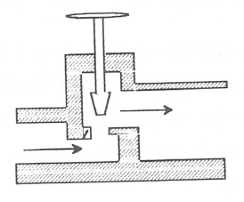

Dispositivos de estrangulación
==============================

Sistemas de flujo estacionario tales como una turbina Ó'una tobera producen, como hemos dicho, trabajo o un incremento de la energía cinética cuando el fluido pasa a través de ellos. Concomitante con estos efectos hay una caída de presión. Esta caída de presión debe controlarse en las instalaciones y el control se consigue insertando en el sistema de flujo otra componente denominada artificio de estrangulación. El proceso de estrangulación se utiliza para fines distintos de los meramente de control. El efecto principal conseguido es una caída significativa de presión sin interacción de trabajo ni variación apreciable de las energías cinética o potencial. El flujo a través de restricciones tales como una válvula o un tapón poroso, cumplen por completo las condiciones requeridas para este tipo de proceso. En la figura 4.5 se muestra una válvula de estrangulación.

   Esquema de una válvula.

Aunque la velocidad puede ser muy alta en la región de la restricción, medidas realizadas corriente-arriba y corriente-abajo de la restricción real indican que el cambio en la velocidad, y por tanto en energía cinética, a través de la válvula es muy pequeño. Como el volumen de control es rígido y no hay presente ningún eje giratorio, no hay implicada ninguna interacción trabajo

Así pues, con las consideraciones anteriores, el balance energético para el flujo estacionario a través de una válvula de estrangulación queda reducido a:

.. math::

   q = h_2 - h_1

Sin embargo, en la mayoría de las aplicaciones, o el dispositivo de estrangulación está asilado o la transferencia de calor es despreciable, por lo que para este proceso el cambio de entalpia es nulo; esto es:

.. math::

   h_2 = h_1

Esto no quiere decir que la entalpia sea constante durante el proceso, sino que la entalpia del flujo en la sección de entrada y en la sección de salida son las mismas. Como ejemplos de sistemas sencillos que utilizan este efecto podrían citarse un grifo de agua, una válvula de expansión de un figorífico, etc. En todos estos dispositivos tiene lugar un efecto de estrangulación o *expansión de Joule-Thomson*.
