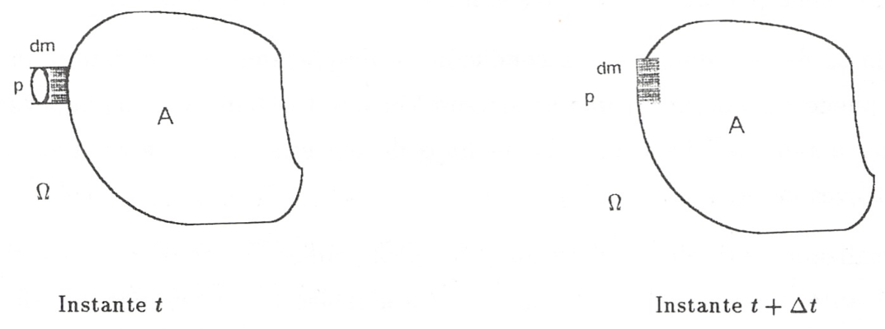
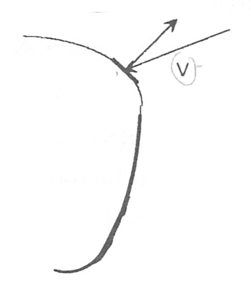

Primer principio para sistemas abiertos
=======================================

Formulación
-----------

El primer principio aplicado a sistemas abiertos (esto es, a un volumen de control) será:

.. math::

   E_2 - E_1 = Q + W_x + \sum_k \int {h_t}_k dm_k

es decir, el incremento de energía en ese volumen de control se debe a:

* el calor aplicado sobre él
* el trabajo en el eje aplicado sobre él
* la suma de las entalpías totales específicas de la materia que entra y la resta de las entalpías totales específicas de la materia que sale

La entalpía total se define como:

.. math::

   h_t = e + pv = u+\frac{\nu^2}{2}+gz + pv
   
esto es, tiene en cuenta toda la energía que tiene ese fluido:

* energía 

  * energía interna (debido a su temperatura)
  * energía cinética (debido a su velocidad)
  * energía potencial (debido a la presencia de un campo gravitatorio)
  
* trabajo al atravesar la superficie

.. warning::

    La formulación del primer principio aplicable a sistemas cerrados:

    .. math::

       dE = \delta Q + \delta W

    **sólo es aplicable a sistemas cerrados** (no puede aplicarse a volúmenes de control o sistemas abiertos).
    
    Tampoco es aplicable a estos sistemas la primera ley en la siguiente forma (aplicable a sistemas cíclicos):

    .. math::

       \oint \delta Q = - \oint \delta W

Demostración
------------

Consideremos un sistema A (esquematizado en la siguiente figura) definido por una frontera perfectamente determinada :math:`\Omega` y un elemento diferencial de masa adyacente :math:`dm`.

   
   Masa de control elegida para aplicar el primer principio a sistemas abiertos.

Si :math:`dm` puede pasar a través de :math:`\Omega` al interior del volumen de control y es :math:`p` la presión que el medio exterior ejerce sobre ella mientras cruza la frontera, la interacción trabajo será igual a:

.. math::

   \delta W = -p dV_{sis}

en la que :math:`dV_{sis}`, tomando como sistema el conjunto masa contenida inicialmente en :math:`\Omega` más :math:`dm`, será igual a:

.. math:: 

   dV_{sis} = V_{sis(t+\Delta t)} - V_{sis(t)}

Ahora bien:

.. math::

   V_{sis(t)} &= V_{\Omega} - V_{dm} \\
   V_{sis(t+\Delta t)} &= V_{\Omega} 
   
pues el proceso de introducir la masa dentro :math:`\Omega` ha finalizado, por lo tanto :math:`dV_{sis}` queda:

.. math::

   dV_{sis} = V_{\Omega} - (V_{\Omega} + V_{dm}) = -V_{dm}

Si el volumen específico de la sustancia al alcanzar la superficie de entrada es :math:`v`, como la masa es :math:`dm`, tendremos :math:`V_{dm}=v dm` y :math:`dV_{sis} = -vdm`. Sustituyendo en la expresión del trabajo:

.. math::

   \delta W = -p (-vdm) = pvdm

Si designamos por :math:`E_1` y :math:`E_1  + dE` a las energías de la materia en el interior de :math:`\Omega` en los instantes :math:`t` y :math:`t +\Delta t` respectivamente, :math:`(e dm)` es la energía de la masa :math:`dm` en la frontera y durante el proceso hay una interacción térmica, entonces para el sistema cerrado elegido, tendremos:

.. math::

   (E_1 + dE) — (E_1+edm) = \delta Q + pv dm
   
   
Si además consideramos que durante el proceso hay una interacción trabajo, por variación de la frontera :math:`\Omega`, o por rotación de un eje (éste será el caso más frecuente) representemos por :math:`\delta W_x` (trabajo al eje) esta interacción, entonces podremos reescribir la ecuación anterior en la forma:

.. math::

   dE = \delta Q + (e + pv) dm + \delta W_x

donde :math:`dE` representa la variación de energía en el interior de :math:`\Omega`.

A la magnitud :math:`e + pv` se la denomina entalpía total, :math:`h_t`, y si despreciamos todo tipo de acción, menos la presencia del campo gravitatorio, recordarán que:

.. math::

   e = u+\frac{\nu^2}{2} + gz

.. note::

   Volumen específico: :math:`v`
   
   Velocidad: :math:`\nu`

.. note::

   Entalpía: :math:`h = u+pv`
   
   Entalpía total: :math:`h_t=e+pv`

por lo que:

.. math::

   dE &= \delta Q + \delta W_x + \left(h+\frac{v^2}{2} +gz\right) dm \\
      &= \delta Q + \delta W_x + h_t dm
      
Para la transferencia de una masa finita a través de :math:`\Omega`, los términos de la ecución (4.5) pueden ser sumados para todos los elementos en los que puede considerarse descompuesta la masa finita. Si un elemento de masa pasa a través de :math:`\Omega` hacia afuera, entonces :math:`dm` es negativo y :math:`h_t` es su entalpia por unidad de masa cuando emerge (es decir sobre la frontera :math:`\Omega`). Así:

.. math::

   E_2 - E_1 = Q + W_x + \sum_k \int h_{tk} dm_k
   

Un **ejemplo simple** al que puede aplicarse la ecuación anterior es al flujo adiabático de un gas desde una línea de alimentación a un depósito a presión más baja (llenado de botellas de gas). Cuando la presión se incrementa en la botella, el incremento de la energía interna del contenido de la botella es igual a la masa del fluido que entra por su entalpia total a la entrada.

Flujo másico por un elemento de área
------------------------------------

Para el volumen de control (:math:`\Omega`)de la siguiente figura: 

   
   Flujo másico a través de un elemento de área
   
   
podemos expresar la velocidad a la que gana masa el interior de :math:`\Omega` en función de:

.. math::

   \boldsymbol{a_k} &= \boldsymbol{n} \cdot a_k = \text{ vectores área de la superficie de entrada} \\
   \boldsymbol{\nu_k} &= \text{ vector velocidad} \\
   \rho_k &= \text{ vector densidad }
   
en los puntos donde el fluido cruza la superficie

.. note::

   Los vectores área son paralelos al vector normal en la superficie.

Consecuentemente, el flujo másico que entra/sale del volumen de control, se calcula mediante:  

.. math::

   \dot{m}_\Omega = -\sum_k \boldsymbol{\nu_k} \cdot \boldsymbol{n} a_k \rho_k

.. note::

   El signo negativo viene porque consideramos flujo másico positivo al que entra en el volumen de control; la velocidad, por tanto, tiene sentido opuesto al vector normal cuando el flujo másico es positivo.

en la que :math:`\dot{m}` representa la velocidad a la que el volumen limitado por :math:`\Omega` gana masa, :math:`\textbf{n}` es un vector unitario normal al área de la superficie :math:`a_k` en la que la velocidad es :math:`\boldsymbol{V_k}` y :math:`\rho_k` es la densidad del fluido en :math:`a_k`.

Por unidad de tiempo
--------------------

Si referimos a la unidad de tiempo el primer principio aplicado aplicado a sistemas abiertos:

.. math::

   \frac{dE}{dt} = \dot{Q} + \dot{W}_x + h_t \dot{m}
   
en la que:

- :math:`\dot{m}` representa la velocidad de flujo másico en el volumen de control para una corriente simple que cruza la superficie de control
- :math:`\dot{Q}`  la velocidad a la que se suministra calor
- :math:`\dot{W_x}` la potencia mecánica suministrada al eje que cruza la frontera.	

Si en vez de ser una sola corriente, consideramos varias tendremos:

.. math::

   \frac{dE}{dt} = \dot{Q} + \dot{W}_x + \sum_e \left( h_t \dot{m} \right)_e - \sum_s \left( h_t \dot{m} \right)_s

Cuando sólo hay una corriente de entrada y una de salida y los flujos másicos son iguales, la ecuación anterior toma la forma:

.. math::

   \frac{ dE}{dt} = \dot{Q} +\dot{W_x} + ({h_t}_e - {h_t}_s) \dot{m}
   
Otra forma más general de expresar la ecuación anterior sería:

.. math::

   \int_V \frac{\partial(\rho e)}{\partial t} dV = -\int_{\Omega} \boldsymbol{q} \cdot \boldsymbol{n} da + \dot{W_x} - \int_{\Omega} \rho h_t \boldsymbol{\nu} \cdot \boldsymbol{n} da

en donde:

- :math:`\boldsymbol{q}`: vector flujo de calor
- :math:`\boldsymbol{\nu}`: vector velocidad 
- :math:`\boldsymbol{n}`: vector unitario normal a la superficie del volumen de control y dirigido hacia el exterior de éste

.. warning::

   Vemos que, para volúmenes de control que experimenten transformaciones cíclicas, no es posible aplicar la ecuación del primer principio en la forma:

   .. math::

      \oint \delta Q = - \oint \delta W

   pues quedarían sin considerar los términos correspondientes al flujo músico. 
   

.. note::

   La formulación obtenida para sistemas abiertos (volúmenes de control) sí es aplicable a sistemas cerrados (masas de control). Basta con considerar nulos los correspondientes flujos másicos.

Proceso de flujo estacionario
^^^^^^^^^^^^^^^^^^^^^^^^^^^^

Un caso especial, y que es el que más frecuentemente se considera, es flujo estacionario. Por este nombre entendemos que el estado del fluido en cualquier punto dentro del volumen de control es el mismo a lo largo del tiempo, aunque, como ya se ha dicho, el estado del fluido cambia de una a otra sección del volumen de control. El estado de un sistema abierto para el que esta suposición se cumple se denomina **estado estacionario**.

La condición de estado estacionario requiere que *dE* sea cero, por lo que las ecuaciones anteriores se simplifican. Podemos expresar:

.. math::

   Q+W_x+\sum_k \int h_{tk} dm_k = 0

Si sólo hay una corriente de entrada y otra de salida:

.. math::

   q = h_{ts}-h_{te} -w_x
   
donde :math:`q` y :math:`w_x` representan el calor específico (por unidad de masa) y el trabajo específico suministrados a través de las fronteras impermeables del sistema.

Variaciones periódicas en el estado dentro de :math:`\Omega` se pueden explicar también mediante las ecuaciones (4.10) y (4.11). Si los estados del fluido en todos los puntos dentro del volumen de control, periódica y simultáneamente, se hacen idénticos a estados previamente existentes en aquellos puntos, entonces estas ecuaciones también son aplicables sobre un conjunto de períodos completos. Así, **estas ecuaciones se aplican tanto a una turbina como a un motor alternativo**.

Para el flujo estacionario la siguiente ecuación:

.. math::

   \dot{m}_\Omega = -\sum_k \boldsymbol{\nu_k} \cdot \boldsymbol{n} a_k \rho_k

se reduce a:

.. math::

   \sum_k \boldsymbol{\nu_k} \cdot \boldsymbol{n} a_k \rho_k = 0
   
Cuando sólo hay una corriente de entrada y otra de salida con velocidad constante en cada sección normal al área tendremos:

.. math::
  
   \nu_1 a_1 \rho_1 = \nu_2 a_2 \rho_2 = \dot{m}
   

en la que :math:`\dot{m}` es el gasto a través de una sección del sistema y los subíndices 1 y 2 se refieren a cualquier sección normal a la dirección del flujo.

Trabajo mecánico en flujo estacionario
^^^^^^^^^^^^^^^^^^^^^^^^^^^^^^^^^^^^^

En el tema 2 vimos que el máximo trabajo mecánico realizado por un sistema cerrado cuando se desplaza su frontera, en ausencia de otros efectos, viene dado por:

.. math::

   \partial W = -p dV

Esto permite evaluar tales interacciones trabajo, independientemente del conocimiento de la interacción calor y de los cambios en la energía del sistema, que también tengan lugar en el proceso. Sería útil tener una expresión análoga para el máximo trabajo al eje realizado por un sistema durante un proceso de flujo estacionario. En el mejor de los casos, la ecuación resultante debería incluir variables independientes que sean características del sistema y conduzcan ellas mismas a la evaluación del trabajo.

Hay dos métodos de análisis que conducen a una forma deseable de la ecuación para el trabajo mecánico en régimen estacionario durante un proceso sin fricción. El más corto de éstos implica la aplicación de un balance de energía como sistema cerrado y un balance de energía como sistema abierto sobre una cantidad diferencial de masa que pasa a través del sistema en régimen estacionario. El segundo método está basado en un balance de las fuerzas que actúan sobre un elemento de fluido dentro del sistema en flujo estacionario. A continuación analizamos el primero de estos métodos.

Consideremos un observador situado en el exterior de un sistema de flujo estacionario que realiza el balance de energía en un volumen de control, arbitrariamente elegido, en tanto la masa va desde la entrada a la salida.

De acuerdo con la ecuación (4.11), el balance de energía en un sistema en régimen_esta-cionario. sobre el volumen de control por unidad de masa que atraviesa un elemento diferencial de volumen de control, está dada por:

.. math::

   \partial q + \partial w_x = du + d(pv) + d(e_c) + d(e_p)

si despreciamos otras formas de energía. (Esto no restringe el resultado final, como ya veremos). Podemos considerar otro punto de vista igualmente válido. Supongamos que otro observador viaja sobre el elemento de masa a través del sistema en flujo estacionario desde la entrada a la salida. En este caso el sistema será la unidad de masa de control, y no el volumen de control, por lo que es válido un análisis como sistema cerrado. Si un elemento de masa experimenta un
cambio sin fricción, el balance de energía sobre la unidad de masa está dado por:

.. math::

   \partial q - pdv = du
   
De nuevo se desprecian otras formas de energía, así como otras formas de trabajo. Los cambios en las energías cinética y potencial no son notados por el observador que viaja con el sistema. En ambas ecuaciones, (4.13) y (4.14), :math:`\delta q` representa la interacción calor entre el medio ambiente y el sistema (unidad de masa) cuando éste pasa a través del dispositivo en flujo estacionario. Eliminando 6qe ntre (4.13) y (4.14) y despejendo 6wx obtenemos:

.. math::
   
   \partial w_x &= d(pv) + d(e_c) + d(e_p) - pdv \\
    &= vdp + d(e_c)+ d(e_p)

Para un dispositivo con flujo estacionario, el trabajo mecánico sin fricción sobre la base de la unidad de masa se convierte en:

.. math::

   w_x = \int vdp + \Delta e_c + \Delta e_p

El alumno debe distinguir cuidadosamente entre la ecuación del trabajo para sistemas cerrados y para sistemas en flujo estacionario. La confusión nace, frecuentemente, de la semejanza entre Jpdv y J vdp. Si los cambios en energía potencial y cinética son despreciables, la ecuación

.. math::

   w_x = \int v dp

Trazando el proceso sobre un diagrama p v, se puede distinguir fácilmente entre aquellas dos expresiones de trabajo en función de las áreas sobre el diagrama.
