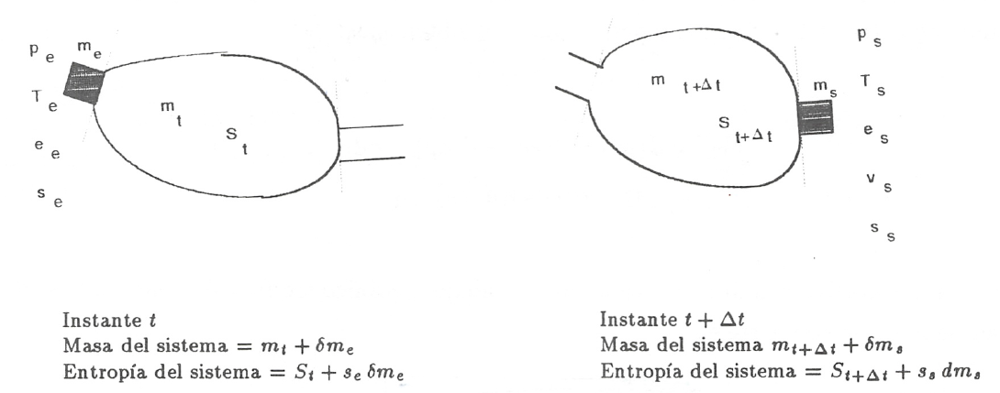

Ecuación del segundo principio para sistemas abiertos
=====================================================

De manera análoga a como anteriormente hemos procedido con el primer principio de la termodinámica, en esta sección haremos una deducción de la aplicación del segundo principio de la temodinámica a sistemas abiertos.

De acuerdo con (3.18), la variación de entropía de un sistema cerrado que experimenta una evolución elemental vendrá dada por:

.. math::

   dS = \frac{\partial Q}{T} + \partial \sigma

y para un proceso finito:

.. math::

   S_2-S_1 = \frac{Q_{12}}{T} + \sigma_{12}

A continuación procederemos a deducir la aplicabilidad de esta ecuación a un sistema abierto, para lo que seguiremos un método análogo al utilizado en la deducción de la ecuación del primer principio para este tipo de sistemas.

   Esquema para la deducción de la ecuación del segundo principio aplicada a un sistema abierto.

En el instante :math:`t` nuestro sistema está integrado por la masa contenida en el volumen de control, delimitado por la línea a trazos, :math:`m_t`, y la contenida en el volumen rayado, :math:`\partial m_e`.

Transcurrido el intervalo de tiempo :math:`\Delta t`, durante el que la masa :math:`\partial m_e` se ha introducido ya en el volumen de control y de él ha salido la masa :math:`\partial m_s` el sistema a considerar (instante :math:`t+\Delta t`) es el constituido por la masa en el interior del volumen de control y :math:`\partial m_s`.

Durante el intervalo de tiempo considerado se supone que se produce una interacción con el medio ambiente en la que se transfieren al volumen de control una cierta cantidad de calor :math:`\partial Q_i` y un trabajo :math:`\partial W_x`.

Como se indica en la figura 4.3, :math:`S_t` y :math:`S_{t+\Delta t}` son los valores de la entropía de la masa del volumen de control en los instantes :math:`t` y :math:`t+\Delta t` respectivamente. Si es :math:`S_1` la entropía del sistema en el instante :math:`t` y :math:`S_2` la del sistema en el instante :math:`t+\Delta t`, tendremos:

.. math::

   S_1 &= S_t + s_e \partial m_e\\
   S_2 &= S_{t+\Delta t}+ s_s \partial m_s

Así pues, llevando estas expresiones a (4.17) obtendremos:

.. math::

   S_{t+\Delta t} - S_t+s_s \partial m_s -s_e \partial m_e = \frac{\partial Q_i}{T_i} + \partial \sigma_{VC}

En el caso que estamos considerando, hemos de tener claro que :math:`\partial Q_i` y :math:`T_i`son, respectivamente, los valores de la cantidad de calor que a través de las fronteras impermeables recibe el sistema y la temperatura de la frontera del sistema por donde se produce la transferencia de calor. Si esta transferencia de calor tiene lugar en más de un punto de la frontera habrá que considerar el sumatorio correspondiente.

Considerando el cambio por unidad de tiempo, tendremos:

.. math::
 
   \frac{\partial \sigma_{VC}}{\Delta t} = \frac{S_{t+\Delta t}-S_t}{\Delta t} + s_s \frac{\partial m_s}{\Delta t} - s_e \frac{\partial m_e}{\Delta t} - \sum_i \frac{\frac{\partial Q_i}{\Delta t}}{T_i}
  
En el límite :math:`\Delta t \rightarrow 0` y suponiendo múltiples entradas y salidas:

.. math::

   \dot{\sigma}_{VC} = \sum_s s \dot{m}_s - \sum_s \dot{m}_e - \sum_i \frac{\dot{Q}_i}{T_i}

La ecuación (4.18) es la ecuación del segundo principio para sistemas abiertos en régimen no estacionario. El término de producción de entropía que aparece en ella recoge todas las irreversibilidades existentes en el interior del volumen de control.

Si consideramos un proceso estacionario, :math:`\dot{S}_{VC}=0`, y de (4.18) deducimos:

.. math::

   \dot{\sigma}_{VC} = \sum_s s \dot{m}_s - \sum_s \dot{m}_e - \sum_i \frac{\dot{Q}_i}{T_i}

y si además el proceso es reversible, :math:`\dot{\sigma}_{VC} = 0`,

.. math::

   \sum_i \frac{\dot{Q}_i}{T_i} = \sum_s s \dot{m}_s - \sum_s s \dot{m}_e

es decir, en un proceso estacionario y reversible, el flujo de entropía debido a la transferencia de calor en un sistema abierto es igual al flujo neto de entropía debido al flujo másico.

De (4.20) obtenemos que para un proceso que cumpla las condiciones anteriores y además sea adiabático:

.. math::

   \sum_s s \dot{m}_s = \sum_s s \dot{m}_e

y si sólo hubiese una corriente de entrada y una de salida:

.. math::

   s_s = s_e

Es decir, un proceso adiabático y reversible en un sistema abierto es isoentrópico.

A fin de encontrar la semejanza entre las ecuaciones deducidas de la aplicación de los principios primero y segundo, tanto a sistemas cerrados (masa de control) como a sistemas abiertos (volumen de control), expresemos la ecuación (4.18) en la forma:

.. math::

   \dot{S}_{VC} &= \frac{d}{dt} \left( m s \right)_{VC} \\
                &= \underbrace{\sum_i \frac{\dot{Q}_i}{T_i} + \sum_e s \dot{m}_e - \sum_s s \dot{m}_s}_{\text{(a)}} + \dot{\sigma}_{VC}

De nuevo nos encontramos con que la variación de entropía de un volumen de control está compuesta por términos de flujo, (a), y términos de producción, crvc. En este caso, a diferencia de lo encontrado para el sistema cerrado, el ambiente no sólo actúa como un conjunto de fuentes térmicas que proporciona una determinada cantidad de calor, sino que además proporciona un intercambio de materia al que podemos asociar el correspondiente flujo de entropía	m¡

Teniendo esto en cuenta podemos expresar la producción total de entropía., como en el caso de sistemas cerados, sin más que recordar que:

.. math::

   \Delta S_{univ} = \Delta S_{sis} + \Delta S_{MA} = \sigma_t

siendo, en este caso, AS,i, el incremento de entropía del volumen de control, ASvc e ASMA el incremento de entropía del medio ambiente. La ecuación anterior se puede escribir también:

.. math::

   \dot{S}_{univ} = \dot{S}_{VC} + \dot{S}_{MA} = \dot{\sigma}_t

La expresión para Svc es la (4.22). Para calcular la variación de entropía del medio ambiente, SMA, hemos de tener en cuenta que éste podemos modelizarlo mediante un conjunto de fuentes térmicas, más las fuentes y sumideros de materia. En todo caso, el calor QFi que la fuente intercambia con el sistema será igual pero de signo contrario a Qi que como vimos es el calor desde el punto de vista del sistema, ya que el calor cedido por la fuente es recibido por el sistema y viceversa. Algo análogo podríamos decir respecto a los términos m¡ es decir, lo que es positivo para el sistema es negativo para la fuente y a la inversa. Es importante resaltar que no siempre es inmediato la modelización de las correspondientes fuentes térmicas.

Por lo tanto tendremos:

.. math::

   \dot{S}_{MA} &= \sum_i  \frac{\dot{Q}_{Fi}}{T_{F_i}} + \sum_s s \dot{m}_s - \sum_e \dot{m}_e \\
                &= -\sum_i \frac{\dot{Q}_{Fi}}{T_{F_i}} + \sum_s s \dot{m}_s - \sum_e \dot{m}_e
 
Por lo tanto, sustituyendo en (4.23), (4.22) y (4.24.a) se obtiene:

.. math::

   \dot{S}_{univ} = \dot{\sigma}_{VC} + \sum_i \dot{Q}_i \left( \frac{1}{T_i} - \frac{1}{T_{Fi}} \right) = \dot{\sigma}_t

.. math::
 
   \dot{\sigma}_t = \dot{S}_{VC} + \sum_s s \dot{m}_s - \sum_e s \dot{m}_e - \sum_i \frac{\dot{Q}_i}{T_{Fi}}

Nos encontramos con que la producción de entropía en el proceso es debida a los fenómenos <)isipativos que se producen en el volumen de control, más la irreversibilidad producida por la diferencia finita de temperaturas entre las fuentes térmicas y las distintas secciones de la superficie en las que se produce la transferencia de caloré.
