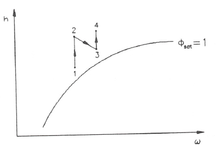

Acondicionamiento de aire
=========================

Por acondicionamiento de aire se entiende cualquier proceso o conjunto de procesos que actuando sobre el aire atmosférico lo hace más adecuado para su uso en una aplicación determinada que requiere unas condiciones predefinidas. Esas condiciones pueden ser necesarias para obtener un cierto bienestar fisiológico en personas, animales o plantas, preservar materiales almacenados, etc.

En general, las condiciones del aire que se obtiene en el proceso de acondicionamiento vendrán dadas por unos valores determinados de temperatura y humedad. Por tanto todos los sistemas y procesos que se utilizen en el acondicionamiento irán dirigidos a obtener esas condiciones.

En esta sección es estudian algunos procesos típicos de acondicionamiento de aire haciendo uso de las propiedades del aire húmedo, así como de los diagramas de Mollier y del diagrama psicrométrico desarrollados anteriormente. Conviene señalar que los valores de las propiedades termodinámicas del agua y del aire seco pueden tomarse de las correspondientes tablas de propiedades termodinámicas de las respectivas sustancias.

Como se ha citado anteriormente, en un sistema de acondicionamiento, dependiendo de las condiciones del aire atmosférico, se tendrán que utilizar de forma conjunta diversos procesos que den como resultado las condiciones deseadas. En general los procesos utilizados en acondicionamiento de aire son: deshumidificación, humidificación, calentamiento y enfriamiento, y mezcla adiabática de corrientes de aire húmedo. Dichos procesos se estudian de forma individualizada, para dar finalmente algunas ideas sencillas de como agruparlos para conseguir el fin requerido.

Introducción a los procesos con aire húmedo
-------------------------------------------

Antes de proceder al estudio de los procesos elementales para el acondicionamiento de aire citados anteriormente, conviene describir un gráfico adicional que aparece en algunos diagramas psicrométricos, así como la escala que aparece en el diagrama de Mollier y que proporcionan el valor de la relación entre las diferencias de entalpia y diferencias de humedad entre dos estados.

1.	El gráfico que aparece en el diagrama psicrométrico (fig.6) proporciona la relación entre las diferencias de entalpia y diferencias de humedad entre los estados inicial y final de cualquier proceso. Es decir

.. math::

   q' = \frac{\text{variación de entalpía}}{\text{variación de humedad}} = \frac{h_2 - h_1}{\omega_2 - \omega_2} = \frac{\Delta h}{\Delta \omega}

Es útil para determinar dichos estados (inicial o final), o el calor transferido en el proceso, como se verá posteriormente con algún ejemplo.

.. figure:: ./img/diag_psicrometrico.png

   Diagrama psicrométrico

   
Para ver que es lo que exactamente representa, supongamos que tenemos un cierto sistema (fig.7) en el que entra una corriente de aire en unas condiciones 1 y sale en unas condiciones 2. A través de la frontera del sistema hay un cierto intercambio de calor y al sistema se le añade o quita una cierta cantidad de agua.
Fig. 7

.. figure:: ./img/acondicionamiento_fig7.png

Aplicando al sistema el principio de conservación de la masa y de conservación de la energía (sistema abierto en régimen estacionario) se obtiene:

a)	Conservación de la masa:

    * para el aire seco
    
    .. math::
    
       \dot{m}_{a_1} = \dot{m}_{a_2} = \dot{m}_a

    * para el agua
    
    .. math::
       
       \dot{m}_{v_1} + \sum_e \dot{m}_{w_e} = \dot{m}_{v_2} + \sum_s \dot{m}_{w_s}

b)	Conservación de la energía (suponiendo que las variaciones de las energías potencial son despreciables):

.. math::

   \dot{Q} = \dot{m}_{a_2} h_{a_2} + \dot{m}_{v_2} h_{v_2} + \sum_s (\dot{m}_w h_w)_s - \dot{m}_{a_1} h_{a_1} - \dot{m}_{v_1} h_{v_1} - \sum_e (\dot{m}_w h_w)_e
   

Teniendo en cuenta que

.. math::

   \dot{m}_{v_1} = \omega_1 \dot{m}_{a_1} \\
   \dot{m}_{v_2} = \omega_2 \dot{m}_{a_2}

de la ecuación (10.46) se obtiene

.. math::

   \sum_e \dot{m}_{w_e} - \sum_s \dot{m}_{w_s} = \dot{m}_{a} (\omega_2 - \omega_1)

y de la ecuación (10.47) se obtiene

.. math::

   \dot{Q} =\dot{m}_{a} ( h_{a_2} - h_{a_1} ) + \dot{m}_{a} ( h_{v_2}\omega_2 - h_{v_1}\omega_1 ) + \sum_s (\dot{m}_w h_w)_s -  \sum_e (\dot{m}_w h_w)_e

Esta última ecuación se puede expresar como

.. math::

    \dot{Q}+\sum_s (\dot{m}_w h_w)_s -  \sum_e (\dot{m}_w h_w)_e = \dot{m}_{a} ( h_2 - h_1 ) 

y con el valor de ma obtenido en la ecuación (10.48)

.. math::

   \frac{ \dot{Q}+\sum_s (\dot{m}_w h_w)_s -  \sum_e (\dot{m}_w h_w)_e}{ \sum_e \dot{m}_{w_e} -  \sum_s \dot{m}_{w_s}} = \frac{ h_2 - h_1}{\omega_2 - \omega_1}

que es precisamente el valor :math:`q'` que da el diagrama psicrométrico, es decir

.. math::

   q'  = \frac{ h_2 - h_1}{\omega_2 - \omega_1} = \frac{\dot{Q}_{neto}}{\dot{m}_{w_{neto}}}

Por lo tanto, de lo anterior se concluye que dado, por ejemplo, el estado del aire húmedo a la entrada, todos los demás posibles estados del aire a la salida estarán sobre una recta cuya pendiente es :math:`q'` y que pasa por el punto dado por las condiciones a la entrada.

En el diagrama de Mollier aparece una escala que proporciona, igual que en el caso anterior, el valor de la relación entre las diferencias de entalpia y diferencias de humedad entre dos estados de un proceso (fig.8).

.. figure:: ./img/diag_mollier.png

2.	En el mismo gráfico que aparece en el diagrama psicrométrico, citado anteriormente, hay otra escala que proporciona el "Factor de calor sensible" (FCS) y que da el cambio de entalpia asociado con un cambio en la temperatura seca dividido entre el cambio de entalpia total. Para el proceso entre un estado 1 y un estado 2 (fig.9)

.. math::

   FCS = \frac{h_{2'} - h_1}{h_2 - h_1}
   
donde :math:`\theta_{2'} = \theta_2` y :math:`\omega_{2'} = \omega_1`.

Para ver el significado del FCS una manera más simple, volvamos al sistema introducido en el punto anterior. Si se supone que no se añade, ni se quita agua, del sistema (:math:`\dot{m}_{w_e} = \dot{m}_{w_s}`) resulta un proceso ficticio tal que a partir de la ecuación (10.49)

.. math::

   h_{2'} - h_1 = \frac{\dot{Q}}{\dot{m}_a}

mientras que en el proceso real :math:`h_2 - h_1` vendría dado por la ecuación (10.49) conservando todos los términos. Por tanto el factor FCS se puede definir como la relación entre el calor neto que se comunica al sistema y la energía total añadida al sistema (incluyendo la cantidad de energía que posee el agua añadida y que vendría dada por su entalpia), quedando

.. math::

   FCS = \frac{\dot{Q}}{\dot{Q} + \sum_e (\dot{m}_w h_w)_e - \sum_s (\dot{m}_w h_w)_s}

Deshumidificación
-----------------

El proceso mediante el cual se consigue disminuir la humedad de una mezcla de aire-vapor de agua se denomina deshumidificación.

Si una corriente de aire húmedo se enfría a presión constante hasta alcanzar una temperatura menor que su temperatura de rocío (:math:`\theta < \theta_R`), parte del vapor de agua se condensa, quedando aire húmedo saturado.

Como el aire que se obtiene está a una temperatura menor que la del aire antes de la deshumidificación, y en general se requiere utilizar el aire a una temperatura parecida a la de la corriente inicial, se suele proceder posteriormente a calentar dicha corriente hasta alcanzar la temperatura deseada, proceso que se estudiará posteriormente (calentamiento).

La instalación, como se muestra en la fig.10, constará de un cambiador de calor (por el que circulará un fluido refrigerante) con el que se enfría la corriente de aire.

En las fig.ll y 12 se representa el proceso, seguido por el aire, en el diagrama de Mollier y en el diagrama psicrométrico, respectivamente, mientras que en la fig.13 se representa el proceso seguido por el agua en un diagrama (T-s).

En un proceso real hay que hacer notar que:

a)	El aire no se enfría todo a la misma temperatura, ya que el aire que pasa cerca de la superficie del refrigerador estará a menor temperatura que el aire que pasa a una cierta distancia.
b)	El agua que se condensa no lo hace todo a la misma temperatura. La razón de esto, es que cuando la mezcla alcanza la temperatura de rocío (:math:`\theta_R`) de las condiciones iniciales, parte se condensa a esa temperatura. La mezcla continua posteriormente condensándose y variando su temperatura desde :math:`\theta_R` a :math:`\theta_2` (fig.12)

Lo anterior nos lleva a establecer dos hipótesis simplificadoras antes de proceder a realizar el análisis del proceso:

a) Todo el aire húmedo se enfría a la misma temperatura antes de dejar el sistema.
b) Todo el líquido condensado se enfría a la temperatura de salida del aire húmedo antes de salir del sistema, es decir,

.. math::

   \theta_l =  \theta_2
   
El error introducido con esta hipótesis es pequeño debido a que la entalpia del agua líquida es pequeña frente a la entalpia de la corriente de aire.

Para el proceso, en régimen estacionario, se tienen las siguientes ecuaciones:

a)	Conservación de la masa:

    * para el aire seco
    
    .. math::
    
       \dot{m}_{a_1} =\dot{m}_{a_2}  = \dot{m}_a

    * para el agua
    
    .. math::
    
       \dot{m}_{v_1} =\dot{m}_l  + \dot{m}_{v_2}

b)	Conservación de la energía (suponiendo que las variaciones de las energías cinética y potencial son despreciables):

.. math::

   \dot{Q} = \dot{m}_{a_2} \dot{h}_{a_2} + \dot{m}_{v_2} \dot{h}_{v_2} + \dot{m}_l \dot{h}_l - \dot{m}_{a_1} \dot{h}_{a_1} - \dot{m}_{v_1} \dot{h}_{v_1}

Teniendo que cuenta que

.. math::

   \dot{m}_{v_1} = \omega_1 \dot{m}_{a_1}  \\
   \dot{m}_{v_2} = \omega_2 \dot{m}_{a_2}  
   
y con la ecuación (10.51) se obtiene

.. math::

    \dot{m}_l = \dot{m}_a (\omega_2 - \omega_1) 

y la ecuación (10.52) se reduce a

.. math::

   \dot{Q} = \dot{m}_a (\dot{h}_{a_2} - \dot{h}_{a_1} ) + \dot{m}_l \dot{h}_l + \dot{m}_a (\dot{h}_{v_2} \omega_2 - \dot{h}_{a_1} \omega_1 )

que se puede expresar como

.. math::
   
   \dot{Q} = \dot{m}_a (\dot{h}_2 - \dot{h}_1  )+ \dot{m}_a (\omega_2 - \omega_1) h_l
   

El último término de esta expresión representa la cantidad de energía extraída del sistema, debida a la condensación del agua. En general, este término, comparado con el primero se puede despreciar en muchos cálculos.

Ejercicio 10.1
^^^^^^^^^^^^^^

Para cierto proceso se necesita tener aire saturado con una humedad de :math:`0.007\frac{kg}{kg}`. Se utiliza :math:`0.5\frac{kg}{s}` de aire atmosférico a 25°C y con una humedad relativa del 60%.

Calcular la cantidad de calor que se necesita extraer del aire para obtener las condiciones deseadas.

La presión atmosférica es 1 bar.

Solución
''''''''

El calor que hay que extraer se calcula a partir de la ecuación (10.53)

.. math::
   
   \dot{Q} = \dot{m}_a (\dot{h}_2 - \dot{h}_1  )+ \dot{m}_a (\omega_2 - \omega_1) h_l
   
Se necesita conocer el valor de :math:`\dot{m}_a`, y puesto que

.. math::

   \dot{m} = \dot{m}_a + \dot{m}_v = \dot{m}_a (1+\omega)
   
resulta que

.. math::

   \dot{m}_a = \frac{\dot{m}}{1+\omega_2} = \frac{0.5\frac{kg}{s}}{1+0.007\frac{kg}{kg}} = 0.4965\frac{kg}{s}
   

De la ecuación (10.6)

.. math::

   p_v = \phi_1 \cdot p^*(25°C) \\
   p_{v_1} = 0.6 \cdot 0.03169bar = 0.019014bar

y de la ecuación (10.4)

.. math::

   \omega_1 = 0.622 \frac{p_{v_1}}{p-p_{v_1}} \\
   \omega_1 = 0.622 \frac{0.019014}{1-0.019014} = 0.012\frac{kg}{kg}
   

También es preciso calcular :math:`\theta_2`. Como a la salida el aire está saturado, de la ecuación (10.4)

.. math::

   p_2^* = \frac{p \cdot \omega_2}{0.622 - \omega_2} = \frac{1 \cdot 0.007}{0.622-0.007} = 0.01138bar

Con este valor y la tabla de propiedades termodinámicas del agua en saturación

.. math::

   \theta_2 = 8.9°C

El valor de la entalpia es

.. math::

   h_2 &= c_{p_a} \theta_2 + \omega_2[ h_{l_v}(\theta_{ref}) + c_{p_v} \theta_2] = 1.005\cdot 8.9 + 0.007 [2501.4 +  1.82 \cdot 8.9] = 26.57\frac{kJ}{kg} \\
   h_1 &= c_{p_a} \theta_1 + \omega_1[ h_{l_v}(\theta_{ref}) + c_{p_v} \theta_1]  = 1.005 \cdot 25 + 0.012(2501.4 + 1.82\cdot25] = 55.69\frac{kJ}{kg} \\
   h_l &= c_l \theta_l = 4.18 \cdot 8.9 = 37.2 \frac{kJ}{kg}

De lo anterior se obtiene

.. math::

   \dot{Q} = 0.4965(26.57 - 55.69) + 0.4965(0.012 - 0.007) \cdot 37.2 \\
   \dot{Q} = -14.37 \frac{kJ}{s}

Humidificación
--------------

La humidificación es el proceso contrario al estudiado anteriormente, es decir, consiste en el aumento de humedad de una mezcla de aire-vapor de agua.

Para lograrlo se pueden utilizar varios i	2	procedimientos: inyectar vapor de agua o pul-
verizar agua líquida en la corriente de aire (fig-14).

Según se utilice uno u otro procedimiento la temperatura a la salida (:math:`\theta_2`) será mayor o menor que la temperatura a la entrada (:math:`\theta_1`), por lo que este proceso nos permite, según los casos, obtener un efecto simultáneo de calefacción o refrigeración (calentamiento o enfriamiento del aire tratado).

En el caso de inyectar vapor de agua a alta temperatura, la humedad y temperatura a la salida (:math:`\omega_2`, :math:`\theta_2`) aumentan, estando representado el proceso, en el diagrama de Mollier y en el diagrama psicrométrico, como se muestra en las fig.15 y 16 respectivamente.

.. figure:: ./img/acondicionamiento_fig16.png

Si por el contrario, lo que se hace es inyectar agua en estado líquido, la temperatura a la salida (:math:`\theta_2`) será menor que la temperatura a la entrada (:math:`\theta_1`), quedando el proceso representado en los diagramas de Mollier y psicrométrico como se muestra en las fig.17 y 18.

Las ecuaciones que gobiernan el proceso de humidificación son las siguientes:

a)	Conservación de la masa:

   * para el aire seco
   
   .. math::
    
      \dot{m}_{a_1} = \dot{m}_{a_2} = \dot{m}_a	

   * para el agua

   .. math::
    
      \dot{m}_{v_1} = \dot{m}_l = \dot{m}_{v_2}	

En este caso :math:`\dot{m}_l` puede representar el gasto de agua líquida o vapor aportado.

b)	Conservación de la energía en régimen estacionario (suponiendo que las variaciones de las energías cinética y potencial son despreciables):

.. math::

   0 = \dot{m}_{a_1} h_{a_1} +  \dot{m}_{v_1} h_{v_1}  \dot{m}_l h_l -  \dot{m}_{a_2} h_{a_2} -  \dot{m}_{v_2} h_{v_2}

También :math:`h_l` puede representar la entalpia del líquido o vapor aportado, según los casos.

Teniendo en cuenta las ecuaciones (10.54) y (10.55) y que

.. math::

   \dot{m}_{v_1} = \omega_1 \dot{m}_{a_1} \\
   \dot{m}_{v_2} = \omega_2 \dot{m}_{a_2}

la ecuación (10.56) se reduce a

.. math::

   \dot{m}_l h_l = \dot{m}_a ( h_{a_2}-h_{a_1}) + \dot{m}_a ( \omega_2 h_{v_2}- \omega_1h_{v_1})

o lo que es lo mismo

.. math::

   h_l = \frac{h_2 - h_1}{\omega_2- \omega_1}

Las ecuaciones (10.55) y (10.57) nos permiten, conocidas las condiciones del aire a la entrada y salida del sistema, determinar la cantidad y condiciones en las que es preciso introducir el agua o el vapor. Si por el contrario, se conoce la cantidad y condiciones en las que se introduce el agua y uno de los estados inicial o final, el otro se determinaría utilizando la ecuación de la energía (10.56) y la de conservación de la masa (10.54, 10.55) o de forma semigráfica a partir de la ecuación (10.57), teniendo en cuenta que

.. math::

   h_l = \frac{h_2 - h_1}{\omega_2- \omega_1} = q'
   
y utilizando el transportador del diagrama psicrométrico o del diagrama de Mollier. Para ello, conocida :math:`h_l`, y por tanto la pendiente de la recta que une el estado 1 y el estado 2, se traza dicha recta en el diagrama adjunto al psicrométrico y posteriormente una paralela a esta que pase por el punto 1 o 2 (el que esté determinado) en el diagrama psicrométrico, el otro punto estará situado sobre dicha recta y para determinarlo se necesita otra condición adicional.

Ejercicio 10.2
^^^^^^^^^^^^^^

Cierto día se alcanza una temperatura de 34°C , con una humedad relativa del 20%. Para acondicionar una vivienda se utiliza un sistema de humidificación adiabática.

Si a la salida se requiere tener una temperatura de 21°C, determinar de forma analítica y con el diagrama psicrométrico la cantidad de agua que hay que añadir al aire y la humedad relativa del mismo.

La presión atmosférica es de 1 bar y el agua se suministra a la temperatura de salida del aire.

Solución
''''''''

De la ecuación (10.6) se obtiene

.. math::

   p_v = \phi \cdot p^*

:math:`p^*` de las tablas de propiedades termodinámicas del agua en saturación a :math:`\theta = 34°C` es

.. math::

   p^*(34°C) = 0.05324bar
   p_v =  0.2 \cdot 0.05324 = 0.010648bar

De la ecuación (10.4)

.. math::

   \omega_1 = 0.622 \cdot \frac{p_v}{p-p_v} = 0.622\cdot \frac{0.010648}{1-0.010648} = 6.694 \cdot 10^{-3} \frac{kg}{kg}
   
De la ecuación (10.57)

.. math::

   h_2 - h_1 = (\omega_2- \omega_1)h_l

y con las ecuaciones (10.17) y (10.18)

.. math::

   \left[
   \begin{array}
   h = c_{p-1} \theta \omega [h_{lv}(\theta_{ref})+c_{p_v} \theta] \\
   h_l = c_l \theta + \frac{p-p_{ref}}{\rho_l}
   \end{array}
   \right. \\
   c_{p_a} \theta_2 + \omega_2 [h_{lv}(\theta_{ref})+c_{p_v} \theta_2]- c_{p_a} \theta_1 - \omega_1 [h_{lv}(\theta_{ref})+c_{p_v} \theta_1] = (\omega_2- \omega_1)c_l \theta_l \\
   \omega_2 = \frac{\omega_1 [h_{lv}(\theta_{ref})+c_{p_v} \theta_1] + c_{p_a} (\theta_2 - \theta_1)}{ [h_{lv}(\theta_{ref})+c_{p_v} \theta_1 - c_l \theta_l}\\
   \left[
   \begin{array}
   c_{p_v} = 1.82\frac{kJ}{kg \cdot K} \\
   c_{p_a} = 1.005\frac{kJ}{kg \cdot K}  \hspace{2cm} p^*(21°C) = 0.02487bar\\
   c_l = 4.18 \frac{kJ}{kg \cdot K}
   \end{array}
   \right. \\
   \omega_2 = \frac{29.6359}{2451.84} = 0.012087 \frac{kg}{kg}
    
De la ecuación (10.4) 

.. math::

   p_v = \frac{\omega \cdot p}{0.622+\omega}

y de la ecuación (10.6)

.. math::

   \phi = \frac{p_v}{p^*} \Rightarrow \phi_2 = \frac{\omega_2 p}{(0.622+\omega_2)p^*} = \frac{0.012087 \cdot 1}{(0.622+0.012087)\cdot 0.02487} = 0.7665 = 76.65% \\
   \frac{\dot{m}_l}{\dot{m}_a} = (\omega_2 - \omega_1) = 5.39\cdot 10^{-3}\frac{kg}{kg}

La resolución utilizando el diagrama psicrométrico se deja como ejercicio.

Ejercicio 10.3
^^^^^^^^^^^^^^

Para tratar una corriente de aire húmedo a una temperatura seca de 21°C y una temperatura húmeda de 8°C, se inyecta adiabáticamente vapor saturado a 110°C, hasta que su temperatura de rocío es 13°C.

El gasto músico de aire seco es de 90kg/min.

Determinar el gasto músico de vapor, en kg/h, necesario y la temperatura final del aire obtenido.

Se puede suponer que la presión total se mantiene constante en un valor de 1 bar. 

Solución
''''''''

A partir de la ecuación (10.55) se obtiene

.. math::

   \dot{m}_l = \dot{m}_{v_2}-\dot{m}_{v_1} = (\omega_2-\omega_1) \dot{m}_a

y por tanto es necesario calcular la humedad del aire a la entrada y salida del humidificador.

Para calcular :math:`\omega_1`, como conocemos la temperatura húmeda a la entrada y utilizando su definición, al aplicar el principio de conservación de la energía a ese proceso (1 — 2') se obtiene

.. math::

   h_1 + (\omega_{2'}-\omega_1) h_l = h_{2'} \\
   h_{a_1} + \omega_1 h_{v_1} + (\omega_{2'} - \omega_1) h_l =  h_{2'} +  \omega_{2'} h_{v2'} \\
   c_{p_a} \theta_1 + \omega_1 [h_{lv}(\theta_{ref})+c_{p_v} \theta_1] + (\omega_{2'}-\omega_1) c_l \theta_l  = c_{p_a} \theta_{2'} + \omega_{2'} [h_{lv}(\theta_{ref})+c_{p_v} \theta_{2'}] \\
   \omega_1 = \frac{c_{p_a} (\theta_{2'} - \theta_1) +\omega_{2'}[h_{lv}(\theta_{ref})+c_{p_v} \theta_{2'} - c_l \theta_l] }{h_{lv}(\theta_{ref})+c_{p_v} \theta_1 -c_l \theta_l}
   

obteniendo :math:`p^*` de las tablas de propiedades termodinámicas del agua en saturación (:math:`p^* = 0.01072bar`).

.. math::

   \omega_{2'} = 0.622 \frac{0.01072}{1 - 0.01072} = 6.74 \cdot 10^{-3} \frac{kg}{kg} \\
   \omega_1 = \frac{1.005(8-21) 6.47 \cdot 10^{-3}(2501.4+1.82\cdot 8 - 4.18 \cdot 8}{2501.4+1.82\cdot 21 -4.18 \cdot 8} \\
   \omega_1 = 1.46 \cdot 10^{-3} \frac{kg}{kg}

Paxa calcular la humedad a la salida (:math:`\omega_2`), a partir de la ecuación (10.4) y teniendo en cuenta que la presión de vapor a la salida es igual a la presión de vapor saturado a la temperatura de rocío (13°C), de las tablas de propiedades termodinámicas del agua en saturación :math:`p^*(13°C) = 0,01497bar` y por tanto :math:`p_v = 0.01497bar`, quedando

.. math::

   \omega_2 = 0.622 \frac{p_v}{p - p_v} = 0.622\frac{0.01497}{1-0.01497} = 9.45 \cdot 10^{-3} \frac{kg}{kg} \\
   \dot{m}_l = \dot{m}_a (\omega_2 - \omega_1) = 90 \cdot 60(9.45\cdot 10^{-3} - 1.46 \cdot 10^{-3}) = 43.15\frac{kg}{h}

Para calcular la temperatura a la salida, mediante la ecuación (10.57)

.. math::

   h_2 - h_1 = h_l (\omega_2 - \omega_1) \\
   c_{p_a} \theta_2 + \omega_2 [h_{lv}(\theta_{ref})+c_{p_v} \theta_2] - c_{p_a} \theta_1 - \omega_1 [h_{lv}(\theta_{ref})+c_{p_v} \theta_1] = [h_{lv}(\theta_{ref})+c_{p_v} \theta_l] (\omega_2 - \omega_1) \\
   \theta_2 = \frac{ [h_{lv}(\theta_{ref})+c_{p_v} \theta_l] (\omega_2 - \omega_1)  c_{p_a} \theta_1 + \omega_1 [h_{lv}(\theta_{ref})+c_{p_v} \theta_1] -  \omega_2 h_{lv}(\theta_{ref})} {    c_{p_a} +  \omega_2 c_{p_v}} \\
   \theta_2 &= \frac{(2501.4 + 1.82 \cdot 110)(9.45 -1.46) \cdot 10^{-3} + 1.005 \cdot 21}{1.005 + 9.45 \cdot 10^{-3}\cdot 1.82} + \\
   &+ \frac{1.46 \cdot 10^{-3}(2501.4+1.82 \cdot 21) - 9.45\cdot 10^{-3}\cdot 2501.4}{1.005+9.45\cdot 10^{-3}\cdot 1.82} \\
   \theta_2 = 22.27°C

Calentamiento y enfriamiento
----------------------------

El calentamiento y el enfriamiento son procesos muy sencillos, en los que su único fin es aumentar o disminuir la temperatura del arre húmedo sin variar su humedad. Para conseguir esto se hace pasar el aire húmedo por un cambiador de calor por el que circula un fluido caliente o un refrigerante según sea el caso. En la fig.19 se representa un esquema de la instalación y en las fig.20 y 21 se representa, en el diagrama de Mollier y en el diagrama psicrométrico, el proceso que tiene lugar.

Las ecuaciones que resuelven el problema son

a)	Conservación de la masa:

    * para el aire seco
    
    .. math::
    
       \dot{m}_{a_1} =\dot{m}_{a_2}  = \dot{m}_a
    
    * para el vapor de agua
    
    .. math::
    
       \dot{m}_{v_1} = \dot{m}_{v_2}

b)	Conservación de la energía (suponiendo que las variaciones de energía cinética y potencial son despreciables):

.. math::

   \dot{Q} = \dot{m}_{a_2} h_{a_2} + \dot{m}_{v_2} h_{v_2}  - \dot{m}_{a_1} h_{a_1}  - \dot{m}_{v_1} h_{v_1}

Teniendo en cuenta que

.. math::

   \dot{m}_{v_1} = \omega_1 \dot{m}_{a_1} \\
   \dot{m}_{v_2} = \omega_2 \dot{m}_{a_2}

de la ecuación (10.58) y (10.59) resulta que

.. math::

   \omega_1 = \omega_2

como se había indicado anteriormente. 

De la ecuación (10.60) se obtiene

.. math::

   \dot{Q} = \dot{m}_a (h_2 - h_1)

y por tanto el calor que es necesario comunicar o extraer es igual a la variación de entalpia de la corriente de aire húmedo.

En general es un proceso a presión total constante, y por tanto, en el diagrama (T-s) para el agua, el proceso tendrá lugar en la región de vapor sobrecalentado como se puede ver en la fig.22.

Ejercicio 10.4
^^^^^^^^^^^^^^

Se desea obtener :math:`0.83\frac{kg}{s}` de aire a una temperatura de 35°C. Para ello, se utiliza aire atmosférico a una temperatura de 4°C y con una humedad de :math:`0.0045\frac{kg}{s}` , que se hace pasar por un cambiador de calor que aumenta su temperatura hasta el valor deseado. 

Calcular la cantidad de calor que es necesario suministrar para realizar dicho proceso.

La presión atmosférica es 1 bar.

Solución
''''''''

El valor pedido se calcula a partir de la ecuación (10.61)

.. math::

   \dot{Q} = \dot{m}_a (h_2 - h_1)

Puesto que 

.. math::

   \dot{m} = \dot{m}_a + \dot{m}_v = \dot{m}_a (1+\omega)

y por tanto

.. math::

   \dot{m}_a = \frac{\dot{m}}{1+\omega} = \frac{0.83 \frac{kg}{s}}{1+0.0045\frac{kg}{kg}} = 0.826 \frac{kg}{s}

De la ecuación (10.17)

.. math::

   h = c_{p_a} \theta + \omega [h_{lv}(\theta_{ref}) + c_{p_v} \theta]

queda

.. math::

   h_1 = 1.005 \cdot 4 + 0.045[2501.4+1.82 \cdot 4] = 15.3\frac{kJ}{kg}\\
   h_2 = 1.005 \cdot 35 + 0.045[2501.4+1.82 \cdot 35] = 46.7 \frac{kJ}{kg}
   

y por tanto la cantidad de calor que hay que suministrar es

.. math::

   \dot{Q} = 0.826 \frac{kg}{s} (46.7\frac{kJ}{kg} - 15.3\frac{kJ}{kg} = 25.9\frac{kJ}{s}

Mezcla adiabática de corrientes de aire húmedo
----------------------------------------------

Otro proceso que es de interés técnico es la mezcla de corrientes de aire húmedo. El estudio se realiza para el caso del mezclado de dos corrientes, pudiéndose extrapolar fácilmente a cualquier otro número.

Se supone que el proceso es adiabático y que las variaciones de energía cinética y potencial son pequeñas En general se conocen las condiciones (gasto y estado) de cada una de las corrientes que se mezclan y se pretende calcular el gasto y el estado de la corriente que se obtiene.

Las ecuaciones de las que se dispone para resolver el problema, igual que en casos anteriores
son:

a)	Conservación de la masa:

    * para el aire seco
    
    .. math::
    
       \dot{m}_{a_1} =\dot{m}_{a_2}  = \dot{m}_a
    
    * para el vapor de agua
    
    .. math::
    
       \dot{m}_{v_1} + \dot{m}_{v_2} = \dot{m}_{v_3}
      

b)	Conservación de la energía:

.. math::

   \dot{Q} = \dot{m}_{a_1} h_{a_1} + \dot{m}_{v_1} h_{v_1} + \dot{m}_{a_2} h_{a_2}  + \dot{m}_{v_2} h_{v_2} -  \dot{m}_{a_3} h_{a_3}  - \dot{m}_{v_3} h_{v_3} 

Teniendo que cuenta las ecuaciones (10.62) y (10.63) y que

.. math::

   \dot{m}_{v_1} = \omega_1 \dot{m}_{a_1} \\
   \dot{m}_{v_2} = \omega_2 \dot{m}_{a_2} \\
   \dot{m}_{v_3} = \omega_3 \dot{m}_{a_3}

resulta que

.. math::

   \omega_3 = \frac{\omega_1 \dot{m}_{a_1} + \omega_2 \dot{m}_{a_2}}{\dot{m}_{a_1} =\dot{m}_{a_2} }

De la ecuación (10.64) se obtiene

.. math::

   h_3 = \frac{\dot{m}_{a_1}  h_1 + \dot{m}_{a_2}  h_2 }{\dot{m}_{a_1}  + \dot{m}_{a_2}}

De las dos ecuaciones anteriores, conocidas las condiciones de entrada, se puede calcular la humedad y entalpia de la corriente de salida.

En el diagrama psicrométrico el proceso podría venir dado por cualquiera de los indicados en las fig.24 ó 25, dependiendo de las condiciones a la entrada. En las condiciones mostradas en la fig.25, el proceso vendría representado en el diagrama de Mollier como se muestra en la fig.26.

A partir de las ecuaciones anteriores, combinándolas adecuadamente, se obtienen las relaciones

.. math::

   \frac{\dot{m}_{a_1} }{\dot{m}_{a_2} } = \frac{h_3 - h_2}{h_1 - h_3} = \frac{\omega_3 - \omega_2}{\omega_1 - \omega_3}

De estas relaciones se obtiene una interesante interpretación geométrica en el diagrama psicrométrico y que puede observarse en las fig.24, 25 ó 26. Las relaciones citadas nos indican que el estado de la corriente a la salida se encuentra sobre la recta que une los puntos de las condiciones a la entrada.

.. toctree::
   :maxdepth: 1
   :caption: Ejercicios:
   
   vapores_acondicionamiento_ex10_5
   vapores_acondicionamiento_ex10_6

Sistemas de aire acondicionado
------------------------------

Cualquier sistema de acondicionamiento de aire estará integrado por un conjunto de los procesos estudiados anteriormente. Los procesos utilizados podrán variar más o menos respecto a los descritos, pero su fundamento será el mismo.

* Acondicionamiento de verano:

En general la temperatura y la humedad relativa suelen ser bastante altas por lo que se procede a acondicionar el aire disminuyendo su temperatura y humedad. Para conseguir lo anterior se realiza un proceso de deshumidificación hasta conseguir un valor de humedad tal que, si la temperatura resultante es demasiado baja, al proceder a realizar un calentamiento, la humedad resultante sea la adecuada. En la fig.27 se representa el proceso en un diagrama de Mollier.

Si la temperatura fuese elevada y la humedad relativa baja (clima continental o desértico) se puede obtener un enfriamiento adecuado sin más que hacer pasar el aire por una cámara de saturación adiabática (humidificación), proceso que se conoce como enfriamiento por evaporación.

* Acondicionamiento de invierno

Si el clima (como suele suceder en invierno) es seco y frió se procede a realizar un calentamiento, seguido de un proceso de humidificación, hasta conseguir la humedad deseada, y por último otro proceso de calentamiento. En el diagrama de Mollier el proceso vendría representado como se muestra en la fig.28.

En los sistemas de acondicionamiento se suele recurrir además a mezclar dos corrientes de aire, una procedente del interior del espacio a acondicionar y la otra procedente del exterior.

En la fig.29 se esquematiza una instalación muy simple que puede utilizarse para acondicionar un cierto espacio. Dependiendo de los requisitos y condiciones exteriores entrarán en funcionamiento unos sistemas u otros.

.. toctree::
   :maxdepth: 1
   :caption: Ejercicios:
   
   vapores_acondicionamiento_ex10_7
   vapores_acondicionamiento_ex10_8
