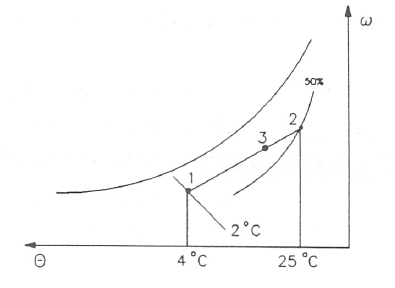

Ejercicio 10.6
^^^^^^^^^^^^^^

Se mezclan :math:`2 \frac{m^3}{s}` de aire a una temperatura seca de 4°C y una temperatura húmeda de 2°C con :math:`7 \frac{m^3}{s}` de aire a una temperatura de 25°C y con una humedad relativa del 50%.

Determinar la temperatura seca y húmeda de la corriente resultante.

Solución
''''''''

Entrando en el diagrama psicrométrico con la temperatura seca (4°C) y la temperatura húmeda (2°C) de la corriente se obtiene un valor del volumen específico de

.. math::

   v_1 = 0.789\frac{m^3}{kg}

Entrando en el diagrama psicrométrico con la temperatura seca (25°C) y con el valor de la humedad relativa (50%) de la otra corriente se obtiene un valor del volumen específico de

.. math::

   v_2 = 0.858\frac{m^3}{kg}

De lo anterior se obtiene que

.. math::

   \dot{m}_{a_1} = \frac{2}{0.789} = 2.53 \frac{kg}{s} \\
   \dot{m}_{a_2} = \frac{7}{0.858} = 8.16 \frac{kg}{s} 

y con la ecuación (10.67)

.. math::

   \frac{\omega_3 -\omega_2}{\omega_1- \omega_3} = \frac{\dot{m}_{a_1}}{\dot{m}_{a_2}} = \frac{2.53\frac{kg}{s}}{8.16 \frac{kg}{s}} = 0.31

De igual forma

.. math::

   \frac{\omega_3 -\omega_2}{\omega_1- \omega_3} = \frac{\dot{m}_{a_2}}{\dot{m}_{a_3}} = \frac{\dot{m}_{a_2}}{\dot{m}_{a_1} + \dot{m}_{a_2}} = \frac{8.16}{2.53+8.16} = 0.76

y por tanto para calcular el punto 3, que estará en la recta que une el punto 1 y 2, simplemente hay que tener en cuenta que la distancia entre los puntos 1 y 3 es 0.76 veces la distancia entre el punto 1 y 2.

De lo anterior se obtiene que 

.. math::

   \theta_3 = 20.2°C\\
   \theta_{\text{húmedo}_3} = 15°C

