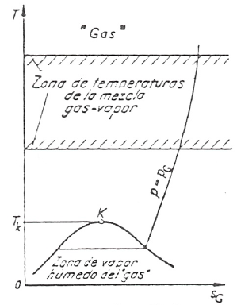
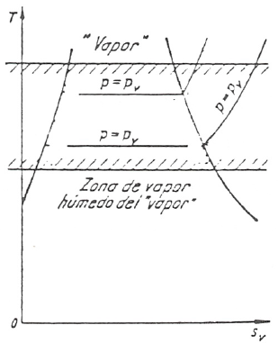

Introducción
============

De entre las mezclas de gases ocupan un lugar destacado, debido tanto a sus peculiaridades como a su importancia, las mezclas en las que uno, o más, de sus componentes es condensable. Nos vamos a ceñir, en el presente tema, sólo al estudio de mezclas binarias entre un gas y un vapor, analizando con detalle el caso de la mezcla aire seco-vapor de agua.

La temperatura crítica de uno de los componentes de la mezcla binaria es muy baja, de manera que su estado, a las temperaturas de trabajo, se hallará tan lejos de la zona de saturación que podremos considerar su comportamiento como el de un gas ideal siempre suponiendo que su presión parcial :math:`p_g` sea lo suficientemente baja; en cambio la temperatura crítica del otro componente de la mezcla, el vapor, está muy por encima de la zona de temperaturas consideradas, de manera que su estado se hallará cerca de la saturación, por lo que será posible, en principio, separarlo de la mezcla gaseosa tanto por enfriamiento como por compresión. Se supondrá que la presión del vapor, :math:`p_v`, es lo suficientemente baja como para poder considerar el comportamiento de este componente también como gas ideal.

Lo dicho anteriormente queda esquemáticamente reflejado en los diagramas T-s del gas y del vapor.

Dado que, como ya se ha dicho, el componente vapor puede condensar, las mezclas de gases y vapores podemos clasificarlas en tres grandes grupos:

Mezcla no saturada
------------------

Corresponden al caso en que ambos componentes se encuentran en fase gaseosa. Será, pues, una mezcla ideal de gases ideales. La presión parcial del vapor, :math:`p_v`, será menor que la presión de saturación, :math:`p^*(T)`, a esa temperatura; esto es :math:`p_v < p^*(T)`.

Mezcla saturada
---------------

En este caso, la presión parcial del vapor es la de saturación de éste a la temperatura de la mezcla:

.. math::

   p_v = p^*(T)

La mezcla del gas y el vapor saturado puede componerse de gas + vapor saturado, gas + vapor saturado + líquido saturado o también puede darse gas + vapor saturado + sólido saturado. Estos últimos, en equilibrio termodinámico con el vapor saturado (:math:`\mu_i = \mu_v`, :math:`T_l = T_v` o :math:`\mu_s = \mu_v`, :math:`T_s = T_v`) puede suponerse que se halla formando una fina niebla o que ha precipitado, formando una masa líquida compacta o hielo.

Mezcla sobresaturada
--------------------

Para unas condiciones de :math:`p_g` y *T*, sería una mezcla en la que la presión parcial del vapor fuese mayor que la de saturación a esa temperatura, manteniéndose el vapor no saturado. Correspondería a un estado metaestable en el que, por cualquier pequeña perturbación, se produciría la condensación de parte del vapor disminuyendo, por tanto, la presión que pasaría al valor correspondiente a la de saturación a la temperatura *T*.

También se denomina aire sobresaturado al que resulta de una mezcla sobresaturada una vez que se ha condensado el vapor de agua en exceso y éste permanece en suspensión (niebla).
