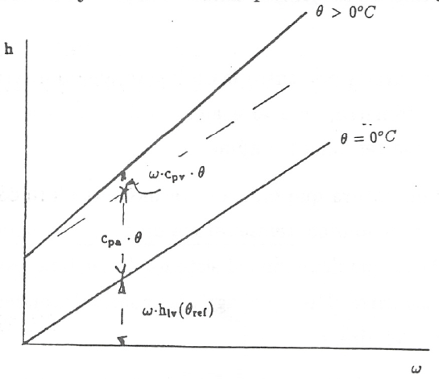
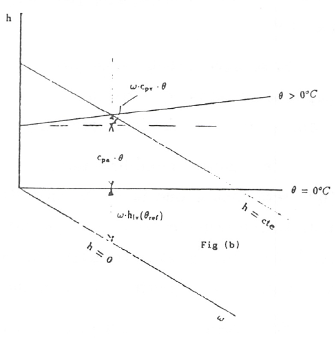
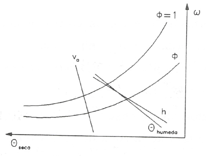

Diagrama de Mollier y psicrométrico del aire húmedo
===================================================

Diagrama de Mollier del aire húmedo
-----------------------------------

Para representar de un modo claro los cambios de estado del aire húmedo se utiliza un diagrama termodinámico, introducido por Mollier, en el que se adopta como coordenadas la entalpia y la humedad, (h, :math:`\omega`). Estos diagramas, válidos cada uno de ellos para una presión *p*, han obtenido una gran aceptación por sus aplicaciones prácticas. Este tipo de diagramas puede ser confeccionado para cualquier mezcla de un gas y un vapor, aunque nosotros sólo vamos a estudiarlo en el caso de aire húmedo.

En el estudio del diagrama de Mollier distiguiremos fundamentalmente dos zonas:

A)	zona de no saturación
B)	zona de sobresaturación (zona de niebla).

A) Si el aire húmedo sólo contiene vapor de agua, ya vimos que su entalpia es (ec. 10.17)

.. math::

   h = c_{p_a}\theta + \omega \left[ h_{lv}(\theta_{ref}) + c_{p_v}\theta \right]

por lo que en un diagrama (h, :math:`\omega`), las isotermas :math:`\theta = cte` son rectas de pendiente

.. math::

   \left. \frac{\partial h}{\partial \omega} \right)_\theta = h_{lv} (\theta_{ref} ) + c_{p_v} \theta

que será tanto mayor cuanto mayor sea la temperatura. Como :math:`h_{lv} (\theta_{ref} )` tiene un valor muy alto y el intervalo de temperaturas en que nos vamos a mover es moderadamente pequeño ( de -40 a 60°C) la contribución del término en :math:`\theta` es pequeño frente a :math:`h_{lv} (\theta_{ref} )`. Esto hace que todas las isotermas tengan una pendiente muy grande y que la zona del diagrama a considerar sea una zona muy reducida en las proximidades del eje de ordenadas, (ver fig. 2).

  

Por esta razón Mollier propuso un diagrama oblicuángulo para consiguir una zona de trabajo más cómoda. La modificación consiste en girar el eje :math:`\omega` hacia abajo hasta conseguir que la isoterma :math:`\theta =  0°C` sea horizontal (fig. 3). Las isoentálpicas, :math:`h = const`, van de izquierda a derecha, descendiendo paralelamente al eje :math:`\omega` en el que :math:`h = 0`. Las líneas :math:`\omega = const` permanecen verticales.

La diferencia de entalpia entre dos estados determinados (1,2) viene dada por el segmento de recta comprendido entre las isoentálpicas correspondientes. Para construir las isotermas se hace lo siguiente:

dada una cierta humedad :math:`\omega`, la diferencia de ordenadas entre el eje :math:`\omega` y la isoterma :math:`\theta =  0°C` vale :math:`\omega \cdot h_{lv} (\theta_{ref} )`. A este valor se le añade la entalpia del aire seco, :math:`c_{p_a} \theta` y :math:`\omega \cdot c_{p_v} \theta` (ver fig. 3). En el eje de ordenadas, (:math:`\omega = 0`), se representan los estados del aire seco. En este eje, sobre cada isoterma puede leerse el valor de las entalpias correspondientes a esos estados, :math:`h = c_{p_a} \theta`.

Las isotermas sólo pueden dibujarse, con el esquema anteriormente señalado, hasta valores de :math:`\omega` correspondientes a la saturación, que es cuando :math:`\omega` alcanza el valor

.. math::

   \omega_{sat} = 0.622 \frac{p^*}{p-p^*}

y entonces estaremos sobre la línea :math:`\phi = 1`, que es donde se termina la zona de aire no saturado.

Las líneas de humedad relativa constante se dibujan por puntos calculando, a una cierta temperatura, la presión de saturación :math:`p^*`, la humedad :math:`\omega` y la entalpia *h* ya que de (10.4) y (10.7)

.. math::
   
   \omega = 0.622 \frac{\phi \cdot p^*}{p - \phi \cdot p^*}

con lo que la entalpía del aire húmedo podemos expresarla en la forma

.. math::

  h = c_{p_a} \theta + 0.622 \frac{\phi \cdot p^*}{p - \phi \cdot p^*} \left[ h_{lv}(\theta_{ref}) + c_{p_v} \theta \right]

Así pues, para una cierta temperatura, calculada la entalpia, podemos hallar :math:`\phi` sin más que tener la curva :math:`p^*(T) = f(T)`. La curva :math:`\phi = 0` coincide con el eje de ordenadas :math:`\omega = 0`

B) Zona de sobresaturación (zona de niebla).

En esta zona las isotermas del aire húmedo también son líneas rectas. En efecto, distinguiendo que :math:`\theta \geq 0.01°C` o que :math:`\theta < 0.01°C`, se tendrá, de acuerdo con (10.20) ó (10.23), que

.. math::

   \left. \frac{\partial h}{\partial \omega} \right)_\theta = c_l \theta

o que

.. math::

   \left. \frac{\partial h}{\partial \omega} \right)_\theta = h_{ls}(\theta_{ref}) + c_s \theta

Para la zona de niebla con :math:`\theta \geq 0.01°C`, cada isoterma se une con la correspondiente isoterma de la zona de vapor no saturado en la línea :math:`\phi = 1`, formando un ángulo. Para :math:`\theta= 0`, :math:`\frac{\partial h}{\partial \omega} = 0` y la isoterma :math:`\theta= 0` coincide con una línea isentálpica. Para :math:`\theta> 0`, las isotermas de esta zona son algo menos inclinadas que las isoentálpicas (ver fig. 4)

.. figure:: ./img/mollier_fig4.png

Análogamente cuando :math:`\theta < 0.01°C`, las isotermas de la zona de niebla (en este caso será hielo el condensado) también se unen, sobre la línea :math:`\phi = 1`, con las isotermas correspondientes de la zona de vapor no saturado formando un ángulo. La isoterma :math:`\theta = 0°C` tiene una pendiente igual a :math:`h_{ls}(\theta_{ref}) = —333.4\frac{kJ}{kg}`. Por lo tanto su inclinación es mayor que la misma isoterma en la zona de niebla con condensado líquido. La zona entre estas dos isotermas a 0°C contiene estados del aire húmedo en el que coexisten aire seco, vapor de agua, agua líquida y hielo.

De (10.4) se ve claramente que se precisa un diagrama (*h*, :math:`\omega`) para cada valor de la presión, *p*, a la que se está trabajando. En general se suele disponer de un diagrama de Mollier para una presión de 100kPa, que es la más usual en la mayoría de los procesos de acondicionamiento de aire. Las variaciones de presión atmosférica normales, ±20mbar, son despreciables para la exactitud deseada normalmente en la técnica. No obstante vamos a ver qué ocurre con el diagrama (*h*, :math:`\omega`) cuando varía la presión.

Al haber modelizado el aire húmedo como una mezcla ideal de gases perfectos, la entalpia del mismo no depende de la presión, de modo que las líneas isoentálpicas del diagrama de Mollier no varían al variar la presión; en cambio lo que sí varía es la expresión de las líneas :math:`\phi = const`. Para una presión determinada si :math:`\phi = const`, también será constante :math:`\frac{\phi}{p}`. De manera que para la nueva presión cada líneas :math:`\phi= const` valdrá

.. math::

   \phi-1 = \phi \frac{p-1}{p}

De modo que, por ejemplo, la línea :math:`\phi = 0.5` del diagrama de Mollier para p=100kPa se transforma en la línea :math:`\phi = 1` si la presión es 200 kPa. Y todas las isotermas de la zona de niebla, que deben coincidir con las correspondientes isotermas de la zona de aire húmedo no saturado sobre la línea :math:`\phi = 1`, quedan modificadas.

Diagrama psicrométrico del aire húmedo
--------------------------------------

El diagrama psicrométrico, (fig. 5), tiene como coordenadas la temperatura, :math:`\theta`, y la humedad, :math:`\omega`.  En este diagrama se han representado las líneas de humedad relativa, obtenidas mediante la ecuación :math:`\omega = 0.622 \frac{\phi \cdot p^*}{p - \phi \cdot p^*}`, y las líneas de volumen específico y de la entalpia por unidad de masa de aire seco de la fase gaseosa, dadas por las ecuaciones (10.14), junto con la (10.10), y (10.17).

A) SISTEMAS CERRADOS Exergía termomecánica

Consideremos una masa determinada de aire húmedo en unas condiciones determinadas de temperatura, presión y humedad relativa (*T*, *p*, :math:`\phi`). Consideremos también un medio ambiente que suponemos que es, así mismo, aire húmedo en condiciones (:math:`T_{amb}`, :math:`p_{amb}`, :math:`\phi_{amb}`).

Si permitimos que esta masa de aire húmedo alcance el equilibrio térmico y mecánico, pero no el químico, con el medio ambiente considerando a éste como un depósito térmo-mecánico y sin disponer de otros depósitos térmicos, el trabajo útil máximo que puede obtenerse de la configuración inicial viene dado por la exergía del aire húmedo en ese estado termodinámico.

Sabemos que la exergía termomecánica, por unidad de masa, de un sistema cerrado viene dada por

.. math::

   E_x = u - u_{amb} + p_{amb}(v-v_{amb}) - T_{amb} (s-s_{amb})

Es posible que la temperatura del ambiente, :math:`T_{amb}`, sea menor que la temperatura de rocío del estado del aire húmedo, y, al enfriarlo hasta :math:`T_{amb}`, parte del aire se condense, formándose gotas de agua líquida. En este caso el aire quedará, al alcanzar el equilibrio, saturado. Esto sucederá si:

.. math::

   \tilde{\omega}' = \frac{p^*(T_{amb})}{p_{amb} - p^*(T_{amb})} < \frac{\phi p^*(T)}{p-\phi p^*(T)} = \tilde{\omega}

Suponiendo que esto se verifica, la masa de vapor que condensa, por unidad de masa de aire seco, es :math:`\omega - \omega '`, donde hemos llamado :math:`\omega '` a la humedad del aire húmedo saturado a presión y temperatura del medio ambiente. Las fracciones molares del aire seco y del vapor de agua serán :math:`x_a '` y :math:`x_v '` respectivamente.

Con esto, teniendo en cuenta las ecuaciones (10.25.a),(10.26), (10.28), (10.30.a) y (10.30.b),
sin despreciar el volumen ocupado por el líquido condensado, :math:`\frac{\omega - \omega '}{\rho_l}` y como :math:`h_g(T)—T s_g(T) = h_f(T) — Ts_f(T)`, podemos escribir para la exergía termomecánica del aire húmedo por unidad de masa de aire seco:

.. math::
   
   E_x &= (u_a - u_{a_{amb}}) - T_{amb} \left[ s_a(T,p_a) - s_a(T_{amb}, p_{a_{amb}}' ) \right]  \\
   &+ \omega \left{ u_v - h_f(T_{amb}) - T_{amb} \left[ s_g(T) - R_v \ln \frac{x_v p}{p^*(T)} - s_f(T_{amb}) \right] \right}
   
&+ (\omega - \omega ' )\frac{p^*(T_{amb})}{\rho_l} + p_{amb} \left[ (1+\tilde{\omega}) \frac{R_a T}{p} - \frac{R_a T_{amb}}{p_{amb}}  - \left( \frac{\omega - \omega '}{\rho_l}\right)\right]

donde :math:`p_{a_{amb}}'` es presión parcial del aire seco en el aire húmedo saturado; esto es, :math:`p_{a_{amb}}' = x_a' p_{amb} \cdot s_a(T,p_a)` y :math:`s_a(T_{amb}, p_{a_{amb}}')` se obtienen de (10.28.a).

Exergía química
^^^^^^^^^^^^^^^

Ya vimos en el capítulo anterior (9.64) que la exergía química de una mezcla viene expresada
por:

.. math::

   E_{xq} = \sum_{i=1}^k n_i (\mu_i ' - \mu_{oi})

siendo :math:`\mu_i'` el potencial químico del componente *i* en las condiciones del equilibrio termomecánico (:math:`T_{amb}`, :math:`p_{amb}`, :math:`x'`) y :math:`\mu_{oi}` el potencial químico del mismo componente, pero calculado en las condiciones de presión, temperatura y composición del medio ambiente. Para una mezcla ideal de gases ideales el potencial químico de cada uno de los componentes se obtiene a partir de (9.26), teniendo en cuenta (9.73) y (9.74), esto es :math:`\mu_i = h_i(T) - T s_i(T, p_i)`

Para el caso de aire húmedo expresando la exergía por unidad de masa de aire seco obtenemos:

a) aire seco

.. math::

   E_{xq_a} = -T_{amb} \left[ s_a(T_{amb}, p_{a_{amb}}') - s_a(T_{amb}, p_{a_{amb}}) \right]
   
ya que el aire seco se ha modelizado como gas perfecto y por lo tanto no hay variación de su entalpia al pasar del estado de equilibrio termomecánico al de equilibrio en composición ya que no varía la temperatura. Igual que anteriormente los sa se calculan de (10.28.a)

b) vapor de agua

Al aplicar la expresión de la exergía química al vapor de agua existente en el estado de equilibrio termomecánico, que por unidad de masa de aire seco es :math:`\omega '`, se obtendrá:

.. math::

   E_{xq_v} = \omega ' \left\{ hg(T_{amb}) - T_{amb} s_g(T_{amb}) -\left[ h_v(T_{amb}) - T_{amb} \left( s_g(T_{amb}) - R_v \ln \frac{x_{v_{amb}} p_{amb}}{p^*(T_{amb})} \right)  \right]   \right\}

c)	agua líquida

Análogamente, la variación de exergía que experimenta el agua líquida, que ha condensado al alcanzar el equilibrio termomecánico, cuando se le deja alcanzar el equilibrio en composición con el medio ambiente, expresada por unidad de masa de aire seco es:

.. math::

   E_{xq_l} = (\omega - \omega ') \left\{ hf(T_{amb}) + \frac{p_{amb} - p^*(T_{amb})}{\rho_l} - T_{amb} s_f(T_{amb}) -\left[ h_v(T_{amb}) - T_{amb} \left( s_g(T_{amb}) - R_v \ln \frac{x_{v_{amb}} p_{amb}}{p^*(T_{amb})} \right)  \right]   \right\}

Sumando las contribuciones del vapor de agua y del agua líquida, como:

.. math::
 
   h_f(T_{amb}) - T_{amb} s_f( T_{amb}) = h_g(T_{amb}) - T_{amb} s_g(T_amb)
 
   
nos quedará finalmente como contribución del agua a la exergía química de la mezcla:

.. math::
   
   E_{xq_w} = -\omega T_{amb} R_v \ln \frac{x_{v_{amb}} p_{amb}}{p^*(T_{amb})} + (\omega - \omega ')\frac{p_{amb} - p^*(T_{amb})}{\rho_l}

Sumando cada una de las contribuciones, tanto la correspondiente al equilibrio termo-mecánico (10.40) como la del equilibrio en composición (10.41.a y 10.41.b), se tendrá finalmente para la exergía de una determinada masa de aire húmedo, considerado éste como una mezcla ideal de gases perfectos:

.. math::

   E_{x_t} &= (c_{v_a} + \omega c_{v_v}) (T- T_{amb}) + p_{amb} R_a (1+ \tilde{\omega}) \left( \frac{T}{p} - \frac{T_{amb}}{p_{amb}} \right) \\
   &-T_{amb} (c_{p_a} + \omega c_{p_v}) \ln \frac{T}{T_{amb}}  + R_a T_{amb} (1+ \tilde{\omega}) \ln \frac{p}{p_{amb}} \\
   &+ R_a T_{amb} \left[ (1+\tilde{\omega}) \ln \frac{1+ \tilde{\omega}_{amb}}{1+ \tilde{\omega}} + \tilde{\omega} \ln \frac{\tilde{\omega}}{\tilde{\omega}_{amb}} \right]

.. math::

   E_x &= h_a(T,p) - h-a(T_{amb}, p_{a_{amb}}' ) - T_{amb} \left[ s_a(T, p_a) - s_a( T_{amb}, p_{a_{amb}}') \right] + \\
   &+ \omega \left\{ h_v - h_g(T_{amb}) - T_{amb} \left[ s_g(T) - T_v\ln \frac{x_v p}{p^*(T)} - s_g(T_{amb})  \right]    \right\} - \\
   &-  (\omega - \omega ') \frac{p_{amb} - p^*(T_{amb})}{\rho_l}
   
La exergía debida al cambio en la composición (exergía química), por unidad de masa de aire seco, tiene la misma expresión que para sistemas cerrados, ya que sólo depende de la composición de la muestra de aire húmedo (:math:`\phi`) y de la composición del aire ambiente (:math:`\phi_{amb}`) Así pues, la exergía química para una corriente de aire húmedo viene dada por la suma de (10.41.a) y (10.41.b).

La exergía de la corriente de aire húmedo que desde las condiciones (*T*, *p*, :math:`\phi`) se lleva al equilibrio térmico, mecánico y en composición, vendrá pues, dada por

.. math::

   E_{x_t} = (c_{p_a} - \omega c_{p_v}) \left[ (T-T_{amb}) - T_{amb}\ln \frac{T}{T_{amb}}\right] + R_a T_{amb} (1+\tilde{\omega}) \ln \frac{p}{p_{amb}} 
   
+ \\
&+ R_a T_{amb} \left[ (1+\tilde{\omega}) \ln \frac{(1+\tilde{\omega}_{amb})}{(1+\tilde{\omega})} + \tilde{\omega} \ln \frac{\tilde{\omega}}{\tilde{\omega}_{amb}} \right]
