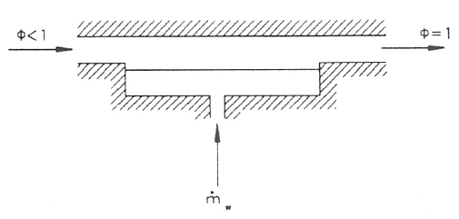

Temperaturas de saturación adiabática y de bulbo húmedo
=======================================================

Se define la temperatura de saturación adiabáticacomo aquella temperatura que alcanzaría una corriente de aire húmedo a (*T*, *p*, :math:`\omega`) si se le añadiese agua suficiente como para llevarla a la saturación adiabáticamente, estando el agua añadida a la temperatura de equilibrio final.

Un sistema mediante el cual se puede conseguir un procesó que se aproxime al de saturación adiabática se muestra, de forma esquemática,en la fig. 1.

Según se ve en ella, el aire se suministra a una presión *p*, una temperatura *T* y una humedad relativa :math:`\phi< 1`; a su paso por el sistema arrastra vapor de agua de la superficie hasta su saturación ya que suponemos que el sistema tiene una longitud suficiente (en el límite sería infinita) y que la velocidad del flujo es lo suficientemente pequeña como para conseguir la saturación. 

Suponiendo que el agua se suministra a la temperatura de equilibrio de salida del aire húmedo, tendríamos que la energía necesaria para evaporar el agua que arrastra la corriente gaseosa tiene que ser aportada por el aire y como consecuencia éste se‘enfría ya que el dispositivo se ha supuesto adiabático.

Parecería que lo dicho nos conduce a una indeterminación, pues al ser la temperatura a la que se ha de introducir el agua igual a la temperatura de equilibrio del aire al final del proceso, estamos, teóricamente, no definiendo el proceso. Sin embargo, experimentalmente no hay ninguna ambigüedad ya que se puede proceder de la forma siguiente:

*	Se suministra el agua a la temperatura ambiente y se ve cuál es la temperatura alcanzada a la salida.
*	A continuación se suministra agua a esta temperatura y se vuelve a determinar la temperatura de salida.
*	Así se continúa hasta que ambas temperaturas, la del agua suministrada y la del aire a la salida, coincidan.

De la aplicación de las ecuaciones de conservación de la masa y energía al sistema formado por la corriente de aire húmedo en condiciones (*T*, *p*, :math:`\omega`), el flujo de agua a añadir en condiciones (:math:`T_{sa}`, *p*) y por la corriente de aire húmedo saturado en condiciones (:math:`T_{sa}`, *p*, :math:`\omega_{sa}`), puede encontrarse una expresión que permite determinar la humedad de la corriente de entrada :math:`\omega` en función de magnitudes conocidas.

Conservación de la masa para el agua:

.. math::

   \omega + \frac{\dot{m}_\omega}{\dot{m}_a} = \omega_{sa}
   
Conservación de la energía:

.. math::
   
   h(T,p,\omega) + \frac{\dot{m}_\omega}{\dot{m}_a} h_l(T_{sa}, p) = h(T_{sa},p,\omega_{sa})

De acuerdo con (10.4), (10.17) y (10.19) podremos escribir:

.. math::

   &\omega = 0.622 \frac{p_v}{p-p_v} \\
   &\omega_{sa} = 0.62 \frac{ p^*(T_{sa}) }{p-p^*(T_{sa})} \\
   &c_{p-a} \theta + \omega \left[ h_{lv}(\theta_{ref}) + c_{p_v} \theta \right] + (\omega_{sa} - \omega) \left[ c_l\theta_{sa} + \frac{p-p_{ref}}{\rho_l} \right] = c_{p_a} \theta_{sa}+ \omega_{sa} \left[ h_{lv}(\theta_{ref}) + c_{p_v} \theta_{sa} \right]

Para utilizar las relaciones anteriores en la determinación analítica de :math:`\nu_{sa}` es necesario, además, una relación que nos de la presión de saturación en función de la temperatura, :math:`p^* =
f(T)`

De esta forma la temperatura de saturación adiabática tiene una solución analítica. Pero si los valores de las propiedades termodinámicas se conocen en forma tabular o por medio de un diagrama termodinámico, la resolución de las ecuaciones (10.33) y (10.34), que nos dan la temperatura de saturación adiabática, hay que realizarla mediante el método de prueba y error o por un método iterativo.

Con el método de prueba y error se supone una temperatura de saturación adiabática y con ella se obtiene :math:`\omega_{sa}` de (10.34); con este valor y los de *h*, :math:`\omega`, :math:`h_l` y :math:`h_{sa}` se comprueba si se verifica la ecuación (10.33). Si esto ocurre, ese valor supuesto de la temperatura de saturación adiabática será el buscado; si no hay que probar otro y así sucesivamente. Si en vez de cambiar de valor de la temperatura de saturación adiabática se toma como nuevo valor el que se obtiene de hacer cumplir la ecuación (10.33), con los valores de :math:`\omega_{sa}`, *h*, *u* y :math:`h_l` obtenidos con el valor inicialmente supuesto de la temperatura, y con esa temperatura obtenida se vuelve a repetir el proceso hasta que dos valores obtenidos de la temperatura de saturación adiabática difieran en una cantidad pequeña, obtendremos la temperatura de saturación adiabática por un método iterativo.

Si se hace circular una corriente de aire no saturado por entre las hilas de algodón, empapadas en agua, que rodean el bulbo de un termómetro, este aire alcanzará la saturación evaporando agua. A dicho termómetro se le denomina termómetro húmedo.

Alcanzado el equilibrio termodinámico, la temperatura que indica el termómetro húmedo (que será menor que la del termómetro seco) se la denomina **temperatura de bulbo húmedo**. Esta temperatura no es una propiedad de la mezcla ya que depende del sistema de medida, esto es, de las velocidades de transferencia de calor y masa entre el aire y el agua las cuales dependen, a su vez, de la geometría del bulbo, de la velocidad del aire, etc.

Se ha comprobado que cuando la velocidad del aire es de unos 2 ó 3 :math:`\frac{m}{s}`, la temperatura de bulbo húmedo es prácticamente igual a la de saturación adiabática para una mezcla de aire-vapor agua , por lo que se suele tomar la temperatura de bulbo húmedo como la temperatura de saturación adiabática. Es importante recalcar que sólo para la mezcla de aire-vapor de agua sucede esto y no para el resto de mezclas de aire con cualquier otro vapor.
