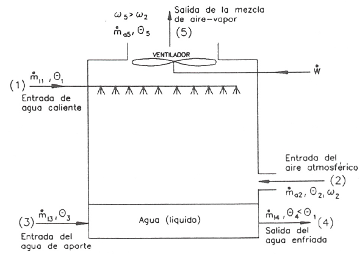
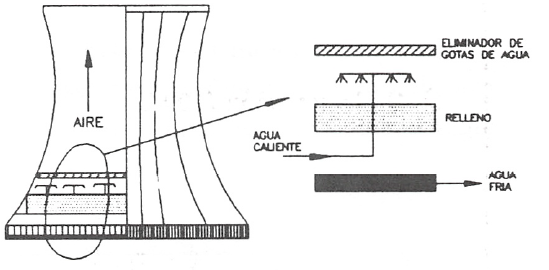
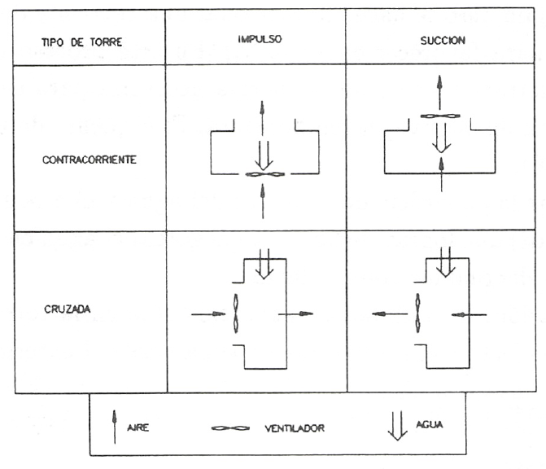
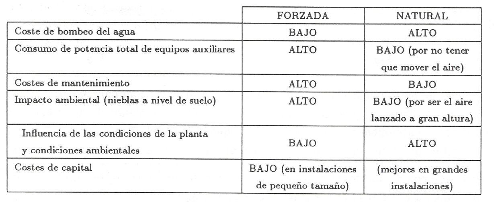

Torres de enfriamiento
======================

En multitud de procesos industriales es necesario refrigerar determinados sistemas o elementos. Como fluido refrigerante se suele utilizar agua, proveniente de recursos naturales (lagos o ríos) o de depósitos de almacenamiento construidos para ese fin.

En un caso o en otro se debe enfriar el agua caliente, que sale del sistema a refrigerar, para, respectivamente, evitar contaminación térmica o poder volver a utilizar el agua de nuevo. Para enfriar el agua se utilizan las llamadas torres de enfriamiento.

En una torre de enfriamiento se hace interaccionar una corriente de aire con el agua a enfriar (finamente pulverizada para favorecer el contacto). En este proceso una pequeña cantidad de agua se evapora, suministrando parte de la energía necesaria para su evaporación el resto del agua, que de esta manera disminuye su temperatura. El esquema de una torre de enfriamiento se puede ver en la (fig.30).

Para lograr aumentar la superficie de contacto del agua y el aire se suele disponer de algún elemento (láminas o tubos) que logran dicho efecto al gotear el agua en ellos. A dichos elementos, en conjunto, se les suele denominar como relleno.

Debido a la evaporación, la cantidad de agua existente en la torre va disminuyendo con el tiempo, para evitar este efecto se necesita añadir agua desde el exterior (agua de aporte).
Salida de la mezcla de aire-vapor

Las torres de enfriamiento se pueden presentar con diversas configuraciones.

Se pueden clasificar en general, atendiendo al mecanismo mediante el que se hace circular el aire en la torre, o atendiendo a la dirección en la que circulan el agua y el aire.

De acuerdo con el mecanismo por el que circula el aire en la torre, estas se clasifican en:

a)	Torres de convección forzada si hay algún elemento mecánico, por ejemplo un ventilador, que obliga a circular el aire a través de la torre (fig.30).
b)	Torres de convección natural si el aire circula a través de la torre por mecanismos naturales (convección natural). En este caso el tipo de torre más frecuente es el denominado “hiperbólico” (fig.31).

Si se atiende a la dirección en la que circulan el agua y el aire en la torre, estas se pueden ser:

a) Torres de flujo a contracorriente si el agua y el aire circulan en la misma dirección y sentidos opuestos.
b)	Torres de flujo cruzado si el agua y el aire circulan en direcciones perpendiculares.
c)	Torres combinadas cuando se tiene una combinación de las anteriores.

Un esquema de los diversos tipos se puede ver en la fig.32.

La elección de un tipo u otro de torre, depende del tipo de instalación (tipo de industria), cantidad de agua a enfriar y costes de instalación y mantenimiento. A continuación se exponen algunas consideraciones que dan una idea del tipo de torre a utilizar en cada caso:

Suponiendo que la torre funciona en régimen estacionario, la ecuación de conservación de la masa para el aire seco y el agua, junto con la ecuación de conservación de la energía aplicadas a la torre en su conjunto, proporcionan información de las características de su funcionamiento. Utilizando la nomenclatura de la fig.30 se tendrá:

a) Ecuación de conservación de la masa:

* para el aire seco:

.. math::

   \dot{m}_{a_2} = \dot{m}_{a_5} = \dot{m}_{a}
   
* para el agua:

.. math::

   \dot{m}_{l_1} + \dot{m}_{v_2} + \dot{m}_{l_3} = \dot{m}_{l_4} + \dot{m}_{v_5}

b) Ecuación de la conservación de la energía (suponiendo que las variaciones de las energías cinética y potencial son despreciables):

.. math::

   \dot{Q}  + \dot{W} &= h_{l_4} \dot{m}_{l_4} + (\dot{m}_{a_5} h_{a_5} + \dot{m}_{v_5} h_{v_5}) - \\
   &- h_{l_1} \dot{m}_{l_1} - (\dot{m}_{a_2} h_{a_2} + \dot{m}_{v_2} h_{v_2}) - h_{l_3} \dot{m}_{l_3}
   
Teniendo en cuenta que

.. math::

   \dot{m}_{v_2} = \omega_2 \dot{m}_{a} \\
   \dot{m}_{v_5} = \omega_5 \dot{m}_{a} \\
   

considerando la ecuación (10.68) y que la cantidad de agua que circula por el sistema a refrigerar debe ser constante (:math:`\dot{m}_{l_1} = \dot{m}_{l_4}`) se obtiene de la ecuación (10.69) que

.. math::
 
   \dot{m}_{l_3} = (\omega_5 - \omega_2) \dot{m}_a

De la ecuación (10.70) se obtiene que

.. math::
 
   \dot{m}_a = \frac{\dot{Q} + \dot{W} + \dot{m}_{l_1} (h_{l_1} - h_{l_4})}{ h_{a_5}- h_{a_2} + \omega_5 h_{v_5} - \omega_2 h_{v_2} - (\omega_5 - \omega_2) h_{l_3}}
   
En la mayoría de los casos el calor transferido con los alrededores es despreciable (:math:`\dot{Q}`) y la potencia requerida por el ventilador en las torres de convección forzada también es despreciable frente al resto de las energías (:math:`\dot{W}`), por lo que la ecuación (10.71) se reduce a

.. math::
 
   \dot{m}_a = \dot{m}_{l_1} (h_{l_1} - h_{l_4})}{ h_{a_5}- h_{a_2} + \omega_5 h_{v_5} - \omega_2 h_{v_2} - (\omega_5 - \omega_2) h_{l_3}}
   
y reordenándola se obtiene

.. math::
 
   \dot{m}_a = \dot{m}_{l_1} (h_{l_1} - h_{l_4})}{ (h_{a_5}   + \omega_5 h_{v_5})- (h_{a_2}  + \omega_2 h_{v_2}) - (\omega_5 - \omega_2) h_{l_3}}
   
Los valores de las entalpias del vapor de agua y del agua líquida se pueden evaluar considerando la entalpia del vapor saturado y líquido saturado, a sus temperaturas respectivas.

La humedad :math:`\omega_2` y :math:`\omega_5` se pueden evaluar mediante la ecuación (10.4), utilizando la presión parcial del vapor de agua obtenida a partir de los valores de humedad relativa (que suelen ser dato) y la ecuación (10.6).

Hay que recordar que los valores de :math:`(h_{a_5}   + \omega_5 h_{v_5})` y :math:`(h_{a_2}  + \omega_2 h_{v_2})` se pueden calcular mediante el diagrama de Mollier, o el psicrométrico, o la ecuación (10.17), y que la entalpia del agua líquida (:math:`h_{l_1}`, :math:`h_{l_3}`, :math:`h_{l_4}`) se puede calcular mediante la ecuación (10.19).'

Ejercicio 10.9
--------------

Se desean enfriar :math:`0.6 \frac{m^3}{s}` de agua desde 30°C hasta 20°C, para lo que se utiliza una torre de enfriamiento de convección forzada que utiliza aire a 1bar y temperaturas de termómetro seco y húmedo de 21°C y 15°C respectivamente. El aire a la salida de la torre tiene una temperatura de 27°C y una humedad relativa del 90%.

Determinar:
a)	El gasto volumétrico de aire necesario en :math:`\frac{m^3}{s}`.
b)	El consumo de agua en :math:`\frac{kg}{s}`.
El trabajo consumido por el ventilador de la torre se puede suponer despreciable.

Solución
^^^^^^^^

a) El problema se resuelve mediante las ecuaciones (10.69) y (10.72).

En este caso hay que tener en cuenta que no hay agua de aporte (:math:`\dot{m}_{l_3} = 0`, :math:`\dot{h}_{l_3} = 0`) y por tanto :math:`\dot{m}_{l_1} \neq \dot{m}_{l_4}`. Debido a lo anterior las ecuaciones citadas anteriormente se modifican quedando el sistema de ecuaciones

.. math::

   \dot{m}_a =  \frac{\dot{m}_{l_1} h_{l_1} - \dot{m}_{l_4} h_{l_4}}{(h_{a_5}   + \omega_5 h_{v_5}) - (h_{a_2}   + \omega_2 h_{v_2})} \\
   \dot{m}_{l_1} + \omega_2 \dot{m}_a = \dot{m}_{l_4} + \omega_5 \dot{m}_a

A continuación procederemos a calcular el valor de las diversas magnitudes que aparecen en las ecuaciones anteriores.

De las tablas de propiedades termodinámicas del agua en saturación,

.. math::

   v_{l-1}(30°C) = 1.0043\cdot 10^{-3} \frac{m^3}{kg}

y teniendo en cuenta que en la torre entran :math:`0.6\frac{m^3}{s}` de agua, el gasto de agua que entra en la torre es

.. math::

   \dot{m}_{l_1} = \frac{0.6\frac{m^3}{s}}{1.0043\cdot 10^{-3} \frac{m^3}{kg}} = 597.43 \frac{kg}{s}

Por otra parte se tiene

.. math::

   h_{l_1} = c_{l_1} \theta_{l_1} = 4.18 \cdot 30 = 125.4 \frac{kJ}{kg} \\
   h_{l_4} = c_{l_4} \theta_{l_4} = 4.18 \cdot 20 = 83.6 \frac{kJ}{kg} \\

Para el aire que sale de la torre, de las tablas de propiedades termodinámicas del agua en saturación

.. math::
 
   p^*(27°C) = 0.03567bar

y de la ecuación (10.6)

.. math::

   p-v = p^* \phi = 0.03567 \cdot 0.9 = 0.0321bar

y de la ecuación (10.4)

.. math::

   \omega_5 = 0.622 \frac{p_v}{p-p_v} = 0.622 \frac{0.0321}{1-0.0321} = 0.02063\frac{kg}{kg}\\
   h_5 = h_{a_5}+ \omega_5 h_{v_5} = c_{p_a} \theta_5 + \omega_5 \left[ h_{l_v}(\theta_{ref})+c_{p_v} \theta_5\right] = \\
   = 1.005 \cdot 27 + 0.0263[2501.4+1.82 \cdot 27] = 79.75 \frac{kJ}{kg}
   

Para el aire que entra en la torre, de la definición de temperatura húmeda, aplicando el principio de conservación de la energía al proceso de saturación (2 — 2') se obtiene

.. math::

   h-2 + (\omega_2' -\omega_2) h_l = h_2'  \\
   h_{a_2} + \omega_2 h_{v_2}+  (\omega_2' -\omega_2) h_l = h_s' + \omega_2'  h_{v_2 '} \\
   c_{p_a} \theta_2 + \omega_2 [h_{l-v}(\theta_{ref}) + c_{p_v}\theta_2] +  (\omega_2' -\omega_2) c_l \theta_l = \\
   c_{p_a} \theta_{2'} + \omega_{2'}[h_{l-v}(\theta_{ref}) + c_{p_v}\theta_{2'}] \\
   \omega_2 = \frac{c_{p_a} (\theta_{2'} - \theta_2)+\omega_{2'}[h_{l-v}(\theta_{ref}) + c_{p_v}\theta_2 - c_l \theta_l]}{h_{l-v}(\theta_{ref}) + c_{p_v}\theta_2-c_l \theta_l}
   

El valor de :math:`\omega_{2'}` se calcula a partir de la ecuación (10.4)

.. math::

   \omega_{2'} = 0.622 \frac{p_{v_{2'}}}{ p- p_{v_{2'}}} = 0.622 \frac{p^*}{p-p^*}

obteniendo :math:`p^*` de las tablas de propiedades termodinámicas del agua en saturación

.. math::

   p^*(15°C) = 0.01705bar \\
   \omega_{2' } = 0.622 \frac{0.01705}{1-0.01705} = 0.01079\frac{kg}{kg} \\
   \omega_2 = \frac{1.005(15-21)+0.01079[2501.4 + 1.82\cdot 15 -4.18 \cdot 15]}{2501.4 + 1.82\cdot 21 - 4.18 \cdot 15} \\
   \omega_2 = 8.308 \cdot 10^{-3} \frac{kg}{kg}

y entonces

.. math::

   h_2 = h_{a_2} + \omega_2 h_{v_2} = c_{p_a} \theta_2 + \omega_2 [h_{l-v}(\theta_{ref})+c_{p_v}\theta_2] = \\
   1.005 \cdot 21+8.308.10^{-3} [2501.4 + 1.82\cdot 21] = 42.2 \frac{kJ}{kg}

Introduciendo el valor de las magnitudes calculadas en el sistema de ecuaciones inicial se obtiene

.. math::

   1995-2.23 \dot{m}_{L-4} = \dot{m}_a \\
   \dot{m}_{l_4} = -1.23 \cdot 10^{-2} \dot{m}_a + 597.4
   

Resolviendo el sistema

.. math::

   \dot{m}_a = 681.6\frac{kg}{s} \\
   \dot{m}_{l_4} = 589.03 \frac{kg}{s}

Para calcular el gasto volumétrico de aire necesitamos conocer la presión parcial del aire seco. De la ecuación (10.4) se obtiene

Pv2
1
1 +
0,622
W2
1 +
),622
= 0,01318bar
8,308•10
-3
Pa2 = P -Pv2 = 1 — O, 01318 = 0,9868bar y de la ecuación de estado para el aire seco
queda
V
PaV = rhaRaT
ma RaT	6 81,6 • 287-294
582,8m 3/s
Pa	0,9868 • 1Q5

b) La cantidad de agua consumida será la diferencia entre el agua que entra y sale de la torre Agua consumida = m/j - m¡4 = 597,43 — 589,03 = 8,4kg/s
